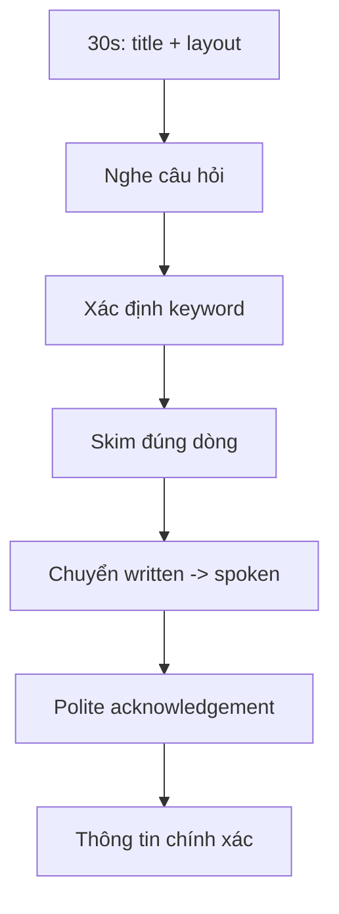

# Speaking 04 - Questions 7-9: Respond Using Information Provided

> **Nguồn:** PDF trang 54-68 (trang sách 41-55)

## Mục tiêu bài học

- Scan schedule/agenda nhanh trong 30 giây.
- Nghe câu hỏi một lần và định vị đúng thông tin.
- Chuyển thông tin viết thành câu nói lịch sự, hoàn chỉnh.

## Nội dung cốt lõi

### Format

- 30 giây đọc bảng thông tin.
- Q7-8: 15 giây/câu.
- Q9: 30 giây.
- Câu hỏi **chỉ được nghe**, không hiện đầy đủ trên màn hình.

### Ba kiểu câu hỏi

- **Detail:** hỏi một dữ kiện cụ thể.
- **Confirmation:** người gọi đưa thông tin và hỏi có đúng không.
- **Open-ended:** yêu cầu tổng hợp nhiều dòng trong schedule.

### Kỹ thuật scan

1. Đọc **title** để biết loại tài liệu.
2. Nhìn layout: time / event / place / cost / note.
3. Đánh dấu footnote, asterisk, change/cancellation.
4. Không cố đọc từng chữ.

### Khung Q7-8

**Acknowledge -> filler (nếu cần) -> answer -> short explanation**

### Khung Q9

**Acknowledge -> first item + detail -> transition -> second item + detail -> close**

Sách đặc biệt lưu ý tính **polite + accurate**. Câu đúng ngữ pháp nhưng đưa sai dữ kiện vẫn làm giảm điểm mạnh.

## Sơ đồ ghi nhớ

## Luyện tập

Luyện với 4 loại tài liệu: conference schedule, train/tour itinerary, event agenda, price list.

Mỗi bảng, tự tạo 3 câu hỏi: 1 detail, 1 confirmation, 1 open-ended. Sau đó trả lời dưới timer.

## Checklist tự chấm

- [ ] Đọc title trước.
- [ ] Tìm đúng dòng trước khi nói.
- [ ] Không đọc nguyên văn bảng như robot.
- [ ] Nếu thông tin người gọi sai, đính chính lịch sự.
- [ ] Q9 có đủ các mẩu thông tin được hỏi.
