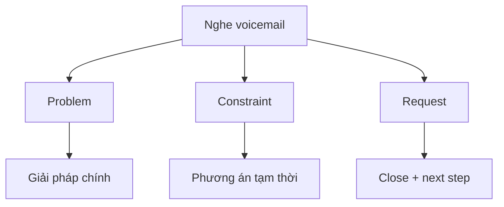

# Speaking 05 - Question 10: Propose a Solution

> **Nguồn:** PDF trang 69-83 (trang sách 56-70)

## Mục tiêu bài học

- Nghe voicemail và nhận diện complaint/request chính.
- Chuẩn bị trong 30 giây và trả lời 60 giây.
- Thể hiện đã hiểu vấn đề và đưa ra giải pháp khả thi.

## Nội dung cốt lõi

### Format

Nghe một voicemail về vấn đề thường gặp: nhà ở, văn phòng, delivery, customer service, reservation... Sau đó bạn phải trả lời trong một **role** cụ thể.

### Khung 60 giây

1. **Greeting + role**
2. **Acknowledge / restate problem**
3. **Empathy / apology nếu phù hợp**
4. **Primary solution**
5. **How/when it will happen**
6. **Backup / temporary solution**
7. **Polite close**

### Nghe gì trong voicemail

- Vấn đề chính thường xuất hiện sớm.
- Ai bị ảnh hưởng?
- Điều gì đã xảy ra / xảy ra bao nhiêu lần?
- Người gọi muốn điều gì?
- Có giới hạn nào khiến một giải pháp không phù hợp?

### Chất lượng giải pháp

Giải pháp nên cụ thể hơn *I will fix it*. Hãy nói **action + timing + result**. Nếu có thể, đưa phương án tạm thời để thể hiện completeness.

## Sơ đồ ghi nhớ

## Luyện tập

Tập nghe một complaint ngắn (hoặc đọc audio script ở appendix), tắt transcript và ghi 4 keyword: **problem / cause / request / constraint**. Chỉ sau đó mới chuẩn bị câu trả lời.

## Checklist tự chấm

- [ ] Tôi nói đúng role.
- [ ] Tôi cho thấy đã hiểu đúng vấn đề.
- [ ] Giải pháp cụ thể và khả thi.
- [ ] Có next step hoặc timeline.
- [ ] Không bỏ quên yếu tố lịch sự.
