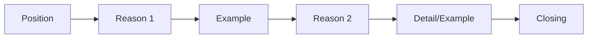

# Speaking 06 - Question 11: Express an Opinion

> **Nguồn:** PDF trang 84-96 (trang sách 71-83)

## Mục tiêu bài học

- Chọn và nêu lập trường rõ trong 15 giây chuẩn bị.
- Nói 60 giây với lý do và ví dụ cụ thể.
- Tổ chức câu trả lời đủ mạch lạc để người nghe theo được.

## Nội dung cốt lõi

### Dạng prompt

Có thể hỏi preference, agree/disagree, support/oppose hoặc opinion chung về chủ đề quen thuộc.

### Framework 60 giây

**Position -> Reason 1 -> Example -> Reason 2 -> Example/detail -> Closing**

Không cần cố đưa quá nhiều lý do. Hai lý do phát triển tốt thường mạnh hơn bốn lý do rất ngắn.

### Transition hữu ích

- Nêu ý kiến: *As I see it..., Personally..., I would say...*
- Thêm ý: *In addition..., Furthermore...*
- Ví dụ: *For example..., For instance...*
- Giải thích: *In fact..., The main reason is...*
- Kết: *For these reasons...*

### Chuẩn bị 15 giây

Chỉ ghi mental outline 3 điểm:

1. **Position**
2. **Reason A**
3. **Reason B / example**

Không cố viết cả câu trong đầu.

## Sơ đồ ghi nhớ

## Luyện tập

Chọn 10 topic quen thuộc: work, money, shopping, transport, education, community, sports, family, technology, leisure. Mỗi topic chuẩn bị sẵn 2 reason banks nhưng thay ví dụ khi luyện để tránh học thuộc bài cứng.

## Checklist tự chấm

- [ ] Lập trường xuất hiện sớm.
- [ ] Có ít nhất 2 ý hỗ trợ hoặc 1 ý phát triển sâu.
- [ ] Ví dụ cụ thể.
- [ ] Transition không lặp một cụm duy nhất.
- [ ] Kết thúc đủ ý trong 60 giây.
