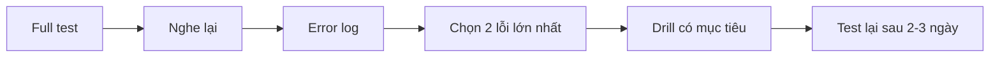

# Speaking 07 - Full Practice Test

> **Nguồn:** PDF trang 97-102 (trang sách 84-89)

## Mục tiêu bài học

- Mô phỏng một lượt thi Speaking hoàn chỉnh.
- Không nghe lại / làm lại giữa bài.
- Sau bài thi, phân loại lỗi theo dạng câu hỏi.

## Nội dung cốt lõi

### Cách mô phỏng

- Phòng yên tĩnh, dùng headset/microphone.
- Chạy đúng timer của từng task.
- Không dừng để tra từ hoặc sửa câu.
- Ghi âm toàn bộ buổi thi thành một file hoặc nhiều file theo câu.

### Sau khi thi

Lập error log theo 5 cột:

| Câu | Task problem | Pronunciation | Intonation/fluency | Grammar/vocab |
|---|---|---|---|---|
| Q1-2 | | | | |
| Q3 | | | | |
| Q4-6 | | | | |
| Q7-9 | | | | |
| Q10 | | | | |
| Q11 | | | | |

Chỉ quay lại lesson tương ứng với **lỗi lặp lại**, không học lại cả sách từ đầu.

## Sơ đồ ghi nhớ

## Luyện tập

Ảnh trang practice đã tách trong `../assets/pages/` từ PDF page 97 đến 102. Audio thật không nằm trong PDF; dùng audio đi kèm sách nếu anh có file riêng.

## Checklist tự chấm

- [ ] Không pause test.
- [ ] Tuân thủ timer.
- [ ] Có bản ghi để review.
- [ ] Chọn tối đa 2-3 lỗi trọng tâm sau test.
