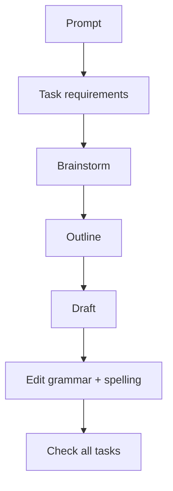

# Writing 00 - Guide và các lỗi nền tảng cần xử lý

> **Nguồn:** PDF trang 103-107 (trang sách 90-94)

## Mục tiêu bài học

- Hiểu ba task types của Writing.
- Ôn sentence types: simple, compound, complex, compound-complex.
- Thiết lập kỹ năng brainstorm, typing và time management.

## Nội dung cốt lõi

### Writing test cần gì?

- Viết câu đúng và relevant.
- Phản hồi email đúng role, đủ task, đúng tone.
- Viết opinion essay có thesis, support, organization.

### Sentence types

- **Simple:** 1 independent clause.
- **Compound:** 2 independent clauses nối bằng coordinating conjunction.
- **Complex:** independent clause + dependent clause.
- **Compound-complex:** ít nhất 2 independent clauses + dependent clause.

### Các challenge lớn trong sách

- Grammar/spelling yếu -> luyện cấu trúc thường dùng và viết đa dạng sentence types.
- Sợ essay dài -> coi essay là chuỗi paragraph được tổ chức từ nhiều câu tốt.
- Bí ý khi trả lời email -> luyện brainstorm 10 ý rồi chọn ý phù hợp task.
- Ít tiếp xúc với native writing -> đọc email/editorial thật để hấp thụ phrasing.
- Hết giờ -> luyện QWERTY, typing, edit, và làm bài theo timer.

Nguyên tắc cuối của sách rất thực dụng: **simple but correct** thường tốt hơn complex nhưng sai.

## Sơ đồ ghi nhớ

## Luyện tập

Mỗi ngày gõ 10 phút bằng tiếng Anh trên bàn phím QWERTY. Sau khi viết, sửa trực tiếp trên máy để quen thao tác edit thay vì chỉ viết tay.

## Checklist tự chấm

- [ ] Tôi phân biệt được 4 sentence types.
- [ ] Tôi brainstorm trước khi viết dài.
- [ ] Tôi kiểm tra task requirements trước khi nộp.
- [ ] Tôi gõ đủ nhanh để còn thời gian sửa.
