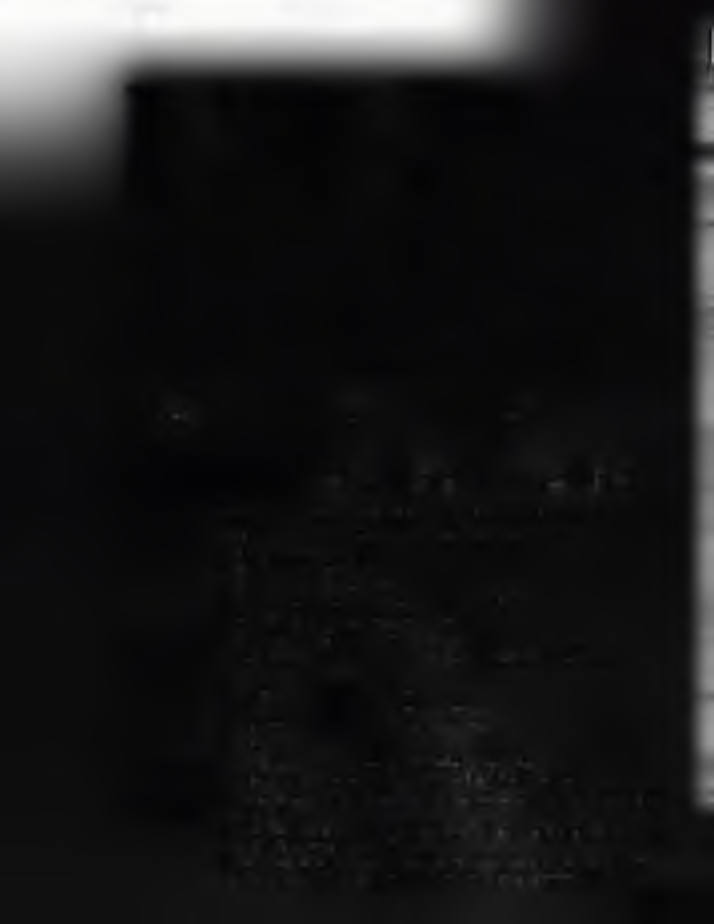
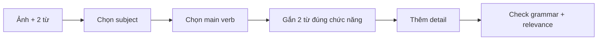

# Writing 01 - Questions 1-5: Write a Sentence Based on a Picture

> **Nguồn:** PDF trang 108-123 (trang sách 95-110)

## Mục tiêu bài học

- Viết 5 câu trong tổng 8 phút.
- Dùng đúng cả hai từ/cụm từ cho sẵn.
- Tạo câu đúng grammar và relevant với ảnh.

## Nội dung cốt lõi

### Task

Mỗi ảnh đi kèm hai từ/cụm từ. Có thể đổi dạng từ và thứ tự, miễn dùng đúng nghĩa và tạo **một câu** phù hợp ảnh.

### Quy trình 4 bước

1. **Observe:** xác định subject + main action trong ảnh.
2. **Place words:** quyết định vai trò ngữ pháp của hai từ cho sẵn.
3. **Build core sentence:** subject + verb (+ object/complement).
4. **Add detail:** prepositional phrase, modifier hoặc subordinate clause nếu cần.

### Các dạng từ thường gặp

- noun
- verb
- adjective/adverb
- preposition
- coordinating conjunction
- subordinating conjunction

Questions 4-5 trong tài liệu thường yêu cầu xử lý subordinating conjunction nên phải tạo subordinate clause đúng nghĩa: time, cause, contrast, condition, location.

### Detail qua prepositions và modifiers

Dùng *at, on, next to, behind, in front of, between...* để làm câu cụ thể. Participles có thể làm adjective nhưng cần phân biệt người/vật **gây cảm giác** (-ing) và **nhận cảm giác** (-ed) trong những trường hợp phù hợp.

## Sơ đồ ghi nhớ

## Luyện tập

Timer drill: 5 ảnh / 8 phút. Sau mỗi câu kiểm tra đúng 3 điểm: **both words - grammar - relevance**. Không dùng câu quá dài nếu làm tăng rủi ro lỗi.

## Checklist tự chấm

- [ ] Dùng cả 2 từ/cụm từ.
- [ ] Câu có chủ ngữ và động từ rõ.
- [ ] Nếu có conjunction thì hai mệnh đề hợp logic.
- [ ] Không mô tả chi tiết không có trong ảnh.
- [ ] Hoàn thành 5 câu trong 8 phút.
