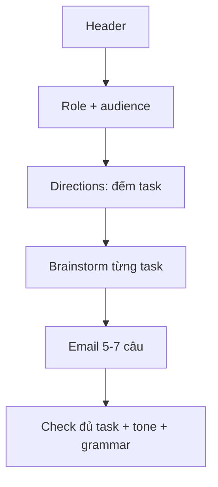

# Writing 02 - Questions 6-7: Respond to a Written Request

> **Nguồn:** PDF trang 124-139 (trang sách 111-126)

## Mục tiêu bài học

- Đọc email và xác định đúng role, audience, topic.
- Hoàn thành mọi task trong directions trong 10 phút.
- Dùng tone và vocabulary phù hợp quan hệ người gửi - người nhận.

## Nội dung cốt lõi

### Cách đọc prompt

Theo sách, hãy scan theo thứ tự:

1. **Subject line**
2. **Directions**
3. **Body of e-mail**

Directions quyết định bạn phải làm gì: ask questions, make requests, make suggestions, give information, explain a problem...

### Template cơ bản

1. Greeting
2. Opening statement / purpose
3. Task 1
4. Task 2
5. Task 3
6. Concluding statement / request for action
7. Closing

Một response hoàn chỉnh thường không cần quá dài; quan trọng nhất là **đủ task**.

### Tone

- Người có vị trí cao hơn / khách hàng: formal hơn.
- Đồng nghiệp/peer: có thể ít formal hơn.

Ví dụ nhóm chức năng:

- Request: *Could you please...? / I would appreciate it if...*
- Information: *I would like to let you know that...*
- Problem: *Unfortunately, I have had an issue with...*
- Explanation: *The main reason is... / Due to...*

### Checklist task response

Nếu directions yêu cầu **ONE problem + TWO suggestions**, response phải cho đúng 3 thành phần đó. Một email viết hay nhưng thiếu 1 task vẫn bị mất điểm.

## Sơ đồ ghi nhớ

## Luyện tập

Trước khi viết, ghi mini-outline: `P1 / S1 / S2` hoặc `Q1 / Q2 / Q3` đúng với directions. Sau khi viết, tick từng item. Đây là cách nhanh nhất tránh lỗi “viết hay nhưng thiếu task”.

## Checklist tự chấm

- [ ] Đúng role.
- [ ] Đúng người nhận/tone.
- [ ] Đủ toàn bộ task theo số lượng yêu cầu.
- [ ] Có opening và closing.
- [ ] Câu đa dạng nhưng không quá phức tạp.
- [ ] Hoàn thành trong 10 phút.
