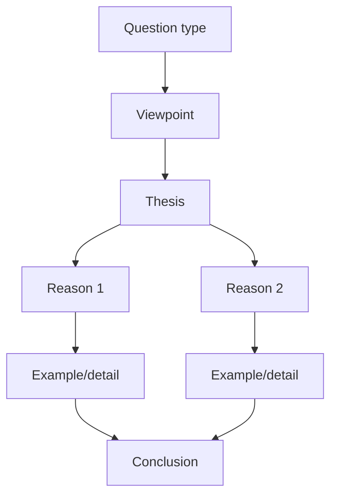

# Writing 03 - Question 8: Write an Opinion Essay

> **Nguồn:** PDF trang 140-155 (trang sách 127-142)

## Mục tiêu bài học

- Phân tích đúng loại câu hỏi và nêu thesis rõ.
- Viết khoảng 300 từ trong 30 phút.
- Phát triển reasons bằng details/examples và tổ chức paragraph rõ ràng.

## Nội dung cốt lõi

### Dạng đề

Sách cho các kiểu như agree/disagree, preference, advantages/disadvantages, opinion/importance. Trước khi brainstorm phải xác định chính xác prompt đang hỏi dạng nào.

### Outline đề xuất

**Introduction**
- paraphrase topic
- thesis / position
- preview reasons (nếu phù hợp)

**Body 1**
- topic sentence
- reason 1
- detail/example
- mini conclusion/transition

**Body 2**
- topic sentence
- reason 2
- detail/example
- mini conclusion/transition

**Body 3** (tùy thời gian/nội dung)
- reason 3 hoặc mặt đối lập cần thảo luận

**Conclusion**
- restate thesis
- summarize support
- final sentence

### Quy trình 30 phút

- 3-5 phút: analyze + brainstorm + outline.
- 20-22 phút: write.
- 3-5 phút: revise grammar, spelling, punctuation, sentence completeness.

### What makes support strong?

Không chỉ viết *I think X is better*. Mỗi reason cần được nối với **why it matters** và một example/detail cụ thể.

### Cohesion

Dùng transitions để thể hiện chức năng logic: *First of all, Next, On the other hand, For example, Therefore, To summarize...* nhưng không nhồi transition vào mọi câu.

## Sơ đồ ghi nhớ

## Luyện tập

Luyện một đề theo hai viewpoint khác nhau. Mục tiêu không phải bảo vệ “ý kiến thật” mà là luyện khả năng tạo thesis + support nhanh cho bất kỳ hướng nào.

## Checklist tự chấm

- [ ] Thesis trả lời trực tiếp prompt.
- [ ] Mỗi body paragraph có topic sentence.
- [ ] Reasons được giải thích bằng details/examples.
- [ ] Có conclusion.
- [ ] Essay gần hoặc trên khoảng 300 từ theo hướng dẫn của sách.
- [ ] Dành thời gian revise.
