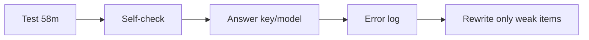

# Writing 04 - Full Practice Test

> **Nguồn:** PDF trang 156-162 (trang sách 143-149)

## Mục tiêu bài học

- Làm 8 câu liên tục dưới đúng giới hạn thời gian.
- Không mở answer key trong khi làm.
- Tự chấm theo checklist của từng dạng trước khi xem model response.

## Nội dung cốt lõi

### Mô phỏng thời gian

- Q1-5: 8 phút tổng.
- Q6: 10 phút.
- Q7: 10 phút.
- Q8: 30 phút.

Tổng thời gian phần task khoảng 58 phút, tương ứng cấu trúc Writing một giờ trong sách.

### Tự chấm trước khi xem đáp án

**Q1-5:** both words + grammar + relevance.

**Q6-7:** all tasks + sentence variety + vocabulary + organization + tone.

**Q8:** thesis + support + organization + grammar + vocabulary + length.

Sau đó mới mở `appendix/01-answer-key.md` và trang scan tương ứng để so với model responses.

## Sơ đồ ghi nhớ

## Luyện tập

Không rewrite toàn bộ bài ngay. Chỉ rewrite câu/email/paragraph có lỗi rõ, rồi làm một đề mới để kiểm tra xem lỗi có tái diễn không.

## Checklist tự chấm

- [ ] Đúng timer.
- [ ] Không xem key trước.
- [ ] Tự chấm trước khi so model.
- [ ] Có error log theo Task/Organization/Grammar/Vocabulary.
