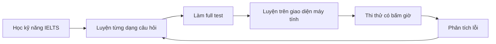
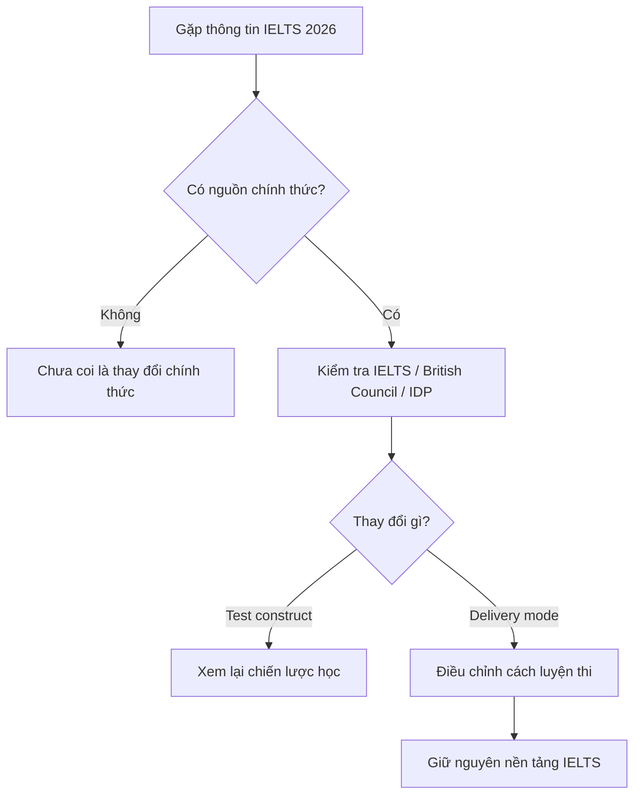

# 006 - Cập Nhật IELTS 2026: Điều Gì Thực Sự Thay Đổi Và Điều Gì Không?

**Module:** 02 - Thông Tin Cơ Bản Về Kỳ Thi IELTS
**Loại bài:** lesson

---

## 1. Tóm tắt

IELTS có những thay đổi quan trọng trong năm 2026, nhưng điểm cốt lõi cần hiểu là:

> **IELTS thay đổi chủ yếu về cách tổ chức và hình thức làm bài, không phải cấu trúc đánh giá năng lực tiếng Anh.**

Ngày 5 tháng 3 năm 2026, IELTS chính thức thông báo quá trình chuyển từ IELTS trên giấy sang IELTS trên máy tính từ giữa năm 2026. Thời điểm áp dụng cụ thể có thể khác nhau giữa từng thị trường. Đồng thời, tại một số quốc gia, thí sinh có thể chọn hình thức `Writing on Paper`: Listening và Reading làm trên máy tính, còn Writing được viết tay trên giấy. ([IELTS][1])

Điều này **không có nghĩa IELTS xuất hiện một "new pattern" hoàn toàn mới**. Các kỹ năng được đánh giá, bản chất của bài thi, cách chấm điểm và thang điểm IELTS không bị thay đổi bởi cập nhật này. ([IELTS][1])

Vì vậy, người học không cần xây dựng lại toàn bộ phương pháp luyện IELTS. Điều cần điều chỉnh chủ yếu là khả năng làm bài trên máy tính và sự quen thuộc với hình thức thi tại test centre.

---

## 2. Mục tiêu học tập

Sau bài này, người học có thể:

* phân biệt được **thay đổi cấu trúc đề thi** với **thay đổi cách tổ chức bài thi**;
* mô tả chính xác những thay đổi quan trọng của IELTS trong năm 2026;
* xác định những thành phần của IELTS vẫn giữ nguyên;
* giải thích được `Writing on Paper` và `One Skill Retake`;
* điều chỉnh chiến lược luyện thi cho môi trường IELTS trên máy tính;
* đánh giá một thông tin về "IELTS 2026 new format" trước khi quyết định thay đổi kế hoạch học.

---

## 3. "Test format" và "test delivery" không phải một khái niệm

Đây là điểm dễ gây nhầm lẫn nhất khi đọc thông tin về IELTS 2026.

**Test format** liên quan đến những yếu tố như:

* IELTS kiểm tra bao nhiêu kỹ năng;
* Listening có bao nhiêu câu;
* Reading gồm những dạng câu hỏi nào;
* Writing có bao nhiêu task;
* Speaking có bao nhiêu part;
* tiêu chí chấm điểm;
* thang điểm.

**Test delivery** là cách bài thi được tổ chức, chẳng hạn:

* làm bài trên giấy hay máy tính;
* nhập câu trả lời bằng bàn phím hay viết tay;
* examiner Speaking ngồi cùng phòng hay trao đổi qua video call;
* cách nhận kết quả.

IELTS 2026 chủ yếu thay đổi ở **test delivery**.

Có thể hình dung:

```text
IELTS 2026
     │
     ├── Nội dung được đánh giá
     │       └── Về cơ bản giữ nguyên
     │
     ├── Cấu trúc bài thi
     │       └── Về cơ bản giữ nguyên
     │
     ├── Cách chấm điểm
     │       └── Giữ nguyên
     │
     └── Cách tổ chức bài thi
             └── Chuyển mạnh sang computer delivery
```

Nếu một thông báo nói rằng IELTS chuyển từ giấy sang máy tính, điều đó **không tự động có nghĩa** IELTS đã thay đổi dạng câu hỏi hoặc tiêu chí chấm điểm.

---

## 4. Những thay đổi quan trọng của IELTS trong năm 2026

### 4.1. IELTS chuyển sang hình thức thi trên máy tính

IELTS chính thức thông báo rằng từ giữa năm 2026, hình thức IELTS truyền thống hoàn toàn trên giấy sẽ được ngừng cung cấp, với lịch chuyển đổi cụ thể khác nhau theo từng thị trường. Các bài IELTS sẽ được chuyển sang hình thức làm bài trên máy tính tại test centre. ([IELTS][1])

Trong IELTS on computer:

* Listening thực hiện trên máy tính;
* Reading thực hiện trên máy tính;
* Writing thông thường được nhập bằng bàn phím;
* Speaking vẫn được thực hiện với một IELTS Examiner.

Điều này khiến kỹ năng sử dụng giao diện thi trở thành một phần quan trọng của quá trình chuẩn bị.

### 4.2. Xuất hiện lựa chọn `Writing on Paper`

Để hỗ trợ những thí sinh viết tay tốt hơn đánh máy, IELTS triển khai `Writing on Paper` tại một số thị trường từ giữa năm 2026. ([IELTS][2])

Ở hình thức này:

| Thành phần | Cách thực hiện                                            |
| ---------- | --------------------------------------------------------- |
| Listening  | Trên máy tính                                             |
| Reading    | Trên máy tính                                             |
| Writing    | Đề hiển thị trên máy tính, câu trả lời viết tay trên giấy |
| Speaking   | Với IELTS Examiner                                        |

Điểm quan trọng là `Writing on Paper` **không phải một loại IELTS Writing mới**.

Task, thời gian làm bài và cách chấm Writing vẫn giống với IELTS on computer thông thường. Điểm khác biệt chính là phương thức nhập câu trả lời. ([IELTS][2])

Hình thức này áp dụng cho cả IELTS Academic và IELTS General Training tại những nơi được hỗ trợ, nhưng hiện không áp dụng cho IELTS for UKVI. ([IELTS][2])

---

## 5. Những thành phần không thay đổi

Việc chuyển sang máy tính không tạo ra một IELTS hoàn toàn mới.

Cấu trúc cốt lõi vẫn gồm bốn kỹ năng:

| Kỹ năng   | Cấu trúc chính     |
| --------- | ------------------ |
| Listening | 4 parts, 40 câu    |
| Reading   | 3 parts, 40 câu    |
| Writing   | 2 tasks            |
| Speaking  | 3 parts            |
| Điểm số   | IELTS 9-band scale |

IELTS xác nhận Listening hiện vẫn gồm bốn phần với tổng cộng 40 câu. Reading gồm ba phần và 40 câu, trong khi Academic Writing vẫn gồm hai task. ([IELTS][3])

Listening và Reading vẫn được quy đổi sang thang điểm IELTS từ `0–9`, bao gồm whole band và half band. ([IELTS][4])

Quan trọng hơn, thông báo năm 2026 của IELTS khẳng định thay đổi về delivery **không làm thay đổi các kỹ năng được đánh giá, test construct hoặc cách các tổ chức diễn giải kết quả IELTS**. ([IELTS][1])

Vì vậy, không có cơ sở để kết luận rằng IELTS 2026:

* có một kỹ năng thứ năm;
* chuyển thành adaptive testing;
* thay toàn bộ dạng câu hỏi;
* có thang điểm mới;
* loại bỏ Writing Task 1 hoặc Task 2;
* thay Speaking từ ba part thành một cấu trúc mới.

---

## 6. `One Skill Retake` cần được hiểu đúng

`One Skill Retake` cho phép thí sinh thi lại **một trong bốn kỹ năng**:

* Listening;
* Reading;
* Writing;
* Speaking.

Ví dụ:

```text
Kết quả ban đầu

Listening  8.0
Reading    8.0
Writing    6.0
Speaking   7.5
               ↓
        Retake Writing
               ↓
Listening  8.0
Reading    8.0
Writing    điểm mới
Speaking   7.5
```

Thí sinh không nhất thiết phải thi lại cả bốn kỹ năng chỉ vì một kỹ năng chưa đạt mục tiêu.

Theo quy định hiện hành, người thi cần hoàn thành `One Skill Retake` trong vòng **60 ngày** kể từ bài thi đầy đủ ban đầu và chỉ được thực hiện một One Skill Retake cho mỗi bài thi gốc. Khả năng sử dụng tính năng này còn phụ thuộc vào test centre và thị trường. ([IELTS][5])

Một lưu ý đặc biệt:

> Trước khi sử dụng điểm `One Skill Retake`, hãy kiểm tra xem trường đại học, cơ quan di trú hoặc tổ chức nhận hồ sơ của bạn có chấp nhận loại kết quả này hay không.

IELTS cũng khuyến nghị người thi xác nhận trực tiếp với tổ chức nhận điểm trước khi đăng ký. ([IELTS][6])

---

## 7. Kết quả thi trên máy tính thường nhanh hơn

Một lợi thế thực tế của IELTS on computer là thời gian nhận kết quả.

Theo IELTS, kết quả IELTS trên máy tính hiện thường có trong khoảng **1–2 ngày**. Khoảng một nửa số kết quả có thể được phát hành trong một ngày và phần lớn được phát hành trong hai ngày, mặc dù một số trường hợp có thể cần thời gian kiểm tra lâu hơn. ([IELTS][7])

Riêng `Writing on Paper`, IELTS thông báo kết quả được cung cấp trong vòng **5 ngày** sau ngày thi. ([IELTS][2])

Không nên hiểu "1–2 ngày" là cam kết tuyệt đối rằng mọi thí sinh sẽ luôn nhận điểm đúng sau 24 hoặc 48 giờ.

---

## 8. Speaking qua video call có làm thay đổi bài thi không?

Một số IELTS test centre có thể tổ chức Speaking thông qua `Video Call Speaking` hoặc `VCS`.

Trong trường hợp này:

```text
Thí sinh
    │
    │ live video
    ▼
IELTS Examiner
```

Examiner vẫn là người thật và cuộc thi vẫn diễn ra trực tiếp.

British Council cho biết tại những test centre triển khai `Video Call Speaking`, nội dung, cách chấm điểm, thời gian, dạng câu hỏi và yêu cầu bảo mật vẫn tương đương với Speaking trực tiếp. ([British Council Iraq][8])

IELTS cũng đã tiến hành nghiên cứu về hình thức Video Call Speaking và ghi nhận bằng chứng về khả năng duy trì tính tương đương của phương thức đánh giá. ([IELTS][9])

Do đó:

> **Video-call Speaking là thay đổi về phương thức tương tác với examiner, không phải một Speaking format mới.**

Thí sinh vẫn phải chuẩn bị đầy đủ ba phần của IELTS Speaking.

---

## 9. IELTS 2026 ảnh hưởng thế nào đến cách ôn thi?

Việc cấu trúc bài thi không thay đổi có nghĩa người học **không cần bỏ toàn bộ giáo trình IELTS hiện tại**.

Các tài liệu luyện IELTS chuẩn vẫn có giá trị để luyện:

* comprehension;
* vocabulary;
* grammar;
* skimming;
* scanning;
* paraphrase;
* Listening;
* Writing Task 1;
* Writing Task 2;
* Speaking Part 1;
* Speaking Part 2;
* Speaking Part 3;
* các dạng câu hỏi Reading và Listening.

Tuy nhiên, chỉ luyện trên giấy là chưa đủ nếu bài thi thực tế của bạn được tổ chức trên máy tính.

Chiến lược chuẩn bị nên chuyển thành:



Kỹ năng tiếng Anh vẫn là nền tảng chính, nhưng người học cần thêm một lớp **digital test familiarity**: khả năng thực hiện chính xác những gì mình đã luyện trong môi trường thi trên máy tính.

---

## 10. Những kỹ năng máy tính nên luyện trước ngày thi

Người chuẩn bị IELTS on computer nên luyện một cách có chủ đích:

* đọc văn bản dài trên màn hình;
* chuyển nhanh giữa passage và câu hỏi;
* nhập câu trả lời chính xác;
* kiểm tra spelling sau khi nhập;
* sử dụng bàn phím tiếng Anh thành thạo;
* viết essay bằng bàn phím trong giới hạn thời gian;
* đọc và sửa câu trực tiếp trên màn hình;
* duy trì tập trung khi nghe bằng headphone;
* làm full test liên tục trên máy tính.

Đặc biệt với Writing, hãy đo tốc độ thực tế của mình.

Ví dụ, nếu bạn có ý tưởng tốt nhưng đánh máy quá chậm, vấn đề không nằm ở IELTS Writing knowledge mà nằm ở **execution speed**.

Người học có thể luyện theo chu trình:

```text
Viết essay không bấm giờ
        ↓
Viết essay 50 phút
        ↓
Viết essay 45 phút
        ↓
Mô phỏng đúng thời gian thi
        ↓
Kiểm tra lỗi khi đánh máy
```

Mục đích không phải đánh máy càng nhanh càng tốt mà là đạt tốc độ đủ để:

1. lập dàn ý;
2. viết;
3. kiểm tra bài;

trong thời gian cho phép.

---

## 11. Có cần bỏ các bộ Cambridge IELTS cũ không?

Không nên bỏ các tài liệu luyện tập chất lượng chỉ vì chúng được xuất bản trước năm 2026.

Nếu một tài liệu sử dụng cấu trúc IELTS hợp lệ, nó vẫn có thể giúp luyện:

* dạng câu hỏi;
* vocabulary;
* paraphrase;
* kỹ thuật Reading;
* kỹ thuật Listening;
* Writing;
* Speaking;
* quản lý thời gian.

Ví dụ, các bộ Cambridge IELTS như Cambridge 14–19 vẫn có thể được sử dụng để luyện các kỹ năng và task IELTS cốt lõi vì cập nhật 2026 không phải là một cuộc thiết kế lại toàn bộ test construct.

Tuy nhiên, nên bổ sung tài liệu luyện trên máy tính để tránh tình trạng:

```text
Làm paper test rất tốt
        ↓
Không quen giao diện máy tính
        ↓
Mất thời gian thao tác
        ↓
Giảm hiệu suất ngày thi
```

Do đó, hai loại luyện tập nên được kết hợp:

| Loại luyện tập                    | Mục tiêu                                          |
| --------------------------------- | ------------------------------------------------- |
| Cambridge/official practice tests | Luyện kiến thức và kỹ năng IELTS                  |
| Computer practice                 | Luyện khả năng thực thi trong môi trường thi thật |

---

## 12. Cách nhận diện tin đồn "IELTS 2026 new pattern"

Không nên thay đổi toàn bộ kế hoạch học chỉ vì nhìn thấy một tiêu đề như:

> "IELTS NEW FORMAT 2026 – EVERYTHING HAS CHANGED!"

Hãy kiểm tra thông tin theo quy trình:



Điểm quan trọng nhất ở bước cuối là xác định **loại thay đổi**.

Ví dụ:

**Thông tin:** "IELTS chuyển sang computer."

Kết luận đúng:

> Cần luyện thi trên máy tính nhiều hơn.

Kết luận sai:

> Toàn bộ Cambridge IELTS cũ không còn giá trị.

---

## 13. Hai ví dụ kiểm chứng thông tin IELTS

**Ví dụ 1**

Một video tuyên bố:

> "Từ 2026 IELTS Writing có ba task."

Quy trình đánh giá:

1. Không thay đổi kế hoạch học ngay.
2. Kiểm tra thông tin trên website IELTS chính thức.
3. Đối chiếu với test format hiện hành.
4. IELTS Academic Writing hiện vẫn có hai task. ([IELTS][3])
5. Không có cơ sở để chuyển sang luyện ba Writing tasks.

**Kết luận:** thông tin không phù hợp với cấu trúc chính thức hiện hành.

---

**Ví dụ 2**

Một bài viết nói:

> "IELTS 2026 chuyển từ paper test sang computer test."

Quy trình đánh giá:

1. Kiểm tra thông báo chính thức.
2. IELTS đã công bố việc ngừng IELTS paper-based từ giữa năm 2026, với thời điểm triển khai cụ thể thay đổi theo thị trường. ([IELTS][1])
3. Xác định đây là thay đổi về delivery mode.
4. Bổ sung luyện Reading, Listening và Writing trên máy tính.

**Kết luận:** thông tin có cơ sở, nhưng không nên diễn giải thành "IELTS đã đổi toàn bộ cấu trúc đề".

---

## 14. Sai lầm thường gặp

> **Hiện tượng:** Dừng sử dụng toàn bộ tài liệu IELTS cũ vì nghe nói có "IELTS 2026 new format".
> **Nguyên nhân:** Nhầm giữa test delivery và test format.
> **Cách xử lý:** Tiếp tục luyện kỹ năng IELTS nhưng bổ sung computer practice.

> **Hiện tượng:** Chỉ luyện đề trên giấy.
> **Nguyên nhân:** Chưa tính đến quá trình chuyển sang IELTS on computer.
> **Cách xử lý:** Thực hiện thường xuyên các bài thi thử trực tiếp trên máy tính.

> **Hiện tượng:** Cho rằng Video Call Speaking dễ hoặc khó hơn một bài Speaking khác.
> **Nguyên nhân:** Nhầm phương thức truyền hình ảnh với cấu trúc bài thi.
> **Cách xử lý:** Chuẩn bị cùng ba phần Speaking và cùng tiêu chuẩn năng lực như bình thường.

> **Hiện tượng:** Giả định mình chắc chắn được sử dụng `One Skill Retake`.
> **Nguyên nhân:** Không kiểm tra test centre và tổ chức nhận kết quả.
> **Cách xử lý:** Kiểm tra availability tại test centre và chính sách của tổ chức nhận điểm trước khi đăng ký. ([IELTS][6])

---

## 15. Chiến lược chuẩn bị IELTS 2026

Một kế hoạch ôn tập hợp lý có thể chia thành bốn lớp:

**Lớp 1 — English proficiency**

Tăng năng lực thực tế:

* vocabulary;
* grammar;
* pronunciation;
* listening comprehension;
* reading comprehension;
* writing;
* spoken communication.

**Lớp 2 — IELTS skills**

Nắm:

* question types;
* task requirements;
* marking criteria;
* paraphrase;
* time management;
* chiến lược từng kỹ năng.

**Lớp 3 — Computer test execution**

Luyện:

* đọc trên màn hình;
* sử dụng giao diện;
* nhập đáp án;
* đánh máy Writing;
* kiểm tra lỗi trực tiếp trên máy.

**Lớp 4 — Full mock test**

Mô phỏng:

```text
Đúng thiết bị
+
Đúng thời gian
+
Đúng thứ tự
+
Không dừng giữa bài
+
Review sau khi hoàn thành
```

Đây là cách chuẩn bị hiệu quả hơn nhiều so với việc liên tục tìm kiếm "mẹo cho IELTS 2026 new pattern".

---

## 16. Câu hỏi tự kiểm tra

1. Vì sao việc IELTS chuyển sang computer delivery không đồng nghĩa với việc IELTS thay toàn bộ cấu trúc đề?

2. `Writing on Paper` khác IELTS on computer thông thường ở điểm nào?

3. Người học cần thay đổi điều gì trong quá trình luyện thi khi paper-based IELTS được giảm dần?

4. Vì sao một tài liệu Cambridge IELTS được xuất bản trước năm 2026 vẫn có thể hữu ích?

5. Trước khi tin rằng IELTS xuất hiện một dạng câu hỏi mới, bạn nên kiểm tra những gì?

---

## 17. Checklist chuẩn bị

* [ ] Tôi phân biệt được `test format` và `test delivery`.
* [ ] Tôi biết IELTS vẫn đánh giá Listening, Reading, Writing và Speaking.
* [ ] Tôi biết Listening vẫn có 40 câu.
* [ ] Tôi biết Reading vẫn có 40 câu.
* [ ] Tôi biết Writing vẫn gồm 2 tasks.
* [ ] Tôi biết Speaking vẫn gồm 3 parts.
* [ ] Tôi hiểu `Writing on Paper` hoạt động như thế nào.
* [ ] Tôi hiểu nguyên tắc cơ bản của `One Skill Retake`.
* [ ] Tôi đã bắt đầu luyện IELTS trên máy tính.
* [ ] Tôi có thể viết một bài Writing có bấm giờ bằng bàn phím.
* [ ] Tôi không thay đổi kế hoạch học chỉ dựa trên tin đồn về "new pattern".
* [ ] Tôi kiểm tra thông tin quan trọng trên các kênh IELTS chính thức trước khi áp dụng.

---

## 18. Tổng kết

Cập nhật IELTS 2026 là một thay đổi đáng chú ý về **cách bài thi được tổ chức**, đặc biệt là quá trình chuyển từ IELTS trên giấy sang IELTS trên máy tính từ giữa năm 2026, với lịch cụ thể phụ thuộc từng thị trường. IELTS cũng triển khai `Writing on Paper` ở một số nơi dành cho thí sinh muốn viết tay phần Writing. ([IELTS][1])

Tuy nhiên, đây không phải một cuộc thiết kế lại toàn bộ IELTS.

Các kỹ năng được đánh giá, test construct và cách diễn giải điểm không thay đổi vì cập nhật delivery này. Listening, Reading, Writing và Speaking vẫn là bốn thành phần cốt lõi của IELTS. ([IELTS][1])

Vì vậy, chiến lược phù hợp cho IELTS 2026 là:

```text
Không chạy theo tin đồn
        ↓
Giữ vững nền tảng IELTS
        ↓
Tiếp tục luyện các dạng bài chuẩn
        ↓
Bổ sung luyện thi trên máy tính
        ↓
Mô phỏng điều kiện thi thực tế
        ↓
Kiểm tra thông tin chính thức trước khi điều chỉnh kế hoạch
```

Điều thay đổi lớn nhất với phần lớn người học không phải là **học một IELTS hoàn toàn mới**, mà là học cách thể hiện năng lực IELTS quen thuộc một cách hiệu quả trong môi trường thi ngày càng được số hóa.

[1]: https://ielts.org/news-and-insights/updates-to-ielts-test-delivery?utm_source=chatgpt.com "IELTS | News and Insights - Updates to IELTS test delivery"
[2]: https://ielts.org/take-a-test/test-types/ielts-on-computer-writing-on-paper?utm_source=chatgpt.com "IELTS | IELTS on computer: Writing on Paper option"
[3]: https://ielts.org/take-a-test/preparation-resources/sample-test-questions/academic-test?utm_source=chatgpt.com "IELTS | IELTS Academic sample test questions"
[4]: https://ielts.org/take-a-test/your-results/ielts-scoring-in-detail?utm_source=chatgpt.com "IELTS | IELTS scoring in detail: band scores explained"
[5]: https://ielts.org/organisations/ielts-for-organisations/verifying-ielts-results/one-skill-retake?utm_source=chatgpt.com "IELTS | One Skill Retake"
[6]: https://ielts.org/take-a-test/booking-your-test/one-skill-retake?trk=public_post_comment-text&utm_source=chatgpt.com "IELTS | IELTS One Skill Retake: retake one section"
[7]: https://ielts.org/take-a-test/your-results/fast-test-results-and-sharing?utm_source=chatgpt.com "IELTS | Fast IELTS results: get and share your score"
[8]: https://iraq.britishcouncil.org/en/exam/ielts/which-test/academic?utm_source=chatgpt.com "Take your IELTS Academic test | British Council"
[9]: https://ielts.org/researchers/our-research/research-reports/development-of-the-ielts-video-call-speaking-test?utm_source=chatgpt.com "IELTS | Research report - Development of the IELTS Video Call…"
