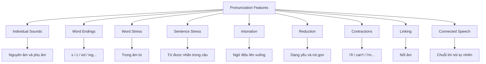
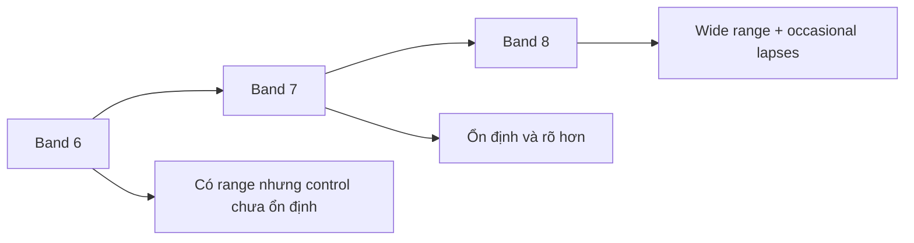
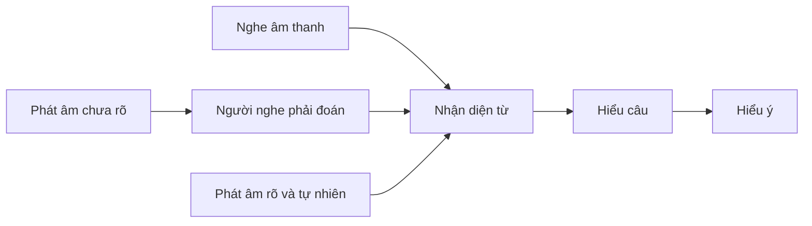
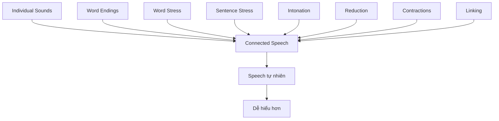
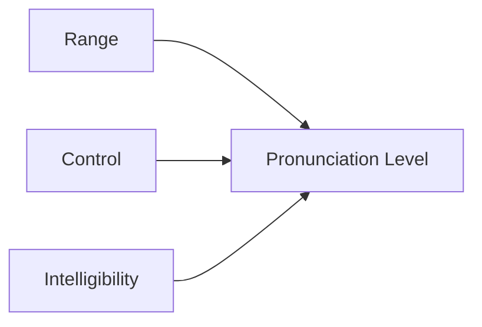

# Lesson 1 – Pronunciation Features

## Các đặc điểm phát âm trong IELTS Speaking

---

## 1. Mục tiêu bài học

Sau bài học này, bạn có thể:

* Hiểu **Pronunciation** được đánh giá như thế nào trong IELTS Speaking.
* Phân biệt đặc điểm phát âm ở các mức **Band 5, 6, 7, 8 và 9**.
* Hiểu khái niệm **pronunciation features**.
* Nhận biết những lỗi phát âm có thể làm giảm độ rõ ràng của câu nói.
* Biết các nhóm kỹ năng phát âm quan trọng cần luyện:

  * individual sounds;
  * word endings;
  * reductions;
  * contractions;
  * word stress;
  * sentence stress;
  * intonation;
  * linking;
  * connected speech.
* Hiểu rằng mục tiêu quan trọng không phải là có giọng bản xứ, mà là **nói rõ, tự nhiên và dễ hiểu**.

---

# 2. Pronunciation trong IELTS Speaking

IELTS Speaking thường được đánh giá dựa trên bốn tiêu chí chính:

1. **Fluency and Coherence**
   Độ trôi chảy và mạch lạc.

2. **Lexical Resource**
   Khả năng sử dụng từ vựng.

3. **Grammatical Range and Accuracy**
   Độ đa dạng và chính xác của ngữ pháp.

4. **Pronunciation**
   Khả năng phát âm.

Trong bài này, chúng ta chỉ tập trung vào tiêu chí thứ tư:

> **Pronunciation – Phát âm**

Pronunciation không đơn giản chỉ là đọc đúng từng âm riêng lẻ.

Người nói còn phải biết kết hợp nhiều đặc điểm của ngôn ngữ nói để tạo ra lời nói:

* rõ ràng;
* tự nhiên;
* có nhịp điệu;
* dễ theo dõi;
* dễ hiểu đối với người nghe.

---

# 3. Pronunciation Features là gì?

**Pronunciation features** có thể hiểu là những đặc điểm tạo nên cách chúng ta phát âm tiếng Anh.

Một số thành phần quan trọng gồm:



Điểm IELTS cao không đến từ một kỹ thuật duy nhất.

Bạn cần sử dụng **nhiều pronunciation features cùng lúc** và kiểm soát chúng ổn định.

---

# 4. Band 5 – Phát âm còn hạn chế

Ở khoảng Band 5, người nói có thể sử dụng một số đặc điểm phát âm nhưng phạm vi còn hạn chế.

Đặc điểm thường gặp:

* Sử dụng một phạm vi pronunciation features tương đối hạn chế.
* Có cố gắng kiểm soát cách phát âm.
* Tuy nhiên lỗi vẫn xuất hiện thường xuyên.
* Một số từ bị phát âm sai.
* Một số âm riêng lẻ bị phát âm sai.
* Lỗi phát âm đôi khi khiến người nghe gặp khó khăn khi hiểu.

Có thể hình dung:

> Người nghe vẫn hiểu phần lớn nội dung, nhưng đôi lúc phải cố gắng đoán người nói muốn nói từ nào.

---

# 5. Một lỗi âm nhỏ có thể thay đổi nghĩa

Hãy xem hai từ:

* **live**
* **leave**

Chúng chỉ khác nhau ở nguyên âm nhưng mang nghĩa hoàn toàn khác nhau.

### Ví dụ

> I'm leaving Hanoi.

Nghĩa:

> Tôi đang rời Hà Nội.

Nhưng nếu phát âm **leaving** thành gần giống **living**, người nghe có thể hiểu thành:

> I'm living in Hanoi.

Nghĩa:

> Tôi đang sống ở Hà Nội.

Hai câu có ý nghĩa gần như đối lập:

| Câu                  | Nghĩa                   |
| -------------------- | ----------------------- |
| I'm leaving Hanoi.   | Tôi đang rời Hà Nội.    |
| I'm living in Hanoi. | Tôi đang sống ở Hà Nội. |

Đây là lý do IELTS không chỉ quan tâm việc bạn biết từ vựng nào.

Nếu âm được phát ra không đủ rõ, người nghe có thể nhận diện thành **một từ hoàn toàn khác**.

---

# 6. Band 6 – Có nhiều pronunciation features hơn nhưng kiểm soát chưa ổn định

Ở Band 6, người nói bắt đầu sử dụng được phạm vi phát âm rộng hơn.

Tuy nhiên khả năng kiểm soát vẫn chưa hoàn toàn ổn định.

Đặc điểm chính:

* Sử dụng được một phạm vi pronunciation features.
* Khả năng kiểm soát các features còn **mixed control**.
* Có những đoạn sử dụng phát âm hiệu quả.
* Nhưng chất lượng này chưa được duy trì xuyên suốt.
* Nhìn chung người nghe vẫn có thể hiểu.
* Một số từ hoặc âm vẫn bị phát âm sai.
* Những lỗi này đôi lúc làm giảm độ rõ ràng.

Có thể biểu diễn:

```text
Band 6

Có nhiều pronunciation features
            ↓
Một số đoạn sử dụng khá tốt
            ↓
Nhưng chưa duy trì ổn định
            ↓
Vẫn có lỗi từ / âm riêng lẻ
            ↓
Người nghe nhìn chung vẫn hiểu
```

Từ khóa quan trọng ở mức này là:

> **not sustained**

Tức là:

> Có thể làm tốt, nhưng chưa duy trì được liên tục.

---

# 7. Band 7 – Cầu nối giữa Band 6 và Band 8

Band 7 có thể được hiểu là mức nằm giữa Band 6 và Band 8.

Người đạt Band 7:

* có đầy đủ những đặc điểm tích cực của Band 6;
* đồng thời thể hiện được một số đặc điểm của Band 8;
* nhưng chưa thể hiện được tất cả những đặc điểm đó một cách ổn định.

Có thể hình dung:



Band 7 vì vậy không đơn giản là:

> “Phát âm đúng 70%.”

IELTS đánh giá **chất lượng tổng thể của lời nói**, bao gồm:

* phạm vi kỹ thuật;
* khả năng kiểm soát;
* tính ổn định;
* độ rõ ràng;
* mức độ dễ hiểu.

---

# 8. Band 8 – Phạm vi rộng và rất dễ hiểu

Ở Band 8, người nói có khả năng sử dụng **wide range of pronunciation features**.

Điều này có nghĩa là nhiều yếu tố được phối hợp với nhau:

* âm;
* trọng âm;
* ngữ điệu;
* nối âm;
* reduction;
* connected speech.

Đặc điểm chính:

* Sử dụng một phạm vi pronunciation features rộng.
* Khả năng kiểm soát rất tốt.
* Chỉ đôi lúc xuất hiện lỗi nhỏ.
* Người nói dễ hiểu trong toàn bộ phần thi.
* Ảnh hưởng của giọng ngôn ngữ mẹ đẻ lên khả năng hiểu là rất nhỏ.

Một cụm từ quan trọng:

> **only occasional lapses**

Có nghĩa là:

> Chỉ thỉnh thoảng mới có lỗi hoặc mất kiểm soát.

Đây là điểm khác biệt lớn so với Band 5–6.

---

# 9. Accent không phải vấn đề chính

Một hiểu lầm thường gặp là:

> Muốn đạt IELTS Speaking cao thì phải nói giống người Mỹ hoặc người Anh.

Không nhất thiết.

Bạn có thể vẫn mang:

* Vietnamese accent;
* Chinese accent;
* Japanese accent;
* Indian accent;
* hoặc bất kỳ accent nào khác.

Điều quan trọng là accent đó **không làm giảm intelligibility**.

### Intelligibility

**Intelligibility** nghĩa là:

> Mức độ mà người nghe có thể hiểu lời nói của bạn một cách chính xác.

Có thể xem mối quan hệ như sau:

```text
Accent tồn tại
      ↓
Không sao
      ↓
Miễn là âm vẫn rõ
      ↓
Từ vẫn nhận diện được
      ↓
Câu vẫn dễ hiểu
      ↓
Intelligibility cao
```

Vì vậy mục tiêu không phải:

> “Xóa hoàn toàn giọng Việt.”

Mục tiêu tốt hơn là:

> **Giảm những đặc điểm của accent gây khó hiểu.**

---

# 10. Band 9 – Kiểm soát phát âm ở mức rất cao

Band 9 là mức kiểm soát pronunciation features rất cao.

Đặc điểm chính:

* Sử dụng **full range of pronunciation features**.
* Có độ chính xác cao.
* Có khả năng sử dụng các sắc thái phát âm tinh tế.
* Sử dụng linh hoạt các features.
* Duy trì khả năng đó xuyên suốt phần nói.
* Người nghe hiểu gần như không cần nỗ lực.

Hai từ khóa rất quan trọng:

> **precision**

và

> **subtlety**

### Precision

**Precision** là độ chính xác.

Không chỉ phát âm gần đúng mà cần kiểm soát tốt:

* âm;
* trọng âm;
* rhythm;
* intonation;
* linking.

### Subtlety

**Subtlety** là khả năng sử dụng những thay đổi nhỏ, tinh tế trong giọng nói.

Ví dụ:

* thay đổi ngữ điệu để biểu đạt thái độ;
* nhấn đúng từ quan trọng;
* giảm nhẹ những từ chức năng;
* thay đổi rhythm theo ý nghĩa của câu.

---

# 11. Easy to understand và Effortless to understand

Đây là một khác biệt rất đáng chú ý.

Ở trình độ cao, mục tiêu không chỉ là:

> **easy to understand**

mà cao hơn nữa là:

> **effortless to understand**

## Easy to understand

Người nghe hiểu bạn dễ dàng.

## Effortless to understand

Người nghe gần như không phải bỏ công xử lý cách bạn phát âm.

Thông tin đi trực tiếp từ lời nói đến ý nghĩa.



Ở trình độ rất cao, bước:

> “Người nghe phải đoán”

gần như biến mất.

---

# 12. So sánh các Band

| Band  | Range       | Control              | Lỗi phát âm      | Khả năng hiểu                 |
| ----- | ----------- | -------------------- | ---------------- | ----------------------------- |
| **5** | Hạn chế     | Còn yếu              | Thường xuyên     | Đôi lúc gây khó khăn          |
| **6** | Khá đa dạng | Mixed control        | Vẫn xuất hiện    | Nhìn chung hiểu được          |
| **7** | Khá rộng    | Tốt hơn Band 6       | Ít hơn           | Phần lớn rõ ràng              |
| **8** | Rộng        | Rất tốt              | Chỉ thỉnh thoảng | Dễ hiểu xuyên suốt            |
| **9** | Toàn diện   | Chính xác, linh hoạt | Rất ít           | Hiểu gần như không cần nỗ lực |

Xu hướng tổng quát:

```text
Band 5
  ↓
Limited range
  ↓
Band 6
  ↓
Range + mixed control
  ↓
Band 7
  ↓
Control tốt và ổn định hơn
  ↓
Band 8
  ↓
Wide range + occasional lapses
  ↓
Band 9
  ↓
Full range + precision + subtlety
```

---

# 13. Individual Sounds – Âm riêng lẻ

Nền tảng đầu tiên của pronunciation là phát âm các âm riêng lẻ.

Bao gồm:

* vowels – nguyên âm;
* consonants – phụ âm;
* diphthongs – nguyên âm đôi.

Ví dụ một số cặp âm dễ gây nhầm:

```text
live  ↔ leave
ship  ↔ sheep
full  ↔ fool
bed   ↔ bad
```

Nếu phát âm các âm này không rõ, người nghe có thể nhận diện nhầm từ.

Tuy nhiên, chỉ luyện individual sounds là chưa đủ.

Để nói tự nhiên, chúng ta cần tiếp tục học các pronunciation features ở cấp độ từ và câu.

---

# 14. Word Endings – Âm cuối

Một vấn đề phổ biến với người học tiếng Anh là bỏ âm cuối.

Ví dụ:

```text
work
works
worked
working
```

Những phần cuối như:

* `-s`
* `-es`
* `-ed`
* `-ing`

có thể chứa thông tin ngữ pháp.

Nếu bỏ âm cuối, không chỉ pronunciation bị ảnh hưởng mà ý nghĩa hoặc cấu trúc câu cũng có thể trở nên khó xác định.

---

# 15. Reduction – Hiện tượng rút gọn âm

Trong tiếng Anh tự nhiên, không phải từ nào cũng được phát âm với độ mạnh giống nhau.

Một số từ thường được giảm nhẹ trong connected speech.

Ví dụ:

```text
going to → gonna
want to  → wanna
```

Trong hội thoại tự nhiên, người nói thường không đọc mọi từ theo cách tách rời như trong từ điển.

Reduction giúp câu nói:

* nhanh hơn;
* tự nhiên hơn;
* có rhythm tốt hơn.

Tuy nhiên, mục tiêu không phải sử dụng càng nhiều dạng rút gọn càng tốt.

Bạn cần đảm bảo câu nói vẫn:

> **clear and intelligible**

---

# 16. Contractions – Dạng viết và nói rút gọn

Contractions xuất hiện rất thường xuyên trong tiếng Anh nói.

Ví dụ:

```text
I will → I'll

I am → I'm

cannot → can't

do not → don't

I have → I've
```

Ví dụ:

> I'll do it.

tự nhiên hơn trong hội thoại thông thường so với việc luôn đọc:

> I will do it.

Contractions giúp speech trở nên gần với cách người bản ngữ sử dụng tiếng Anh trong hội thoại hàng ngày.

---

# 17. Word Stress – Trọng âm từ

Trong tiếng Anh, các âm tiết trong một từ không có độ mạnh bằng nhau.

Một âm tiết thường được nhấn rõ hơn.

Ví dụ về cấu trúc:

```text
âm tiết yếu
    ↓
ÂM TIẾT NHẤN
    ↓
âm tiết yếu
```

Đặt trọng âm sai có thể khiến một từ đúng về mặt âm riêng lẻ nhưng vẫn khó nhận diện.

Vì vậy khi học từ mới, không nên chỉ học:

```text
spelling + meaning
```

Mà nên học:

```text
spelling
   +
meaning
   +
pronunciation
   +
word stress
```

---

# 18. Sentence Stress – Trọng âm câu

Trong câu tiếng Anh, không phải từ nào cũng được nhấn bằng nhau.

Các từ mang thông tin chính thường được nhấn mạnh hơn.

Ví dụ:

> I'm **OBSESSED** with music.

Từ **obsessed** chứa thông tin quan trọng nên có thể được nhấn mạnh.

Sentence stress giúp người nghe nhanh chóng nhận ra:

> Đâu là thông tin quan trọng nhất trong câu?

---

# 19. Intonation – Ngữ điệu

**Intonation** là sự lên xuống của cao độ giọng nói.

Ngữ điệu có thể giúp thể hiện:

* câu hỏi;
* sự ngạc nhiên;
* sự hào hứng;
* sự do dự;
* sự chắc chắn;
* thái độ của người nói.

Ví dụ cùng một câu:

> I love music.

Nếu nói đều đều, câu chỉ truyền tải thông tin.

Nhưng nếu sử dụng stress và intonation:

> I **LOVE** music!

người nghe có thể cảm nhận rõ mức độ yêu thích của người nói.

---

# 20. Linking Sounds – Nối âm

Trong tiếng Anh tự nhiên, các từ không luôn được đọc tách riêng.

Thay vì:

```text
word | word | word | word
```

speech tự nhiên thường có dạng:

```text
word‿word‿word‿word
```

Hiện tượng này gọi là:

> **linking**

Ví dụ, âm cuối của một từ có thể nối với nguyên âm đầu của từ tiếp theo.

Linking giúp câu nói:

* mượt hơn;
* giảm khoảng ngắt không tự nhiên;
* tăng tính liên tục của speech.

---

# 21. Connected Speech

Khi các pronunciation features kết hợp lại, chúng tạo nên:

> **Connected Speech**

Connected speech là cách tiếng Anh được sử dụng dưới dạng một chuỗi lời nói liên tục thay vì từng từ tách biệt.



Connected speech không có nghĩa là:

> Nói càng nhanh càng tốt.

Mục tiêu thực sự là:

> **nói liền mạch nhưng vẫn rõ ràng.**

---

# 22. Ví dụ về sự khác biệt trong chất lượng phát âm

Xét ý tưởng:

> Tôi rất yêu âm nhạc và không thể tưởng tượng cuộc sống thiếu âm nhạc.

Một cách nói đơn giản:

> I love music. I love music.

Thông tin đúng nhưng cách diễn đạt và pronunciation có thể khá đơn điệu.

Một cách tự nhiên hơn:

> I'm obsessed with music. I just can't imagine my life without it.

Nếu kết hợp:

* sentence stress;
* intonation;
* contraction;
* linking;
* rhythm;

câu nói có thể trở nên tự nhiên và biểu cảm hơn nhiều.

Điều này minh họa một nguyên tắc quan trọng:

> Pronunciation ở trình độ cao không chỉ là **không phát âm sai**.

Nó còn là khả năng **điều khiển lời nói để truyền đạt ý nghĩa một cách tự nhiên**.

---

# 23. Từ Band thấp đến Band cao thay đổi điều gì?

Quá trình cải thiện pronunciation có thể hình dung qua ba yếu tố:



## 23.1. Range

Bạn sử dụng được bao nhiêu pronunciation features?

```text
Sounds
Stress
Intonation
Reduction
Contractions
Linking
Connected speech
...
```

---

## 23.2. Control

Bạn có kiểm soát chúng chính xác không?

```text
Biết kỹ thuật
     ↓
Có thể sử dụng
     ↓
Sử dụng đúng
     ↓
Sử dụng ổn định
```

---

## 23.3. Intelligibility

Người nghe có hiểu bạn dễ dàng không?

Đây là kết quả cuối cùng quan trọng nhất.

---

# 24. Mô hình phát triển pronunciation

```text
LEVEL 1
Đọc đúng từng âm
        ↓

LEVEL 2
Đọc đúng từ
        ↓

LEVEL 3
Đặt đúng trọng âm
        ↓

LEVEL 4
Điều khiển stress + intonation
        ↓

LEVEL 5
Biết reduction + contractions
        ↓

LEVEL 6
Biết linking
        ↓

LEVEL 7
Connected speech
        ↓

LEVEL 8
Sử dụng linh hoạt
        ↓

LEVEL 9
Speech rõ, tự nhiên và effortless to understand
```

---

# 25. Sai lầm khi luyện pronunciation

## Sai lầm 1: Chỉ luyện accent

Accent không phải tiêu chí duy nhất.

Bạn có thể có accent nhưng vẫn đạt pronunciation tốt nếu lời nói:

* rõ;
* ổn định;
* dễ hiểu.

---

## Sai lầm 2: Chỉ luyện từng âm

Individual sounds rất quan trọng nhưng chỉ là nền tảng.

Bạn còn cần:

```text
sounds
   +
stress
   +
intonation
   +
linking
   +
connected speech
```

---

## Sai lầm 3: Cố nói quá nhanh

Nói nhanh không đồng nghĩa với pronunciation tốt.

Nếu tốc độ khiến:

* mất âm cuối;
* nuốt âm quan trọng;
* sai trọng âm;
* người nghe khó hiểu;

thì tốc độ đó có thể phản tác dụng.

---

## Sai lầm 4: Học reduction như công thức bắt buộc

Không phải lúc nào cũng cần biến:

```text
going to → gonna
want to → wanna
```

Reduction phụ thuộc vào:

* ngữ cảnh;
* tốc độ;
* mức độ trang trọng;
* rhythm của câu.

Hãy ưu tiên **clarity** trước.

---

# 26. Chiến lược luyện tập

Thay vì cố sửa toàn bộ pronunciation cùng lúc, hãy luyện theo từng tầng.

### Giai đoạn 1 – Sounds

Luyện các âm thường gây nhầm:

```text
/iː/ ↔ /ɪ/
/uː/ ↔ /ʊ/
/æ/ ↔ /e/
...
```

### Giai đoạn 2 – Word Level

Luyện:

* endings;
* syllables;
* word stress.

### Giai đoạn 3 – Sentence Level

Luyện:

* sentence stress;
* intonation;
* rhythm.

### Giai đoạn 4 – Connected Speech

Luyện:

* linking;
* reductions;
* contractions.

### Giai đoạn 5 – Spontaneous Speaking

Áp dụng trong:

* IELTS Speaking Part 1;
* Part 2;
* Part 3;
* hội thoại tự nhiên.

---

# 27. Quy trình luyện một câu

Giả sử bạn muốn luyện câu:

> I'm obsessed with music. I just can't imagine my life without it.

Không nên chỉ đọc câu đó nhiều lần.

Hãy phân tích từng lớp:

```text
Bước 1
Individual sounds
        ↓
Bước 2
Word stress
        ↓
Bước 3
Sentence stress
        ↓
Bước 4
Contractions
        ↓
Bước 5
Linking
        ↓
Bước 6
Intonation
        ↓
Bước 7
Nói toàn câu tự nhiên
```

Sau đó ghi âm và tự hỏi:

* Có từ nào khó hiểu không?
* Có mất âm cuối không?
* Có nhấn quá nhiều từ không?
* Intonation có quá phẳng không?
* Các từ có bị tách rời không?
* Người nghe có phải cố đoán không?

---

# 28. Checklist tự đánh giá

Khi nghe lại bản ghi âm của mình, hãy kiểm tra:

* [ ] Tôi phát âm rõ các nguyên âm và phụ âm quan trọng.
* [ ] Tôi không thường xuyên bỏ âm cuối.
* [ ] Trọng âm từ tương đối chính xác.
* [ ] Tôi biết nhấn những từ chứa thông tin quan trọng.
* [ ] Tôi sử dụng intonation thay vì nói hoàn toàn đều giọng.
* [ ] Tôi sử dụng contractions tự nhiên.
* [ ] Tôi có thể nối một số từ với nhau.
* [ ] Tôi không cố nối âm đến mức mất clarity.
* [ ] Speech của tôi có rhythm.
* [ ] Người nghe có thể hiểu mà không phải liên tục đoán từ.
* [ ] Accent của tôi không làm thay đổi nghĩa của từ.
* [ ] Tôi có thể duy trì pronunciation tương đối ổn định trong một đoạn nói dài.

---

# 29. Bài tập 1 – Phân biệt nghĩa

Giải thích sự khác nhau giữa hai câu:

```text
I'm leaving Hanoi.

I'm living in Hanoi.
```

Hãy xác định:

1. Từ nào khác nhau?
2. Âm nào tạo ra sự khác biệt?
3. Nếu phát âm sai thì người nghe có thể hiểu nhầm điều gì?

---

# 30. Bài tập 2 – Nhận diện pronunciation features

Với câu:

> I'm obsessed with music. I just can't imagine my life without it.

Hãy xác định:

* từ nào nên được nhấn;
* contraction nào xuất hiện;
* vị trí nào có thể nối âm;
* intonation nên thay đổi ở đâu.

---

# 31. Bài tập 3 – Từ isolated speech đến connected speech

Đọc câu sau theo hai cách:

> I can't imagine my life without music.

### Lần 1

Đọc từng từ riêng biệt:

```text
I | can't | imagine | my | life | without | music
```

### Lần 2

Đọc như một câu hoàn chỉnh.

Tập trung vào:

* stress;
* rhythm;
* linking;
* intonation.

Sau đó so sánh hai bản ghi âm.

---

# 32. Bài tập 4 – Tự đánh giá theo Band

Ghi âm khoảng **60 giây** trả lời câu hỏi:

> What kind of music do you enjoy?

Sau đó tự đánh giá:

### Range

Bạn có sử dụng:

* sentence stress?
* intonation?
* contractions?
* linking?
* connected speech?

### Control

Bạn có duy trì chúng xuyên suốt 60 giây không?

### Intelligibility

Một người khác có thể hiểu toàn bộ nội dung ngay từ lần nghe đầu tiên không?

---

# 33. Ghi nhớ quan trọng

Pronunciation tốt không đồng nghĩa với:

> “Có accent Mỹ hoàn hảo.”

Pronunciation tốt nghĩa là bạn có khả năng sử dụng:

```text
Sounds
   +
Stress
   +
Intonation
   +
Reduction
   +
Contractions
   +
Linking
   +
Connected Speech
```

với mức độ kiểm soát ngày càng cao.

Mục tiêu phát triển có thể tóm tắt như sau:


---

# 34. Tổng kết bài học

Ba khái niệm quan trọng nhất của bài này là:

## 1. Range

Bạn sử dụng được bao nhiêu pronunciation features.

## 2. Control

Bạn kiểm soát những features đó tốt và ổn định đến đâu.

## 3. Intelligibility

Người nghe hiểu lời nói của bạn dễ dàng đến mức nào.

Có thể tóm tắt sự tiến bộ từ Band 5 đến Band 9:

```text
Band 5
Limited range
Frequent pronunciation problems
        ↓
Band 6
More features
Mixed control
Generally understandable
        ↓
Band 7
Better range and control
More consistent
        ↓
Band 8
Wide range
Only occasional lapses
Easy to understand throughout
        ↓
Band 9
Full range
Precision + subtlety
Flexible and sustained control
Effortless to understand
```

Điểm cốt lõi cần nhớ:

> **Pronunciation không phải là bắt chước một accent cụ thể. Mục tiêu là sử dụng các đặc điểm phát âm một cách chính xác, linh hoạt và ổn định để người nghe hiểu bạn dễ dàng.**

---

## Từ khóa của bài

| Thuật ngữ              | Nghĩa                         |
| ---------------------- | ----------------------------- |
| Pronunciation          | Phát âm                       |
| Pronunciation features | Các đặc điểm/kỹ thuật phát âm |
| Individual sounds      | Các âm riêng lẻ               |
| Word endings           | Âm cuối của từ                |
| Word stress            | Trọng âm từ                   |
| Sentence stress        | Trọng âm câu                  |
| Intonation             | Ngữ điệu                      |
| Reduction              | Rút gọn âm                    |
| Contraction            | Dạng rút gọn                  |
| Linking                | Nối âm                        |
| Connected speech       | Lời nói liên kết tự nhiên     |
| Range                  | Phạm vi sử dụng               |
| Control                | Khả năng kiểm soát            |
| Lapse                  | Lỗi/mất kiểm soát tạm thời    |
| Clarity                | Độ rõ ràng                    |
| Intelligibility        | Mức độ dễ hiểu                |
| Precision              | Độ chính xác                  |
| Subtlety               | Sự tinh tế                    |
| Sustained              | Được duy trì ổn định          |
| Effortless             | Không cần nỗ lực              |
