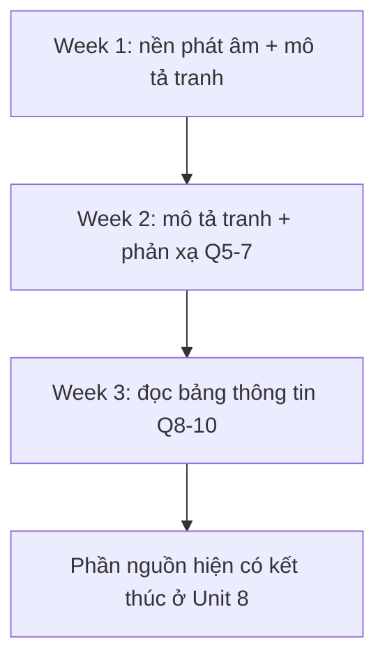

# Lộ trình học theo tài liệu

Nguồn: PDF trang 9-11.

Tài liệu gốc chia nội dung thành các phần nhỏ theo ngày để giảm tải khi tự học. Lộ trình được trình bày theo 4 tuần, 6 ngày/tuần.

> Theo yêu cầu cập nhật gói học, file bài Unit 1 đã được xóa. Bảng dưới đây vẫn giữ số Unit theo tài liệu PDF gốc để không làm thay đổi tham chiếu nguồn.

## Lộ trình 4 tuần

| Tuần | Day 1 | Day 2 | Day 3 | Day 4 | Day 5 | Day 6 |
|---|---|---|---|---|---|---|
| **Week 1** | Tổng quan TOEIC Speaking | Part 1 - Unit 1: 44 sounds in IPA | Part 1 - Unit 2: Appropriate pausing | Part 1 - Unit 3: Intonation & stress | Part 2 - Unit 4 (I & II) | Part 2 - Unit 4 (III & IV) |
| **Week 2** | Part 2 - Unit 5 (I, II, III) | Part 2 - Unit 5 (IV & V) | Part 3 - Unit 6: Q5-6, WH-questions | Part 3 - Unit 6: Q5-6, Yes/No questions | Part 3 - Unit 7 (I) | Part 3 - Unit 7 (II) |
| **Week 3** | Part 4 - Unit 8 (I & II) | Part 4 - Unit 8 (III & IV) | Part 4 - Unit 9: class schedule & movie festival | Part 4 - Unit 9: conference | Part 5 - Unit 10 (I) | Part 5 - Unit 10 (II) |
| **Week 4** | Part 5 - Unit 10 (III) | Part 5 - Unit 11 (IV) | Part 5 - Unit 11 (V) | Part 5 - Unit 12 (Đề 1 & 2) | Part 5 - Unit 12 (Đề 3 & 4) | Part 5 - Unit 12 (Đề 5, 6 & 7) |

> **Lưu ý về file hiện tại:** nội dung Unit 9-12 được nhắc trong lộ trình/mục lục nhưng không có trong 99 trang PDF tải lên. Gói này dừng ở Unit 8 để không tự tạo nội dung ngoài nguồn.

## Sơ đồ học nhanh

## Nội dung nguồn chi tiết

---

### Trang PDF 9

HƯỚNG DẪN HỌC VIÊN CÁCH SỬ DỤNG SÁCH SAO CHO ĐẠT HIỆU QUẢ TỐI ĐA Do khối lượng kiến thức lớn, nhiều bạn học viên cảm thấy có phần đuối sức khi tự học ở nhà. Hiểu được tâm lý đó, cuốn sách tự học mà Anh ngữ Ms Hoa dành tặng cho quý học viên sẽ được chia thành nhiều nội dung nhỏ theo từng ngày ôn tập. Sau khi ôn tập hết theo lộ trình, các bạn học viên có thể yên tâm rằng mình đã được trang bị đầy đủ kiến thức cũng như kĩ năng đã được rèn luyện theo từng dạng bài. Kiên trì mỗi ngày như vậy, chắc chắn điểm số mơ ước nằm trong tầm tay!
Day 1 Day 2 Day 3 Day 4 Day 5 Day 6 Week 1 Giới thiệu tổng quan bài thi TOEIC SPEAKING Part 1 Unit 1 44 sounds in IPA Part 1 Unit 2 Appropriate pausing Part 1 Unit 3 Intonation & stress Part 2 Unit 4 Describe a picture (1) (I & II) Part 2 Unit 4 Describe a picture (1) (III & IV) Week 2 Part 2 Unit 5 Describe a picture (2) (I & II & III) Part 2 Unit 5 Describe a picture (2) (IV & V) Part 3 Unit 6 Respond to questions 5-6 (phân tích ví dụ WH- questions) Part 3 Unit 6 Respond to questions 5-6 (phân tích ví dụ yes/no- questions) Part 3 Unit 7 Respond to question 7 (I) Part 3 Unit 7 Respond to question 7 (II) Week 3 Part 4 Unit 8 Respond to questions using information provided (1) (I & II) Part 4 Unit 8 Respond to questions using informatio n provided (1) (III & IV) Part 4 Unit 9 Respond to questions using information provided (2) (class schedule & movie festival) Part 4 Unit 9 Respond to questions using information provided (2) (conference) Part 5 Unit 10 Express an opinion (1) (I) Part 5 Unit 10 Express an opinion (1) (II)

---

### Trang PDF 10

Week 4 Part 5 Unit 10 Express an opinion (1) (III) Part 5 Unit 11 Express an opinion (2) (IV) Part 5 Unit 11 Express an opinion (2) (V) Part 5 Unit 12 Express an opinion (Đề 1&2) Part 5 Unit 12 Express an opinion (Đề 3&4) Part 5 Unit 12 Express an opinion (Đề 5,6&7)

---

### Trang PDF 11

TABLE OF CONTENTS GIỚI THIỆU TỔNG QUAN BÀI THI TOEIC SPEAKING ....................................................................... 4 PART 1. QUESTIONS 1-2: READ A TEXT ALOUD ........................................................................... 13 Marking criteria (Tiêu chí chấm điểm) ...................................................................................... 13 UNIT 1: 44 SOUNDS IN IPA ........................................................................................................ 14 UNIT 2: APPROPRIATE PAUSING .............................................................................................. 21 UNIT 3: INTONATION & STRESS ................................................................................................ 32 PART 2. QUESTIONS 3-4: DESCRIBE A PICTURE ........................................................................... 39 Marking criteria (Tiêu chí chấm điểm): ..................................................................................... 39 UNIT 4: DESCRIBE A PICTURE (1) .............................................................................................. 40 UNIT 5: DESCRIBE A PICTURE (2) .............................................................................................. 50 PART 3. QUESTIONS 5-7: RESPOND TO QUESTIONS .................................................................... 57 Marking criteria (Tiêu chí chấm điểm) ...................................................................................... 57 UNIT 6: RESPOND TO QUESTIONS 5&6 ................................................................................... 58 UNIT 7: RESPOND TO QUESTION 7 ........................................................................................... 68 PART 4. QUESTIONS 8-10: RESPOND TO QUESTIONS USING INFORMATION PROVIDED .......... 81 Marking criteria (Tiêu chí chấm điểm): ..................................................................................... 81 UNIT 8: RESPOND TO QUESTIONS USING INFORMATION PROVIDED (1) ............................... 82 UNIT 9: RESPOND TO QUESTIONS USING INFORMATION PROVIDED (2) ............................... 92 PART 5. QUESTION 11: EXPRESS AN OPINION ........................................................................... 101 Marking criteria (Tiêu chí chấm điểm): ................................................................................... 101 UNIT 10: EXPRESS AN OPINION (1) ........................................................................................ 102 UNIT 11: EXPRESS AN OPINION (2) ........................................................................................ 112 UNIT 12: EXPRESS AN OPINION (3) ........................................................................................ 120
