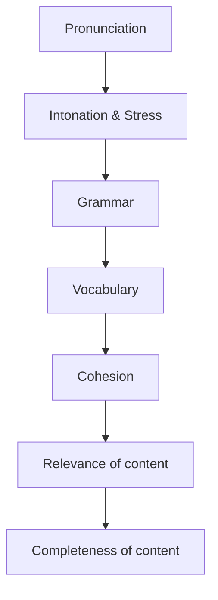

# Tổng quan bài thi TOEIC Speaking

Nguồn: PDF trang 12-20.

Theo tài liệu, TOEIC Speaking là bài thi làm trên máy tính; phần nói được thu âm và chấm sau. Tài liệu mô tả bài thi khoảng 20 phút, 5 phần, 11 câu.

## Cấu trúc bài thi

| Câu | Nhiệm vụ | Chuẩn bị | Thời gian nói | Thang điểm trong tài liệu |
|---|---|---:|---:|---:|
| 1-2 | Read a text aloud | 45 giây/đoạn | 45 giây/đoạn | 0-3 phát âm + 0-3 ngữ điệu/trọng âm |
| 3-4 | Describe a picture | 45 giây/tranh | 30 giây/tranh | 0-3 |
| 5-7 | Respond to questions | 3 giây/câu | Q5-6: 15 giây; Q7: 30 giây | 0-3 |
| 8-10 | Respond using information provided | 45 giây đọc bảng + 3 giây trước mỗi câu | Q8-9: 15 giây; Q10: 30 giây | 0-3 |
| 11 | Express an opinion | 30 giây | 60 giây | 0-5 |

## Nhóm tiêu chí chấm điểm được tài liệu nêu

Part 1 tập trung vào phát âm và ngữ điệu/trọng âm; các phần sau tích lũy thêm ngữ pháp, từ vựng, độ liên kết, độ liên quan và mức độ hoàn thiện câu trả lời.

## Mức độ thành thạo trong tài liệu

Tài liệu ghi điểm Speaking quy đổi theo thang 200 và mô tả 8 proficiency levels; cách quy đổi điểm thô sang thang chính thức không được nêu chi tiết trong tài liệu.

## Nội dung nguồn chi tiết

---

### Trang PDF 12

GIỚI THIỆU TỔNG QUAN BÀI THI TOEIC SPEAKING TOEIC Speaking là một bài thi dạng computer-delivered testing: Thí sinh thu âm câu trả lời của mình trên máy tính ngay tại địa điểm tổ chức thi, sau đó phần thu âm này sẽ được gửi sang các giám khảo của Viện Khảo thí Giáo dục Hoa Kỳ (Educational Testing Service – ETS) chấm điểm; thí sinh không phải đối diện với một giám khảo thật sự (a real examiner). Bài thi kéo dài khoảng 20 phút, gồm 5 phần – 11 câu hỏi, cụ thể như sau:

---

### Trang PDF 13

Câu hỏi Nhiệm vụ Tiêu chí chấm điểm Thời gian chuẩn bị Thời gian thực nói – ghi âm Thang điểm 1-2 Read a text aloud (Đọc thành tiếng một đoạn văn)
- Pronunciation
(Phát âm)
- Intonation and
stress (Ngữ điệu và trọng âm) 45 giây (mỗi đoạn) 45 giây (mỗi đoạn) 0-3 (Phát âm) & 0-3 (Ngữ điệu và trọng âm) 3-4 Describe a picture (Mô tả tranh) 2 tiêu chí trên, cộng với:
- Grammar (ngữ
pháp)
- Vocabulary (từ
vựng)
- Cohesion (độ liên
kết) 45 giây (mỗi tranh) 30 giây (mỗi tranh) 0-3
5-7 Respond to questions (Trả lời các câu hỏi) 5 tiêu chí trên, cộng với:
- Relevance of
content (Nội dung phù hợp với câu hỏi)
- Completeness of
content (Tính hoàn thiện của câu trả lời) 3 giây (mỗi câu)
- 15 giây (câu
5 & câu 6)
- 30 giây (câu
7) 0-3 8- Respond to questions Tất cả các tiêu chí trên.
- 45 giây
(đọc hiểu
- 15 giây (câu
8 & câu 9) 0-3

---

### Trang PDF 14

by using information provided (Trả lời câu hỏi dựa theo bảng thông tin cho sẵn) bảng thông tin cho sẵn)
- 3 giây
(trước mỗi câu hỏi)
- 30 giây (câu
10) Express an opinion (Trình bày ý kiến) Tất cả các tiêu chí trên. 30 giây 60 giây 0-5 * Phỏng theo: TOEIC® Examinee Handbook – Speaking & Writing Tests
* Diễn giải thang điểm: Câu hỏi Điểm Mô tả câu trả lời 1-2 3 Cách phát âm rất dễ hiểu, mặc dù câu trả lời có thể có những sai sót nhỏ và/hoặc có ảnh hưởng từ ngôn ngữ khác. Đáp ứng tốt việc nhấn giọng (emphases), dừng nghỉ (pauses) và cao độ tăng giảm (rising and falling pitch). 2 Cách phát âm nhìn chung vẫn dễ hiểu, mặc dù câu trả lời có một số sai sót và/hoặc có ảnh hưởng từ ngôn ngữ khác. Việc sử dụng nhấn giọng (emphases), dừng nghỉ (pauses) và cao độ tăng giảm (rising and falling pitch) nhìn chung phù hợp với văn bản, mặc dù câu trả lời có một số sai sót và/hoặc có ảnh hưởng từ ngôn ngữ khác ở mức độ vừa phải. 1 Đôi khi cách phát âm có thể dễ hiểu, nhưng ảnh hưởng đáng kể từ ngôn ngữ khác khiến văn bản không được truyền tải đúng cách. Việc sử dụng nhấn giọng (emphases), dừng nghỉ (pauses) và cao độ tăng giảm (rising and falling pitch) không phù hợp và câu trả lời có chứa nhiều tác động từ ngôn ngữ khác.

---

### Trang PDF 15

3-4 3 Câu trả lời mô tả được các đặc điểm chính của bức tranh. Việc truyền tải có thể đòi hỏi người nghe phải nỗ lực một chút, nhưng nhìn chung vẫn hiểu được. Việc lựa chọn từ vựng và cấu trúc câu giúp diễn đạt ý tưởng một cách mạch lạc. 2 Câu trả lời có liên quan đến bức tranh, nhưng ý nghĩa có thể bị nhầm lẫn trong một số trường hợp nhất định. Việc truyền tải đòi hỏi sự nỗ lực của người nghe. Việc lựa chọn từ vựng và cấu trúc câu có thể bị hạn chế, gây ra vấn đề về khả năng hiểu tổng quát của người nghe. 1 Mặc dù câu trả lời có liên quan đến bức tranh, nhưng khả năng hình thành ngôn ngữ sao cho dễ hiểu của người nói bị hạn chế nghiêm trọng. Việc truyền tải có thể đòi hỏi rất nhiều nỗ lực của người nghe. Việc lựa chọn từ vựng và cấu trúc câu hạn chế rất nghiêm trọng hoặc cản trở rất nhiều khả năng nghe hiểu của người nghe. 5- 3 Câu trả lời đầy đủ, có liên quan đến câu hỏi và phù hợp với xã hội. Trong trường hợp câu hỏi 8-9-10, thông tin từ bảng biểu cho sẵn được truyền tải chính xác. Việc truyền tải đòi hỏi rất ít nỗ lực của người nghe. Lựa chọn từ vựng phù hợp. Việc sử dụng cấu trúc câu đáp ứng được yêu cầu của nhiệm vụ. 2 Câu trả lời có đáp ứng một phần cho câu hỏi, nhưng không đầy đủ, không phù hợp hoàn toàn. Trong trường hợp câu hỏi 8-9-10, thông tin từ bảng biểu cho sẵn được truyền tải không chính xác. Việc truyền tải có thể cần sự nỗ lực của người nghe, nhưng phần lớn có thể hiểu được. Việc lựa chọn từ vựng có thể bị hạn chế hoặc không chính xác, nhưng thông điệp chính vẫn rõ ràng.

---

### Trang PDF 16

Việc sử dụng cấu trúc câu có thể đòi hỏi nỗ lực diễn giải/suy luận của người nghe. Trong trường hợp câu hỏi 8-9-10, người nói có thể xác định được thông tin cần thiết trong bảng biểu cho sẵn, nhưng không thể phân biệt nó với những thông tin không liên quan, hoặc không chuyển đổi được từ ngôn ngữ Viết sang ngôn ngữ Nói để người nghe dễ hiểu. 1 Câu trả lời không đáp ứng được câu hỏi. Thông tin liên quan không được truyền đạt một cách hiệu quả. Việc truyền tải có thể cản trở khả năng hiểu của người nghe. Từ vựng có thể được sử dụng không chính xác, hoặc phụ thuộc vào từ ngữ lặp lại từ bảng biểu cho sẵn. Việc sử dụng các cấu trúc câu có thể gây cản trở khả năng nghe hiểu của người nghe. 5 Câu trả lời nêu rõ sự lựa chọn hoặc quan điểm của người nói; những ý kiến hỗ trợ cho lựa chọn hoặc quan điểm đó dễ hiểu, bền vững và mạch lạc. Câu trả lời như vậy có tất cả các đặc điểm sau:
- Lựa chọn hoặc quan điểm của người nói được hỗ trợ bởi (các) lý do, chi
tiết, lập luận hoặc ví dụ; mối quan hệ giữa các ý kiến trên đều rõ ràng.
- Bài nói rõ ràng, trôi chảy với nhịp độ tốt. Có thể có những sai sót nhỏ hoặc
các vấn đề về cách phát âm hoặc ngữ điệu, nhưng không ảnh hưởng đến mức độ hiểu tổng thể.
- Kiểm soát các cấu trúc câu cơ bản và phức tạp một cách phù hợp; có thể có
những sai sót nhỏ, nhưng chúng không làm tối nghĩa bài nói.
- Việc sử dụng từ ngữ có hiệu quả, đôi khi có một số sai sót nhỏ.
4 Câu trả lời thể hiện sự lựa chọn hoặc quan điểm của người nói một cách rõ ràng; những ý kiến hỗ trợ được nêu đầy đủ và thích đáng.
- Câu trả lời giải thích (các) lý do cho sự lựa chọn hoặc quan điểm của người
nói, dù có thể chưa được phát triển đầy đủ; mối liên hệ giữa các ý tưởng phần lớn là rõ ràng; đôi khi có nhầm lẫn nhưng không thường xuyên.

---

### Trang PDF 17

- Các vấn đề nhỏ về phát âm, ngữ điệu hoặc nhịp độ có thể được nhìn thấy
và đôi khi có thể khiến người nghe phải nỗ lực, tuy nhiên mức độ hiểu tổng thể không bị ảnh hưởng.
- Câu trả lời cho thấy cách sử dụng ngữ pháp khá chủ động và hiệu quả, tuy
nhiên phạm vi cấu trúc được sử dụng có thể hạn chế một cách tương đối.
- Việc sử dụng từ vựng khá hiệu quả. Một số từ vựng được sử dụng không
chính xác. 3 Câu trả lời thể hiện được một lựa chọn, sở thích hoặc quan điểm, nhưng những ý kiến hỗ trợ bị hạn chế.
- Ít nhất có một lý do cơ bản cho lựa chọn, sở thích hoặc quan điểm được
đưa vào câu trả lời; tuy nhiên đưa ra rất ít hoặc không có lời giải thích tại sao, lặp lại ý tưởng mà không thêm thông tin mới; câu trả lời tối nghĩa, không rõ ràng.
- Bài nói phần lớn có thể hiểu được, tuy nhiên người nghe có thể phải nỗ lực
nhiều do phát âm không chính xác, ngữ điệu không đều, hoặc nhịp độ nhanh chậm thất thường.
- Câu trả lời thể hiện khả năng kiểm soát ngữ pháp chưa tốt; trong hầu hết
câu trả lời, chỉ có các dạng câu cơ bản mới được sử dụng thành công.
- Việc sử dụng từ vựng bị hạn chế.
2 Câu trả lời thể hiện một lựa chọn, sở thích hoặc quan điểm có liên quan đến câu hỏi, nhưng không có bằng chứng nào chứng minh cho lựa chọn, sở thích hoặc quan điểm đó.
- Các vấn đề về phát âm, trọng âm và ngữ điệu khiến người nghe phải nỗ lực
nhiều; việc truyền tải bị gián đoạn, rời rạc hoặc vắn tắt; có thể có những khoảng dừng nghỉ kéo dài và thường xuyên ngập ngừng trong câu.
- Kiểm soát ngữ pháp gây hạn chế nghiêm trọng đến diễn đạt ý tưởng và sự
rõ ràng của việc liên kết các khái niệm.
- Việc sử dụng từ vựng bị hạn chế nghiêm trọng hoặc lặp đi lặp lại nhiều lần.

---

### Trang PDF 18

1 Câu trả lời bao gồm các từ hoặc cụm từ riêng biệt, hoặc sự trộn lẫn giữa tiếng mẹ đẻ và tiếng Anh; đọc lại đề; hoặc câu trả lời không nêu rõ lựa chọn, sở thích hoặc quan điểm. 1- 0 Không có câu trả lời; hoặc không nói tiếng Anh trong câu trả lời; hoặc câu trả lời hoàn toàn không liên quan đến bài thi. * Phỏng theo: TOEIC® Examinee Handbook – Speaking & Writing Tests
Như vậy, điểm “thô” tối đa mà thí sinh đạt được là 41 điểm, từ đó điểm được quy đổi sang thang điểm 200. Tuy nhiên, cách thức quy đổi và làm tròn từ điểm thô sang thang điểm chính thức không được ETS công bố. Bảng điểm nhận được thể hiện điểm thành phần mỗi kỹ năng Speaking & Writing (điểm tròn chục – không có điểm lẻ 5 như TOEIC Listening & Reading), tương đương với 8 mức độ thành thạo (proficiency level): Level 8 190- 200 Thí sinh trong phạm vi điểm này thường có thể tạo ra sự kết nối, diễn đạt bền vững, phù hợp với nơi làm việc. Khi họ bày tỏ ý kiến hoặc trả lời những yêu cầu phức tạp, lời nói của họ rất dễ hiểu. Việc sử dụng ngữ pháp cơ bản và phức tạp tốt, sử dụng từ vựng chính xác. Thí sinh ở mức điểm này cũng có thể sử dụng ngôn ngữ nói để trả lời các câu hỏi và cung cấp thông tin cơ bản. Cách phát âm, ngữ điệu và trọng âm của họ luôn rất dễ hiểu. Level 7 160- 180 Thí sinh trong phạm vi điểm này thường có thể tạo ra sự kết nối, diễn đạt bền vững, phù hợp với nơi làm việc. Họ có thể bày tỏ ý kiến hoặc trả lời những yêu cầu phức tạp một cách hiệu quả. Khi mở rộng câu trả lời có thể để lộ một số điểm yếu, nhưng không ảnh hưởng đến ý nghĩa:
- Gặp một số khó khăn nhỏ khi phát âm, ngữ điệu, hoặc ngập ngừng khi
nói.
- Gặp một số lỗi khi sử dụng các cấu trúc ngữ pháp phức tạp.
- Một số từ vựng sử dụng không chính xác.
Thí sinh ở mức điểm này cũng có thể sử dụng ngôn ngữ nói để trả lời các câu hỏi và cung cấp thông tin cơ bản.

---

### Trang PDF 19

Đọc thành tiếng văn bản rất dễ hiểu. Level 6 130- 150 Thí sinh ở mức điểm này thường có thể tạo ra một câu trả lời thích đáng khi được yêu cầu bày tỏ ý kiến hoặc trả lời một yêu cầu phức tạp. Tuy nhiên, ít nhất trong một số trường hợp, lý do hoặc lời giải thích về quan điểm đó không được người nghe hiểu rõ. Điều này có thể là do:
- Phát âm không rõ ràng, hoặc ngữ điệu không phù hợp, hoặc sự căng
thẳng khi người nói phải tạo ra ngôn ngữ
- Lỗi ngữ pháp
- Vốn từ vựng hạn chế
Hầu hết các thí sinh ở mức điểm này đều có thể trả lời các câu hỏi và đưa ra thông tin cơ bản. Tuy nhiên, đôi khi câu trả lời của họ khó hiểu hoặc khó diễn giải. Thí sinh trong phạm vi điểm này khi đọc thành tiếng có thể hiểu được. Level 5 110- 120 Thí sinh ở mức điểm này thường ít thành công trong việc bày tỏ ý kiến hoặc phản hồi một yêu cầu phức tạp. Câu trả lời gặp các vấn đề như:
- Ngôn ngữ không chính xác, tối nghĩa hoặc lặp đi lặp lại
- Nhận thức về sự có mặt của người nghe ở mức tối thiểu hoặc không có
- Tạm dừng lâu và thường xuyên do dự
- Hạn chế trong việc thể hiện ý tưởng và sự kết nối giữa các ý tưởng
- Vốn từ vựng hạn chế
Hầu hết các thí sinh ở mức điểm này đều có thể trả lời các câu hỏi và đưa ra thông tin cơ bản. Tuy nhiên, đôi khi câu trả lời của họ khó hiểu hoặc khó diễn giải. Thí sinh trong phạm vi điểm này khi đọc thành tiếng nhìn chung có thể hiểu được. Tuy nhiên, khi tạo ra ngôn ngữ, cách phát âm, ngữ điệu và trọng âm của họ có thể không nhất quán. Level 4 80- 100 Thí sinh ở mức điểm này thường không thành công khi cố gắng giải thích một ý kiến hoặc phản hồi một yêu cầu phức tạp. Câu trả lời có thể chỉ giới hạn trong một câu, hoặc một phần của câu. Các vấn đề khác có thể bao gồm:

---

### Trang PDF 20

- Việc sử dụng ngôn ngữ bị hạn chế nghiêm trọng
- Nhận thức về sự có mặt của người nghe ở mức tối thiểu hoặc không có
- Thường xuyên gặp khó khăn khi phát âm, nhấn âm và ngữ điệu
- Tạm dừng lâu và thường xuyên do dự
- Vốn từ vựng bị hạn chế nghiêm trọng
Hầu hết các thí sinh ở mức điểm này không thể trả lời các câu hỏi hoặc đưa ra thông tin cơ bản. Khi đọc thành tiếng, thí sinh trong phạm vi điểm này có mức độ dễ hiểu khác nhau. Tuy nhiên, khi tạo ra ngôn ngữ, họ thường gặp vấn đề về phát âm, ngữ điệu và trọng âm. Level 3 60-70 Thí sinh ở mức điểm này thường có thể đưa ra ý kiến dù gặp một số khó khăn, nhưng họ không thể đưa ra chứng minh cho ý kiến đó. Bất kỳ câu trả lời nào đối với một yêu cầu phức tạp đều bị hạn chế nghiêm trọng. Hầu hết các thí sinh ở khoảng điểm này không thể trả lời các câu hỏi và đưa ra thông tin cơ bản. Thông thường, họ không có đủ từ vựng hoặc ngữ pháp để tạo ra những lời mô tả đơn giản. Thí sinh trong khoảng điểm này khi đọc thành tiếng thường khó hiểu. Level 2 40-50 Thí sinh ở mức điểm này thường không thể đưa ra ý kiến hoặc chứng minh cho ý kiến đó. Họ không đáp lại được các yêu cầu phức tạp, hoặc phản hồi không liên quan chút nào. Trong các tương tác xã hội và nghề nghiệp thông thường, như trả lời câu hỏi và cung cấp thông tin cơ bản, thí sinh ở mức điểm này thường nói rất khó hiểu. Thí sinh trong khoảng điểm này khi đọc thành tiếng thường rất khó hiểu. Level 1 0-30 Thí sinh ở mức điểm này thường bỏ qua - không trả lời một phần quan trọng của bài thi. Họ có thể không có kỹ năng nghe hoặc đọc tiếng Anh cần thiết để hiểu hướng dẫn bài thi, hoặc nội dung câu hỏi của bài thi. * Phỏng theo: TOEIC® Examinee Handbook – Speaking & Writing Tests
