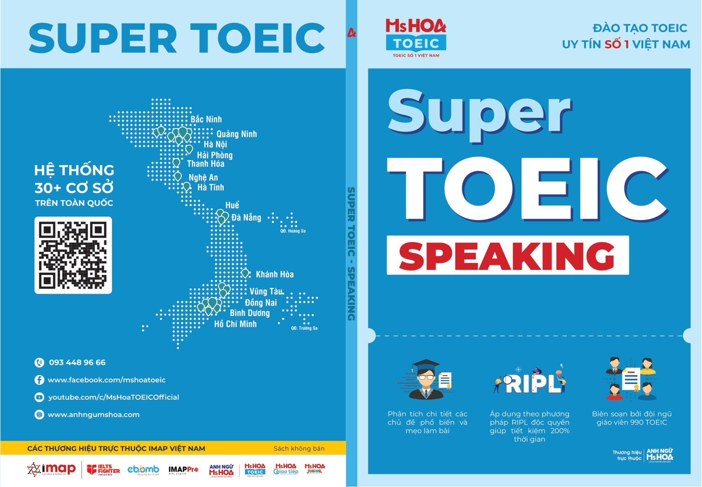

# Super TOEIC Speaking - Markdown Course Pack



Gói này được chuyển từ file PDF người dùng cung cấp thành các bài học Markdown, kèm ảnh tách riêng trong thư mục `assets/`. Nội dung được giữ theo cấu trúc và thuật ngữ của tài liệu gốc; các sơ đồ Mermaid là phần **tóm tắt biên tập** để học nhanh hơn, không thay thế nội dung nguồn.

> **Phạm vi nguồn:** file PDF tải lên có 99 trang. Mục lục của tài liệu có liệt kê Unit 1-12, nhưng phần nội dung thực tế trong file này chỉ đi đến **Unit 8** và kết thúc ở Vocabulary list của Unit 8. Vì vậy gói này **không tự bổ sung Unit 9-12** từ nguồn ngoài.
>
> **Cập nhật gói:** theo yêu cầu, bài Unit 1 đã được xóa; số thứ tự ở đầu tên các file bài học còn lại đã được đánh lại từ `01` đến `07`. Số Unit trong nội dung vẫn giữ theo tài liệu nguồn.

## Cấu trúc thư mục

```text
super-toeic-speaking-md/
├── README.md
├── 00-lo-trinh-hoc.md
├── 01-tong-quan-bai-thi.md
├── part-1-read-a-text-aloud/
│   ├── 00-part-1-overview.md
│   ├── 01-unit-02-appropriate-pausing.md
│   └── 02-unit-03-intonation-stress.md
├── part-2-describe-a-picture/
│   ├── 00-part-2-overview.md
│   ├── 03-unit-04-describe-a-picture-1.md
│   └── 04-unit-05-describe-a-picture-2.md
├── part-3-respond-to-questions/
│   ├── 00-part-3-overview.md
│   ├── 05-unit-06-respond-to-questions-5-6.md
│   └── 06-unit-07-respond-to-question-7.md
├── part-4-information-provided/
│   ├── 00-part-4-overview.md
│   └── 07-unit-08-respond-using-information-1.md
└── assets/
    ├── README.md
    └── ... ảnh gốc tách từ PDF
```

## Sơ đồ khóa học có trong nguồn

```mermaid
flowchart LR
    A[Part 1: Read a Text Aloud] --> U2[Unit 2: Appropriate Pausing]
    U2 --> U3[Unit 3: Intonation & Stress]
    U3 --> B[Part 2: Describe a Picture]
    B --> U4[Unit 4: Describe a Picture 1]
    U4 --> U5[Unit 5: Describe a Picture 2]
    U5 --> C[Part 3: Respond to Questions]
    C --> U6[Unit 6: Questions 5-6]
    U6 --> U7[Unit 7: Question 7]
    U7 --> D[Part 4: Information Provided]
    D --> U8[Unit 8: Questions 8-10]
```



## Cách dùng

1. Đọc `00-lo-trinh-hoc.md` để biết thứ tự học theo ngày/tuần của sách.
2. Đọc `01-tong-quan-bai-thi.md` để nắm nhiệm vụ, thời gian và tiêu chí chấm.
3. Học lần lượt theo Part/Unit; trong mỗi bài có phần tóm tắt nhanh, sơ đồ và nội dung chi tiết theo trang PDF.
4. Khi bài có tranh/bảng/QR, ảnh đã được tách thành file riêng và nhúng lại bằng đường dẫn tương đối đến `assets/`.
