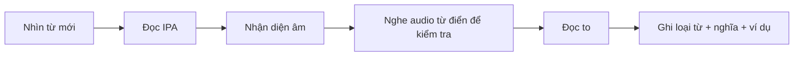
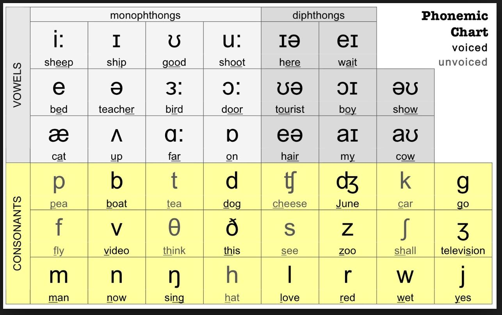
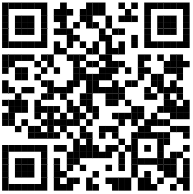
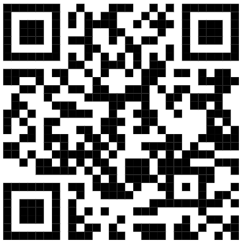

# Unit 1 - 44 Sounds in IPA

Nguồn: PDF trang 22-28.

## Tóm tắt nhanh

Unit 1 xây nền phát âm bằng bảng IPA: 12 nguyên âm đơn, 8 nguyên âm đôi và 24 phụ âm. Tài liệu nhấn mạnh việc đọc phiên âm thay vì đoán theo mặt chữ, kết hợp tra từ điển, nghe mẫu và luyện đọc thành tiếng.

### Asset chính

## Nội dung nguồn chi tiết

---

### Trang PDF 22

## Mục tiêu bài học
1. Nhận biết toàn bộ 44 âm trong bảng IPA.
2. Cách phát âm cơ bản 44 âm trong bảng IPA.
3. Biết cách tra từ điển & đọc phiên âm của từ.
4. Đọc thành tiếng một đoạn văn ở mức độ cơ bản.
## I. Vì sao cần học bảng phiên âm IPA?
IPA là viết tắt của International Phonetic Alphabet – bảng ký hiệu ngữ âm quốc tế. IPA được sử dụng để tạo thành chuẩn phiên âm cho tất cả ngôn ngữ trên toàn thế giới. IPA giúp người học nhận diện và đọc đúng phiên âm chuẩn của các từ mới, thay vì chỉ phụ thuộc vào việc bấm vào biểu tượng 📣 – nghe âm thanh – bắt chước âm thanh; mà đôi khi việc “nhại lại âm thanh” này lại không hoàn toàn chính xác. Chúng ta cần một “hệ quy chiếu”, để từ đó nhận thức được rằng từ vựng đó đã được phát âm đúng hay chưa. Lấy ví dụ từ island (hòn đảo), hay receipt (biên lai): nếu bạn chưa từng tiếp xúc với những từ vựng này, chắc hẳn trong đầu bạn sẽ tự “chế” ra một cách phát âm dựa theo mặt chữ, ví dụ: island: “i-xlen”, “ai-xlần”… receipt: “rì-xíp”, “rì-xép”… Tuy nhiên, phiên âm đúng của 2 từ trên là: island /ˈaɪ.lənd/ (chính tả có “s” - phát âm bỏ “s”) receipt /rɪˈsiːt/ (chính tả có “p” - phát âm bỏ “p”) Như vậy, mỗi từ vựng sẽ có một cách đọc riêng. Đương nhiên cũng sẽ có một số quy tắc phát âm nhất định, nhưng không áp dụng được cho toàn bộ từ vựng trong tiếng Anh. Bảng phiên âm IPA sẽ giúp người học nhận dạng cách phát âm chính xác thông qua các ký tự phiên âm,

---

### Trang PDF 23

*Asset tách từ trang 23: Bảng 44 âm IPA.*

từ đó có được nền tảng phát âm tiếng Anh cơ bản và thiết yếu. Người học không-thể-học- tốt nếu chỉ dùng từ điển để lấy nghĩa tiếng Việt và … dừng lại ở đó.
## II. Bảng phiên âm quốc tế IPA
* 44 ký tự phiên âm trong IPA Nhìn vào hình ảnh trên, bạn sẽ thấy có 3 mảng màu: màu xám nhạt, góc trái trên cùng là 12 nguyên âm đơn (monophthongs); màu xám đậm, góc phải trên cùng là 8 nguyên âm đôi (diphthongs); và màu vàng phía dưới là 24 phụ âm (consonants). Vậy nguyên âm, phụ âm là gì?
### II.1. Nguyên âm (Vowels):
Hiểu theo cách đơn giản, nguyên âm là những âm thanh được phát ra nguyên vẹn, luồng khí đi ra từ thanh quản không bị răng, lưỡi, hoặc môi cản trở; dây thanh âm có độ rung khi ta phát âm nguyên âm. Có 12 nguyên âm đơn và 8 nguyên âm đôi.
- Nguyên âm đơn là những âm thường đứng một mình, gồm 6 nguyên âm ngắn (luồng
hơi bật ra nhanh, không kéo dài) /i/, /e/, /ʊ/, /ʌ/, /ɒ/, /ə/; và 6 nguyên âm dài (luồng hơi bật ra dài hơn, mạnh hơn, khuôn miệng căng hơn so với nguyên âm ngắn) /i:/, /æ/, /u:/, /a:/, /ɔ:/, /ɜ:/.

---

### Trang PDF 24

- Nguyên âm đôi là những âm được kết hợp giữa 2 nguyên âm đơn lại với nhau, bao
gồm /ɪə/, /eə/, /eɪ/, /ɔɪ/, /əʊ/, /aʊ/, /aɪ/, /ʊə/. Lưu ý: Nguyên âm u, e, o, a, i (uể oải – cách chúng ta thường ghi nhớ) là 5 nguyên âm chính theo chữ cái. Từ 5 nguyên âm chính này, IPA đã chia ra thành 20 âm nguyên âm như trên.
> Liên quan đến việc sử dụng mạo từ a & an, bạn phải xét theo âm nguyên âm, không
xét theo chữ cái. Ví dụ: university có phiên âm là /ˌjuː.nɪˈvɜː.sə.ti/ (âm đầu là /j/), vậy chính xác ta phải dùng với mạo từ “a”: a university.
### II.2. Phụ âm (Consonants):
Hiểu theo cách đơn giản, phụ âm là những âm phụ trợ cho nguyên âm để tạo ra một tiếng nguyên vẹn. Có nghĩa là, phụ âm không thể đứng một mình riêng biệt, mà phải được ghép với nguyên âm để tạo ra tiếng. Xét về ngôn ngữ học, 24 phụ âm được phân loại cụ thể dựa theo phương thức cấu âm (manner of articulation) và vị trí cấu âm (place of articulation), tiếp tục cho ra các tên gọi như âm bật (plosive), âm xát (fricative), âm hai môi (bilabial), v.v… và rất nhiều thuật ngữ chuyên ngành ngôn ngữ học khác nữa. Do đó, để bạn dễ hình dung cách phát âm từng âm một cách chính xác và thực chiến nhất, Anh ngữ Ms Hoa có chuẩn bị sẵn cho bạn một số video hướng dẫn chi tiết. Bạn hãy quét mã QR sau đây để xem toàn bộ nội dung trước khi chuyển sang phần bài tập áp dụng nhé:

---

### Trang PDF 25

*Asset tách từ trang 25: QR video phát âm Ms Hoa.*

*Asset tách từ trang 25: QR video phát âm IELTS Fighter.*

Học Phát Âm Tiếng Anh Chuẩn Quốc Tế - Bảng Phiên Âm IPA | Tiếng Anh giao tiếp từ mất gốc | Ms Hoa Giao Tiếp
Bảng phiên âm tiếng Anh IPA – Cách phát âm chuẩn 44 âm quốc tế | IELTS FIGHTER
## III. Bài tập áp dụng: Dựa vào ngữ cảnh của đoạn văn, hãy viết ra các từ vựng có phiên âm
cho sẵn. Sau đó, luyện đọc to đoạn văn đã hoàn thành. 1. TOEIC Speaking
Question 1 of 11 Before we finish tonight's /njuːz/ (1), we'd like to tell you about tomorrow's /rəʊd/ (2) /ˈkləʊ.ʒər/ (3). Beginning at six o'clock in the morning, Church Lane will be closed for /ˈmeɪn.tən.əns/ (4). The workers will be /rɪˈpeərɪŋ/ (5) tracks, /rɪˈpleɪsɪŋ/ (6) the guardrails, and repainting the lines /θruːˈaʊt/ (7) the day. Until we finish this work, please note that all drivers need to take an /ɒlˈtɜː.nət/ (8) route.
(1) (5) (2) (6) (3) (7) (4) (8)

---

### Trang PDF 26

2. TOEIC Speaking
Question 2 of 11 Good afternoon /ˈpæs.ən.dʒərz/ (1). Thank you for flying with Hazel Santiago /ˈeə.laɪnz/ (2). On this /flaɪt/ (3) to San Diego, we will be offering /ˌkɒm.plɪˈmen.tər.i/ (4) refreshments, snacks and /ˈbev.ər.ɪdʒɪz/ (5). To see a /ˈdiː.teɪld/ (6) list of available services, please look at the menu in your /siːt/ (7) pocket. When our flight /əˈten.dəntz/ (8) pass by, they will serve you what you would like to have. And now, please pay your /əˈten.ʃən/ (9) to the flight attendants before we /teɪk ɒf/ (10).
(1) (6) (2) (7) (3) (8) (4) (9) (5) (10)
3. TOEIC Speaking
Question 1 of 11 Tonight, we are here /təˈɡeð.ər/ (1) to /ˈsel.ə.breɪt/ (2) the /ˈtwen.ti.əθ/ (3) /ˌæn.ɪˈvɜː.sər.i/ (4) of our /ˈæd.və.taɪ.zɪŋ/ (5) company. As we celebrate our twentieth year in the field, we have to /əˈpriː.ʃi.eɪt/ (6) all who made an /ˈef.ət/ (7) to our success. They have /ˌkɒntrɪˈbjuː.tɪd/ (8) their creativity, passion, and dedication. It has been such a wonderful success and we made it all while going through great /ˈdɪf.ɪ.kəl.tɪz/ (9). I hope we can continue to step /ˈfɔː.wəd/ (10) together.
(1) (6) (2) (7) (3) (8) (4) (9) (5) (10)

---

### Trang PDF 27

4. TOEIC Speaking
Question 2 of 11 Thanks for watching this /ˈep.ɪ.səʊd/ (1) from Amanda's /ˈfɜː.nɪ.tʃər/ (2). In this video, you'll learn about the /ˈkʌm.fə.tə.bəl/ (3) and durable furniture. Whether you need to /ˈpɜː.tʃəs/ (4) furniture for your home, office or an /ɪnˈtaɪər/ (5) business, we have /ˈver.i.əs/ (6) options for you. Orders can be made online, by phone, or at one of our /kənˈviː.ni.ənt.li/ (7) located /ˈri.dʒə.nəl/ (8) stores. At the end of the video, we will inform you of our website address, phone number, and regional stores' addresses.
(1) (5) (2) (6) (3) (7) (4) (8)
## Mở rộng kiến thức
Từ nay, việc học từ vựng của bạn phải đủ các bước sau:
1. Tra từ điển – xem phần ký tự IPA trong dấu /…/, nhận dạng ký tự và phát âm đúng
theo phiên âm.
2. Bấm biểu tượng 📣 để nghe và kiểm tra phần nhận dạng phiên âm của mình.
3. Đọc to từ để ghi nhớ tốt hơn.
4. Ghi chú loại từ (danh từ/động từ/tính từ/trạng từ…)
5. Ghi chú nghĩa (và các nghĩa biến thế) của từ vựng.
6. Đọc ví dụ của từ điển (từ vựng được nằm trong câu có ngữ cảnh).

---

### Trang PDF 28

## Vocabulary list
English
Vietnamese
‘d like to = would like to
muốn làm gì (cách dùng trang trọng)
road closure
(n.ph.) chặn đường (không cho lưu thông)
maintenance
(n) bảo trì, bảo dưỡng
repair
(v) sửa chữa
replace
(v) thay thế
guardrail
(n) hàng rào an toàn
note
(v) ghi chú, lưu ý
take an alternate route
đi tuyến đường khác thay thế
* đi đường nào: dùng với TAKE
complimentary
(adj) miễn phí
refreshments
(n) món ăn nhẹ
beverage
(n) nước giải khát
seat
(n) chỗ ngồi
pocket
(n) túi đựng
flight attendant
(n) tiếp viên hàng không
pass by
(v) đi ngang qua
serve
(v) phục vụ
pay (s.o’s) attention to
(v.ph.) chú ý đến…
take off
(v) cất cánh (máy bay)
(v) cởi (áo, giày dép, mũ nón)
celebrate
(v) làm lễ chúc mừng, tôn vinh
advertising
(n) nghề quảng cáo
appreciate
(v) cảm kích, đánh giá cao
make an effort to
(v.ph.) nỗ lực cho việc gì
contribute to
(v) đóng góp vào việc gì
dedication
(n) sự cống hiến
step forward
(v.ph.) bước về phía trước
episode
(n) tập, phần, đoạn
durable
(adj) bền
purchase
(v, n) mua
entire
(adj) toàn bộ
various
(adj) đa dạng, nhiều loại
conveniently locate
đặt ở nơi thuận tiện
regional
(adj) thuộc địa phương, khu vực
