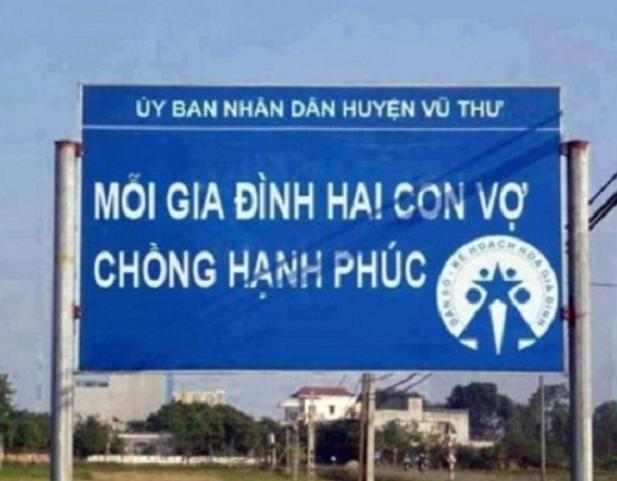
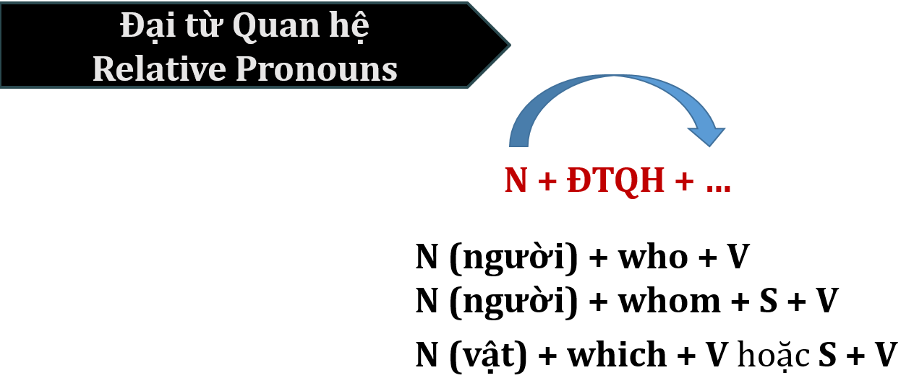

# Unit 2 - Appropriate Pausing

Nguồn: PDF trang 29-39.

## Tóm tắt nhanh

Bài tập trung vào dừng/ngắt theo cụm nghĩa thay vì ngắt theo xuống dòng. Tài liệu dùng ký hiệu `/` cho nghỉ ngắn khoảng 0,5 giây và `//` cho nghỉ dài khoảng 1 giây.

```mermaid
flowchart TD
    S[Câu cần đọc] --> P{Có dấu câu/kết thúc câu?}
    P -->|Dấu chấm/kết thúc ý| L[// nghỉ dài]
    P -->|Chưa kết thúc| C{Có ranh giới cụm nghĩa?}
    C -->|Giới từ / liên từ / mệnh đề quan hệ / cụm S-V-O dài| Sh[/ nghỉ ngắn]
    C -->|Không| R[Đọc liền mạch]
    Sh --> M[Kiểm tra: không cắt đứt ý nghĩa]
    R --> M
```

### Ví dụ hình ảnh trong tài liệu




## Nội dung nguồn chi tiết

---

### Trang PDF 29


*Asset tách từ trang 29: Ví dụ ngắt nghỉ: biển "Xoài phun thuốc sâu...".*


*Asset tách từ trang 29: Ví dụ ngắt nghỉ: biển "Mỗi gia đình hai con...".*

## Mục tiêu bài học
1. Nhận biết nhanh chóng toàn bộ 44 âm trong bảng IPA.
2. Phát âm chính xác 44 âm trong bảng IPA.
3. Tra cứu từ điển chính xác & nhanh chóng.
4. Biết cách ngắt cụm từ trong câu một cách hiệu quả.
5. Đọc thành tiếng một đoạn văn ở mức độ Trung bình - Khá.
Như đã trình bày ở phần Tổng quan Bài thi TOEIC Speaking, một trong những tiêu chí để đánh giá câu trả lời Read a text aloud của bạn là pauses (dừng nghỉ). Ngắt-nghỉ trong câu là một yếu tố cần thiết để diễn đạt ngôn ngữ một cách hiệu quả. Một sự ngắt-nghỉ không chính xác (kể cả văn Nói lẫn văn Viết) sẽ dẫn đến những hiểu lầm tai hại trong giao tiếp, hoặc ý nghĩa câu nói bị mơ hồ, tối nghĩa. Ví dụ (nguồn: VnExpress)


---

### Trang PDF 30

Từ 2 hình ảnh hài hước trên, chắc hẳn bạn đã hình dung ra tầm quan trọng của việc ngắt- nghỉ đúng chỗ. Vậy, với nhiệm vụ của một người truyền tải câu nói, bạn phải dừng nghỉ như sau:
1. Xoài phun thuốc sâu // không ăn!
2. Mỗi gia đình hai con // vợ chồng hạnh phúc.
Tiếng Anh nói chung và bài thi TOEIC Speaking nói riêng cũng như vậy: không phải cứ thấy dòng chữ bị ngắt xuống dòng, bạn cũng ngắt mạch nói của mình ngay chỗ đó. Bạn phải nắm chắc cấu trúc câu, biết cách xác định các cụm từ trong câu, từ đó điều chỉnh việc ngắt-nghỉ của mình một cách hợp lý khi thực hiện bài nói Read a text aloud này.
## I. Phân tích ví dụ:
Ghi chú: 1 gạch chéo (/): nghỉ ngắn (~ 0,5 giây)
2 gạch chéo (//): nghỉ dài (~ 1 giây) TOEIC Speaking
Question 1 of 11 Summers Resort Group is proud to announce / the completion of its new hotel / in New York. // Our new hotel has a VIP lounge,/ royal suites,/ and private meeting rooms / offered to all our special guests! // When you visit our new hotel,/ you will experience the state-of-the-art facilities / with an upper-class service / that suits you in every way. // It will be an experience of your lifetime! //
TOEIC Speaking
Question 2 of 11 Good morning everyone, / this is Wesley Simons / with Today’s Weather Report. // Today, / the southern region of the state / will stay wet with showers / all day long. // These showers will continue on / through the week / until Thursday. // However, / we are expecting some sunlight / on Friday, / Saturday / and Sunday, / so get ready to go on a family outing / this weekend! //
Từ 2 văn bản trên, ta dễ dàng nhận thấy nghỉ dài khi kết thúc câu bằng dấu chấm; trường hợp nghỉ ngắn có một số lưu ý như sau:
- Dừng nghỉ sau Dấu phẩy
- Dừng nghỉ trước Giới từ
- Dừng nghỉ trước Liên từ
- Dừng nghỉ trước Mệnh đề Quan hệ & Rút gọn Mệnh đề Quan hệ (Vpp / Ving)


---

### Trang PDF 31

- Dừng nghỉ sau Chủ ngữ hoặc trước Tân ngữ, nếu phần Chủ ngữ và Động từ quá dài,
không thể giữ một cột hơi liền mạch. Tuy nhiên, tất cả những dừng nghỉ nêu trên chỉ mang tính tương đối, bởi vì dừng nghỉ phải đảm bảo một điều kiện quan trọng, đó là phải ngắt cụm sao cho không đứt quãng mạch ý nghĩa của câu. Hay nói cách khác, không được dừng nghỉ ở giữa một nhóm từ có nghĩa (a thought group). Nếu không, câu sẽ rất rời rạc, khiến người nghe cảm thấy khó hiểu, phải nỗ lực rất nhiều khi nghe và phân tích. Như vậy, bài toán đặt ra ở đây là bạn phải nắm rõ một số điểm ngữ pháp cần thiết để nhận dạng về Giới từ; Liên từ; Mệnh đề Quan hệ & Rút gọn Mệnh đề Quan hệ; phân tách Chủ ngữ, Động từ & Tân ngữ trong câu. Chúng ta sẽ giải quyết lần lượt từng điểm một trong bài học này nhé!
## II. Các điểm ngữ pháp quan trọng (*tham khảo sách Giải thích Ngữ pháp Tiếng Anh
– Mai Lan Hương):
### 1. Giới từ (Prepositions)
Theo Mai Lan Hương, tác giả cuốn sách Giải thích Ngữ pháp Tiếng Anh kinh điển, “Giới từ là từ hoặc nhóm từ thường được dùng trước danh từ hoặc đại từ để chỉ sự liên hệ giữa danh từ hoặc đại từ này với các thành phần khác trong câu”. Mách bạn một mẹo nhỏ để dễ nhớ, dễ hiểu: từ “Giới” trong tên gọi “Giới từ” có thể hiểu theo nghĩa “môi giới”, nghĩa là nhân vật trung gian, đứng giữa để “giới thiệu” cho các bên gặp gỡ, tiếp xúc với nhau, từ đó tạo ra một mối quan hệ nhất định. Vậy theo cách hiểu này, “Giới từ” cũng có chức năng tương tự như vậy. Một số giới từ thường gặp: in trong, ở trong (một khoảng không gian, thời gian) on trên (bề mặt); vào ngày nào (trong tuần, tháng) at ở, tại (nơi nào); vào lúc (chỉ thời điểm) near gần (khoảng cách ngắn) by, beside, next to bên cạnh from từ (một nơi, một thời điểm nào đó) across ngang qua along dọc theo about về việc gì into vào trong with với, cùng với


---

### Trang PDF 32

for dành cho (ai/cái gì); để (mục đích); trong khoảng (bao lâu) during trong suốt (một khoảng thời gian) since kể từ khi until cho đến khi between giữa (2 đối tượng) among giữa (nhiều đối tượng) as như, như là, với tư cách là to để (mục đích); đến (nơi nào); trở thành
> **Lưu ý: Giới từ không có một nghĩa nhất định, chúng ta phải phụ thuộc vào ngữ cảnh để**
hiểu đúng nghĩa của giới từ được nêu. Trên đây chỉ nhắc đến những nghĩa thường gặp nhất.
### Exercise 1a: Đặt dấu gạch chéo (/) ngay trước giới từ để phân tách 2 câu sau đây:
(1) As you know, our company has been getting recognition as the industry leader by outperforming the competitors for the past forty years. (2) With the growing number of participants each year, the community of Greenville has changed the previous weekend event to a week-long festival to share its international background with more people.
### Exercise 1b: Từ 2 câu trên, hãy viết ra từ vựng có IPA như sau:
/ˌrek.əɡˈnɪʃ.ən/
/ˈpriː.vi.əs/
/ˌaʊt.pəˈfɔːm/
/ˈwiːk.end/
/kəmˈpet.ɪ.tər/
/ˈfes.tə.vəl/
/ˈɡrəʊ.ɪŋ/
/ˌɪn.təˈnæʃ.ən.əl/
/kəˈmjuː.nə.ti/
/ˈbæk.ɡraʊnd/
### 2. Liên từ (Conjunctions)
Liên từ là những từ dùng để liên kết các từ, cụm từ, mệnh đề trong câu. Liên từ được chia làm 2 loại: Liên từ kết hợp (Co-ordinating conjunctions) và Liên từ phụ thuộc (Subordinating conjunctions)
### a. Liên từ kết hợp (Co-ordinating conjunctions): Gồm 4 nhóm chính
(1) Nhóm AND: chỉ sự thêm vào: gồm and, both…and, not only…but also, as well as; các trạng từ liên kết (conjunctive adverbs) besides, furthermore, moreover, in addition. (2) Nhóm BUT: chỉ sự mâu thuẫn, trái ngược: gồm but, yet, still; các trạng từ liên kết however, nevertheless, on the other hand. (3) Nhóm OR: chỉ sự lựa chọn hoặc đoán chừng: gồm or, or else, otherwise, either…or, neither…nor.


---

### Trang PDF 33

(4) Nhóm SO: chỉ hậu quả, kết quả: gồm so, therefore, for; các trạng từ liên kết consequently, as a result.
### b. Liên từ phụ thuộc (Subordinating conjunctions)
(1) Nhóm WHEN: chỉ mối quan hệ về thời gian: gồm when, whenever, while, as, as soon as, after, before, until/till, since, by the time… (2) Nhóm BECAUSE: chỉ nguyên nhân, lý do: gồm because, as, since, now that, seeing that (3) Nhóm IF: chỉ điều kiện: gồm if, unless, in case, provided that, providing that, supposing that, once (4) Nhóm THOUGH: chỉ sự tương phản: gồm though, although, even though, even if, whether…or not, no matter what, whatever, whenever, wherever, whoever, however + tính từ/trạng từ (5) Nhóm IN ORDER THAT: chỉ mục đích “để mà”: gồm in order that, so that, for fear that (6) Nhóm SO…THAT: chỉ kết quả “quá…đến nỗi mà”: gồm so + adj/adv + that và such + (a/an) + adj + noun + that (7) Nhóm THAT: đưa ra một ý kiến, một sự việc, “rằng”.
### Exercise 2a: Đặt dấu gạch chéo (/) ngay trước giới từ và liên từ để phân tách 3 câu sau đây:
(1) The scorching heat is affecting our day-to-day life and thousands of heat-related patients have been reported throughout the nation over the weekend. (2) Healthcare experts say that it is important to keep cool, avoid vigorous physical activities and drink plenty of water. (3) While staying at our inn, you’ll breathe clean country air as you view spectacular sights.
### Exercise 2b: Từ 3 câu trên, hãy viết ra từ vựng có IPA như sau:
/ˈskɔː.tʃɪŋ/
/ˈek.spɜːt/
/əˈfekt/
/ˈvɪɡ.ər.əs/
/ˈθaʊ.zənd/
/ˈfɪz.ɪ.kəl/
/rɪˈleɪ.tɪd/
/waɪl/
/ˈpeɪ.ʃənt/
/briːð/
/θruːˈaʊt/
/spekˈtæk.jə.lər/


---

### Trang PDF 34



*Asset tách từ trang 34: Sơ đồ đại từ quan hệ.*

3. Mệnh đề quan hệ (Relative Clauses) & Rút gọn mệnh đề quan hệ (Reduced
Relative Clauses): a. Mệnh đề quan hệ (Relative Clauses) Mệnh đề quan hệ (MĐQH) bao gồm Đại từ quan hệ (ĐTQH) và các thành phần đứng sau nó, dùng để làm rõ nghĩa thêm cho một danh từ (chỉ người/vật/sự việc) trước đó, nhưng không phải là thành phần chính trong câu. Để dễ nhớ, bạn có thể hiểu, Đại từ là những từ dùng để đại diện và thay thế cho danh từ xuất hiện trước nó. Như vậy, ĐTQH cũng có nguồn gốc từ Đại từ, nên chúng cũng có chức năng đại diện-thay thế danh từ. Tuy nhiên, giữa danh từ xuất hiện trước đó và các thành phần đứng sau ĐTQH phải có mối quan hệ với nhau.
Ví dụ:
- This Saturday is the annual holiday parade, so everyone who works that day will get
overtime pay.
> Trong câu này, “who works that day” là MĐQH làm rõ nghĩa cho “everyone” – chỉ
những ai làm việc vào ngày đó mới nhận được tiền công làm ngoài giờ.
- Let’s welcome again Erika Cliffton whom we conducted an exclusive interview within last
month’s episode.
> “whom we conducted an exclusive interview within last month’s episode” là MĐQH
làm rõ nghĩa cho “Erika Cliffton”, cho biết Erika Cliffton là nhân vật mà chúng ta đã phỏng vấn độc quyền trong tập phát sóng của tháng trước.
- The parking spaces which are marked "visitor" may charge you a fee.
> “which are marked "visitor" ” là MĐQH làm rõ nghĩa cho “parking spaces” – những
bãi đậu xe mà có ghi chú “dành cho khách” có lẽ sẽ tính phí cho bạn.


---

### Trang PDF 35

> **Lưu ý: that được dùng thay thế cho who/whom/which ở cả 3 câu ví dụ trên; tuy nhiên,**
ĐTQH that không đứng sau dấu phẩy. b. Rút gọn mệnh đề quan hệ (Reduced Relative Clauses) * Ghi nhớ 3 bước sau để rút gọn MĐQH: B1: Bỏ các ĐTQH who/whom/which/that B2: Bỏ các dạng chia của BE (nếu có): will be/have been/am/is/are… B3: Đối với MĐQH có ĐTQH làm chủ ngữ: Chuyển động từ thành V-ing (nếu mang nghĩa chủ động) hoặc V3/ed (nếu mang nghĩa bị động) Ví dụ:
- This Saturday is the annual holiday parade, so everyone who works that day will get
overtime pay.
> This Saturday is the annual holiday parade, so everyone working that day will get
overtime pay.
- The parking spaces which are marked "visitor" may charge you a fee.
> The parking spaces marked "visitor" may charge you a fee.
> **Lưu ý: Không lược bỏ ĐTQH khi có đi kèm với giới từ.**
- Let’s welcome again Erika Cliffton with whom we conducted an exclusive interview in last
month’s episode.
### Exercise 3a: Đặt dấu gạch chéo (/) ngay trước giới từ, liên từ, MĐQH và rút gọn MĐQH để
phân tách 3 câu sau đây: (1) We will be selling handcrafted gifts, traditional African clothing and carpets to raise money for children who are starving in Africa. (2) This weekend, come to Meridian Clothing store located downtown in the Flushing Shopping Mall. (3) We are giving a limited time offer to all the customers visiting our store this weekend.
### Exercise 3b: Từ 3 câu trên, hãy viết ra từ vựng có IPA như sau:
/ˈhænd.krɑːf.tɪd/
/reɪz/
/trəˈdɪʃ.ən.əl/
/ˈstɑː.vɪŋ/
/ˈkləʊ.ðɪŋ/
/ˈtʃɪl.drən/
/ˈæf.rɪ.kən/
/ləʊˈkeɪt/
/ˈkɑː.pɪt/
/flʌʃ/


---

### Trang PDF 36

4. Phân tách Chủ ngữ (Subject) - Động từ (Verb) - Tân ngữ (Object) trong câu.
Chủ ngữ (Subject – S) và Tân ngữ (Object – O) đều do Danh từ (Noun) hoặc Đại từ (Pronoun) đảm nhiệm. Chủ ngữ đóng vai trò là người thực hiện hoặc tác nhân của Động từ (Verb – V), còn Tân ngữ giữ nhiệm vụ làm rõ thêm ý nghĩa cho động từ này. Ví dụ: Nassar Builders will be holding an employment fair next month.
S
V
O Như vậy, Nassar Builders là chủ thể của hành động “tổ chức – hold”, nhưng tổ chức gì thì phải được tân ngữ “một ngày hội việc làm – an employment fair” làm rõ nghĩa.
Thế nhưng, danh từ làm chủ ngữ hoặc tân ngữ đôi khi sẽ được kéo dài hoặc mở rộng (gọi là cụm danh từ), ví dụ: Nassar Builders that is building the airport will be holding an employment fair next month.
S
V
O We will investigate little-known historical facts that have had a huge impact on today’s world. S
V
O Do đó, bạn cần phải có kiến thức về giới từ và MĐQH như đã đề cập ở trên để có khả năng phân tách câu nói hợp lý, mặc dù trong câu không có các dấu hiệu rõ ràng để ngắt nghỉ như dấu phẩy, dấu chấm:
> Nassar Builders / that is building the airport / will be holding an employment fair /
next month.
> We will investigate / little-known historical facts / that have had a huge impact / on
today’s world.


---

### Trang PDF 37

## III. Bài tập áp dụng: Dựa vào ngữ cảnh của đoạn văn, hãy viết ra các từ vựng có phiên âm
cho sẵn. Đặt dấu gạch chéo (/) ở những vị trí cần thiết để ngắt nghỉ. Sau đó, luyện đọc to đoạn văn đã hoàn thành. 5. TOEIC Speaking
Question 1 of 11 Thank you for calling Brooks /əˈpær.əl/ (1) Company. Our office is /ˈkʌr.ənt.li/ (2) closed, so please listen carefully to the following options. If you need to check your order /ˈsteɪ.təs/ (3), please press one. If you want to leave a /ˈmes.ɪdʒ/ (4) for our customer /ˈsɜː.vɪs/ (5) /dɪˈpɑːt.mənt/ (6), please press two. If you wish to be connected to our 24- hour hotline, please press three now.
(1) (4) (2) (5) (3) (6)
6. TOEIC Speaking
Question 2 of 11 Welcome to /ˈsaɪ.əns/ (1) News. Today, we will take a closer look into /ˈriː.sənt/ (2) /ədˈvɑːnsɪz/ (3) in /ˈrəʊ.bɒt/ (4) technology. Nowadays, robots are becoming more /fəˈmɪl.i.ər/ (5) to us in many ways. You can easily buy a /tɔɪ/ (6) robot, hear about /rəʊˈbɒt.ɪk/ (7) inventions and sometimes even /ɪkˈspɪə.ri.əns/ (8) them yourself. Let's welcome Dr. Griffins who is here to tell us more about it.
(1) (5) (2) (6) (3) (7) (4) (8)


---

### Trang PDF 38

7. TOEIC Speaking
Question 1 of 11 This is Fred Norman on Greatest Hits 101. Tonight is going to be a /ˈspeʃ.əl/ (1) night with Kim Jones, the nation's number one hit /ˈsɪŋ.ər/ (2). 2008 has been her year, and it hasn't /endɪd/ (3) yet. We see her on /kəˈmɜː.ʃəlz/ (4), TV programs, and all the famous /əˈwɔːd/ (5) ceremonies. Stay /tuːnd/ (6) and you will get to be /əˈmʌŋ/ (7) the first to hear her newest /ˈsɪŋ.ɡəl/ (8) coming right up!
(1) (5) (2) (6) (3) (7) (4) (8)
8. TOEIC Speaking
Question 2 of 11 Welcome to Woodland /ˈnæʃ.ən.əl/ (1) Zoo Park. I am /ˈreɪn.dʒər/ (2) Johanna your tour guide for the /səˈfɑː.ri/ (3) today. /waɪld/ (4) animals are quite /ˈdeɪn.dʒər.əs/ (5) and /əˈtæk/ (6) people if they are /dɪˈstɜːbd/ (7). So, please make sure not to /θrəʊ/ (8) food, /træʃ/ (9) or anything else out the window. If any dangerous /ˌsɪtʃ.uˈeɪ.ʃən/ (10) occurs during our trip, please remain /ˈsiː.tɪd/ (11) and listen to my instructions /ɪnˈstrʌk.ʃənz/ (12).
(1) (7) (2) (8) (3) (9) (4) (10) (5) (11) (6) (12)


---

### Trang PDF 39

## Vocabulary list
English
Vietnamese
suite
(n) phòng khách sạn
guest
(n) khách mời
experience
(n) kinh nghiệm | (v) trải nghiệm
state-of-the-art
(adj) hiện đại
southern
(adj) phía Nam
shower
(n) vòi sen; trận mưa
recognize
(v) nhận ra
outperform
(v) vượt trội hơn
competitor
(n) đối thủ
community
(n) cộng đồng
background
(n) nền tảng; tầng lớp xã hội; lai lịch
scorching heat
(n.ph.) nắng nóng gay gắt
patient
(adj) kiên nhẫn | (n) bệnh nhân
avoid
(v) tránh
vigorous
(adj) mạnh mẽ
inn
(n) nhà trọ
breathe
(v) thở
spectacular
(adj) hùng vĩ
handcrafted
(adj) thủ công
carpet
(n) thảm
starve
(v) chết đói
apparel
(n) trang phục
press
(v) nhấn | (n) báo chí
advance
(n) cải tiến, nâng cao
familiar
(adj) thân thuộc
commercial
(adj) thuộc về thương mại
(n) quảng cáo trên TV và radio
award ceremony
(n) lễ trao giải
stay tuned
(v.ph.) giữ nguyên (đừng chuyển kênh)
ranger
(n) nhân viên kiểm lâm
safari
(n) cuộc đi săn
attack
(v) tấn công
disturbed
(adj) bị làm phiền
throw
(v) ném
trash
(n) rác
remain seated
(v.ph.) ngồi yên
instruct
(v) hướng dẫn
