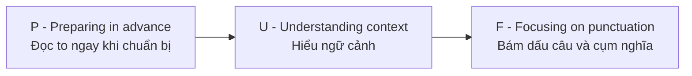

# Unit 3 - Intonation & Stress

Nguồn: PDF trang 40-46.

## Tóm tắt nhanh

Unit 3 nối phát âm + ngắt nghỉ với ngữ điệu và trọng âm câu. Tài liệu khuyến nghị hiểu nhanh ngữ cảnh trong 45 giây chuẩn bị để chọn tone phù hợp.

### PUF trong tài liệu

Bài tập yêu cầu kết hợp: điền từ theo IPA, đặt `/` ở chỗ ngắt, đánh dấu lên/xuống giọng và gạch chân từ cần nhấn.

## Nội dung nguồn chi tiết

---

### Trang PDF 40

## Mục tiêu bài học
1. Nhận biết & Phát âm chính xác 44 âm IPA.
2. Tra cứu từ điển chính xác & nhanh chóng.
3. Biết cách ngắt cụm từ trong câu một cách hiệu quả.
4. Biết cách nhấn từ, nhấn câu một cách hiệu quả.
5. Đọc thành tiếng một đoạn văn ở mức độ Khá - Tốt.
Intonation (ngữ điệu) và Stress (âm nhấn) chính là một tiêu chí lớn để chấm điểm cho Read a text aloud nói riêng, và toàn bộ bài thi TOEIC Speaking nói chung. Một câu nói monotone - stays on the same note without going higher or lower (giọng đều đều, không lên cao hay xuống thấp), sẽ khó thu hút sự chú ý của người nghe, đồng thời sẽ gây khó hiểu ở một số trường hợp nhất định. Ví dụ, bạn hãy đọc có ngữ điệu và âm nhấn phù hợp ở các trường hợp “Thảo nào” trong tiếng Việt như sau: (1) A: Ai như Thảo đang đứng đợi xe buýt kìa.
B: Thảo nào?
(2) A: Lan được 10 điểm Lịch sử luôn. Bạn ấy dành cả đêm để học bài đấy.
B: Thảo nào!
(3) A: Bạn nào xung phong làm bài 1?
B: Em ạ!
A: Thảo nào!
Dựa vào ngữ cảnh, ta có thể dễ dàng thấy được: “Thảo nào?” của trường hợp (1) thể hiện sự nghi vấn; trường hợp (2) mang nghĩa như “hèn gì”, thể hiện rằng điều đó không có gì phải ngạc nhiên; trường hợp (3) là một lời mời, lời đề xuất của giáo viên gọi học sinh làm bài tập.

---

### Trang PDF 41

Vậy chỉ cần cách nói không đủ nhấn nhá và lên xuống giọng phù hợp, câu nói sẽ trở nên không cảm xúc, tối nghĩa, khó hiểu; tiếng Anh cũng tương tự như vậy. Do đó, bạn cần nắm chắc một số cách lên-xuống giọng phù hợp, đồng thời cùng với cách ngắt cụm hợp lý (đã học ở Unit 2) để dễ dàng truyền tải ý muốn diễn đạt của bản thân.
## I. Phân tích ví dụ:
TOEIC Speaking
Question 1 of 11
Summers Resort Group is proud to announce / the completion of its new hotel / in New York. ↓// Our new hotel has a VIP lounge ,/ royal suites ,/ and private meeting rooms ↓/ offered to all our special guests! ↓// When you visit our new hotel,↓/ you will experience the state-of-the-art facilities / with an upper-class service / that suits you in every way.↓ // It will be an experience of your lifetime! ↓//
TOEIC Speaking
Question 2 of 11
Good morning everyone, / this is Wesley Simons / with Today’s Weather Report. ↓// Today , / the southern region of the state / will stay wet with showers / all day long. ↓// These showers will continue on / through the week / until Thursday. ↓// However, / we are expecting some sunlight / on Friday , / Saturday / and Sunday, ↓ / so get ready to go on a family outing / this weekend! ↓//
* Về intonation (ngữ điệu): Có 2 lưu ý chính:
- Đoạn văn 1 và 2 trong phần Read a text aloud hầu như luôn có 3 cụm từ liệt kê (tạm gọi là
3 đối tượng A, B, C): bạn phải lên ngữ điệu cho A và B, và xuống ngữ điệu cho C.
- Hạ giọng ở từ kết thúc của câu khẳng định (có dấu chấm cuối câu).
* Về sentence stress (trọng âm trong câu) Trọng âm của câu là việc thêm sự nhấn mạnh vào một số từ nhất định trong câu để nâng cao ý nghĩa. Có 2 cách để nhấn trọng âm cho câu (nguồn E2 TOEIC):

---

### Trang PDF 42

- Cách 1: Nhấn mạnh key words (words that carry the main meaning of the text – những từ
mang ý nghĩa chính yếu của đoạn văn), thường là danh từ (từ dùng để gọi tên người, sự vật), động từ (từ chỉ hành động), tính từ (từ chỉ tính chất, đặc điểm), trạng từ (từ dùng để bổ sung thêm ý nghĩa cho động từ, tính từ, hoặc một trạng từ khác).
- Cách 2: Nhấn mạnh repetitive words, bao gồm:
Emphasis words (nhấn mạnh ý nghĩa): really, very, so, great, definitely, etc. Negative words (phủ định):
not, isn't, doesn't, don't, never, etc. Connectors (liên kết):
and, but, if, then, after, before, etc. Lists (liệt kê):
dogs, cats, and monkeys, etc. Contrasts (tương phản):
dim-bright, fast-slow, limited-more, etc. Reference words (ám chỉ, nhắc đến): this, that, those, which, who, etc. Emotional words (cảm xúc):
disgusting, awkward, awful, etc.
Như vậy, key words và repetitive words là những từ được đặt trọng âm mạnh hơn trong câu so với một số loại từ như mạo từ (a/an/the); giới từ (on, with, of, to, in, etc.) và trợ động từ (will, have/has, am/is/are, etc.). Việc phân biệt được những từ nào được nhấn mạnh, từ nào được “đọc lướt” đi và hạ giọng, sẽ dẫn đến việc truyền tải có độ tự nhiên hơn về mặt ngữ điệu, câu nói không bị đơn điệu, ngang bằng.
Mặt khác, ngoài việc xác định từ được nhấn mạnh, bạn còn cần thêm kỹ năng đọc hiểu nhanh. Một khi đã đọc hiểu đoạn văn ngay lúc 45s chuẩn bị, bạn sẽ biết cách nên chọn giọng đọc như thế nào để truyền tải. Ví dụ: thông báo thời tiết khắc nghiệt khiến con đường bị đóng cửa, bạn phải đọc với giọng điệu nghiêm túc, dứt khoát và mạnh mẽ; quảng cáo về một đợt bán hàng xả kho, số lượng có hạn và trong một khoảng thời gian ngắn, bạn phải chọn giọng đọc hào hứng, nhanh nhẹn, tone giọng cao, để thôi thúc người nghe chú ý đến mẩu quảng cáo này; hay khi giới thiệu tên riêng của một diễn giả trong hội thảo, bạn phải nâng tone giọng, đọc một cách chậm rãi hơn so với tốc độ bình thường và nhấn nhá hơn khi giới thiệu để tăng tính long trọng.

---

### Trang PDF 43

Tổng hòa toàn bộ các phương pháp học nêu trên, IMAP gợi ý cho bạn một bộ mã hóa để tối ưu điểm số khi thực hiện phần thi Read a text aloud này, đó chính là PUF: P: Preparing in advance: Chuẩn bị trước: Hãy đọc to rõ ngay khi đang trong thời gian chuẩn bị (45 giây). U: Understanding context: Hiểu ngữ cảnh đoạn văn: Hãy trang bị thật nhiều từ vựng được lấy ra từ những đoạn văn luyện tập. F: Focusing on punctuation: Chú ý vào dấu câu (và các dấu hiệu khác – Unit 2) để ngắt nghỉ sao cho hợp lý theo cụm từ có nghĩa.
## II. Bài tập áp dụng:
- Dựa vào ngữ cảnh của đoạn văn, hãy viết ra các từ vựng có phiên âm cho sẵn.
- Đặt dấu gạch chéo (/) ở những vị trí cần thiết để ngắt nghỉ.
- Đặt dấu mũi tên () ở những vị trí lên ngữ điệu, hoặc (↓) ở những vị trí xuống
ngữ điệu.
- Gạch chân vào những từ cần nhấn mạnh.
- Luyện đọc to đoạn văn đã hoàn thành.
1. TOEIC Speaking
Question 1 of 11 Gloria's /dɪˈpɑːt.mənt/ (1) Store is /ˈɒf.ər.ɪŋ/ (2) an exciting summer /ˈspeʃ.əl diːl/ (3) on photos. Photos are great for /dɪˈspleɪŋ/ (4) in your house, /ˈdek.ə.reɪtɪŋ/ (5) your office, or giving as /ˈbɜːθ.deɪ/ (6) gifts. This month only, you can get a set of thirty wallet- size photos for free when you make an /əˈpɔɪnt.mənt/ (7) at our /fəˈtɒɡ.rə.fi/ (8) studio with one of our /fəˈtɒɡ.rə.fərz/ (9). If you're interested in this great deal, call to book your /ˈseʃ.ən/ (10) right now.
(1) (6) (2) (7) (3) (8) (4) (9) (5) (10)

---

### Trang PDF 44

2. TOEIC Speaking
Question 2 of 11 If you are /kənˈsɪd.ər.ɪŋ/ (1) about /ˈpɜːtʃəsɪŋ/ (2) bicycles, you should visit Best /spɔːts/ (3) Store. Whether it is for professional /ˌkɒm.pəˈtɪʃ.ən/ (4) racing or just everyday use, you will see the bike you were looking for at our store. Maybe you will be /əˈmeɪzd/ (5) when you look at the many different /ˈfiː.tʃərz/ (6) and colors in our store. And /bɪˈsaɪdz/ (7) our great /sɪˈlek.ʃən/ (8), we provide /ˈləʊ.ər/ (9) prices, friendly service, and a free two-year /ˈwɒr.ən.ti/ (10).
(1) (6) (2) (7) (3) (8) (4) (9) (5) (10) 3. TOEIC Speaking
Question 1 of 11 You don't need to go far away to have a /ɡreɪt/ (1) /veɪˈkeɪ.ʃən/ (2). Kelly Cox's farm, 20 /ˈmɪn.əts/ (3) from the center of the city, is an /ɪkˈsaɪtɪŋ/ (4) place for everyone. You can go fishing, /ˈbəʊ.tɪŋ/ (5), and camping at our beautiful /ˈnætʃ.ər.əl/ (6) farm. Best of all, the /kənˈviː.ni.əns/ (7) of this local /ˌdes.tɪˈneɪ.ʃən/ (8) means that you don't need to spend much money on travel /ɪkˈspensɪz/ (9). Come to Kelly Cox's farm for an /ˌʌn.fəˈɡet.ə.bəl/ (10) experience!
(1) (6) (2) (7) (3) (8) (4) (9) (5) (10)

---

### Trang PDF 45

4. TOEIC Speaking
Question 2 of 11 Thanks for calling Dr. Geraldine's Office. During the week of April 10th, Dr. Geraldine will be out of reach because she will /əˈtend/ (1) an international /ˈmed.ɪ.kəl/ (2) /ˈkɒn.fər.əns/ (3). If you want to /ˈskedʒ.uːl/ (4) an appointment for /əˈnʌð.ər/ (5) time, please /liːv/ (6) a /ˈmes.ɪdʒ/ (7) including your name, /ˌməʊ.baɪl ˈfəʊn/ (8) number, and the reason for your appointment. Our /əˈsɪs.tənts/ (9) will call you on the next business day to /kənˈfɜːm/ (10).
(1) (6) (2) (7) (3) (8) (4) (9) (5) (10)

---

### Trang PDF 46

## Vocabulary list
English
Vietnamese
Department store
(n) Cửa hàng bách hóa (trung tâm thương mại)
Offer a deal/sale
(v.ph.) Ưu đãi/Khuyến mãi
Display
(v, n) Trưng bày
Decorate
(v) Trang trí
Gift
(n) Món quà
A set of
(n.ph.) Một bộ…
Wallet
(n) Cái ví
For free
(prep.ph.) Miễn phí
Make an appointment
(v.ph.) Đặt một cuộc hẹn
Photography studio
(n.ph.) Xưởng phim, trường quay, phòng chụp ảnh
Photograph
(n) Bức ảnh
Photographer
(n) Nhiếp ảnh gia
Be interested in
(adj.ph.) Hứng thú với
Session
(n) Buổi, phiên họp
Consider
(v) Xem xét, cân nhắc
Purchase
(v, n) Mua
Competition
(n) Cuộc thi
Race
(n) Cuộc đua
Everyday use
(n.ph.) Sử dụng hàng ngày
Look for
(v.ph.) Tìm kiếm
Amazed
(adj) (cảm xúc) Kinh ngạc
Feature
(n) Tính năng
Besides
(prep) Bên cạnh đó
Select
(v) Lựa chọn
Low price
(n.ph.) Giá thấp
Friendly service
(n.ph.) Dịch vụ thân thiện
Warranty
(n) Phiếu bảo hành
Far away
(adj.ph.) Xa
Boating
(n) Chèo thuyền
Local
(adj) Địa phương, khu vực
Destination
(n) Điểm đến, đích đến
Travel expense(s)
(n.ph.) Chi phí đi lại
Unforgettable experience
(n.ph.) Trải nghiệm khó quên
Out of reach
(adj.ph.) không liên lạc được
Attend a conference
(v.ph.) Tham dự một hội nghị
Schedule an appointment
(v.ph.) Lên lịch một cuộc hẹn
Leave a message
(v.ph.) Để lại lời nhắn
Assistant
(n) Trợ lý
Business day
(n.ph.) Ngày làm việc
Confirm
(v) Xác nhận
