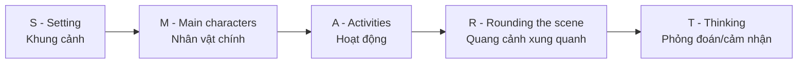
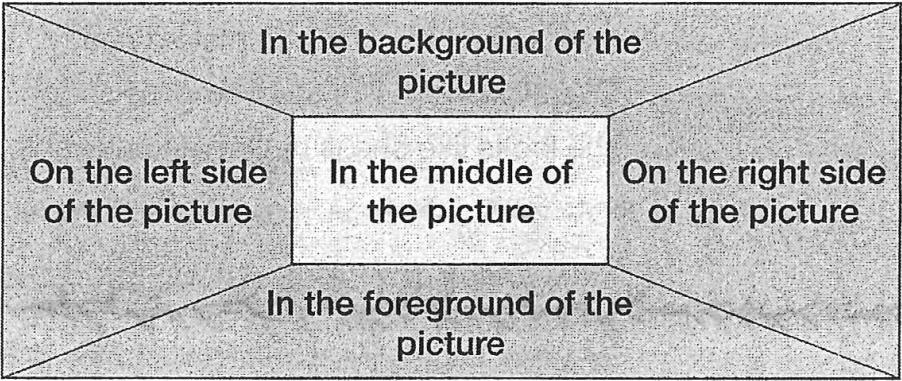
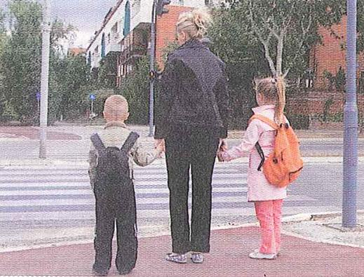
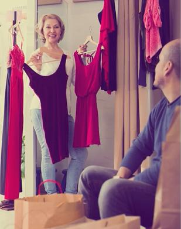
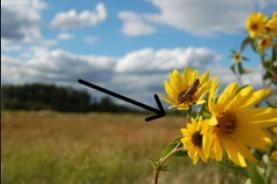
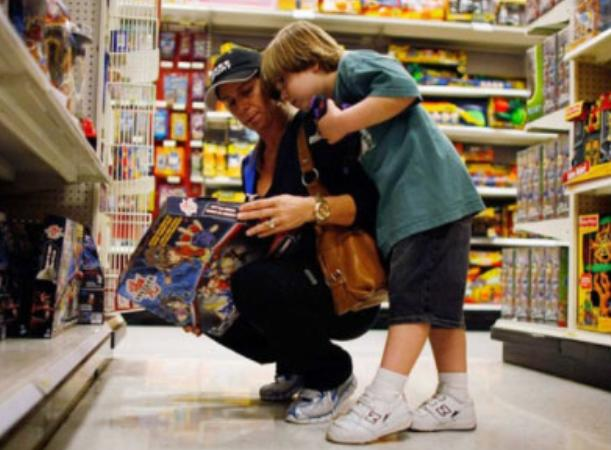

# Unit 4 - Describe a Picture (1)

Nguồn: PDF trang 48-57.

## Tóm tắt nhanh

Bài đưa ra cấu trúc Mở bài - Thân bài - Kết bài và sau đó mã hóa thành **SMART**.

### Bố cục không gian

Tài liệu khuyến nghị dùng hiện tại tiếp diễn cho hành động đang diễn ra, hiện tại hoàn thành bị động cho trạng thái đã được thực hiện, và mở rộng mô tả bằng tính từ + giới từ thay vì lặp `There is/There are`.

## Nội dung nguồn chi tiết

---

### Trang PDF 48

*Asset tách từ trang 48: Ảnh mẫu mô tả công viên.*

## Mục tiêu bài học
1. Nắm được cấu trúc mô tả tranh trong 30s.
2. Thuộc một số cụm cố định mô tả vị trí trong tranh.
3. Sử dụng được một số mẫu câu đơn giản trong mô tả tranh.
4. Sử dụng được từ vựng cơ bản & nâng cao theo chủ đề.
## I. Phân tích ví dụ:
(1)
(Nguồn: TOEIC Speaking Live Class – Gwen Tv) This is a picture taken at a park. There are many people in this picture, and they all look like friends.
On the right side of the picture, there is a couple; they're sitting down and relaxing. On the left side of the picture, there are three people; one of them is standing up and doing the barbecue, and two of them are sitting down and enjoying music; the woman is playing the guitar. In the background of the picture, I can see several people; some of them are standing and talking, and two of them are playing badminton. Maybe they're having a good time. Đây là bức ảnh được chụp ở công viên. Có rất nhiều người trong bức ảnh này và tất cả họ đều trông giống như bạn bè. Ở bên phải bức tranh có một cặp đôi; họ đang ngồi và thư giãn. Bên trái bức tranh có ba người; một người đang đứng nướng thịt, hai người đang ngồi thưởng thức âm nhạc; người phụ nữ đang chơi guitar.
Ở hậu cảnh, tôi có thể nhìn thấy vài người; một số người trong số họ đang đứng nói chuyện, và hai người trong số họ đang chơi cầu lông.
Có lẽ họ đang có khoảng thời gian vui vẻ.

---

### Trang PDF 49

*Asset tách từ trang 49: Ảnh mẫu mô tả lối qua đường.*

(2)
(Nguồn: TOEIC Speaking Actual Test – Darakwon) I think this is a picture of a crosswalk in the street.
A woman with her blond hair tied back is holding hands with her two children while waiting to cross the street. She is wearing a black jacket, the same color pants, and flat shoes. On her left side is a little boy with his left hand in his pocket and who is wearing a beige long- sleeved jacket and black pants. He is also carrying a black backpack. On her right side is a little girl with a ponytail who is also carrying an orange-colored backpack. She is wearing a pink coat and peach- colored pants. Judging by the picture itself, it seems to be a quiet street. Tôi nghĩ đây là hình ảnh một lối qua đường dành cho người đi bộ trên đường phố. Một người phụ nữ tóc vàng buộc lại phía sau đang nắm tay hai đứa con của mình khi chờ qua đường. Cô ấy mặc một chiếc áo khoác đen, quần cùng màu và đi giày bệt/đế bằng. Bên trái cô ấy là một cậu bé đang đút tay trái vào túi quần, mặc áo khoác dài tay màu be và quần đen. Cậu ấy cũng đang đeo một chiếc balô màu đen. Bên phải cô ấy là một cô bé buộc tóc đuôi ngựa đang đeo một chiếc balô màu cam. Cô bé mặc một chiếc áo khoác màu hồng và quần màu đào.
Phán đoán từ bức ảnh, có vẻ đây là một con phố yên tĩnh.
Từ 2 bài mẫu trên, ta rút ra được một cấu trúc chung có thể áp dụng cho tất cả các bức tranh, tương tự như Mở bài – Thân bài – Kết bài: Introduction (Mở bài)
- Bức tranh này được chụp ở đâu?
- Có bao nhiêu người xuất hiện trong tranh?
Body (Thân bài) Phân chia bố cục và mô tả từng khu vực trong tranh. (Ở giữa; phía trước; phía sau; bên phải; bên trái) Conclusion (Kết bài) Nói một câu phỏng đoán để kết thúc bài mô tả.

---

### Trang PDF 50

*Asset tách từ trang 50: Ảnh mẫu cửa hàng quần áo.*

### 1. Introduction
Để trả lời cho câu hỏi “Bức tranh này được chụp ở đâu?”, bạn có thể linh hoạt sử dụng một trong những cấu trúc sau:
- This is a picture taken in/on/at…
- This picture is/was taken in/on/at…
- This is a picture of…
- This picture shows…
- This picture describes/depicts…
Ví dụ: This is a picture taken in a clothing store.
This picture is/was taken in a clothing store.
This is a picture of a clothing store.
This picture shows a clothing store.
This picture describes/depicts a clothing store.
Kết hợp với “Có bao nhiêu người xuất hiện trong tranh?”, bạn áp dụng cấu trúc There is/there are là đủ một phần Introduction hoàn chỉnh: There is a girl/a boy/a man/a woman…in the picture. There are two people/three men/four women/many people…in the picture.

---

### Trang PDF 51

*Asset tách từ trang 51: Sơ đồ vị trí trong bức tranh.*

This is a picture taken in a clothing store. There are two people in the picture.
This picture is/was taken in a clothing store. There are two people in the picture.
This is a picture of a clothing store. There are two people in the picture.
This picture shows a clothing store. There are two people in the picture.
This picture describes/depicts a clothing store. There are two people in the picture.
(Bức tranh được chụp ở/mô tả một cửa hàng quần áo. Có 2 người trong tranh.)
2. Body
Như bạn cũng thấy, từ vựng trong 2 đoạn body mô tả mẫu ở trên khá đơn giản. Tuy nhiên, điểm nổi bật của chúng chính là phân chia bố cục bức tranh theo từng vị trí cụ thể, đồng thời mô tả hành động của toàn bộ các nhóm người xuất hiện trong tranh. Hãy cùng điểm lại một số cụm từ hữu dụng, mô tả vị trí cụ thể trong tranh như sau:
(Nguồn: Pagoda – Level 7-8)

---

### Trang PDF 52

*Asset tách từ trang 52: Minh họa foreground.*

*Asset tách từ trang 52: Minh họa background.*

In the foreground of the picture
Ở phía trước/cận cảnh của bức tranh In the background of the picture
Ở phía sau/phông nền của bức tranh On the left side of the picture Bên trái bức tranh On the left side of the picture Bên phải bức tranh In the middle/center of the picture Ở chính giữa/trung tâm bức tranh
In the foreground of the picture, there are many shopping bags on a table. (Ở phía trước, có nhiều túi mua sắm trên bàn)
In the background of the picture, many colorful clothing items have been hung on racks and hooks. (Ở phía sau, nhiều quần áo màu sắc đã được treo trên giá và móc)
On the left side of the picture, the woman with short blonde hair is holding two sleeveless dresses. (Bên trái bức tranh, người phụ nữ với tóc ngắn vàng đang cầm 2 chiếc váy không cánh tay/sát nách)
On the right side of the picture, the man with a bald head is sitting and looking at the woman. (Bên phải bức tranh, người đàn ông đầu trọc đang ngồi và nhìn về phía người phụ nữ)

---

### Trang PDF 53

### 3. Conclusion
Maybe/Perhaps they are having a good time together. (Có lẽ là họ đang có một khoảng thời gian vui vẻ bên nhau)
The woman is probably/possibly asking the man to help her choose a more suitable dress. (Người phụ nữ có thể đang nhờ người đàn ông giúp cô ấy chọn chiếc váy phù hợp hơn)
The man seems to be making a decision on which dress is more suitable for the woman. (Người đàn ông có vẻ đang đưa ra quyết định chiếc váy nào phù hợp với người phụ nữ hơn)
Để đưa ra một lời phỏng đoán dựa trên những chi tiết có trong tranh, bạn có thể dùng những cấu trúc in đậm như trên: Maybe/Perhaps + S + V: Có lẽ là… probably/possibly + V: có thể… seem(s) to + V:
có vẻ như…
- Để các bạn không quên cấu trúc mô tả tranh sao cho hiệu quả nhất trong 30 giây,
IMAP cung cấp cho bạn một bộ mã hóa phương pháp học – tóm gọn những kiến thức cần thiết đã nêu trên: SMART S Setting Khung cảnh chung: Bức tranh được chụp ở đâu? M Main characters Nhân vật chính: Có bao nhiêu người trong tranh? A Activities Hoạt động: Mô tả hoạt động của từng nhóm người. R Rounding the scene Quang cảnh xung quanh T Thinking Suy nghĩ: Nêu cảm nhận/phỏng đoán về bức tranh.

---

### Trang PDF 54

## II. Lưu ý về cách hình thành câu mô tả:
1. Linh hoạt về Thì của Động từ: Hầu hết, chúng ta sẽ sử dụng Thì Hiện tại Tiếp diễn
(is/are + V-ing) để mô tả hành động đang diễn ra của con người; nếu muốn diễn đạt tình trạng đã xảy ra của sự vật, chúng ta sử dụng Thì Hiện tại Hoàn thành + dạng Bị động (have/has + been + V3/ed). Ví dụ:
- The man with a bald head is sitting and looking at the woman.
- Many colorful clothing items have been hung on racks and hooks.
2. Linh hoạt sử dụng đa dạng cấu trúc câu: Nhiều học viên có thói quen sử dụng liên
tục cấu trúc There is/There are để liệt kê, ví dụ: On the left side, there is a woman. On the right side, there is a man. In the background, there are many dresses… Câu trả lời như vậy thường nhận về số điểm không cao vì chỉ mang tính liệt kê, không đủ độ sâu về mặt chi tiết; hơn nữa, quá nhiều câu đơn được lặp đi lặp lại nhiều lần, không “khoe” được độ đa dạng khi sử dụng ngôn ngữ.
### 3. Mở rộng câu mô tả bằng Tính từ và Giới từ
Lưu ý rằng, phần thi Describe a picture yêu cầu hãy mô tả “in as much detail as you can – càng nhiều chi tiết càng tốt”. Do đó, để câu mô tả được chi tiết nhất có thể, bạn hãy cố gắng mở rộng câu nói bằng Tính từ và Giới từ để câu diễn đạt đầy đủ ý nghĩa hơn:
Ví dụ 1: Thay vì In the background of the picture, many dresses have been hung. Hãy sử dụng In the background of the picture, many colorful clothing items have been hung on racks and hooks.
Ví dụ 2: Thay vì On the left side of the picture, the woman is holding two dresses. Hãy sử dụng On the left side of the picture, the woman with short blonde hair is holding two sleeveless dresses.

---

### Trang PDF 55

## III. Từ vựng theo chủ đề:
1. Outfit (trang phục)
jacket (n) áo khoác (ngang thắt lưng) coat (n) áo khoác (ngang thắt lưng hoặc dài hơn) pants (n) quần dài shorts (n) quần lửng with hands in the pocket đút tay vào túi áo/quần long-sleeved shirt (n) áo tay dài short-sleeved shirt (n) áo tay ngắn sleeveless shirt (n) áo sát nách/không cánh tay T-shirt (n) áo thun cổ tròn polo shirt (n) áo thun cổ bẻ dress shirt (n) áo sơ-mi công sở pattern (n) hoa văn, họa tiết plain (adj) trơn/đơn giản/một màu checked (adj) kẻ ca-rô/kẻ ô vuông spotted (adj) chấm bi striped (adj) có sọc/viền flat shoes (n) giày bệt/giày đế bằng dress shoes (n) giày tây/giày da/giày công sở skater shoes (n) giày thể thao high heels (n) giày cao gót hat (n) mũ/nón (nói chung) cap (n) mũ lưỡi trai glasses (n) kính/mắt kiếng sunglasses (n) kính mát/kính râm scarf (n) khăn quàng cổ mask (n) khẩu trang
### 2. Posture (tư thế)
> **Ghi chú: Verbs được soạn theo dạng V-ing để học viên học theo cụm, dễ ghép vào**
câu mô tả. standing (v) đứng standing on tiptoe (v) đứng nhón chân sitting down (v) ngồi reclining on the seat leaning back on the seat (v) ngồi tựa ra sau ghế squatting down (v) ngồi xổm lying down (v) nằm leaning on the railing (v) tựa tay vào lan can

---

### Trang PDF 56

leaning against the wall (v) tựa lưng vào tường bending over to tie the shoe(s) (v) cúi gập người để thắt giây giày crossing s.o’s legs (v) vắt chân chéo lên nhau kneeling (v) quỳ gối folding s.o’s arms (v) khoanh tay lại resting s.o’s hand on s.o’s waist (v) chống tay vào hông passing by (v) đi ngang qua strolling (v) đi tản bộ
3. Shopping (mua sắm)
> **Ghi chú: Verbs được soạn theo dạng V-ing để học viên học theo cụm, dễ ghép vào**
câu mô tả. browsing (v) đi dạo quanh, ngắm hàng hóa window-shopping (v) ngắm hàng hóa qua cửa sổ (không mua) standing in line / lining up (v) xếp hàng going through some aisles (v) đi qua các dãy hàng holding an item in s.o’s hand (v) cầm một món đồ trong tay pushing the cart (v) đẩy xe hàng pulling the cart (v) kéo xe hàng reaching to an item (v) với tay tới một món đồ going over the ingredients / reviewing the ingredients (v) xem qua bảng thành phần restocking the shelves / refilling the shelves (v) thêm hàng hóa lên kệ cashier / check-out counter (n) quầy thu ngân making a payment for s.th / paying for s.th (v) tính tiền, thanh toán by cash (adv) thanh toán bằng tiền mặt by credit card (adv) thanh toán bằng thẻ tín dụng brochure (n) cuốn in sản phẩm quảng cáo a variety of s.th (quantity) đa dạng, nhiều loại on display đang trưng bày [items] are hanging on a bar (v) [hàng hóa] đang treo trên một thanh ngang [items] are being displayed for sale (v) [hàng hóa] đang được trưng bày để bán categorizing the items (v) phân loại hàng hóa

---

### Trang PDF 57

*Asset tách từ trang 57: Bài tập mô tả tranh 1 - siêu thị.*

*Asset tách từ trang 57: Bài tập mô tả tranh 2 - xếp hàng mua sắm.*

## IV. Bài tập áp dụng:
Sử dụng cấu trúc mô tả tranh ở phần I và những từ vựng được gợi ý ở phần III để mô tả 2 bức tranh sau: (1)
(2)
