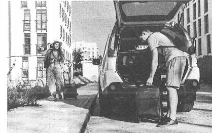
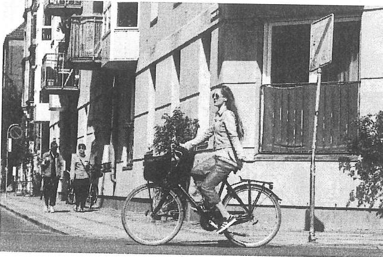
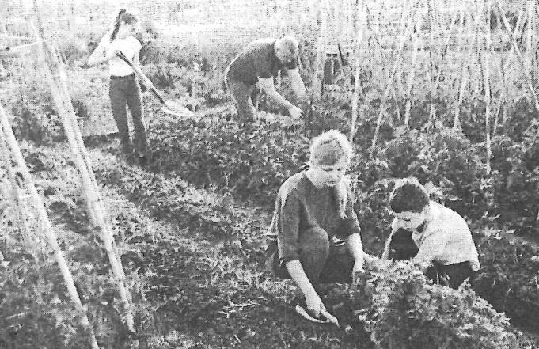
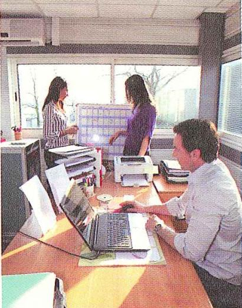
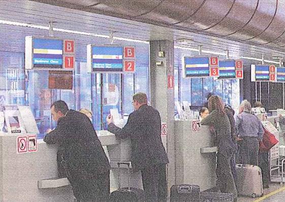

# Unit 5 - Describe a Picture (2)

Nguồn: PDF trang 58-64.

## Tóm tắt nhanh

Unit 5 luyện chuyển từ **key words -> câu nói** trong 45 giây chuẩn bị, tiếp tục dùng SMART và tự ước lượng số câu phù hợp với tốc độ nói 30 giây.

Tài liệu khuyên hạn chế viết nguyên câu trong thời gian chuẩn bị để tránh phụ thuộc vào cấu trúc và làm chậm phản xạ.

## Nội dung nguồn chi tiết

---

### Trang PDF 58

*Asset tách từ trang 58: Ảnh ví dụ ghi key words - đường phố/xe.*

## Mục tiêu bài học
1. Áp dụng hiệu quả cấu trúc & mẫu câu mô tả tranh.
2. Sử dụng được từ vựng cơ bản & nâng cao theo chủ đề.
3. Viết key words & Nói thành câu.
4. Tự ước lượng được số câu (theo khả năng - tốc độ nói của bản thân) trong
30s.
## I. Ôn tập kiến thức nền:
5 bước mô tả tranh theo bộ mã hóa SMART: S Setting Khung cảnh chung: Bức tranh được chụp ở đâu? M Main characters Nhân vật chính: Có bao nhiêu người trong tranh? A Activities Hoạt động: Mô tả hoạt động của từng nhóm người. R Rounding the scene Quang cảnh xung quanh T Thinking Suy nghĩ: Nêu cảm nhận/phỏng đoán về bức tranh.
## II. Luyện tập hình thành câu dựa theo key words:
Thời gian chuẩn bị trước khi nói với máy thu âm là 45 giây cho mỗi tranh. Với 45 giây này, chắc chắn bạn sẽ không kịp viết nguyên một bài nói với các câu đầy đủ thành phần. Việc duy nhất bạn làm được là liệt kê ra key words (từ khóa) trên giấy nháp, sau đó dựa theo từng key words để nói ra thành câu. Sau đây là một bản nháp tham khảo dựa trên bộ mã hóa SMART:
Bản nháp Nói thành câu
(Nguồn: Labsiwon TOEIC Speaking – 10 Tests) S: on street
M: 2 people
A: man: Casual clothes Carry backpack Stand behind car This is a picture taken on a street.
There are two people in the picture.
On the right, there is a man wearing casual clothes. He is carrying a backpack and standing behind a car. He is

---

### Trang PDF 59

Bend over – pick up bag
woman: Walk → the car Carry-on luggage
R: tall buildings
sunny nice weather
T: go on a trip bending over to pick up the bag.
On the left, a woman is walking towards the car. She has some carry-on luggage with her. Surrounding them, there are many tall buildings. It’s a sunny day and the weather seems very nice. I think they are going on a trip.
Từ ví dụ trên có thể thấy, key words mà chúng ta liệt kê thường là danh từ chỉ người/vật có xuất hiện trong tranh, động từ chỉ hành động của con người, và tính từ mô tả người/vật. Sau đó, để hình thành câu hoàn chỉnh, bạn phải thêm một số thành phần như Chủ ngữ - Động từ được chia - Mạo từ - Giới từ chỉ vị trí. Đồng thời, bạn phải “nằm lòng” thứ tự mô tả SMART để bài nói được suôn sẻ, tránh việc sắp xếp ý lộn xộn, không đầu cuối. Hơn nữa, để đảm bảo phản xạ nhanh và tốt, bạn cần luyện tập nhìn vào key words và nói ra thành câu. Hạn chế viết ra thành câu hoàn chỉnh, vì việc này sẽ tạo tâm lý phụ thuộc vào ngữ pháp và cấu trúc câu, sợ sai, cản trở việc bật ra thành tiếng, gây phản xạ chậm.

---

### Trang PDF 60

*Asset tách từ trang 60: Bài tập key words 1.*

*Asset tách từ trang 60: Bài tập key words 2.*

## III. Bài tập áp dụng:
Viết key words của bức tranh và luyện nói trong vòng 30 giây: (1)
(Nguồn: Labsiwon TOEIC Speaking – 10 Tests)
(2)
(Nguồn: Labsiwon TOEIC Speaking – 10 ests)

---

### Trang PDF 61

## IV. Từ vựng theo chủ đề:
1. Outdoor activities (Hoạt động ngoài trời)
> **Ghi chú: Verbs được soạn theo dạng V-ing để học viên học theo cụm, dễ ghép vào**
câu mô tả ; Khuyến khích học viên tra từ bằng Google Images để hình dung rõ hơn. Going swimming Đi bơi Going fishing Đi câu cá Going camping Đi cắm trại Going sightseeing Đi ngắm cảnh Walking the dog Dắt chó đi dạo Talking with friends / Chatting with friends Nói chuyện với bạn bè Hanging out with friends Đi chơi với bạn bè Gardening Làm vườn Planting Trồng cây Watering Tưới cây Going for a walk / Strolling Đi dạo, tản bộ Jogging Chạy bộ Taking a photo Chụp ảnh Climbing Leo núi Hiking Đi bộ đường dài Exploring Thám hiểm Cycling Đạp xe Riding a horse Cưỡi ngựa Having a barbecue / Grilling meat Nướng thịt Cutting fruits into pieces Cắt trái cây thành từng miếng Sitting on the swing Ngồi xích đu Playing badminton Chơi cầu lông
2. In the office (Trong văn phòng)
> **Ghi chú: Verbs được soạn theo dạng V-ing để học viên học theo cụm, dễ ghép vào**
câu mô tả; Khuyến khích học viên tra từ bằng Google Images để hình dung rõ hơn. Typing (on the keyboard) Đánh máy/gõ bàn phím Looking at the computer screen / Staring at the computer screen Nhìn vào màn hình máy tính Proofreading a document Đọc rà soát lỗi (trong văn bản) Reviewing a document / Xem qua một tài liệu/văn bản

---

### Trang PDF 62

Looking over a document Cutting paper into pieces Cắt giấy Cleaning up the cubicle / Tidying the workstation Dọn dẹp khu vực làm việc Making a photocopy Photo tài liệu Pushing the chair under the table Đẩy ghế xuống dưới bàn Taking notes Ghi chú Following the presentation Theo dõi bài thuyết trình Writing something on the board Viết lên bảng Pointing at the figures Chỉ tay vào số liệu Connecting the projector Kết nối máy chiếu Gesturing with s.o’s hands Ra cử chỉ bằng tay
3. At the airport/train station/bus stop (Ở sân bay/ga tàu/trạm xe buýt)
Lining up / Standing in line Xếp hàng Getting on the train/bus/plane Boarding the train/bus/plane Lên tàu/xe buýt/máy bay Getting off the train/car/plane Xuống tàu/xe buýt/máy bay Doing check-in procedures Làm thủ tục check-in Picking up luggage at the conveyor belt/carousel/baggage claim Lấy hành lý sau chuyến bay Proceeding to the gate Tiến đến cổng (để lên chuyến bay) Walking through the security gate/security screening Đi qua khu vực quét an ninh Spreading s.o’s arms out Dang tay sang ngang để quét an ninh Weaving through the crowd Len lỏi qua đám đông Presenting the ticket to the conductor Xuất trình vé cho trưởng tàu Fastening the seat belt Thắt chặt dây an toàn Loosening the seat belt Nới lỏng dây an toàn Placing the luggage in the overhead compartment Đặt hành lý lên khoang chứa đồ Going through the aisles / rows of seats Đi qua hàng ghế
4. Patterns/Directions (kiểu mẫu/phương hướng)
Sitting alternately Ngồi xen kẽ nhau Looking at the same direction Nhìn về cùng một phía Placed in horizontal rows Được đặt thành hàng ngang Placed in vertical rows Được đặt thành hàng dọc

---

### Trang PDF 63

*Asset tách từ trang 63: Bài tập SMART - bếp/đầu bếp.*

*Asset tách từ trang 63: Bài tập SMART - văn phòng.*

Arranged diagonally Được xếp theo đường chéo Casting the shadow on the ground Bóng (cây/tòa nhà) đổ trên mặt đất Lining the road on both sides Đứng dọc hai bên đường Bordering the lake Forming around the edge of the lake Quanh bờ hồ
## V. Bài tập áp dụng:
Sử dụng cấu trúc mô tả tranh SMART và những từ vựng được gợi ý ở phần III, luyện tập viết key words và mô tả 4 bức tranh sau: (1)
(Nguồn: TOEIC Speaking Actual Test - Gwen Tv)
(2)
(Nguồn: TOEIC Speaking Actual Test - Darakwon)

---

### Trang PDF 64

*Asset tách từ trang 64: Bài tập SMART - đi bộ đường dài.*

*Asset tách từ trang 64: Bài tập SMART - sân bay.*

(3)
(Nguồn: TOEIC Speaking Actual Test - Gwen Tv)
(4)
(Nguồn: TOEIC Speaking Actual Test - Darakwon)
