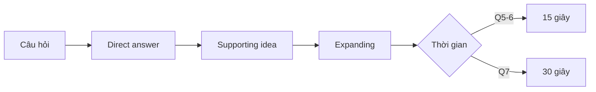

# Unit 6 - Respond to Questions 5-6

Nguồn: PDF trang 66-75.

## Tóm tắt nhanh

Tài liệu rút ra công thức **DSE** cho bộ câu 5-6-7: **Direct answer - Supporting idea - Expanding**. Với 3 giây chuẩn bị, người học được khuyến nghị tận dụng cấu trúc của chính câu hỏi để lắp nhanh câu trả lời.

Bài phân tách hai nhóm chính: **WH-questions** và **Yes/No questions**, đồng thời cung cấp fillers cho positive / negative / uncertainty tone.

## Nội dung nguồn chi tiết

---

### Trang PDF 66

QUESTIONS 5-6
## Mục tiêu bài học
1. Nắm được cấu trúc & cách ra đề phần Respond to questions.
2. Nắm được cách trả lời với các dạng câu hỏi Wh-questions và Yes/No Questions
3. Trả lời hiệu quả các dạng câu hỏi trên.
- Phân tích ví dụ:
Nguồn: TOEIC Speaking Actual Test – Darakwon Imagine that a German marketing firm is doing research in your country. You have agreed to participate in a telephone interview about restaurants. (Hãy tưởng tượng rằng một công ty tiếp thị của Đức đang thực hiện nghiên cứu ở nước bạn. Bạn đã đồng ý tham gia một cuộc phỏng vấn qua điện thoại về nhà hàng.) Q5: How often do you eat out at restaurants? (Bạn thường đi ăn ở nhà hàng bao lâu một lần?) A5: I usually eat out at restaurants at least four times a week. Mostly, I am so busy with my work that I don't have time to cook for myself. As a person living alone, it is much more convenient to eat out rather than to cook for myself. (Tôi thường đi ăn ở nhà hàng ít nhất bốn lần một tuần. Hầu hết, tôi quá bận rộn với công việc đến nỗi không có thời gian tự nấu ăn. Là người sống một mình, việc đi ăn ngoài sẽ tiện hơn rất nhiều so với việc tự nấu ăn.) Q6: Which place would you prefer to visit, your favorite restaurant or a new restaurant? (Bạn muốn đến địa điểm nào hơn, nhà hàng yêu thích hay một nhà hàng mới?) A6: In my case, I would prefer to try a different cuisine at a new restaurant since I am the type of person who always looks for something new. Trying new things, including new tastes, gives me great pleasure.

---

### Trang PDF 67

(Tôi muốn thử một món ăn khác biệt ở một nhà hàng mới, vì tôi là kiểu người luôn tìm kiếm những điều mới mẻ. Việc thử những điều mới, bao gồm cả gu ăn uống mới, sẽ mang lại cho tôi nhiều niềm vui.) Q7: Are there any good restaurants around your school or workplace? (Có nhà hàng nào ngon xung quanh trường học hoặc nơi làm việc của bạn không?) A7: Yes, there is a little Thai restaurant in my neighborhood that just opened a couple of months ago. That restaurant serves American-style Chinese and Vietnamese dishes in addition to the Thai dishes, which are very delicious. I am always satisfied with the taste of the food, and the portions and prices are quite reasonable for Thai food. My favorite food at that restaurant is a Thai noodle dish which is deliciously spicy. The service there is quite good, too. When you are in the mood for some Thai cuisine, I recommend that you go there to try some real Thai food. (Có một nhà hàng Thái nhỏ ở gần nhà tôi mới mở cách đây vài tháng. Ngoài các món Thái, nhà hàng đó còn phục vụ các món ăn Trung Hoa và Việt Nam kiểu Mỹ rất ngon. Tôi luôn hài lòng với hương vị của món ăn; khẩu phần và giá cả cũng khá hợp lý đối với món ăn Thái. Món ăn tôi thích nhất ở nhà hàng đó là món mì Thái có vị cay thơm ngon. Dịch vụ ở đó cũng khá tốt. Khi bạn muốn thưởng thức một số món ăn Thái, tôi khuyên bạn nên đến đó để thử một số món ăn Thái đích thực.)

---

### Trang PDF 68

Nguồn: Jump Up TOEIC Speaking – Level 7-8 Imagine that an American marketing firm is doing research in your country. You have agreed to participate in a telephone interview about computers. (Hãy tưởng tượng rằng một công ty tiếp thị của Mỹ đang thực hiện nghiên cứu ở nước bạn. Bạn đã đồng ý tham gia một cuộc phỏng vấn qua điện thoại về máy tính.) Q5: What is the most important thing you would consider when you choose a laptop computer? (Điều quan trọng nhất mà bạn cân nhắc khi chọn một chiếc máy tính xách tay là gì?) A5: To me, the most important thing is the price. Since I am a student, I get an allowance from my parents. I have to do a part time job if I have to buy an expensive item. So I would consider buying something cheap at a low price. (Với tôi, điều quan trọng nhất là giá cả. Vì đang là sinh viên nên tôi nhận trợ cấp từ bố mẹ. Tôi phải làm một công việc bán thời gian nếu tôi muốn mua một món đồ đắt tiền. Vì vậy, tôi sẽ cân nhắc việc mua một cái gì đó rẻ tiền, ở một mức giá thấp.) Q6: What are some advantages of using a laptop computer? (Một số lợi ích của việc sử dụng máy tính xách tay là gì?) A6: I sometimes carry my laptop to school since I have to take a lot of notes at one of my classes. It would take a lot of time if I use a pen, but it is much easier because I am good at typing. (Đôi khi tôi mang theo máy tính xách tay đến trường vì tôi phải ghi chép rất nhiều ở một trong các lớp học của mình. Sẽ mất rất nhiều thời gian nếu tôi sử dụng bút để viết, nhưng sẽ dễ dàng hơn nhiều vì tôi giỏi đánh máy hơn.) Q7: Would you prefer to buy a laptop computer or a desktop computer? (Bạn thích mua máy tính xách tay hay máy tính để bàn hơn?) A7: In my case, I would prefer to buy a laptop. When I am studying at school or library, laptops come in handy. I can search for information to write a paper or also use the tools to create the documents. If there wasn't a laptop, then I would have to go to the library or wait until I am home to use the computer. So I would definitely buy a laptop.

---

### Trang PDF 69

(Đối với tôi, tôi thích mua một chiếc máy tính xách tay hơn. Khi tôi đang học ở trường hoặc thư viện, máy tính xách tay rất hữu ích. Tôi có thể tìm kiếm thông tin để viết bài hoặc sử dụng các công cụ để biên soạn tài liệu. Nếu không có máy tính xách tay, tôi sẽ phải đến thư viện hoặc đợi đến lúc về nhà mới sử dụng máy tính để bàn. Vì vậy, tôi chắc chắn sẽ chọn mua một chiếc máy tính xách tay.)
Từ 2 ví dụ trên, bạn có thể thấy được một số điểm đáng chú ý của đề mẫu như sau:
- Hoàn cảnh đặt câu hỏi sẽ được giới thiệu trước trong phần Hướng dẫn (Hãy tưởng
tượng bạn đang tham gia phỏng vấn về chủ đề NHÀ HÀNG, MÁY TÍNH,…).
- Toàn bộ 3 câu hỏi chỉ xoay quanh chủ đề đã được giới thiệu từ đầu.
- Những câu trả lời mẫu ở trên không đơn thuần chỉ dừng ở việc trả lời trực tiếp câu
hỏi được đặt ra (direct answer), mà luôn phải có phần giải thích rõ thêm (supporting idea) và mở rộng câu trả lời (expanding). Từ đây, chúng ta rút ra được một công thức chung để giải quyết bộ 3 câu hỏi 5-6-7: DSE: Direct answer – Supporting idea – Expanding.
- Ghi nhớ thời gian cho phép trả lời: 15 giây cho câu 5-6 & 30 giây cho câu 7. Hãy linh
hoạt lựa chọn số lượng Supporting idea & Expanding sao cho phù hợp với thời gian của từng câu.
- Một vấn đề “khó nhằn nhất” mà hầu hết thí sinh dự thi TOEIC Speaking thường chia
sẻ, đó chính là bước chuẩn bị câu trả lời trong 3 giây. Đúng vậy, chỉ vỏn vẹn trong 3 giây thôi, không còn là 45 giây như ở Questions 1-2-3-4 nữa! Cũng như khi giao tiếp ngoài đời thực, quá trình hỏi-đáp cũng sẽ được diễn ra nhanh chóng và tức thời. Do đó, Part 3 TOEIC Speaking được thiết kế để đánh giá khả năng phản xạ tự nhiên của thí sinh về các vấn đề thường nhật trong cuộc sống.
- Một mẹo nhỏ có thể “khắc chế” được vấn đề trên, đó là tận dụng cấu trúc của câu
hỏi hiển thị trên màn hình để nhanh chóng lắp ghép thành một câu nói hoàn chỉnh.

---

### Trang PDF 70

Ví dụ 1: WH-questions: (1) How often do you go shopping for clothes?
> I go shopping for clothes once a month.
(2) When do you usually go to the gym?
> I usually go to the gym three times a week in the evenings.
(3) Where do you usually buy your accessories?
> I usually buy my accessories at various department stores or online platforms.
(4) Which celebrities do you admire the most?
> The celebrity I admire the most is Emma Watson, an English actress.
Lưu ý: 4 ví dụ trên chỉ mới đáp ứng Direct answer (trả lời trực tiếp nội dung câu hỏi). Việc tiếp theo của chúng ta là tìm lý do để giải thích rõ thêm cho câu trả lời trực tiếp đó: (1) How often do you go shopping for clothes? (Bạn mua sắm quần áo bao lâu một lần?)
> I go shopping for clothes once a month. Although I always wear uniforms at work,
I really want to stay updated with the latest trends and refresh my wardrobe.
> Tôi thường đi mua sắm quần áo khoảng một tháng một lần. Mặc dù tôi luôn mặc
đồng phục khi đi làm, nhưng tôi vẫn muốn cập nhật những xu hướng thời trang mới nhất và làm mới tủ quần áo của mình.
(2) When do you usually go to the gym? (Bạn thường đi tập gym khi nào?)
> I usually go to the gym three times a week in the evenings, as it helps me maintain
a healthy lifestyle and manage stress effectively.
> Tôi thường đến phòng tập gym ba lần một tuần vào buổi tối, vì nó giúp tôi duy trì
lối sống lành mạnh và kiểm soát căng thẳng hiệu quả.
(3) Where do you usually buy your accessories? (Bạn thường mua phụ kiện ở đâu?)
> I usually buy my accessories at various department stores or online platforms,
where I can find a wide range of choices and good deals.
> Tôi thường mua phụ kiện của mình tại nhiều cửa hàng bách hóa hoặc các nền tảng
trực tuyến khác nhau, nơi mà tôi có thể tìm thấy nhiều sự lựa chọn và ưu đãi tốt.
(4) Which celebrities do you admire the most? (Bạn hâm mộ người nổi tiếng nào nhất?)
> The celebrity I admire the most is Emma Watson, an English actress. Her
achievements and positive impact on society really inspire me to strive for excellence.

---

### Trang PDF 71

> Nhân vật tôi ngưỡng mộ nhất là Emma Watson, một diễn viên nữ người Anh.
Những thành tựu và tác động tích cực của cô ấy đối với xã hội thật sự truyền cảm hứng cho tôi phấn đấu để đạt đến sự xuất sắc.
- Bài tập ứng dụng 1 – Wh-questions:
Trả lời các câu hỏi sau trong vòng 15 giây (Chú ý: Tận dụng cấu trúc câu hỏi được cho sẵn để tăng phản xạ) a. How often do you eat out in a typical week?
> ………………………………………………………………………………………
………………………………………………………………………………………
b. For whom do you usually buy flowers?
> ………………………………………………………………………………………
………………………………………………………………………………………
c. What is your favorite sport?
> ………………………………………………………………………………………
………………………………………………………………………………………
d. When was the last time you bought a gift for someone?
> ………………………………………………………………………………………
………………………………………………………………………………………
e. Why do you like music?
> ………………………………………………………………………………………
……………………………………………………………………………………… Ví dụ 2: Yes/No questions: (1) Do you like to read books? (Bạn thích đọc sách không?)
> Absolutely, yes. I thoroughly enjoy reading books as it enhances my language
proficiency and broadens my knowledge across various subjects.
> Chắc chắn là có. Tôi hoàn toàn thích đọc sách vì nó giúp nâng cao trình độ ngôn
ngữ của tôi và mở rộng kiến thức của tôi về nhiều chủ đề khác nhau. (2) Do you eat breakfast every morning? (Bạn có ăn sáng mỗi buổi sáng không?)
> Of course. I eat breakfast every morning to ensure that I have the energy and focus
needed for the day ahead.
> Tất nhiên là có rồi. Tôi ăn sáng mỗi buổi sáng để đảm bảo có đủ năng lượng và sự
tập trung cần thiết cho ngày mới. (3) Do you have a lot of free time? (Bạn có nhiều thời gian rảnh không?)

---

### Trang PDF 72

> Unfortunately, I don't have much free time due to work commitments and
additional responsibilities. I usually dedicate my weekends to catching up on personal tasks.
> Thật không may, tôi không có nhiều thời gian rảnh do bận rộn với công việc và
những trách nhiệm khác. Tôi thường dành những ngày cuối tuần của mình để hoàn thành các công việc cá nhân. (4) Would you consider working at a company which requires working on the weekends? (Bạn có cân nhắc làm việc tại một công ty yêu cầu làm việc vào cuối tuần không?)
> Well, it depends. As for me, I would be open to working on weekends if the
company values work-life balance and compensates accordingly.
> Điều đó còn tùy. Đối với tôi, tôi sẵn sàng làm việc vào cuối tuần nếu công ty coi
trọng sự cân bằng giữa công việc-cuộc sống và có chế độ đãi ngộ phù hợp.
Như vậy, để đảm bảo phần Direct answer cho Yes/No questions, bạn phải bày tỏ ý kiến/quan điểm của mình trước: bạn đồng ý, không đồng ý, hay muốn bày tỏ sự không chắc chắn/do dự? Hãy dùng các từ vựng được gợi ý dưới đây:
- Một số Fillers dùng để trả lời ngay đầu câu Yes/No questions với positive tone:
- Absolutely, (yes)
- Certainly, (yes)
- Sure.
- Of course.
- Một số Fillers dùng để trả lời ngay đầu câu Yes/No questions với negative tone:
- I have to say no.
- No, not really.
- Unfortunately,…
- Not exactly.
- Một số Fillers dùng để trả lời ngay đầu câu Yes/No questions - diễn đạt
uncertainty/hesitation:
- Well, it depends.
- Hmm, it can vary based on…
- I’m not entirely sure, but…
- Actually, I guess…

---

### Trang PDF 73

- Bài tập ứng dụng 2 – Yes/No questions:
Trả lời các câu hỏi sau trong vòng 15 giây (Chú ý: Tận dụng cấu trúc câu hỏi được cho sẵn để tăng phản xạ + Sử dụng các Fillers được gợi ý ở trên) a. Have you ever used public transportation to commute to work?
> ………………………………………………………………………………………
……………………………………………………………………………………… b. Is maintaining a healthy work-life balance important to you?
> ………………………………………………………………………………………
……………………………………………………………………………………… c. Do you usually prefer to communicate with colleagues through emails?
> ………………………………………………………………………………………
…………………………………………………………………………………… d. Have you attended any professional development workshops in the past year?
> ………………………………………………………………………………………
……………………………………………………………………………………… e. Is the time-management skill essential at work?
> ………………………………………………………………………………………
………………………………………………………………………………………

---

### Trang PDF 74

## Vocabulary list
English
Vietnamese
Once
(adv) một lần
Twice
(adv) hai lần
Three/four/five… times
(adv) 3/4/5… lần
taste
(n) gu/sở thích/hương vị
In addition to
(prep) ngoài….ra
Be satisfied with
(adj) hài lòng với…
Portion
(n) khẩu phần
Reasonable
(adj) hợp lý
Spicy
(adj) (vị) cay
Be in the mood for
(phrase) có tâm trạng để…/có hứng để…
Get allowance from
(v) nhận tiền trợ cấp từ…
Consider + V-ing
(v) xem xét làm việc gì
At a low price
(adv) ở mức giá thấp
Take notes
(v) ghi chú
Be good at + N/V-ing
(adj) giỏi về việc gì
Come in handy
(v) hữu ích, có ích
Stay updated
(v) cập nhật tin mới/xu hướng mới
Trend
(n) xu hướng
Refresh the wardrobe
(v) làm mới tủ quần áo
Maintain a healthy lifestyle
(v) duy trì lối sống lành mạnh
Manage stress effectively
(v) kiểm soát căng thẳng một cách hiệu quả
Department store
(n) cửa hàng bách hóa
Online platform
(n) nền tảng trực tuyến
A wide range of + Ns
Đa dạng/Nhiều loại
Good deals
(n) các khoản ưu đãi tốt/giá tốt
Admire
(v) ngưỡng mộ (ai đó) / chiêm ngưỡng (cảnh quan)
Achievement
(n) thành tựu, sự đạt được
Positive impact on…
(n) tác động tích cực lên (ai/cái gì)
Inspire s.o
(v) truyền cảm hứng cho ai
Strive for s.th
(v) đấu tranh vì điều gì
Enhance
(v) nâng cao
Broaden s.o’s knowledge
(v) mở rộng kiến thức
Work commitment(s)
(n) (những) việc phải làm/sự bận rộn với công việc
Dedicate [time] to + N/V-ing
(v) cống hiến/dành trọn [thời gian] cho việc gì
Catch up on s.th
(phrasal verb) làm việc gì (mà gần đây chưa làm được)
As for me,…
(adv) đối với tôi,…
Work-life balance
(n) sự cân bằng giữa công việc và cuộc sống
Value s.o/s.th
(v) đánh giá cao, coi trọng ai/cái gì

---

### Trang PDF 75

Compensate (v) đãi ngộ, đền bù, bù đắp Dine out (v) đi ăn ngoài Enjoy/Try cuisines (v) thưởng thức/ăn thử các món ăn Socialize with s.o (v) xã giao với ai Express (v) bày tỏ (adj) nhanh Strategy (n) chiến thuật/chiến lược Purchase (n, v) mua Boost the mood (v) làm phấn chấn tinh thần Unwind (v) nghỉ ngơi, thư giãn Utilize (v) sử dụng, tận dụng Commute (n, v) đi lại Environmentally friendly (adj) thân thiện với môi trường A fulfilling personal life (n) một cuộc sống cá nhân đầy đủ/trọn vẹn Be eager to (adj) háo hức làm gì Performance (n) hiệu suất công việc/sự biểu diễn
