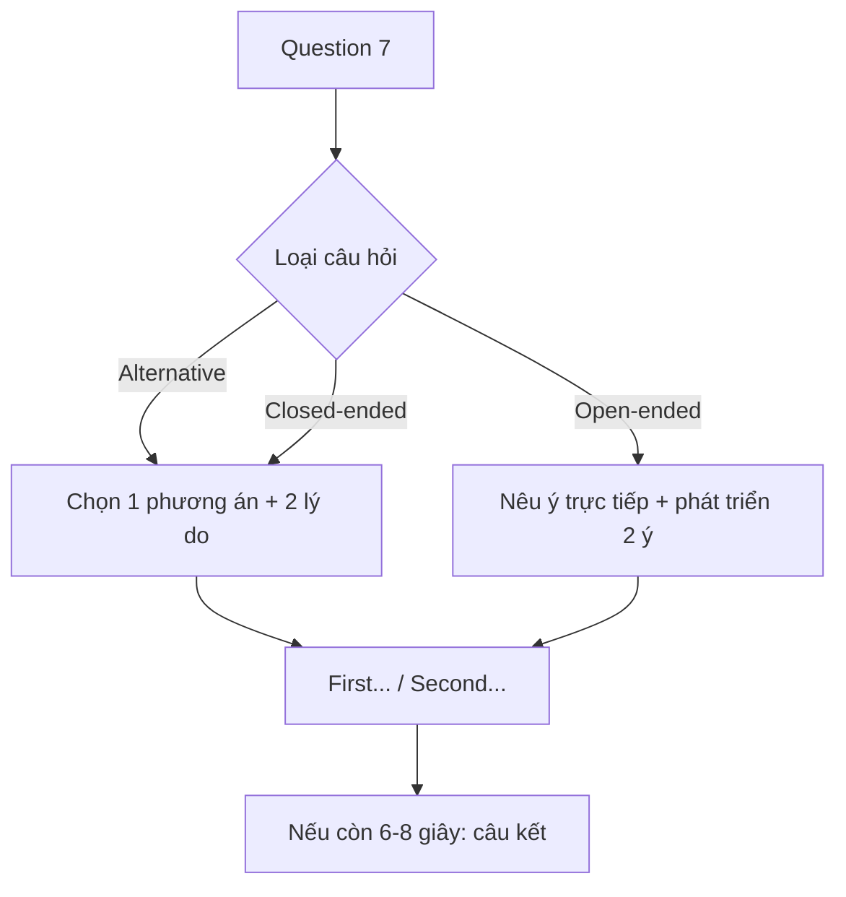

# Unit 7 - Respond to Question 7

Nguồn: PDF trang 76-88.

## Tóm tắt nhanh

Unit 7 tập trung Question 7 (30 giây), đặc biệt là **Alternative questions** và mở rộng sang Closed-ended / Open-ended questions.

Tài liệu gợi ý nhiều khung 30 giây như `I prefer... because of the following reasons`, `The main reason...`, `rather than...`, hoặc `these are 2 benefits/advantages...`.

## Nội dung nguồn chi tiết

---

### Trang PDF 76

QUESTION 7
## Mục tiêu bài học
4. Nắm rõ cấu trúc & cách ra đề phần Respond to questions.
5. Nắm được cách trả lời với dạng câu hỏi Alternative questions.
6. Trả lời hiệu quả các dạng câu hỏi Wh-questions, Yes/No questions & Alternative
questions.
7. Thực hành trả lời một số loại câu hỏi thường ra ở Question 7 (30 giây).
## I. Alternative questions là gì?
Alternative questions là dạng câu hỏi đưa ra các phương án lựa chọn. Nó có cấu trúc gần giống với Yes/No questions: cũng có một trợ động từ nằm đầu câu hỏi, nhưng có từ “or” giữa các sự lựa chọn. Người trả lời phải nói rõ sự lựa chọn của mình, không trả lời Yes hay No.
Ví dụ: (1) Do you prefer reading printed books or e-books? (2) Do you prefer traveling with other people or alone?
Dạng câu hỏi như trên thường được ra ở Question 7 (30 giây), vì thông thường, người trả lời phải đưa ra phương án lựa chọn của mình kèm với lời giải thích (Why/Why not?). Hãy tham khảo các câu trả lời mẫu như sau: (1) Do you prefer reading printed books or e-books? (Bạn thích đọc sách in hay sách điện tử hơn?)
> I prefer reading printed books because of the following reasons. First of all,
there's something about the feel of paper and the smell of a physical book that enhances my reading experience. I like being able to physically engage with the text appearing on paper. Second, I also admire bookshelves with well-worn volumes since they have a unique appeal to me.
> Tôi thích đọc sách in hơn vì những lý do sau. Thứ nhất, cảm giác chạm tay vào giấy
và mùi của một cuốn sách giấy giúp nâng cao trải nghiệm đọc sách của tôi. Tôi

---

### Trang PDF 77

thích mình có thể thật sự chạm vào từng đoạn văn bản xuất hiện trên mặt giấy. Thứ hai, tôi cũng thích chiêm ngưỡng những giá sách với những cuốn sách cũ kỹ - chúng có một sức hấp dẫn rất đặc biệt đối với tôi. OR
> I prefer reading e-books. The main reason I say this is the convenience they offer.
I mean, they seem to carry an entire library in one device, adjustable font sizes, and the ability to search for information instantly. Another reason is that e-books also contribute to environmental sustainability by reducing paper consumption. (Overall, these are the reasons that make e-books my preferred choice for reading.)
> Tôi thích đọc sách điện tử hơn. Lý do chính tôi nói điều này là vì sự tiện lợi mà chúng
mang lại. Ý tôi là, chúng dường như chứa toàn bộ thư viện trong một thiết bị, kích thước phông chữ có thể điều chỉnh và khả năng tìm kiếm thông tin ngay lập tức. Một lý do khác là sách điện tử còn góp phần bảo vệ môi trường bền vững bằng cách giảm lượng tiêu thụ giấy. (Nhìn chung, đây là những lý do khiến sách điện tử trở thành lựa chọn ưu tiên của tôi khi đọc sách.)
(2) Do you prefer traveling with other people or alone? (Bạn thích đi du lịch cùng người khác hay một mình?)
> I love traveling with other people rather than alone. First, it enhances safety
because you can watch out for each other, adding an extra layer of security. Additionally, group travel often leads to cost savings through shared expenses on accommodation and transportation as well. Then, we can spend that savings amount to explore other new things together.
> Tôi thích đi du lịch với người khác hơn là một mình. Đầu tiên, nó tăng cường sự an
toàn vì bạn có thể để ý/đề phòng giúp cho nhau, làm tăng thêm một lớp an toàn/an ninh. Ngoài ra, du lịch theo nhóm thường giúp tiết kiệm chi phí thông qua việc chia sẻ kinh phí với nhau về chỗ ở và phương tiện đi lại. Nhờ vậy, chúng ta có thể dành số tiền tiết kiệm đó để cùng nhau khám phá những điều mới mẻ khác. OR
> I prefer traveling alone and these are 2 benefits of it. The first thing is that I can
set my own pace and choose destinations spontaneously. This also helps me to increase my confidence in navigating new environments independently. Another thing is that it allows for a more immersive cultural experience because I’m likely to communicate more with locals, like asking questions about tourist attractions, or observe how they use local dialect with each other.
> Tôi thích đi du lịch một mình hơn và đây là 2 lợi ích của việc đó. Điều đầu tiên là tôi
có thể tự thiết lập nhịp độ của chính mình và lựa chọn điểm đến một cách ngẫu

---

### Trang PDF 78

hứng. Điều này cũng giúp tôi tăng sự tự tin khi đi đến môi trường mới một cách độc lập. Một điều nữa là nó cho phép trải nghiệm văn hóa sâu sắc hơn vì tôi có thể giao tiếp nhiều hơn với người dân địa phương, chẳng hạn như đặt câu hỏi về các điểm du lịch, hoặc quan sát cách họ sử dụng từ ngữ địa phương với nhau.
Trong 30 giây của Question 7, hầu hết chúng ta có khả năng diễn đạt trọn vẹn 2 ý / 2 lý do của một vấn đề/một sự lựa chọn. Điều này đã được kiểm chứng bởi rất nhiều thí sinh đi thi, cũng như bản thân người viết sách. Do đó, bạn có thể tham khảo cấu trúc chung để trả lời cho Question 7 như sau: (hãy tiếp tục “nằm lòng” dàn ý này, để trong 3 giây chuẩn bị, bạn chỉ cần vạch ra 2 ý chính và ghép vào khung sườn này):
1. I love/I prefer/I would choose … because of the following reasons.
First (of all),… Second,…
2. I love/I prefer/I would choose… . The main reason I say this + is + Noun.
I mean (ý tôi là – dùng để làm rõ ý) Another reason is that…
3. I love/I prefer/I would choose… rather than… .
First (of all),… Additionally,…
4. I love/I prefer/I would choose… and these are 2 benefits/advantages of it.
The first thing is that… Another thing is that…
* Nếu sau khi trình bày hết cả 2 ý mà vẫn còn thời gian khoảng 6-8 giây, bạn có thể nói thêm một câu để chốt lại vấn đề (không nên để trống thời gian quá nhiều), ví dụ: “Overall, these are the reasons that make e-books my preferred choice for reading.” (tùy theo đề, bạn hãy thay thế từ ngữ linh hoạt ở những vị trí được gạch chân).

---

### Trang PDF 79

- Bài tập áp dụng 1:
Vận dụng cấu trúc gợi ý trên, luyện tập trả lời 2 câu hỏi sau trong 30 giây:
(1) Would you consider going abroad or staying in your own country to study a foreign language?
- Going abroad to study a foreign language:
> ………………………………………………………………………………………………………………………………………
……………………………………………………………………………………………………………………………………… ……………………………………………………………………………………………………………………………………… ………………………………………………………………………………………………………………………………………
- Staying in your own country to study a foreign language:
> ………………………………………………………………………………………………………………………………………
……………………………………………………………………………………………………………………………………… ……………………………………………………………………………………………………………………………………… ……………………………………………………………………………………………………………………………………… ………………………………………………………………………………………………………………………………………
(2) Do you prefer to study at home using the Internet or attend a traditional class?
- Studying at home using the Internet:
> ………………………………………………………………………………………………………………………………………
……………………………………………………………………………………………………………………………………… ……………………………………………………………………………………………………………………………………… ……………………………………………………………………………………………………………………………………… ………………………………………………………………………………………………………………………………………
- Attending a traditional class:
> ………………………………………………………………………………………………………………………………………
……………………………………………………………………………………………………………………………………… ……………………………………………………………………………………………………………………………………… ……………………………………………………………………………………………………………………………………… ………………………………………………………………………………………………………………………………………

---

### Trang PDF 80

## II. Một số loại câu hỏi khác ở Question 7 (30 giây)
Sau đây là một số loại câu hỏi khác được ra ở Question 7, yêu cầu thí sinh đưa ra lý do/giải thích cho câu trả lời/sự lựa chọn của mình, sao cho phù hợp trong khoảng thời gian 30 giây. (Nguồn: Youtube - TOEIC Speaking Actual Test - Gwen Tv) * Nhóm Closed-ended questions (Câu hỏi đóng: cho sẵn các phương án lựa chọn, người trả lời chọn một phương án và kèm theo giải thích ngắn gọn)
1. Which of the following do you think could be most effectively advertised on the
Internet: shoes, books or music?
2. How would you get tips on how to grow plants: using the Internet or asking friends?
### 3. What is the most important thing that you would consider when buying new shoes
comfort, durability, or appearance? * Nhóm Open-ended questions (Câu hỏi mở: yêu cầu người trả lời cung cấp thông tin hoặc ý kiến một cách tự do, không bị giới hạn bởi các lựa chọn đã cho trước)
1. What are some advantages of using public transportation over driving your own car?
2. What are some ways to get to know your neighbors better?
3. What kind of food do you bring on a picnic? Why?
### II.1. Nhóm Closed-ended questions:
Tương tự như Alternative questions, người trả lời cũng phải đưa ra sự lựa chọn của mình cùng với lời giải thích, vì vậy bạn có thể tận dụng cấu trúc câu hỏi hiển thị trên màn hình (xem lại Unit 6) và áp dụng cách trả lời như đã gợi ý ở phần I – Unit 7 này. Sau đây là câu trả lời mẫu cho 3 ví dụ ở nhóm Closed-ended questions:
1. Which of the following do you think could be most effectively advertised on the
Internet: shoes, books or music? (Bạn nghĩ điều nào sau đây có thể được quảng cáo hiệu quả nhất trên Internet: giày, sách hay âm nhạc?)
> In my opinion, shoes could be most effectively advertised on the Internet because of
the following reasons. First, the visual nature of online platforms allows for dynamic displays of various shoe styles and features, attracting a wide audience. Additionally, e-commerce platforms make it convenient for consumers to browse, compare, and make purchases online, which enhances the effectiveness of advertising shoes on the Internet.
> Theo tôi, giày có thể được quảng cáo hiệu quả nhất trên Internet vì những lý do sau.
Đầu tiên, bản chất trực quan của nền tảng trực tuyến cho phép hiển thị sinh động các kiểu dáng và đặc tính khác nhau của giày, giúp thu hút nhiều đối tượng người mua hàng. Ngoài ra, nền tảng thương mại điện tử giúp người tiêu dùng thuận tiện trong

---

### Trang PDF 81

việc xem xét, so sánh và mua hàng trực tuyến, giúp nâng cao hiệu quả của việc quảng cáo giày trên Internet.
2. How would you get tips on how to grow plants: using the Internet or asking friends?
(Làm thế nào để bạn có được mẹo trồng cây: sử dụng Internet hay hỏi bạn bè?)
> I believe the most effective way to get tips on how to grow plants is by using the
Internet. The main reason I say this is (that) online resources provide a great deal of available information, including articles, videos, and manuals dedicated to gardening. Moreover, the Internet also offers a diverse range of expertise, allowing gardening lovers to access specialized advice based on their specific plant types and conditions. Overall, I think using the Internet is the best way for getting comprehensive and up- to-date information on planting.
> Tôi tin rằng cách hiệu quả nhất để có được mẹo trồng cây là sử dụng Internet. Lý do
chính khiến tôi nói điều này là vì các tài nguyên trực tuyến cung cấp rất nhiều thông tin có sẵn, bao gồm các bài báo, video và sách hướng dẫn dành riêng cho việc làm vườn. Hơn nữa, Internet cũng cung cấp nhiều kiến thức chuyên môn đa dạng, cho phép những người yêu thích làm vườn tiếp cận được những lời khuyên chuyên môn dựa trên từng loại cây và điều kiện sinh sống của chúng. Nói chung, tôi nghĩ sử dụng Internet là cách tốt nhất để có được thông tin toàn diện và cập nhật về trồng trọt.
### 3. What is the most important thing that you would consider when buying new shoes
comfort, durability, or appearance? (Điều quan trọng nhất mà bạn cân nhắc khi mua giày mới là gì: sự thoải mái, độ bền hay hình thức bên ngoài?)
> When buying/purchasing new shoes, the most important thing to consider is comfort.
Comfortable footwear is essential for long-term wear, ensuring a positive experience and preventing discomfort. While durability and appearance contribute to overall satisfaction, I think comfort comes first because it is more in line with daily activities that consumers need.
> Khi mua giày mới, điều quan trọng nhất cần quan tâm là sự thoải mái. Giày dép thoải
mái là điều cần thiết để mang lâu dài, đảm bảo trải nghiệm tích cực và ngăn ngừa sự khó chịu. Mặc dù độ bền và vẻ ngoài góp phần mang lại sự hài lòng chung, nhưng tôi nghĩ sự thoải mái nên được đặt lên hàng đầu vì nó phù hợp hơn với hoạt động hàng ngày mà người tiêu dùng cần. * Ngoài dàn ý thông thường (tập trung khai thác lý do cho sự lựa chọn của mình), bạn có thể sử dụng cách nhắc đến 2 yếu tố mà bạn không chọn để tạo ra sự tương phản và so sánh, làm nổi bật lên sự lựa chọn ban đầu.

---

### Trang PDF 82

### II.2. Nhóm Open-ended questions:
Đối với câu hỏi mở, bạn không cần quá cứng nhắc tuân theo một khung sườn nào. Tuy nhiên, bạn phải nắm rõ tốc độ nói của bản thân để kiểm soát số lượng ý tưởng vừa đủ trong 30 giây; tránh việc liệt kê dàn trải nhưng không đủ độ sâu cho từng ý.
Ví dụ câu trả lời không được đánh giá cao: What kind of food do you bring on a picnic? Why? When I go on a picnic, I like to bring many things. I will bring oranges, watermelon, mango, and grapes. In addition, I also want to bring meat, fish, and seafood to grill. About beverages, I will bring soft drinks, beer and pure water. I'll take these foods because these are all my favorites. Nhận xét: Câu trả lời này liệt kê dàn trải các loại thực phẩm, từ trái cây, đồ nướng, đến nước uống; sau cùng, người trả lời trả lời vế “Why?” bằng câu “tất cả đều là món yêu thích của tôi”, đây là một lý do khá hời hợt và hiển nhiên, không đủ độ sâu sắc và thuyết phục. Hơn nữa, lượng từ vựng sử dụng quá cơ bản, không đủ để đạt level 2-3 cho câu này.
Sau đây là câu trả lời mẫu cho 3 ví dụ ở nhóm Open-ended questions:
1. What are some advantages of using public transportation over driving your own
car? (Việc sử dụng phương tiện giao thông công cộng có lợi ích gì so với việc lái xe ô tô riêng của bạn?)
> There are several advantages of using public transportation over driving one's own car
including cost efficiency, reduced traffic stress, and environmental benefits. Public transportation is often more economical because it eliminates expenses related to fuel, maintenance, and parking. Additionally, it reduces the stress of navigating traffic congestion. Moreover, it contributes to environmental conservation by lowering emissions from vehicles.
> Có một số lợi ích của việc sử dụng phương tiện giao thông công cộng so với việc lái ô
tô riêng bao gồm hiệu quả chi phí, giảm căng thẳng trong giao thông và có lợi ích cho môi trường. Giao thông công cộng thường tiết kiệm hơn vì nó loại bỏ các chi phí liên quan đến nhiên liệu, bảo trì và chỗ đậu xe. Ngoài ra, nó còn làm giảm căng thẳng khi điều hướng tắc nghẽn giao thông. Hơn nữa, nó còn góp phần bảo tồn môi trường bằng cách giảm lượng khí thải từ xe cộ.

---

### Trang PDF 83

2. What are some ways to get to know your neighbors better? (Một số cách để hiểu rõ
hơn về hàng xóm của bạn là gì?)
> To get to know our neighbors better, there are some ways to consider such as joining
neighborhood gatherings and some local community events. At that time, we definitely have a chance to engage in casual conversations, simply just saying hello and introducing ourselves, which can create connections at first. Gradually, participating in local activities or volunteering within the community provides opportunities for deeper and more meaningful interactions that eventually improve neighbourly bonds.
> Để hiểu rõ hơn về hàng xóm, có một số cách có thể cân nhắc chẳng hạn như tham gia
các cuộc họp mặt hàng xóm và một số sự kiện cộng đồng ở địa phương. Khi đó, chúng ta chắc chắn có cơ hội trò chuyện một cách bình thường, chỉ đơn giản là chào hỏi và giới thiệu bản thân, điều đó có thể tạo ra sự kết nối ban đầu. Dần dần, việc tham gia vào các hoạt động địa phương hoặc hoạt động tình nguyện trong cộng đồng sẽ tạo cơ hội cho những tương tác sâu sắc hơn và có ý nghĩa hơn, cuối cùng sẽ cải thiện được mối quan hệ láng giềng.
3. What kind of food do you bring on a picnic? Why? (Bạn mang theo đồ ăn gì khi đi dã
ngoại? Tại sao?)
> For a picnic, I often bring a selection of easily portable and shareable foods, such as
sandwiches, fresh fruits, and salads. These choices are convenient for outdoor dining and cater to diverse preferences. Moreover, these kinds of food often require little preparation, so we can spend the rest of our time relaxing, talking to each other, and participating in some outdoor activities.
> Khi đi dã ngoại, tôi thường mang theo nhiều loại thực phẩm dễ mang theo và dễ chia
phần, chẳng hạn như bánh mì sandwich, trái cây tươi và salad. Những lựa chọn này thuận tiện cho việc ăn uống ngoài trời và đáp ứng được các sở thích đa dạng (của nhiều người). Hơn nữa, những loại thực phẩm này thường không cần chuẩn bị nhiều nên chúng ta có thể dành thời gian còn lại để thư giãn, trò chuyện với nhau và tham gia một số hoạt động ngoài trời.

---

### Trang PDF 84

- Bài tập áp dụng 2:
Vận dụng từ vựng và các cấu trúc gợi ý trên, luyện tập trả lời 3 bộ đề (Q5-6-7) sau: (Nguồn: Youtube - TOEIC Speaking Actual Test - Gwen Tv) Đề (1): Imagine that an English newspaper company is doing research in your area. You have agreed to participate in a telephone interview about issues related to using computers.
Question 5: Has anyone ever asked for your help to resolve any computer-related issues? If so, were you able to solve the problem? (15 seconds)
> ………………………………………………………………………………………………………………………………………
……………………………………………………………………………………………………………………………………… ……………………………………………………………………………………………………………………………………… ……………………………………………………………………………………………………………………………………… …………………………………………………………………………………………………………… Question 6: Have you considered hiring professional help to resolve technological issues with your computer? (15 seconds)
> ………………………………………………………………………………………………………………………………………
……………………………………………………………………………………………………………………………………… ……………………………………………………………………………………………………………………………………… ……………………………………………………………………………………………………………………………………… …………………………………………………………………………………………………………… Question 7: Which of the following methods would you prefer when seeking technical support from a specialist: interacting face-to-face, talking on the phone, or chatting online? (30 seconds)
> ………………………………………………………………………………………………………………………………………
……………………………………………………………………………………………………………………………………… ……………………………………………………………………………………………………………………………………… ……………………………………………………………………………………………………………………………………… ……………………………………………………………………………………………………………

---

### Trang PDF 85

Đề (2): Imagine that an English newspaper company is doing research to write an article. They want to collect information about having a picnic.
Question 5: When was the last time you went on a picnic? Where did you go to enjoy the picnic? (15 seconds)
> ………………………………………………………………………………………………………………………………………
……………………………………………………………………………………………………………………………………… ……………………………………………………………………………………………………………………………………… ……………………………………………………………………………………………………………………………………… …………………………………………………………………………………………………………… Question 6: When is the best time of day to enjoy a picnic? Why? (15 seconds)
> ………………………………………………………………………………………………………………………………………
……………………………………………………………………………………………………………………………………… ……………………………………………………………………………………………………………………………………… ……………………………………………………………………………………………………………………………………… …………………………………………………………………………………………………………… Question 7: What are some disadvantages of going on a picnic instead of eating at a restaurant? (30 seconds)
> ………………………………………………………………………………………………………………………………………
……………………………………………………………………………………………………………………………………… ……………………………………………………………………………………………………………………………………… ……………………………………………………………………………………………………………………………………… ……………………………………………………………………………………………………………

---

### Trang PDF 86

Đề (3): Imagine that an English newspaper company is doing research to write an article. They want to collect information about TV streaming services.
Question 5: What kind of programs have you recently watched on TV streaming services? Which TV streaming service do you use most often? (15 seconds)
> ………………………………………………………………………………………………………………………………………
……………………………………………………………………………………………………………………………………… ……………………………………………………………………………………………………………………………………… ……………………………………………………………………………………………………………………………………… …………………………………………………………………………………………………………… Question 6: How often do you watch TV on TV streaming services? Who do you usually use TV streaming services with? (15 seconds)
> ………………………………………………………………………………………………………………………………………
……………………………………………………………………………………………………………………………………… ……………………………………………………………………………………………………………………………………… ……………………………………………………………………………………………………………………………………… …………………………………………………………………………………………………………… Question 7: Out of recommendations from friends or advertisements, which has more influence on you when choosing a program to watch on TV streaming services? (30 seconds)
> ………………………………………………………………………………………………………………………………………
……………………………………………………………………………………………………………………………………… ……………………………………………………………………………………………………………………………………… ……………………………………………………………………………………………………………………………………… ……………………………………………………………………………………………………………

---

### Trang PDF 87

## Vocabulary list
Enhance
Boost
(v) làm tăng
Reading experience
(n) trải nghiệm đọc sách
Appear
(v) xuất hiện
Well-worn
(adj) cũ, dùng nhiều lần
Unique
(adj) độc đáo, riêng biệt
Appeal
(n) sự thu hút, sức hấp dẫn
Entire
(adj) toàn bộ
Adjust
(v) điều chỉnh
Instantly
Immediately
(adv) ngay lập tức
Contribute to
(v) đóng góp vào…
Environmental sustainability
(n) sự bền vững của môi trường
Consumption
(n) sự tiêu thụ
(v) consume: tiêu thụ
An extra layer of security
(n) thêm một lớp bảo vệ/an ninh
Cost savings
(n) sự tiết kiệm chi phí
Accommodation
(n) chỗ ở
Explore
(v) khám phá, tìm tòi
Set s.o’s own pace
(v) tự thiết lập nhịp độ của mình
Spontaneously
(adv) một cách ngẫu hứng
Navigate
(v) điều hướng
Immerse
(v) chìm đắm, ngâm mình
(adj) immersive
Local dialect
(n) ngôn ngữ địa phương/phương ngữ
Visual nature of online platforms
(n.ph) Bản chất trực quan của các nền tảng trực
tuyến
e-commerce platform
(n) nền tảng thương mại điện tử
Dedicate to N/V-ing
(v) dành cho, cống hiến cho…
Expertise
(n) kiến thức chuyên môn
Comprehensive
(adj) toàn diện
Be in line with
(phrase) phù hợp với, gắn liền với…
Economical
(adj) tiết kiệm
Eliminate
(v) loại bỏ
Traffic congestion
Traffic jam
(n) kẹt xe
Emission
(n) khí thải
Lower
(v) làm giảm
Gathering
Meeting
(n) họp mặt

---

### Trang PDF 88

Bond (n) sự kết nối, mối quan hệ Portable (adj) dễ mang theo, dễ xách tay Cater (v) phục vụ đồ ăn Diverse preferences (n) các sở thích đa dạng (của nhiều người) Eat out Dine out (v) đi ăn ngoài Cuisine (n) món ăn Socialize with s.o (v) xã giao, giao lưu với ai Unwind (v) thư giãn Utilize Use (v) sử dụng, tận dụng Commute (v, n) đi lại Environmentally friendly (adj) thân thiện với môi trường A fulfilling life (n) một cuộc sống đầy đủ/trọn vẹn Meet deadlines (v) đáp ứng kịp thời hạn Engage in (v) tham gia vào… Target language (n) ngôn ngữ đích/ngôn ngữ đang hướng tới Language acquisition (n) sự tiếp thu ngôn ngữ Exposure (n) sự tiếp cận Flexibility (n) sự linh hoạt Integrate … into … (v) kết hợp (cái gì) vào trong (cái gì) Viable (adj) khả thi Discipline (n) sự kỷ luật, nguyên tắc Commitment to (n) sự cam kết, gắn bó, quyết tâm làm gì Complex (adj) phức tạp In person (adv) trực tiếp, đích thân Lush (adj, n) cây cỏ tươi xanh Picturesque (adj) đẹp như tranh Mild weather (n) thời tiết ôn hòa Compared to khi so sánh với… A lack of (n) sự thiếu hụt… Amenity (n) tiện nghi Seasoning (n) gia vị User-friendly interface (n) giao diện thân thiện với người dùng Commercial (n) quảng cáo trên TV/radio
