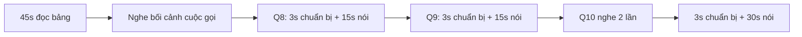
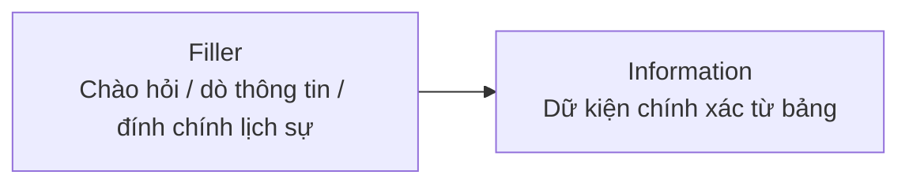
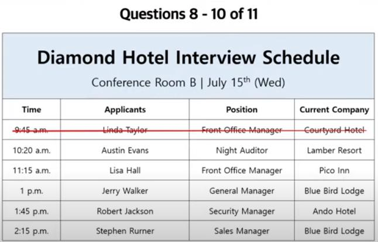
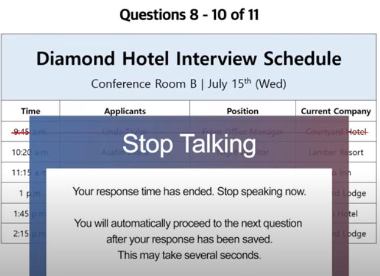
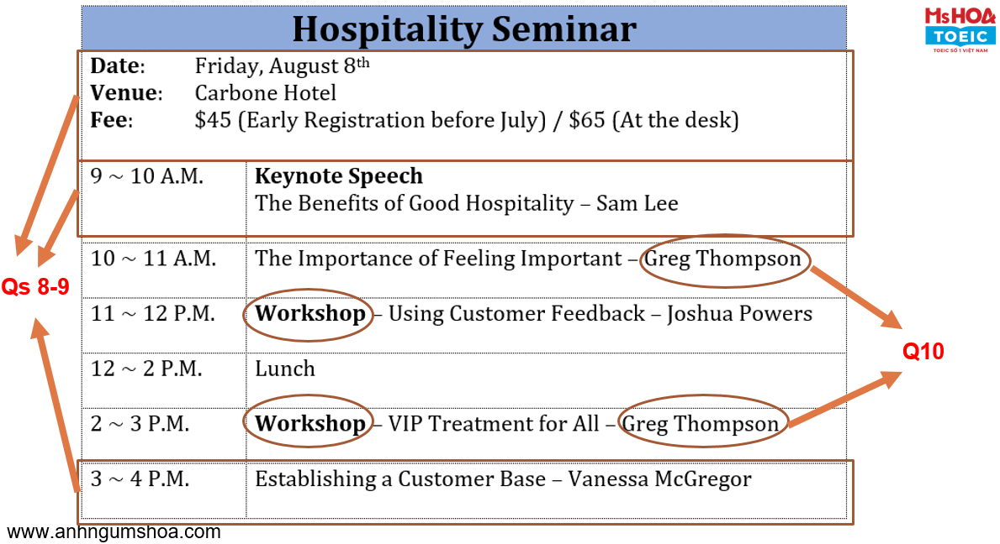
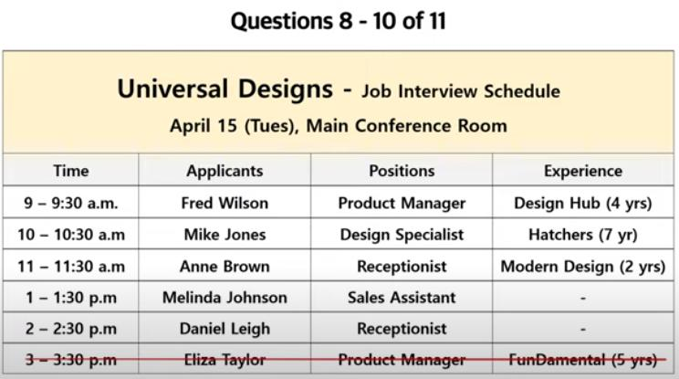
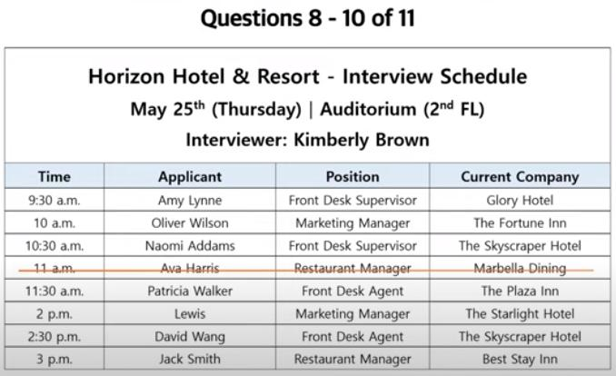

# Unit 8 - Respond to Questions Using Information Provided (1)

Nguồn: PDF trang 90-99.

## Tóm tắt nhanh

Unit 8 hướng dẫn đọc nhanh bảng trong 45 giây, định vị dữ kiện thường bị hỏi, ghi key words và trả lời tự nhiên bằng fillers.

### Công thức F-I

Tài liệu cũng khuyên thay đổi thứ tự trình bày dữ kiện ở Question 10 để tránh lặp cấu trúc.

## Nội dung nguồn chi tiết

---

### Trang PDF 90

*Asset tách từ trang 90: QR video đề mẫu Unit 8.*

*Asset tách từ trang 90: Diamond Hotel Interview Schedule.*

USING INFORMATION PROVIDED (1)
## Mục tiêu bài học
1. Nắm được cách ra đề của bộ câu 8-9-10
2. Luyện nghe hiệu quả các câu hỏi ra trong đề.
3. Đọc hiểu văn bản nhanh chóng trong 45s.
4. Định vị được một số vị trí thường được đặt câu hỏi.
5. Ghi chú key words.
6. Cách trả lời lịch sự - kèm fillers.
## I. Nắm bắt cách ra đề của bộ câu hỏi 8-9-10:
Quét mã QR hoặc truy cập vào link để xem video đề thi:
https://s.imap.edu.vn/suptoespku8v1
- Luôn hiển thị bảng thông tin trên màn hình, xuyên suốt thời gian diễn ra của
phần thi. Thí sinh phải nghe và ghi chú lại câu hỏi để trả lời, câu hỏi không hiển thị trên màn hình như bộ câu hỏi 5-6-7.

---

### Trang PDF 91

*Asset tách từ trang 91: Màn hình Stop Talking trong bài thi.*

- Thí sinh có 45 giây đọc trước bảng thông tin này.
- Sau 45 giây, thí sinh nghe một giọng nói (tưởng tượng như đang trong một
cuộc gọi điện thoại) nói rõ hoàn cảnh và lý do cho các câu hỏi sắp tới: “Hello. My name is Margaret Owen and I have been chosen as one of the interviewers for hiring new employees at our hotel. Unfortunately, I don't know anything about the interview schedule, so I'd like to ask you some questions about it. Could you please help me out?” (Xin chào. Tên tôi là Margaret Owen và tôi đã được chọn làm một trong những người phỏng vấn tuyển dụng nhân viên mới tại khách sạn của chúng ta. Thật không may, tôi không biết gì về lịch phỏng vấn, nên tôi muốn hỏi bạn một số câu hỏi về nó. Bạn có thể giúp tôi không?)
- Ngay sau đó là câu hỏi số 8: “When will the interviews take place? What time
will the first interview start?” (Khi nào diễn ra phỏng vấn? Cuộc phỏng vấn đầu tiên bắt đầu lúc mấy giờ?)
- Hiệu lệnh “Begin preparing now”: đồng hồ đếm ngược 3-2-1 (3 giây chuẩn bị).
Sau đó là “Begin speaking now”: 15 giây đếm ngược cho câu trả lời chính thức (máy thu âm được kích hoạt).
- Khi hết số giây quy định, màn hình hiển thị “Stop talking”: Thời gian trả lời đã
hết. Hãy ngừng nói. Bạn sẽ được tự động chuyển sang câu hỏi tiếp theo sau khi câu trả lời được lưu lại. Việc này có thể mất vài giây.
- Người gọi điện thoại tiếp tục hỏi câu số 9: “I was told that there will be two
interviews for the front office manager position. Could you please check if I've got the right information?” (Tôi được bảo là sẽ có 2 người phỏng vấn vào vị ví quản lý phòng lễ tân. Bạn có thể vui lòng kiểm tra xem thông tin tôi nhận có

---

### Trang PDF 92

đúng không nhé?). Tiếp tục là hiệu lệnh “Begin preparing now” và “Begin speaking now” như trên.
- Câu số 10 được nghe 2 lần: “I think people who used to work at the Blue Bird
Lodge are very competent. Do we have anyone from that hotel this time as well?” (Tôi nghĩ những người đã từng làm ở khách sạn Bluebird Lodge rất có năng lực. Lần này chúng ta có ai đến từ khách sạn đó không?). Sau hiệu lệnh “Now listen again”, thí sinh được nghe lần thứ 2.
- Thí sinh trả lời câu số 10 trong vòng 30 giây.
> **Lưu ý 1: Đề thi được thiết kế mô phỏng một cuộc giao tiếp, mạch nói suôn sẻ giữa 2 người;**
do đó thí sinh không được báo trước “Question 8”, “Question 9” hay “Question 10”. Thí sinh cần thật sự chú ý để biết câu nào – nói trong bao nhiêu giây, từ đó lựa chọn thông tin cần thiết để nói đủ trong thời lượng yêu cầu.
> **Lưu ý 2: Các dạng bảng biểu thường được cho trong bộ câu hỏi 8-9-10 là lịch trình cuộc**
họp, lịch trình phỏng vấn ứng viên, lịch trình sự kiện/lễ hội, lịch hội nghị/hội thảo/buổi định hướng nhân viên, lịch diễn ra lớp học sắp khai giảng, với các thông tin bao gồm giờ, ngày, tháng, địa điểm tổ chức, tên người, tên công ty, tên từng hoạt động cụ thể, giá tiền (vé vào cổng, vé tham dự).
> **Lưu ý 3: Ở phần lớn các đề (nhưng không phải là tất cả), Question 8 thường hỏi về giờ bắt**
đầu của sự kiện đầu tiên/cuối cùng; ngày, tháng, địa điểm tổ chức. Question 9 thường hỏi về một thông tin đặc biệt (bị gạch bỏ, giá tiền được giảm giá, khung thời gian diễn ra bị thay đổi,…). Question 10 chiếm 30 giây, nên thường hỏi về những thông tin “đôi” (thông tin trùng lặp 2 lần, hoặc 2 sự kiện diễn ra so với một mốc thời điểm nào đó – lunch break, Q&A session,…).

---

### Trang PDF 93

*Asset tách từ trang 93: Hospitality Seminar schedule.*

Hãy tận dụng những lưu ý trên để định vị các thông tin quan trọng trong 45 giây chuẩn bị ban đầu, giúp quá trình nghe hỏi-trả lời được suôn sẻ hơn.
## II. Câu trả lời mẫu:

---

### Trang PDF 94

### Question 8:
When will the interviews take place? What time will the first interview start? Oh, hello Ms. Owen. I’d be happy to help you. The interviews will take place on Wednesday, July fifteenth, and the first interview will start at ten-twenty A.M.
### Question 9:
I was told that there will be two interviews for the front office manager position. Could you please check if I've got the right information? Well, I’m afraid you’ve got the wrong information. Initially, there were two applicants for that position, but one of them refused to attend the interview due to her own reasons.
### Question 10:
I think people who used to work at the Blue Bird Lodge are very competent. Do we have anyone from that hotel this time as well? Yeah, fortunately, there are 2 interviewees from Blue Bird Lodge this time. The first one is Jerry Walker. His interview will start at one p.m and he is applying for General Manager. The second one who will be interviewed for Sales Manager position is Stephen Rurner. It will start at a quarter past two p.m.
## III. Gợi ý cách trả lời:
### 1. Fillers (từ đệm)
Đối với bộ câu hỏi 8-9-10, bạn đóng vai như là một người trực điện thoại, đang trả lời câu hỏi cho đối phương dựa theo một lịch trình/bảng biểu. Đặt trong một tình huống giao tiếp như vậy, bạn hãy thể hiện mình là người có khả năng giao tiếp tự nhiên. Do đó, fillers là một phần không thể thiếu trước khi bạn đưa ra thông tin chính, để câu trả lời được tự nhiên nhất có thể. Như bạn có thể thấy ở phần II – Câu trả lời mẫu, một câu trả lời tốt sẽ đủ 2 thành phần: F-I (Filler – Information):
### Question 8:
F: Oh, hello Ms. Owen. I’d be happy to help you.
I: The interviews will take place on Wednesday, July fifteenth, and the first interview will start at ten-twenty A.M.
### Question 9:
F: Well, I’m afraid you’ve got the wrong information.
I: Initially, there were two applicants for that position, but one of them refused to attend the interview due to her own reasons.
### Question 10:
I: The first one is Jerry Walker. His interview will start at one p.m and he is

---

### Trang PDF 95

F: Yeah, fortunately, there are 2 interviewees from Blue Bird Lodge this time. applying for General Manager. The second one who will be interviewed for Sales Manager position is Stephen Rurner. It will start at a quarter past two p.m.
Sau đây là một số Filler tham khảo theo ngữ cảnh sử dụng: a. Khi đối phương là khách hàng/người lạ, và bạn cần chào hỏi trước khi cung cấp thông tin (câu 8): Welcome to our event/workshop, let me check the schedule for you. Chào mừng bạn đến với sự kiện/hội thảo của chúng tôi, để tôi kiểm tra lịch trình cho bạn nhé. Oh, hello Mr/Ms/Mrs…. I’d be happy to help you. Xin chào ông/bà… Tôi rất vui khi giúp đỡ bạn. (giúp bạn trả lời câu hỏi/giải đáp thắc mắc) Good morning/Good afternoon. According to the schedule/ agenda/ itinerary, ….. Chào buổi sáng/Chào buổi chiều. Theo như lịch trình, …..
### b. Khi bạn cần thời gian để dò tìm thông tin
Wait a minute, let me have a look. Đợi tôi một lát nhé, tôi cần xem qua. Sure, let me check that for you. Chắc chắn rồi, để tôi kiểm tra thông tin cho bạn. Just a moment, please. Vui lòng đợi một lát. Well… À… I see. I’ve got the schedule/ agenda/ itinerary right here. Tôi hiểu. Tôi có lịch trình ngay đây rồi. I’m not sure about that. Let me check a few seconds. Tôi không chắc lắm. Đợi tôi kiểm tra trong giây lát nhé.
c. Khi bạn muốn diễn đạt “No” một cách lịch sự (đính chính thông tin của đối phương): It looks like you have the wrong information. Có vẻ như bạn nhận sai thông tin rồi. I’m afraid it’s not correct. Tôi e là thông tin này không đúng đâu. Unfortunately,… Thật không may, … Oh, I’m sorry, but… Ồ, thật tiếc quá, nhưng… Actually, it’s not true. Thật ra thì, nó không đúng đâu.

---

### Trang PDF 96

*Asset tách từ trang 96: QR bài tập Unit 8 - đề 1.*

### 2. Thay đổi cấu trúc câu trả lời ở Question 10
Hãy đọc lại câu trả lời mẫu ở Question 10: “The first one is Jerry Walker. His interview will start at one p.m and he is applying for General Manager. The second one who will be interviewed for Sales Manager position is Stephen Rurner. It will start at a quarter past two p.m.”
> Sẽ rất nhàm chán nếu bạn cung cấp dữ kiện theo một cấu trúc y hệt như nhau:
“The first one is Jerry Walker. His interview will start at one p.m. His position is General Manager. The second one is Stephen Rurner. His interview will start at two fifteen p.m. His position is Sales Manager.” û
> Bạn hãy đổi thứ tự dữ kiện được cung cấp để người 2 khác với người 1: Câu đầu theo
thứ tự tên-giờ-vị trí, thì câu sau đổi lại thành vị trí-tên-giờ. Sử dụng từ vựng trong Interview như “apply for [position]” – nộp đơn vào vị trí nào, hay sử dụng mệnh đề quan hệ “who will be interviewed for [position]” – người (mà) được phỏng vấn vào vị trí nào. Ngoài ra, thay đổi cách nói giờ (thay vì two-fifteen, có thể nói a quarter past two) cũng làm cho câu trả lời nhiều màu sắc hơn, được đánh giá cao hơn về độ linh hoạt ngôn ngữ. ü
## IV. Bài tập áp dụng:
Đề (1): Quét mã QR hoặc truy cập vào link để xem video đề thi:
https://s.imap.edu.vn/suptoespku8v2

---

### Trang PDF 97

*Asset tách từ trang 97: Universal Designs Job Interview Schedule.*

### Question 8:
**Answer:** ______________________________
### Question 9:
**Answer:** ______________________________
### Question 10:
**Answer:** ______________________________

---

### Trang PDF 98

*Asset tách từ trang 98: QR bài tập Unit 8 - đề 2.*

*Asset tách từ trang 98: Horizon Hotel & Resort Interview Schedule.*

Đề (2): Quét mã QR hoặc truy cập vào link để xem video đề thi:
https://s.imap.edu.vn/suptoespku8v3
### Question 8:
**Answer:** ______________________________
### Question 9:
**Answer:** ______________________________
### Question 10:
**Answer:** ______________________________

---

### Trang PDF 99

## Vocabulary list
English
Vietnamese
Hold-held-held
(v) cầm nắm/ tổ chức
Inform s.o that S + V
(v) thông báo với ai rằng…
Offer s.o a position
(v) mời ai đó nhận việc
Have … years of experience
(v) có (bao nhiêu) năm kinh nghiệm
Last
(v) kéo dài (bao lâu)
Apply for + position
(v) ứng tuyển vào vị trí nào
Take place/happen/occur
(v) xảy ra, diễn ra
Refuse to V
(v) từ chối làm gì
Competent
(adj) có năng lực/thành thạo
Initially
(adv) ban đầu, lúc đầu
