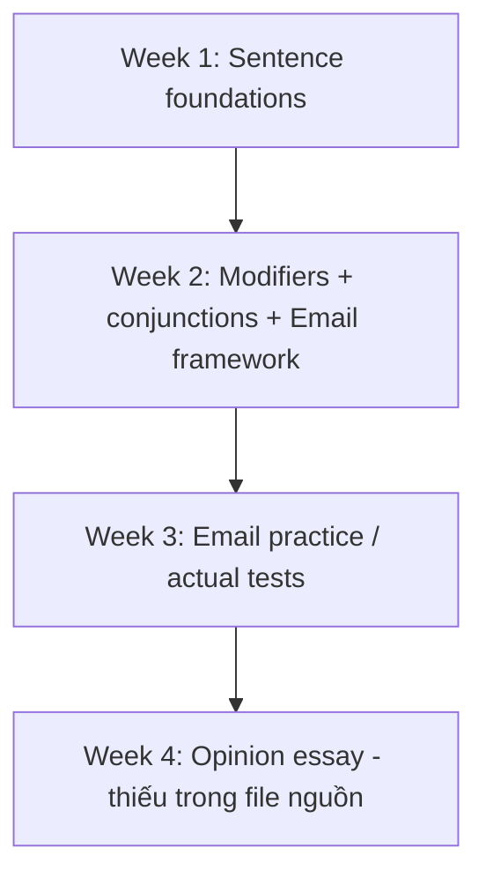

# Lộ trình học 4 tuần

Tài liệu gốc chia kiến thức thành các buổi ngắn theo ngày. Bộ Markdown giữ lại logic đó và đánh dấu phần nào thực sự có trong file tải lên.

| Tuần | Ngày | Nội dung |
|---|---:|---|
| 1 | 1 | Tổng quan TOEIC Writing |
| 1 | 2 | Part 1: Directions + cách ra đề |
| 1 | 3 | Unit 1: Nouns & Pronouns - phần đầu |
| 1 | 4 | Unit 1: Relative clauses + ISS |
| 1 | 5 | Unit 2: Verbs - loại động từ |
| 1 | 6 | Unit 2: chia động từ, thì, chủ động/bị động |
| 2 | 1 | Unit 3: Adjectives & Adverbs - vị trí/chức năng |
| 2 | 2 | Unit 3: so sánh + luyện tập |
| 2 | 3 | Unit 4: Coordinating conjunctions |
| 2 | 4 | Unit 4: Subordinating conjunctions |
| 2 | 5 | Part 2: Directions + cách ra đề + LLT |
| 2 | 6 | Unit 5: Email - dạng cung cấp thông tin/yêu cầu/đề nghị |
| 3 | 1 | Unit 5: luyện mẫu câu mở-kết email + bài tập |
| 3 | 2 | Unit 6: Email “How to” - hướng dẫn quy trình |
| 3 | 3 | Unit 6: chỉ đường + ngôn ngữ tránh lỗi |
| 3 | 4 | Unit 7: Actual test 05 |
| 3 | 5 | Unit 7: Actual test 06 + causative passive |
| 3 | 6 | Unit 7: bài tập tổng hợp |
| 4 | 1-6 | Mục lục gốc dự kiến Part 3 / Unit 8-10, nhưng **không có nội dung trong PDF tải lên** |

---

## Nội dung nguồn theo trang
> Phần dưới giữ sát nội dung của PDF để tiện đối chiếu. Bố cục bảng có thể được tuyến tính hóa do trích xuất từ PDF.

<strong>Trang PDF 9</strong>

HƯỚNG DẪN HỌC VIÊN CÁCH SỬ DỤNG SÁCH
SAO CHO ĐẠT HIỆU QUẢ TỐI ĐA
Do khối lượng kiến thức lớn, nhiều bạn học viên cảm thấy có phần đuối sức khi tự học ở nhà. Hiểu
được tâm lý đó, cuốn sách tự học mà Anh ngữ Ms Hoa dành tặng cho quý học viên sẽ được chia thành
nhiều nội dung nhỏ theo từng ngày ôn tập. Sau khi ôn tập hết theo lộ trình, các bạn học viên có thể
yên tâm rằng mình đã được trang bị đầy đủ kiến thức cũng như kĩ năng đã được rèn luyện theo từng
dạng bài.
Kiên trì mỗi ngày như vậy, chắc chắn điểm số mơ ước nằm trong tầm tay!

Day 1
Day 2
Day 3
Day 4
Day 5
Day 6
Week 1
Giới thiệu
tổng quan
bài thi
TOEIC
WRITING
Part 1
Directions
+ nắm bắt
cách thức
ra đề thi
Part 1
Unit 1
ST-noun &
pronouns (I +
II + III)
Unit 1
ST-noun &
pronouns (IV
+ V + VI)
Unit 2
ST-verbs
(I + II)
Unit 2
ST-verbs
(III + IV)
Week 2
Unit 3
ST-
adjectives
& adverbs
(I + II + III)
Unit 3
ST-
adjectives
& adverbs
(IV + V)
Unit 4
ST-
conjunctions
(I)
Unit 4
ST-
conjunctions
(II + III)
Part 2
Directions
+ nắm bắt
cách thức
ra đề thi
Part 2
Unit 5
Email -
một số
dạng câu
hỏi phổ
biến (1)
(I)
Week 3
Unit 5
Email –
một số
dạng câu
hỏi phổ
biến (1)
(II + III)
Unit 6
Email -
một số
dạng câu
hỏi phổ
biến (2)
(I)
Unit 6
Email –
một số dạng
câu hỏi phổ
biến (2)
(II + III)
Unit 7
Email -luyện
tập với các
đề thi thật
(I)
Unit 7
Email -
luyện tập
với các đề
thi thật
(II + III)
Part 3
Directions
+ nắm bắt
cách thức
ra đề thi
Part 3

<strong>Trang PDF 10</strong>

Week 4
Unit 8
Essay –
trình bày
hoàn toàn
1 mặt vấn
đề/ý kiến
(I. Đề 1)
Unit 8
Essay –
trình bày
hoàn toàn
1 mặt vấn
đề/ý kiến
(I. Đề 2 +
II)
Unit 9
Essay –
trình bày cả
2 mặt vấn
đề/ý kiến
(I. Đề 1)
Unit 9
Essay –
trình bày cả
2 mặt vấn
đề/ý kiến
(I. Đề 2 + II)
Unit 10
luyện tập
với các đề
thi thật
(Đề 1 + 2)
Unit 10
luyện tập
với các đề
thi thật
(Đề 3 + 4)

