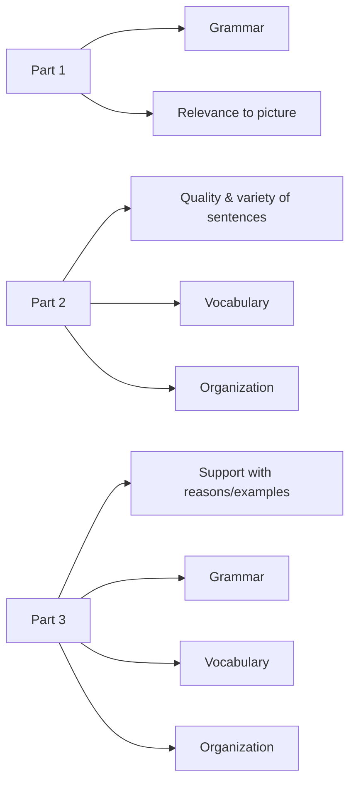

# Tổng quan bài thi TOEIC Writing

Theo tài liệu, TOEIC Writing là bài thi trên máy tính, kéo dài khoảng **60 phút**, gồm **3 phần / 8 câu**.

| Phần | Câu | Nhiệm vụ | Thời gian | Thang điểm |
|---|---:|---|---:|---:|
| Part 1 | 1-5 | Write a sentence based on a picture | 8 phút cho 5 câu | 0-3/câu |
| Part 2 | 6-7 | Respond to a written request (email) | 10 phút/email, tổng 20 phút | 0-4/email |
| Part 3 | 8 | Write an opinion essay | 30 phút | 0-5 |

## Trọng tâm chấm điểm

## Quản lý thời gian theo tài liệu

- **Part 1:** có thể Next/Back giữa 5 câu trong 8 phút; hết thời gian thì không quay lại.
- **Part 2:** mỗi email 10 phút; hết Câu 6 tự chuyển Câu 7 và không quay lại.
- **Part 3:** 30 phút gồm đọc đề, lên ý, viết; hết giờ hệ thống tự lưu.
- Điểm thô tối đa theo tài liệu là **28**, sau đó quy đổi về thang **200**; cách quy đổi cụ thể không được công bố trong tài liệu.

## Mục tiêu học

- Part 1: xây câu đúng ngữ pháp, dùng đủ 2 từ/cụm từ, bám sát tranh.
- Part 2: trả lời đủ mọi task, có bố cục, giọng điệu phù hợp và liên kết ý rõ.
- Part 3: phát triển quan điểm bằng lý do/ví dụ và tổ chức bài mạch lạc.

---

## Nội dung nguồn theo trang
> Phần dưới giữ sát nội dung của PDF để tiện đối chiếu. Bố cục bảng có thể được tuyến tính hóa do trích xuất từ PDF.

<strong>Trang PDF 12</strong>

GIỚI THIỆU TỔNG QUAN BÀI THI TOEIC WRITING
TOEIC Writing được thiết kế để đánh giá kỹ năng viết tiếng Anh của những thí sinh không phải
là người bản xứ ở môi trường làm việc. Bài thi đánh giá khả năng viết bằng tiếng Anh của thí
sinh để đáp ứng các nhiệm vụ khác nhau thường gặp trong môi trường kinh doanh hoặc một
số ngành nghề khác trong xã hội.
Đây là một bài thi dạng computer-delivered testing: Thí sinh đánh máy câu trả lời của mình
ngay trên máy tính tại địa điểm tổ chức thi, sau đó bài thi này sẽ được lưu tự động và gửi sang
các giám khảo của Viện Khảo thí Giáo dục Hoa Kỳ (Educational Testing Service – ETS) chấm
điểm. Bài thi kéo dài khoảng 60 phút, gồm 3 phần – 8 câu hỏi, cụ thể như sau:
Câu
hỏi
Nhiệm vụ
Tiêu chí chấm điểm
Thời gian làm bài
Thang
điểm
1-5
Write a
sentence based
on a picture
(Viết một câu
mô tả tranh)
- Grammar (Ngữ pháp)
- Relevance of the sentences to
the pictures
(Độ liên quan của câu viết so với
bức tranh)
8 phút
0-3

6-7
Respond to a
written request
(Trả lời một yêu
cầu dạng viết)
- Quality and variety of your
sentences
(chất lượng và đa dạng câu
viết)
- Vocabulary (từ vựng)
- Organization (cách sắp xếp)
20 phút
0-4

8
Write an
opinion essay
(Viết một bài
luận nêu ý kiến)
- Whether your opinion is
supported with reasons and/or
examples (liệu ý kiến của bạn có
được hỗ trợ bởi các lý do
và/hoặc ví dụ không)
- Grammar (ngữ pháp)
- Vocabulary (từ vựng)
- Organization (cách sắp xếp)
30 phút
0-5

<strong>Trang PDF 13</strong>

* Phỏng theo: TOEIC® Examinee Handbook – Speaking & Writing Tests
* Các lưu ý kèm theo:
- Phần 1 - Write a sentence based on a picture (Questions 1-5): cho phép bấm Next hoặc Back để
hoàn thành 5 câu trong 8 phút một cách linh hoạt, không giới hạn thời gian từng câu; hết 8 phút, màn
hình tự động chuyển sang Phần 2 - Respond to a written request và không thể quay lại để chỉnh sửa
cho Phần 1.
- Phần 2 - Respond to a written request (Questions 6-7): mỗi câu 10 phút, bao gồm cả thời gian đọc
đề và viết câu trả lời; hết 10 phút của Câu 6, màn hình tự động chuyển sang Câu 7, không thể quay lại
để chỉnh sửa cho Câu 6. Tương tự như vậy với Câu 7.
- Phần 3 - Write an opinion essay (Question 8): 30 phút, bao gồm cả thời gian đọc đề, lên ý tưởng và
viết câu trả lời. Sau khi hết 30 phút, máy tính sẽ tự động lưu câu trả lời của bạn. Bạn được phép xem
qua tổng thể bài làm từ Câu 1 đến Câu 8 (không hiển thị đầy đủ toàn bộ bài thi, chỉ một số dòng nhất
định). Lúc này, bạn không thể quay lại để chỉnh sửa bất kỳ câu nào trong bài thi.
* Diễn giải thang điểm:
Câu
hỏi
Điểm
Mô tả câu trả lời
1-5
3
Câu trả lời bao gồm MỘT câu:
- không có lỗi ngữ pháp,
- chứa các dạng của cả hai từ khóa được sử dụng phù hợp, VÀ
- phù hợp với hình ảnh.
2
Câu trả lời bao gồm một hoặc nhiều câu:
- có một hoặc nhiều lỗi ngữ pháp nhưng không làm lu mờ ý nghĩa,
- chứa CẢ HAI từ khóa, (nhưng chúng có thể không nằm trong cùng một câu, và dạng
của (các) từ có thể không chính xác), VÀ
- phù hợp với hình ảnh.
1
Câu trả lời:
- có lỗi ảnh hưởng đến ý nghĩa,
- bỏ qua một hoặc cả hai từ khóa, HOẶC
- không phù hợp với hình ảnh.

<strong>Trang PDF 14</strong>

Để trống câu trả lời, viết bằng tiếng nước ngoài, hoặc bao gồm các ký tự gõ phím
không có ý nghĩa.
6-7
4
Câu trả lời giải quyết một cách hiệu quả tất cả các nhiệm vụ trong đề bằng cách sử
dụng nhiều câu truyền tải rõ ràng thông tin, hướng dẫn, câu hỏi, v.v. theo yêu cầu
của đề.
- Người viết sử dụng lập luận có tổ chức, hoặc các từ nối thích hợp, hoặc cả hai để
tạo sự mạch lạc giữa các câu.
- Giọng điệu và phạm vi từ vựng của câu trả lời phù hợp với đối tượng người đọc
đang hướng đến.
- Có thể có một vài lỗi riêng lẻ về ngữ pháp hoặc cách sử dụng, nhưng chúng không
làm lu mờ ý nghĩa của người viết.
3
Câu trả lời hầu hết thành công, nhưng không giải quyết được một trong các nhiệm
vụ mà đề yêu cầu:
- Người viết bỏ sót, trả lời không thành công hoặc trả lời không đầy đủ MỘT trong
các nhiệm vụ được yêu cầu.
- Người viết sử dụng lập luận có tổ chức hoặc các từ nối thích hợp trong ít nhất một
phần của câu trả lời.
- Người viết thể hiện sự nhận thức nhất định về người đọc (biết người nhận mail là
ai)
- Có thể có những lỗi đáng chú ý về ngữ pháp và cách sử dụng; MỘT câu có thể có
những lỗi làm tối nghĩa.
2
Câu trả lời làm bật lên một số điểm yếu:
- Người viết chỉ giải quyết MỘT trong các nhiệm vụ được yêu cầu, hoặc giải quyết
không thành công, hoặc không đầy đủ HAI HOẶC BA nhiệm vụ được yêu cầu.
- Mối liên hệ giữa các ý tưởng có thể bị thiếu hoặc mơ hồ.
- Người viết thể hiện ít nhận thức về người đọc. (ngôn từ không phù hợp đối với
người nhận mail)
- Các lỗi về ngữ pháp và cách sử dụng có thể làm tối nghĩa của HƠN MỘT câu.
1
Câu trả lời có sai sót nghiêm trọng và truyền tải ít thông tin, hoặc không có thông tin,
hướng dẫn, câu hỏi, v.v. theo yêu cầu của đề:
- Người viết KHÔNG giải quyết được nhiệm vụ nào được yêu cầu, mặc dù câu trả lời
có thể bao gồm một số nội dung liên quan đến đề.

<strong>Trang PDF 15</strong>

- Sự kết nối giữa các ý tưởng bị thiếu hoặc mơ hồ.
- Giọng điệu hoặc phạm vi từ vựng có thể không phù hợp với người đọc. (người nhận
mail)
- Người viết thường xuyên mắc lỗi ngữ pháp và cách sử dụng, khiến người đọc khó
hiểu.
0
Câu trả lời chỉ sao chép các từ ngữ từ đề, hoặc không liên quan đến đề, hoặc được
viết bằng ngôn ngữ không phải tiếng Anh, hoặc bao gồm các ký tự gõ phím không có
ý nghĩa, hoặc để trống.
8
5
Câu trả lời ở mức 5 đáp ứng phần lớn các yếu tố sau:
- Giải quyết chủ đề và nhiệm vụ một cách hiệu quả.
- Được tổ chức và phát triển tốt, sử dụng các giải thích, ví dụ và/hoặc chi tiết phù
hợp rõ ràng.
- Thể hiện sự thống nhất, chuỗi phát triển ý và mạch lạc.
- Thể hiện sự nhất quán trong việc sử dụng ngôn ngữ, thể hiện sự đa dạng về cú pháp,
lựa chọn từ ngữ thích hợp và lối diễn đạt tự nhiên, mặc dù có thể mắc một số lỗi từ
vựng hoặc ngữ pháp nhỏ.
4
Câu trả lời ở mức 4 phần lớn sẽ đạt được tất cả những điều sau:
- Giải quyết tốt chủ đề và nhiệm vụ, mặc dù một số điểm có thể chưa được trình bày
đầy đủ.
- Nhìn chung, câu trả lời được tổ chức và phát triển tốt, sử dụng các giải thích, ví dụ
và/hoặc chi tiết phù hợp và đầy đủ.
- Thể hiện sự thống nhất, chuỗi phát triển ý và mạch lạc, mặc dù đôi khi nó có thể
chứa một số ý dư thừa, lạc đề hoặc các kết nối không rõ ràng.
- Thể hiện khả năng sử dụng ngôn ngữ, thể hiện sự đa dạng về cú pháp và phạm vi từ
vựng, mặc dù đôi khi có thể có những lỗi nhỏ đáng chú ý về cấu trúc, dạng từ hoặc lối
diễn đạt tự nhiên, nhưng không ảnh hưởng đến ý nghĩa.
3
Câu trả lời ở mức 3 đạt được một hoặc nhiều điều sau:
- Giải quyết chủ đề và nhiệm vụ bằng cách sử dụng các giải thích, ví dụ và/hoặc chi
tiết được phát triển phần nào.
- Thể hiện sự thống nhất, chuỗi phát triển ý và mạch lạc, mặc dù sự liên kết giữa các
ý tưởng đôi khi bị mờ nhạt.

<strong>Trang PDF 16</strong>

- Có thể chứng tỏ khả năng không nhất quán trong việc hình thành câu và lựa chọn
từ, dẫn đến sự thiếu rõ ràng và đôi khi khó hiểu.
- Có thể thể hiện ý tưởng chính xác, nhưng phạm vi cấu trúc cú pháp và từ vựng bị hạn
chế.

2
Câu trả lời ở mức 2 có thể bộc lộ một hoặc nhiều điểm yếu sau:
- Phát triển ý cho chủ đề và nhiệm vụ bị hạn chế.
- Tổ chức hoặc kết nối các ý tưởng không đầy đủ.
- Ví dụ, giải thích hoặc chi tiết không phù hợp hoặc không đầy đủ để hỗ trợ hoặc
minh họa cho ý tưởng.
- Nhiều lần lựa chọn từ ngữ hoặc hình thức từ ngữ không phù hợp.
- Tích lũy nhiều lỗi về cấu trúc và/hoặc cách sử dụng câu.
1
Câu trả lời ở mức 1 có sai sót nghiêm trọng do một hoặc nhiều điểm yếu sau:
- Các ý tưởng lộn xộn, không có tổ chức, hoặc việc phát triển ý kém.
- Ít hoặc không có chi tiết, những chi tiết không liên quan, hoặc khả năng đáp ứng
nhiệm vụ còn rất mơ hồ.
- Lỗi nghiêm trọng và thường xuyên xảy ra trong cấu trúc câu hoặc cách sử dụng.
0
Câu trả lời chỉ sao chép các từ ngữ từ đề, hoặc không liên quan đến đề, hoặc được viết
bằng ngôn ngữ không phải tiếng Anh, hoặc bao gồm các ký tự gõ phím không có ý
nghĩa, hoặc để trống.
* Phỏng theo: TOEIC® Examinee Handbook – Speaking & Writing Tests
Như vậy, điểm “thô” tối đa mà thí sinh đạt được là 28 điểm, từ đó điểm được quy đổi sang
thang điểm 200. Tuy nhiên, cách thức quy đổi và làm tròn từ điểm thô sang thang điểm chính
thức không được ETS công bố. Bảng điểm nhận được thể hiện điểm thành phần mỗi kỹ năng
Speaking & Writing (điểm tròn chục – không có điểm lẻ 5 như TOEIC Listening & Reading),
tương đương với 9 mức độ thành thạo (proficiency level):
Level
9
200
Thông thường, thí sinh ở level 9 có thể trao đổi thông tin đơn giản một cách hiệu
quả và sử dụng lý do, ví dụ hoặc giải thích để hỗ trợ ý kiến.
Khi sử dụng lý do, ví dụ hoặc giải thích để hỗ trợ ý kiến, bài viết của họ được tổ
chức tốt và phát triển tốt. Việc sử dụng tiếng Anh một cách tự nhiên, đa dạng

<strong>Trang PDF 17</strong>

cấu trúc câu và cách lựa chọn từ thích hợp, đồng thời chính xác về mặt ngữ
pháp.
Khi đưa ra thông tin đơn giản, đặt câu hỏi, đưa ra hướng dẫn hoặc đưa ra yêu
cầu, bài viết của họ rõ ràng, mạch lạc và hiệu quả.
Level
8
170-
190
Thông thường, thí sinh ở level 8 có thể trao đổi thông tin đơn giản một cách hiệu
quả và sử dụng lý do, ví dụ hoặc giải thích để hỗ trợ ý kiến.
Khi đưa ra thông tin đơn giản, đặt câu hỏi, đưa ra hướng dẫn hoặc đưa ra yêu
cầu, bài viết của họ rõ ràng, mạch lạc và hiệu quả.
Khi sử dụng lý do, ví dụ hoặc giải thích để hỗ trợ ý kiến, bài viết của họ nói chung
là tốt. Nhìn chung được tổ chức tốt và sử dụng nhiều cấu trúc câu và từ vựng
thích hợp. Nó cũng có thể bao gồm một trong những điểm yếu sau:
- thỉnh thoảng lặp lại các ý tưởng không cần thiết, hoặc sự kết nối giữa các ý
tưởng không rõ ràng;
- có những lỗi ngữ pháp nhỏ có thể thấy được, hoặc sự lựa chọn từ ngữ không
chính xác.
Level
7
140-
160
Thông thường, thí sinh ở level 7 có thể cung cấp thông tin, đặt câu hỏi, đưa ra
hướng dẫn hoặc yêu cầu một cách hiệu quả, nhưng chỉ được thực hiện một phần
thành công khi sử dụng lý do, ví dụ hoặc giải thích để ủng hộ một ý kiến.
Khi cố gắng giải thích một ý kiến, bài viết của họ trình bày những ý tưởng liên
quan và có một số ý hỗ trợ. Điểm yếu ở cấp độ này bao gồm:
- không có đủ ý hỗ trợ và phát triển cụ thể cho ý chính
- kết nối không rõ ràng giữa các ý
- lỗi ngữ pháp hoặc lựa chọn từ vựng không chính xác
Khi đưa ra thông tin đơn giản, đặt câu hỏi, đưa ra hướng dẫn hoặc đưa ra yêu
cầu, bài viết của họ rõ ràng, mạch lạc và hiệu quả.
Level
6
110-
130
Thông thường, thí sinh ở level 6 thành công một phần khi cung cấp thông tin
đơn giản hoặc hỗ trợ một ý kiến với lý do, ví dụ hoặc giải thích.
Khi đưa ra thông tin đơn giản, đặt câu hỏi, đưa ra hướng dẫn hoặc đưa ra yêu
cầu, bài viết bỏ qua thông tin quan trọng hoặc có phần khó hiểu.
Khi cố gắng giải thích một ý kiến, bài viết của họ trình bày những ý tưởng liên
quan và có một số ý hỗ trợ. Điểm yếu ở cấp độ này bao gồm:
- không cung cấp đủ ý hỗ trợ và phát triển cụ thể cho các ý chính

<strong>Trang PDF 18</strong>

- kết nối không rõ ràng giữa các ý
- lỗi ngữ pháp hoặc lựa chọn từ vựng không chính xác
Level
5
90-
100
Thông thường, thí sinh ở level 5 ít nhất đã thành công một phần khi đưa ra
thông tin. Tuy nhiên, khi hỗ trợ một ý kiến bằng lý do, ví dụ hoặc giải thích, hầu
hết đều không thành công.
Khi đưa ra thông tin đơn giản, đặt câu hỏi, đưa ra hướng dẫn hoặc đưa ra yêu
cầu, bài viết bỏ qua thông tin quan trọng hoặc có phần khó hiểu.
Khi cố gắng giải thích một ý kiến, nhiều điểm yếu gây cản trở giao tiếp xảy ra,
chẳng hạn như:
- không cung cấp đủ ví dụ, giải thích hoặc chi tiết để ủng hộ ý kiến, hoặc chúng
không phù hợp
- tổ chức hoặc kết nối các ý tưởng không đầy đủ
- hạn chế phát triển ý tưởng
- lỗi ngữ pháp nghiêm trọng hoặc lựa chọn từ vựng không chính xác
Level
4
70-80
Thông thường, thí sinh ở level 4 có một số khả năng phát triển ý để bày tỏ một ý
kiến và đưa ra thông tin. Tuy nhiên, việc trình bày còn hạn chế.
Khi cố gắng giải thích một ý kiến, nhiều điểm yếu gây cản trở giao tiếp xảy ra,
chẳng hạn như:
- không cung cấp đủ ví dụ, giải thích hoặc chi tiết để ủng hộ ý kiến, hoặc chúng
không phù hợp
- tổ chức hoặc kết nối các ý tưởng không đầy đủ
- hạn chế phát triển ý tưởng
- lỗi ngữ pháp nghiêm trọng hoặc lựa chọn từ vựng không chính xác
Khi đưa ra thông tin đơn giản, đặt câu hỏi, đưa ra hướng dẫn hoặc đưa ra yêu
cầu, các câu trả lời không hoàn thành tốt nhiệm vụ vì:
- thiếu thông tin
- các kết nối bị thiếu hoặc mơ hồ giữa các câu, và/hoặc
- có nhiều lỗi ngữ pháp hoặc chọn từ không chính xác
Ở level 4 này, thí sinh có một số khả năng đưa ra câu đúng ngữ pháp, nhưng lại
không liên tục.
Level
3
50-60
Thông thường, thí sinh ở level 3 có khả năng diễn đạt hạn chế khi đưa ra ý kiến
và thông tin.

<strong>Trang PDF 19</strong>

Khi cố gắng giải thích một quan điểm, các câu trả lời cho thấy một trong những
sai sót nghiêm trọng sau:
- các ý tưởng lộn xộn, không có tổ chức, hoặc việc phát triển ý kém.
- ít hoặc không có chi tiết, hoặc chi tiết không liên quan
- lỗi ngữ pháp nghiêm trọng và thường xuyên, hoặc lựa chọn từ không chính xác
Khi đưa ra thông tin đơn giản, đặt câu hỏi, đưa ra hướng dẫn hoặc đưa ra yêu
cầu, các câu trả lời không hoàn thành tốt nhiệm vụ vì:
- thiếu thông tin
- các kết nối bị thiếu hoặc mơ hồ giữa các câu, và/hoặc
- có nhiều lỗi ngữ pháp hoặc chọn từ không chính xác
Ở level 4 này, thí sinh có một số khả năng đưa ra câu đúng ngữ pháp, nhưng lại
không liên tục.
Level
2
40
Thông thường, thí sinh ở level 2 chỉ có khả năng rất hạn chế để bày tỏ ý kiến và
đưa ra thông tin rõ ràng.
Khi cố gắng giải thích một quan điểm, các câu trả lời cho thấy một trong những
sai sót nghiêm trọng sau:
- các ý tưởng lộn xộn, không có tổ chức, hoặc việc phát triển ý kém.
- ít hoặc không có chi tiết, hoặc chi tiết không liên quan
- lỗi ngữ pháp nghiêm trọng và thường xuyên, hoặc lựa chọn từ không chính xác
Ở level 2 này, thí sinh không thể đưa ra thông tin một cách thẳng thắn. Những
điểm yếu điển hình ở cấp độ này bao gồm:
- không bao gồm bất kỳ thông tin quan trọng nào
- sự kết nối bị thiếu hoặc mơ hồ giữa các ý tưởng
- thường xuyên mắc lỗi ngữ pháp hoặc chọn từ không chính xác
Ở level 2 này, thí sinh không thể viết đúng ngữ pháp cho câu.
Level
1
0-30
Thí sinh level 1 không trả lời một phần hoặc nhiều phần của bài thi TOEIC
Writing.
Thí sinh ở level này có thể cần phải cải thiện khả năng đọc của họ để hiểu các
hướng dẫn và nội dung câu hỏi đề thi.
* Phỏng theo: TOEIC® Examinee Handbook – Speaking & Writing Tests

