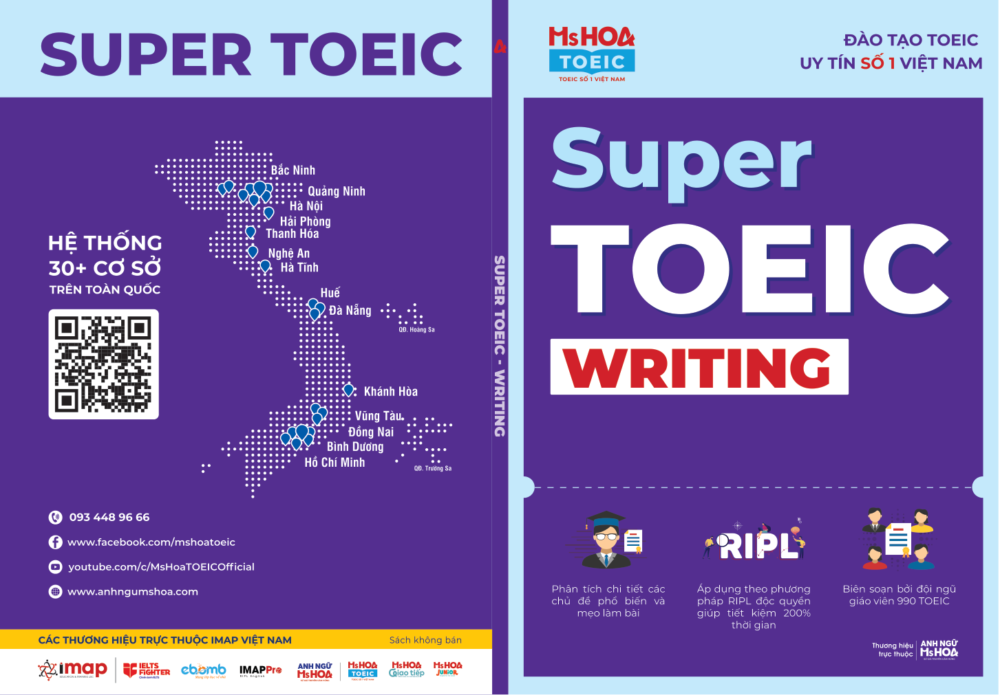

# Super TOEIC Writing - Markdown Course Pack



Bộ này chuyển **MINI EBOOK SUPER TOEIC WRITING** thành các bài học Markdown có cấu trúc, kèm sơ đồ Mermaid và ảnh tách riêng trong `assets/`.

> **Phạm vi nguồn thực tế:** PDF tải lên có **100 trang vật lý**. Mục lục liệt kê Part 3 và Unit 8-10, nhưng nội dung file thực tế kết thúc ở **Unit 7 - Email** (trang vật lý 100 / số trang in 92). Vì vậy bộ này không tự bổ sung Unit 8-10 từ nguồn ngoài.

## Cấu trúc

```text
super-toeic-writing-md/
├── README.md
├── 00-lo-trinh-hoc.md
├── 01-tong-quan-bai-thi.md
├── part-1-write-a-sentence/
│   ├── 00-part-1-overview.md
│   ├── 01-unit-01-nouns-pronouns.md
│   ├── 02-unit-02-verbs.md
│   ├── 03-unit-03-adjectives-adverbs.md
│   └── 04-unit-04-conjunctions.md
├── part-2-email/
│   ├── 00-part-2-overview.md
│   ├── 05-unit-05-email-common-types-1.md
│   ├── 06-unit-06-email-common-types-2.md
│   └── 07-unit-07-email-actual-tests.md
├── part-3-opinion-essay/
│   └── README.md
└── assets/
    ├── cover.png
    ├── contact-sheet.png
    ├── README.md
    └── pageXXX_imgYYY.png
```

## Sơ đồ khóa học trong phần nội dung hiện có

```mermaid
flowchart LR
    A[Tổng quan TOEIC Writing] --> B[Part 1: Write a Sentence Based on a Picture]
    B --> U1[Unit 1: Nouns & Pronouns]
    U1 --> U2[Unit 2: Verbs]
    U2 --> U3[Unit 3: Adjectives & Adverbs]
    U3 --> U4[Unit 4: Conjunctions]
    U4 --> C[Part 2: Respond to a Written Request]
    C --> U5[Unit 5: Email - Common Types 1]
    U5 --> U6[Unit 6: Email - Common Types 2]
    U6 --> U7[Unit 7: Actual Tests]
    U7 -. nội dung không có trong file .-> D[Part 3: Opinion Essay / Unit 8-10]
```



## Cách học

1. Đọc `00-lo-trinh-hoc.md` để theo lộ trình 4 tuần của sách.
2. Đọc `01-tong-quan-bai-thi.md` để nắm cấu trúc, thời gian và tiêu chí chấm.
3. Học Part 1 theo chiến lược **ISS** rồi Part 2 theo chiến lược **LLT**.
4. Mỗi Unit có phần tóm tắt học nhanh, sơ đồ, ảnh/đề mẫu và phần nội dung nguồn theo trang để đối chiếu.
5. Dùng `assets/contact-sheet.png` để duyệt nhanh toàn bộ hình/đề mẫu đã tách.
