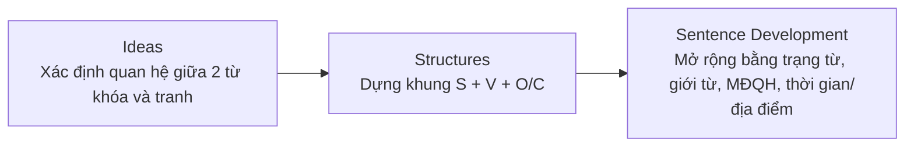
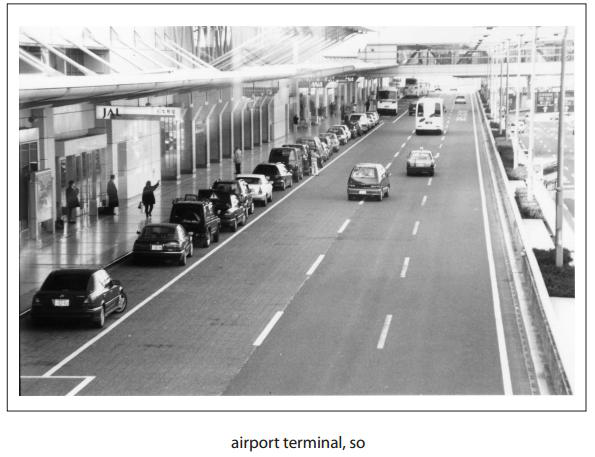

# Part 1 - Write a Sentence Based on a Picture

## Yêu cầu

- 5 tranh trong 8 phút.
- Mỗi tranh có **2 từ/cụm từ bắt buộc**.
- Có thể đổi dạng từ và đảo thứ tự hai từ.
- Câu trả lời phải nằm trong **một câu**, đúng ngữ pháp và liên quan đến tranh.

## Chiến lược ISS

Tài liệu giới thiệu bộ chiến lược **ISS**:

## Checklist trước khi bấm Next

- [ ] Có dùng đủ 2 từ/cụm từ bắt buộc?
- [ ] Dạng từ đã phù hợp chưa?
- [ ] Có chủ ngữ + động từ chính rõ ràng?
- [ ] Thì/chủ động-bị động phù hợp với tranh?
- [ ] Câu chỉ có một câu hoàn chỉnh, không run-on?
- [ ] Nội dung thực sự mô tả điều nhìn thấy trong tranh?

## Hình minh họa / đề mẫu tách từ PDF

---

## Nội dung nguồn theo trang
> Phần dưới giữ sát nội dung của PDF để tiện đối chiếu. Bố cục bảng có thể được tuyến tính hóa do trích xuất từ PDF.

<strong>Trang PDF 20</strong>

PART 1. QUESTIONS 1-5
WRITING A SENTENCE BASED ON
A PICTURE
PART 1 (QUESTIONS 1-5): WRITE A SENTENCE BASED ON A PICTURE

<strong>Trang PDF 21</strong>

DIRECTIONS
Directions:
In this part of the test, you will write ONE sentence that is based on a picture. With each picture,
you will be given TWO words or phrases that you must use in your sentence. You can change the
forms of the words and you can use the words in any order.

Your sentence will be scored on:
- the appropriate use of grammar
- the relevance of the sentence to the picture.

In this part, you can move to the next question by clicking on Next. If you want to return to a
previous question, click on Back.
You will have eight minutes to complete this part of the test.
Hướng dẫn:
Trong phần thi này, bạn sẽ viết MỘT câu dựa trên một bức tranh. Với mỗi bức tranh, bạn sẽ
được cung cấp HAI từ hoặc cụm từ mà bạn phải sử dụng trong câu của mình. Bạn có thể thay đổi
hình thức của từ, và bạn có thể sử dụng các từ này theo bất kỳ thứ tự nào.

Câu của bạn sẽ được chấm điểm dựa trên:
- cách sử dụng ngữ pháp phù hợp
- mức độ liên quan của câu với hình ảnh.

Trong phần này, bạn có thể chuyển sang câu hỏi tiếp theo bằng cách nhấp vào “Next”. Nếu bạn
muốn quay lại câu hỏi trước đó, hãy nhấp vào “Back”.
Bạn sẽ có 8 phút để hoàn thành phần thi này.

Band score (Thang điểm)
0-1-2-3
(for each sentence)

<strong>Trang PDF 22</strong>

NẮM BẮT CÁCH THỨC RA ĐỀ THI PART 1:

Hình ảnh trên được trích từ sample test (đề thi mẫu) do trang web của IIG cung cấp. Ở phần 1 của
TOEIC Writing, bạn sẽ viết 5 câu, tương ứng với 5 bức tranh khác nhau, trong vòng 8 phút.
Ở dưới mỗi tranh, đề thi sẽ cung cấp cho bạn 2 từ, hoặc 2 cụm từ. Theo lời hướng dẫn, “Bạn có thể
thay đổi hình thức của từ, và bạn có thể sử dụng các từ này theo bất kỳ thứ tự nào”: Ví dụ ở hình
trên, bạn có thể thay đổi thành số nhiều (airport terminals); và có thể đảo từ “so” ra trước “airport
terminal” (không nhất thiết phải theo đúng dạng thức và thứ tự đề cho), miễn là câu viết của bạn
phải đúng ngữ pháp, nằm gọn trong MỘT câu, và nội dung có liên quan đến tranh.

Các dạng từ mà đề cho thường là danh từ/đại từ, động từ, tính từ, trạng từ, liên từ. Như vậy, việc
nắm chắc loại từ (khi học từ vựng), và kiến thức thành lập câu (loại từ nào - đặt ở vị trí nào trong
câu) rất quan trọng, giúp bạn có thể “ăn trọn điểm” ở 5 câu đầu tiên của bài thi, đồng thời tạo nền
móng vững chắc cho phần viết email và viết essay sau đó. Vậy ở bài đầu tiên của Sách Bổ trợ TOEIC
Writing này, hãy cùng tìm hiểu về các loại từ nhé!

