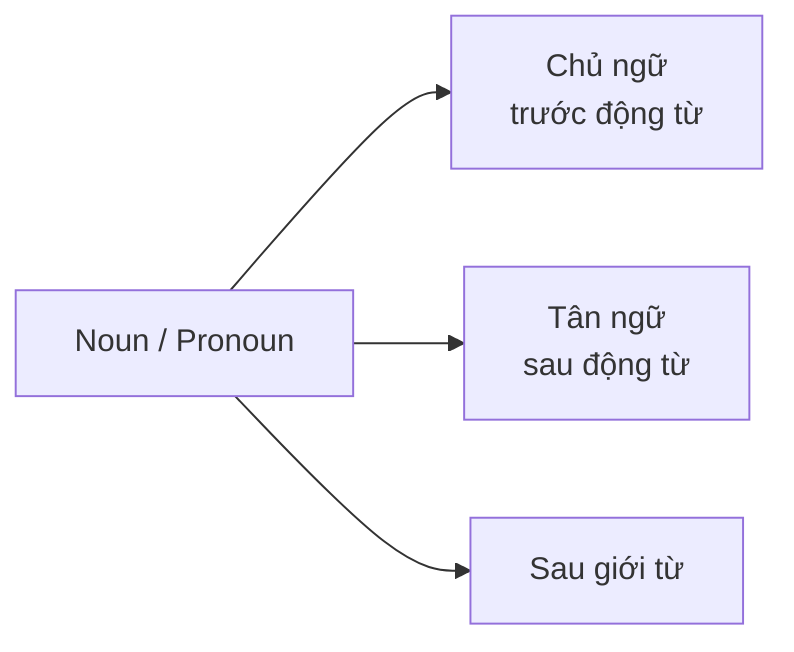
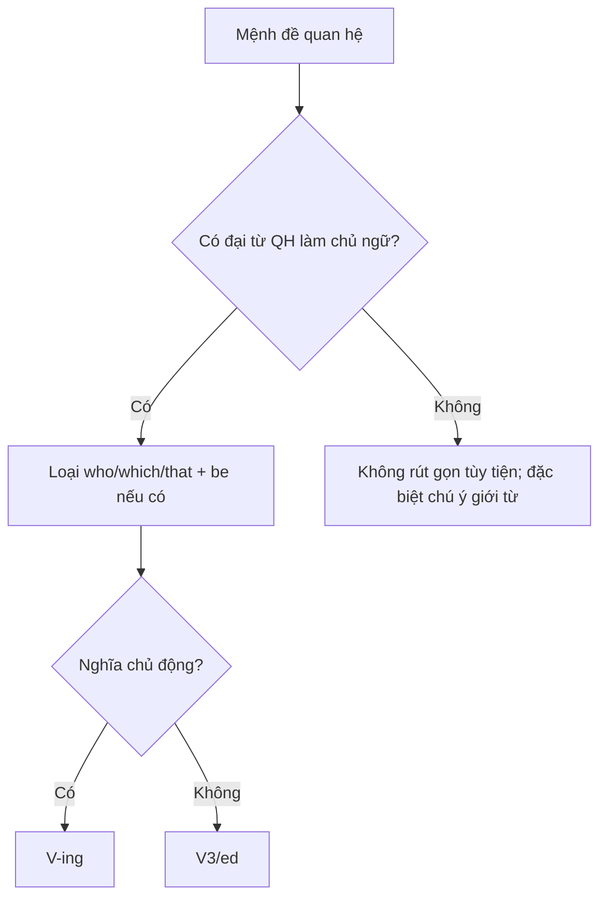
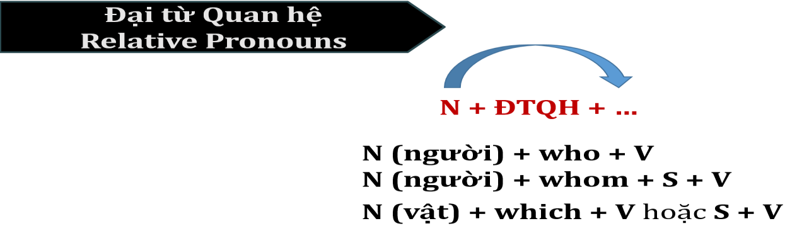

# Unit 1 - Sentence Structure: Nouns & Pronouns

## Mục tiêu

- Ôn danh từ và đại từ.
- Nhận diện vị trí của noun/pronoun trong câu.
- Dùng giới từ và mệnh đề quan hệ để kéo dài câu Part 1.

## 1. Danh từ

Tài liệu nhóm danh từ theo người, sự vật, sự việc và hiện tượng; đồng thời nhắc các hậu tố thường gặp như `-tion`, `-ment`, `-ness`, `-ity`, `-ance/-ence`, `-hood`, `-ism`, `-ist`, `-er/-or`, `-ship`.

> Hậu tố chỉ là dấu hiệu nhận biết; tài liệu khuyến nghị luôn kiểm tra IPA, loại từ, nghĩa và ngữ cảnh sử dụng.

## 2. Đại từ cơ bản

| Chủ ngữ | Tân ngữ | Tính từ sở hữu | Đại từ sở hữu | Phản thân |
|---|---|---|---|---|
| I | me | my | mine | myself |
| we | us | our | ours | ourselves |
| you | you | your | yours | yourself / yourselves |
| they | them | their | theirs | themselves |
| she | her | her | hers | herself |
| he | him | his | his | himself |
| it | it | its | its | itself |

Ngoài ra: demonstratives (`this/that/these/those`), indefinite pronouns và relative pronouns (`who/whom/which/that/whose`).

## 3. Vị trí noun/pronoun

## 4. Giới từ thường gặp

`in, on, at, near, by, beside, next to, from, across, along, about, into, with, for, during, since, until, between, among, as, to`.

## 5. Relative clauses và reduced relative clauses

- `who/whom` cho người; `which` cho vật; `that` có thể thay cho nhiều trường hợp nhưng không đứng sau dấu phẩy theo lưu ý của tài liệu.
- Rút gọn: bỏ relative pronoun; bỏ dạng `be` nếu có; nếu chủ động đổi động từ thành `V-ing`, nếu bị động giữ `V3/ed`.

## 6. Ứng dụng Part 1

Tài liệu dùng ISS để mở rộng câu bằng mệnh đề quan hệ + cụm giới từ. Ví dụ mẫu: `family/meal` được triển khai thành một câu có người đang chuẩn bị bữa ăn trong bếp và được suy luận là một gia đình.

## Hình minh họa / đề mẫu tách từ PDF

---

## Nội dung nguồn theo trang
> Phần dưới giữ sát nội dung của PDF để tiện đối chiếu. Bố cục bảng có thể được tuyến tính hóa do trích xuất từ PDF.

<strong>Trang PDF 23</strong>

UNIT 01:
SENTENCE STRUCTURE
NOUNS & PRONOUNS

UNIT 1: SENTENCE STRUCTURE – NOUNS & PRONOUNS
Expected learning outcomes:
1. Ôn tập kiến thức về Danh từ và Đại từ.
2. Ôn tập từ vựng cơ bản, tiếp thu thêm từ vựng nâng cao.
------------------------------------------------------------------
I. DANH TỪ (NOUNS – N)
Định nghĩa:
Từ “danh” trong tiếng Hán-Việt có nghĩa là “tên / tên gọi”. Chúng ta thường dùng rất nhiều từ ghép
với “danh” mang nghĩa “tên gọi”, như “danh mục” (bảng ghi tên theo sự phân loại nào đó), hay
“danh tiếng” (sự nổi tiếng, nổi bật của một tên người, tên vật). Do đó, thuật ngữ “Danh từ” được
hiểu là những từ dùng để gọi tên con người/sự vật/sự việc/hiện tượng.
-  Ví dụ:

Con người
Sự vật
Sự việc
Hiện tượng
Michael/Julie/…
(tên riêng)
teacher (n): giáo viên
doctor (n): bác sĩ
police (n): cảnh sát
…
tree (n): cây cối
road (n): con
đường
car (n): xe hơi
…
maintenance (n):
sự bảo trì
commute (n): sự đi lại
construction (n):
sự xây dựng
…
atmosphere (n): không
khí
leak (n): sự rò rỉ
malfunction (n):
sự trục trặc/hư hỏng
…
Một số hậu tố (đuôi) thường gặp của Danh từ:
-tion:
Ví dụ: information, education, communication
-ment:
Ví dụ: development, management, government
-ness:
Ví dụ: happiness, kindness, darkness
-ity:

Ví dụ: ability, responsibility, creativity
-ance, -ence:  Ví dụ: importance, difference, independence
-hood:
Ví dụ: childhood, brotherhood, neighborhood
-ism:
Ví dụ: socialism, capitalism, feminism

<strong>Trang PDF 24</strong>

-ist:

Ví dụ: artist, scientist, journalist
-er, -or:
Ví dụ: teacher, doctor, actor
-ship:
Ví dụ: friendship, internship, relationship
Việc nắm bắt hậu tố giúp chúng ta dễ nhận diện loại từ hơn, tuy nhiên nó không phải là phương
pháp tối ưu vì vẫn có các trường hợp ngoại lệ. Để chắc chắn nhất, với mỗi từ vựng tiếp xúc, bạn phải
nắm rõ:
1. Phần ký tự IPA trong dấu /…/, nhận dạng ký tự để phát âm đúng theo phiên âm.
2. Loại từ (danh từ/động từ/tính từ/trạng từ…)
3. Nghĩa thường dùng (và các nghĩa biến thể) của từ vựng.
4. Ngữ cảnh sử dụng từ vựng (đọc ví dụ của từ điển).
(Note: Hai từ điển chính thống và chuẩn xác nhất nên sử dụng là Cambridge và Oxford)
II. ĐẠI TỪ (PRONOUNS – PN)
Định nghĩa:
Để dễ nhớ, bạn có thể hiểu Đại từ là những từ dùng để đại diện và thay thế cho danh từ xuất hiện
trước nó, tránh việc lặp lại danh từ đã sử dụng ở những câu tiếp theo.

Ví dụ 1. My Tam is a Vietnamese singer. She is very talented.
(Mỹ Tâm là một ca sĩ Việt Nam. Cô ấy rất tài năng)
=> Trong câu (a), “she” là đại từ thay thế cho “Mỹ Tâm”- một tên riêng được đề cập ở câu đầu.
Ví dụ 2. I have a group of 4 best friends. All of them are present on my birthday today.
(Tôi có một nhóm bạn thân 4 người. Tất cả họ đều đang có mặt trong bữa tiệc sinh nhật hôm nay của
tôi)
=> Ở câu (b), “all of them” là đại từ thay thế cho cụm danh từ “a group of 4 best friends”.
Nói đến Đại từ, bạn phải thuộc lòng bảng thông tin cơ bản sau:
Đại từ
làm Chủ ngữ
Đại từ
làm Tân ngữ
Tính từ sở hữu
Đại từ sở hữu
Đại từ phản thân
I
me
my
mine
myself
we
us
our
ours
ourselves
you
you
your
yours
yourself
yourselves
they
them
their
theirs
themselves
she
her
her
hers
herself

<strong>Trang PDF 25</strong>

he
him
his
his
himself
it
it
its
its
itself
Đọc ví dụ sau để nắm cách sử dụng của 5 loại đại từ trong bảng trên:
“I took a walk by myself and found a peaceful spot where I could reflect on my life. The beauty of this
place made me appreciate the simple joys that are uniquely mine.”
(Tôi đã tự mình đi dạo bộ và tìm được một nơi yên tĩnh, nơi mà tôi có thể suy ngẫm về cuộc sống. Vẻ
đẹp của nơi này khiến tôi trân trọng những niềm vui đơn giản của chính mình.)
-
Chủ ngữ I đứng trước động từ, thể hiện người tạo ra hành động “took a walk” và “could reflect”.
-
by myself thường được dùng chung thành cụm (by oneself), mang nghĩa “tự tôi làm gì”, được
sử dụng như một trạng từ - bổ nghĩa cho động từ “took a walk”.
-
me đứng sau động từ made, thể hiện người nhận hành động từ chủ ngữ “the beauty of this
place”.
-
my và mine đều mang ý nghĩa sở hữu, nhưng tính từ sở hữu my bắt buộc phải có danh từ theo
sau: my life; mine không cần có danh từ theo sau, vì trong đó đã bao gồm tính từ sở hữu +
danh từ [my (simple) joys].
Ngoài bảng tổng hợp trên, chúng ta có thêm 3 loại Đại từ nữa, bao gồm:
Đại từ chỉ định:
this, that, these, those
Đại từ bất định:
(không ám chỉ một cá nhân, địa điểm hoặc sự vật một cách cụ thể)

all, another, any, anybody, anyone, anything, both, each, either,

everybody, everyone, everything, few, many, neither, nobody, none,

no one, nothing, one, other, several, some, somebody, someone,

something, such
Đại từ quan hệ:
who, whom, which, that, whose

=> Cũng từ việc phân tích ví dụ trên, ta thấy được: Danh từ và Đại từ đứng ở 3 vị trí thường gặp nhất
trong câu: Chủ ngữ (thực hiện hành động – đứng trước Động từ), Tân ngữ (nhận hành động –
đứng sau Động từ), và sau Giới từ.
=> Theo Mai Lan Hương, tác giả cuốn sách Giải thích Ngữ pháp Tiếng Anh kinh điển, “Giới từ là từ
hoặc nhóm từ, thường được dùng trước danh từ hoặc đại từ, để chỉ sự liên hệ giữa danh từ
hoặc đại từ này với các thành phần khác trong câu”.

<strong>Trang PDF 26</strong>

• Mách bạn một mẹo nhỏ để dễ nhớ, dễ hiểu: từ “Giới” trong tên gọi “Giới từ” có thể hiểu theo
nghĩa “môi giới”, nghĩa là nhân vật trung gian, đứng giữa để “giới thiệu” cho các bên gặp gỡ, tiếp
xúc với nhau, từ đó tạo ra một mối quan hệ nhất định. Vậy theo cách hiểu này, “Giới từ” cũng có
chức năng tương tự như vậy: là loại từ kết nối các thành phần khác trong câu thành một cụm từ,
có mối quan hệ với nhau về nghĩa.
Ví dụ: the beauty of this place (vẻ đẹp của nơi này); the book on that table (cuốn sách trên cái bàn
kia); live in an apartment (sống trong một căn hộ),…
Một số Giới từ thường gặp:
in
trong, ở trong (một khoảng không gian, thời gian)
on
trên (bề mặt); vào ngày nào (trong tuần, tháng)
at
ở, tại (nơi nào); vào lúc (chỉ thời điểm)
near
gần (khoảng cách ngắn)
by, beside, next to
bên cạnh
from
từ (một nơi, một thời điểm nào đó)
across
ngang qua
along
dọc theo
about
về việc gì
into
vào trong
with
với, cùng với
for
dành cho (ai/cái gì); để (mục đích); trong khoảng (bao lâu)
during
trong suốt (một khoảng thời gian)
since
kể từ khi
until
cho đến khi
between
giữa (2 đối tượng)
among
giữa (nhiều đối tượng)
as
như, như là, với tư cách là
to
để (mục đích); đến (nơi nào); trở thành

• Lưu ý: Giới từ không có một nghĩa nhất định, chúng ta phải phụ thuộc vào ngữ cảnh để hiểu đúng
nghĩa của giới từ được nêu. Trên đây chỉ nhắc đến những nghĩa thường gặp nhất.

<strong>Trang PDF 27</strong>

III. BÀI TẬP ỨNG DỤNG
Exercise 1. Liệt kê vào bảng tất cả các Danh từ/Đại từ có trong đoạn văn sau:
(1) In this office picture, there is a big room with a nice desk holding a computer and some neatly
arranged papers. (2) Around a big table, people are sitting in comfortable chairs, talking and
working together. (3) The walls have certificates and posters with motivational words, making the
office look professional. (4) In front, a person is sitting at a desk, answering phone calls and
organizing appointments. (5) The office seems busy but everything is in order, making it a good
place to get work done.

Danh từ/Đại từ
làm Chủ ngữ
Danh từ/Đại từ
làm Tân ngữ
Danh từ/Đại từ
đứng sau Giới từ
Câu (1)

Câu (2)

Câu (3)

Câu (4)

Câu (5)

<strong>Trang PDF 28</strong>

Exercise 2. Liệt kê vào bảng tất cả các Danh từ/Đại từ có trong đoạn văn sau:
(1) In the picture, several people are wearing colorful sports clothes, having a great time doing an
exciting outdoor activity. (2) In the front, there are hikers with their backpacks, and behind them,
I can see beautiful mountains with tall peaks and lots of greenery. (3) Some people are walking
carefully on rocky paths, and others are taking pictures of the amazing scenery. (4) Everyone looks
like they're really enjoying the adventure and having fun together. (5) It seems like a memorable
experience for everyone in the picture.

Danh từ/Đại từ
làm Chủ ngữ
Danh từ/Đại từ
làm Tân ngữ
Danh từ/Đại từ
đứng sau Giới từ
Câu (1)

Câu (2)

Câu (3)

Câu (4)

Câu (5)

<strong>Trang PDF 29</strong>

IV. SỬ DỤNG MỆNH ĐỀ QUAN HỆ GIÚP KÉO DÀI CÂU VIẾT
1. Mệnh đề quan hệ (Relative Clauses)
-  Mệnh đề quan hệ (MĐQH) bao gồm Đại từ quan hệ (ĐTQH) và các thành phần đứng sau nó,
dùng để làm rõ nghĩa thêm cho một danh từ (chỉ người/vật/sự việc) trước đó, nhưng không phải
là thành phần chính trong câu.
-  ĐTQH cũng có nguồn gốc từ Đại từ, nên chúng cũng có chức năng đại diện-thay thế danh từ; tuy
nhiên, giữa danh từ xuất hiện trước đó và các thành phần đứng sau ĐTQH phải có mối quan hệ
với nhau.

Xem các ví dụ sau Đây:
Ví dụ 1:
This Saturday is the annual holiday
parade, so everyone who works that
day will get overtime pay.
=> Trong câu này, “who works that day” là
MĐQH làm rõ nghĩa cho “everyone” – chỉ
những ai làm việc vào ngày đó mới nhận
được tiền công làm ngoài giờ.

Ví dụ 2:
Let’s welcome again Erika Cliffton
whom we conducted an exclusive
interview with in last month’s episode.
=> “whom we conducted an exclusive
interview with in last month’s episode” là
MĐQH làm rõ nghĩa cho “Erika Cliffton”,
cho biết Erika Cliffton là nhân vật mà
chúng ta đã phỏng vấn độc quyền trong
tập phát sóng của tháng trước.
Ví dụ 3:
The parking spaces which are marked
"visitor" may charge you a fee.
=> “which are marked "visitor” là MĐQH
làm rõ nghĩa cho “parking spaces” –
những bãi đậu xe mà có ghi chú “dành cho
khách” có lẽ sẽ tính phí cho bạn.

<strong>Trang PDF 30</strong>

* Lưu ý: that được dùng thay thế cho who/whom/which ở cả 3 câu ví dụ trên; tuy nhiên, ĐTQH that
không đứng sau dấu phẩy.
2. Rút gọn mệnh đề quan hệ (Reduced Relative Clauses)

Ví dụ:
- This Saturday is the annual holiday parade, so everyone who works that day will get overtime pay.
=> This Saturday is the annual holiday parade, so everyone working that day will get overtime pay.
- The parking spaces which are marked "visitor" may charge you a fee.
=> The parking spaces marked "visitor" may charge you a fee.
* Lưu ý: Không lược bỏ ĐTQH khi có đi kèm với giới từ.
Ví dụ: Let’s welcome again Erika Cliffton with whom we conducted an exclusive interview in last
month’s episode.
V. BÀI TẬP ỨNG DỤNG
Exercise 1. Viết MỘT câu mô tả cho mỗi bức tranh sau (sử dụng MĐQH và Giới từ để kéo dài câu
viết)
Để thành công chinh phục Part 1 (Write a sentence based on a picture) trong TOEIC Writing, IMAP mách
bạn một bộ chiến lược làm bài hiệu quả mang tên ISS:
I – Ideas (ý tưởng): Xác định sự kết nối của 2 từ/cụm từ cho sẵn trong bức tranh.
S – Structures (cấu trúc): Xây dựng câu theo đúng trình tự ngữ pháp cơ bản với chủ ngữ, động từ (và
tân ngữ - nếu có).
S – Sentence Development (phát triển câu): Mở rộng câu bằng trạng từ, giới từ, mệnh đề quan hệ
hoặc các yếu tố bổ sung khác (thời gian, địa điểm, tình huống) để làm câu trở nên đầy đủ và rõ
ràng.
* Ghi nhớ 3 bước sau để rút gọn MĐQH:
B1: Bỏ các ĐTQH who/whom/which/that
B2: Bỏ các dạng chia của BE (nếu có): will be/have been/am/is/are…
B3: Đối với MĐQH có ĐTQH làm chủ ngữ: Chuyển động từ thành V-ing (nếu mang nghĩa
chủ động) hoặc V3/ed (nếu mang nghĩa bị động)

<strong>Trang PDF 31</strong>

1. family/meal

Phân tích ISS:
I: family đang chuẩn bị meal
S: Câu phải đủ S + V; lưu ý V phải chia thì Hiện
tại tiếp diễn
S: Mở rộng thêm bằng MĐQH + cụm giới từ
chỉ nơi chốn
Sample answer:
=> The people who are preparing for a meal
in the kitchen seem like a family.

2. woman/hand
=> ………………………………………………………………
………………………………………………………………

3. student/table
=> ………………………………………………………………
………………………………………………………………

<strong>Trang PDF 32</strong>

4. cart/merchandise
=> ………………………………………………………………
………………………………………………………………

5. wall/decoration
=> ………………………………………………………………
………………………………………………………………
VI. TỪ VỰNG
English
Part of
speech
Phonetics
Vietnamese
Neatly arranged
PHR
/ˈniːtli əˈreɪndʒd/
Sắp xếp ngăn nắp
Motivational words
PHR
/ˌmoʊtɪˈveɪʃənəl
wɜrdz/
Những câu nói truyền động lực
In order
PHR
/ɪn ˈɔːrdər/
Ngăn nắp, trật tự
Sports clothes
N
/spɔrts kləʊ=>z/
Trang phục thể thao
Backpack
N
/ˈbækˌpæk/
Balô
Tall peak
N
/tɔːl piːk/
Đỉnh núi cao
Greenery
N
/ˈɡriːnəri/
Cảnh vật nhiều cây xanh
Rocky path
N
/ˈrɒki pæθ/
Đường đá
Take pictures of
PHR
/teɪk ˈpɪktʃərz ʌv/
Chụp hình ai/cái gì
Scenery
N
/ˈsiːnəri/
Phong cảnh

<strong>Trang PDF 33</strong>

Adventure
N
/ədˈvɛnʧər/
Chuyến phiêu lưu
Have fun
PHR
/hæv fʌn/
Vui chơi
Seem like
PHR
/siːm laɪk/
Trông có vẻ như
Memorable experience
PHR
/ˈmɛmərəbəl
ɪkˈspɪəriəns/
Trải nghiệm đáng nhớ
Parade
N
/pəˈreɪd/
Diễu hành
Overtime pay
PHR
/ˈoʊvərˌtaɪm peɪ/
Lương làm thêm giờ
Conduct an interview
PHR
/ˈkɒndʌkt ən ˈɪntəvjuː/ Thực hiện phỏng vấn
Exclusive
ADJ
/ɪkˈskluːsɪv/
Độc quyền
Episode
N
/ˈɛpɪsoʊd/
Tập phát sóng (trong một chuỗi
chương trình)
Charge s.o a fee
PHR
/ʧɑrdʒ ˈsʌmwʌn ə fiː/
Tính phí cho ai
Prepare for s.th
PHR
/prɪˈpɛr fɔr ˈsʌmθɪŋ/
Chuẩn bị cho cái gì
Gesture with hands
PHR
/ˈʤɛstʃər wɪ=> hændz/
Ra điệu bộ, cử chỉ bằng tay
Have a discussion
PHR
/hæv ə dɪˈskʌʃən/
Thảo luận
Cart
N
/kɑrt/
Xe đẩy
Pay for
PHR
/peɪ fɔr/
Thanh toán món hàng gì
Merchandise
N
/ˈmɜrtʃəndaɪz/
Hàng hóa
Decoration
N
/ˌdɛkəˈreɪʃən/
Sự trang trí

