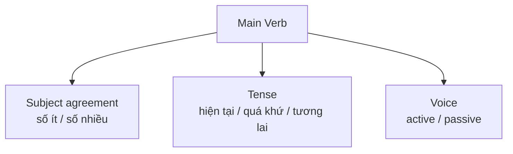
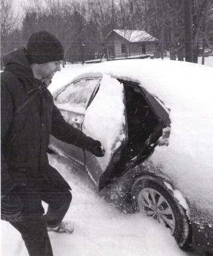
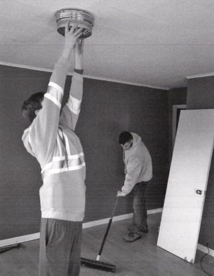

# Unit 2 - Sentence Structure: Verbs

## Mục tiêu

- Ôn các loại động từ.
- Chia động từ chính theo chủ ngữ, thì và thể.
- Kết hợp Unit 1 để dựng câu Part 1.

## 1. Bốn nhóm động từ chính trong bài

| Nhóm | Ý chính |
|---|---|
| Intransitive verbs | tự đủ nghĩa, không cần tân ngữ trực tiếp |
| Transitive verbs | cần tân ngữ để hoàn thành nghĩa |
| Linking verbs | nối chủ ngữ với subject complement, thường mô tả trạng thái |
| Modal verbs | `can/could/may/might/will/would/should/must/have to` + V nguyên mẫu |

## 2. Main verb phải khớp ba yếu tố

Tài liệu ôn các thì thường dùng và nhấn mạnh việc nhìn tranh để chọn thì phù hợp; trong Part 1, hiện tại tiếp diễn xuất hiện thường xuyên khi mô tả hành động đang diễn ra.

## 3. Chủ động và bị động

- Active: chủ ngữ thực hiện hành động.
- Passive: đối tượng chịu tác động được đưa lên làm chủ ngữ, thường dùng `be + V3/ed`.

## 4. ISS khi từ khóa có động từ

1. Xác định ai/cái gì thực hiện hoặc nhận hành động.
2. Chọn transitive/intransitive và xem có cần object không.
3. Chọn thì + voice.
4. Mở rộng câu bằng nơi chốn, trạng từ, relative clause hoặc conjunction.

## Hình minh họa / đề mẫu tách từ PDF

---

## Nội dung nguồn theo trang
> Phần dưới giữ sát nội dung của PDF để tiện đối chiếu. Bố cục bảng có thể được tuyến tính hóa do trích xuất từ PDF.

<strong>Trang PDF 34</strong>

UNIT 02:
SENTENCE STRUCTURE
VERBS
UNIT 2: SENTENCE STRUCTURE – VERBS
Expected learning outcomes:
1. Ôn tập kiến thức về Động từ.
2. Kết hợp với kiến thức Unit 1 để hình thành câu.
3. Ôn tập từ vựng cơ bản, tiếp thu thêm từ vựng nâng cao.
------------------------------------------------------------------
I. ĐỘNG TỪ (VERBS – V)
Định nghĩa:
Động từ là những từ chỉ hành động; là một thành phần bắt buộc phải có trong một câu.

1. Nội động từ (Intransitive verbs)
Định nghĩa:
Nội động từ là động từ mô tả hành động hoặc trạng thái của chủ ngữ, nhưng không cần tân ngữ trực
tiếp để hoàn thành ý nghĩa. Nói cách khác, nội động từ không yêu cầu ai đó hoặc vật gì đó phải nhận
hành động.

• Mẹo ghi nhớ:

Nội-bên trong: bản thân nội động từ đã đủ nghĩa, không cần có thành phần bên ngoài (tân ngữ)
đứng cạnh nữa.
Ví dụ:
English sentences
Vietnamese sentences
The train arrived.
(Tàu đã đến)
Unexpected things happened.
(Những điều bất ngờ đã xảy ra)
The sun rises in the east.
(Mặt trời mọc ở hướng đông)
She laughs loudly.
(Cô ấy cười lớn)
Unicorns exist only in fairy tales.
(Kỳ lân chỉ tồn tại trong truyện cổ tích)

<strong>Trang PDF 35</strong>

2. Ngoại động từ (Transitive verbs)
Định nghĩa:
Ngoại động từ là động từ mô tả hành động hoặc trạng thái của chủ ngữ, chúng cần tân ngữ trực tiếp
để hoàn thành ý nghĩa. Nói cách khác, ngoại động từ yêu cầu phải có ai đó hoặc vật gì đó nhận hành
động.

• Mẹo ghi nhớ:

Ngoại-bên ngoài: ngoại động từ cần có thành phần bên ngoài (tân ngữ) đứng cạnh để đủ nghĩa.
Ví dụ:
English sentences
Vietnamese sentences
She ate an apple.
(Cô ấy đã ăn một quả táo)
I am reading a book.
(Tôi đang đọc một cuốn sách)
We have already bought new clothes.
(Chúng tôi vừa mới mua quần áo mới)
They were painting the fence when I arrived
(Họ đang sơn hàng rào khi tôi đến)

3. Động từ liên kết (Linking verbs)
Định nghĩa:
Động từ liên kết là động từ kết nối chủ ngữ của câu với các thành phần bổ ngữ cho nó (subject
complement), có thể là danh từ, đại từ hoặc tính từ. Những động từ này không thể hiện hành động,
mà mô tả một trạng thái tồn tại hoặc một điều kiện.
Ví dụ:

English sentences
Vietnamese sentences
BE
I am a doctor.
(Tôi là một bác sĩ)
It is nice to meet you
(Rất vui được gặp bạn)
They are all the documents I have
(Chúng là tất cả những tài liệu mà tôi có)
Sense V
(giác
quan)
The soup tastes delicious.
(Món súp có vị ngon)
I feel sick.
(Tôi thấy mệt mỏi)
The flowers smell wonderful.
(Những bông hoa có mùi rất thơm)
Others
He became a successful entrepreneur
(Anh đã trở thành một doanh nhân thành đạt)

<strong>Trang PDF 36</strong>

The weather seems unpredictable.
(Thời tiết có vẻ khó lường)
The situation remained unchanged.
(Tình hình vẫn không thay đổi)
The students appear confident.
(Các học sinh tỏ ra tự tin)
4. Động từ khiếm khuyết (Modal verbs)
Định nghĩa:
Những động từ này thường đi kèm với một động từ chính (main verb) ở dạng nguyên mẫu để biểu đạt
mức độ, khả năng, ý muốn, lời mời, lời đề nghị, hoặc điều kiện. Động từ khiếm khuyết thường gặp là:
can, could, may, might, will, would, should, must, have to.
Ví dụ:
English sentences
Vietnamese sentences
I can speak English fluently.
(Tôi có thể nói tiếng Anh trôi chảy)
I could swim when I was five years old. (Tôi đã có thể bơi khi tôi năm tuổi)
May I use your phone for a moment?
(Tôi có thể sử dụng điện thoại của bạn một lát được
không?)
You should eat more vegetables for
better health.
(Bạn nên ăn nhiều rau hơn để có sức khỏe tốt hơn)
You have to wear a helmet when riding
a motorbike.
(Bạn phải đội mũ bảo hiểm khi đi xe máy)
5. Bài tập áp dụng: Liệt kê vào bảng tất cả các Động từ có trong đoạn văn sau
(1) In the busy airport, people are waiting for their flights. (2) They seem to relax in the departure
lounge, chatting happily. (3) Airport staff assist passengers with their bags, ensuring a smooth
boarding process. (4) Also, important information can be seen on a flight information display. (5)
There's a sign reminding everyone to adhere to safety regulations, such as fastening seatbelts.

Nội động từ
Ngoại động từ
Động từ liên kết
Động từ khiếm khuyết
Câu (1)

Câu (2)

<strong>Trang PDF 37</strong>

Câu (3)

Câu (4)

Câu (5)

II. LƯU Ý KHI DÙNG ĐỘNG TỪ CHÍNH (MAIN VERB) TRONG CÂU.
Một động từ chính của câu phải được chia ra theo:
-
Chủ ngữ (số ít / số nhiều)
-
Thì (quá khứ / hiện tại / tương lai)
-
Thể (chủ động / bị động)

1. Chủ ngữ số ít / số nhiều:
Như đã đề cập ở Unit 1, Danh từ hoặc Đại từ thường làm Chủ ngữ trong một câu. Nếu Danh từ và Đại
từ này ám chỉ đến duy nhất 1 người/1 sự vật/1 đối tượng, chúng được gọi là Chủ ngữ số ít; trường
hợp ám chỉ đến 2 người/2 sự vật/2 đối tượng trở lên, chúng được gọi là Chủ ngữ số nhiều.
* Lưu ý với các trường hợp tên riêng, dù có “s” ở cuối vẫn là danh từ số ít. Ví dụ: James, Thomas, The
Mass Services… (ám chỉ 1 đối tượng)
2. Thì.
Có 8 thì thường dùng nhất trong tiếng Anh, bao gồm:
a. Hiện tại đơn: diễn đạt hành động diễn ra thường xuyên, có một tần suất ổn định.
Thể khẳng định
Thể phủ định
Thể nghi vấn
S + am/is/are
S + am/is/are not
Am/Is/Are + S
S + V nguyên mẫu
S + don’t/doesn’t + V nguyên mẫu
Do/Does + S + V nguyên mẫu

<strong>Trang PDF 38</strong>

Ví dụ:  She works at a bank. (Cô ấy làm việc tại một ngân hàng.)
The sun rises in the east. (Mặt trời mọc ở phía đông.)

b. Hiện tại tiếp diễn: diễn đạt hành đang diễn ra tại thời điểm nói; hoặc một dự định chắc chắn sẽ
thực hiện trong tương lai.
Thể khẳng định
Thể phủ định
Thể nghi vấn
S + am/is/are + V-ing
S + am/is/are not + V-ing
Am/Is/Are + S + V-ing

Ví dụ: They are studying for their exams. (Họ đang học bài cho kì thi.)
I am not watching TV right now. (Tôi không đang xem TV vào lúc này.)

c. Hiện tại hoàn thành: diễn đạt hành động vừa mới xảy ra; hoặc đã xảy ra trong quá khứ ở một thời
điểm không xác định, còn kéo dài đến hiện tại.
Thể khẳng định
Thể phủ định
Thể nghi vấn
S + have/has + V3/ed
S + have/has not + V3/ed
Have/Has + S + V3/ed

Ví dụ:
We have visited that museum before. (Chúng tôi đã thăm bảo tàng đó trước đây rồi)
She has never seen such a beautiful sunset. (Cô ấy chưa bao giờ thấy một hoàng hôn đẹp như vậy.)

d. Quá khứ đơn: diễn đạt hành động đã xảy ra và kết thúc trong quá khứ.
Thể khẳng định
Thể phủ định
Thể nghi vấn
S + was/were
S + was/were not
Was/Were + S
S + V2/ed
S + didn’t + V nguyên mẫu
Did + S + V nguyên mẫu

Ví dụ:  I finished my homework last night. (Tôi đã hoàn thành bài tập tối qua.)
They visited Paris two years ago. (Họ đã ghé thăm Paris hai năm trước.)

e. Quá khứ tiếp diễn: diễn đạt hành đang diễn ra tại một thời điểm trong quá khứ.
Thể khẳng định
Thể phủ định
Thể nghi vấn
S + was/were + V-ing
S + was/were not + V-ing
Was/Were + S + V-ing

<strong>Trang PDF 39</strong>

Ví dụ:  While I was studying, the phone rang. (Khi tôi đang học, điện thoại reo.)
It was raining when they left the house. (Trời đang mưa khi họ rời khỏi nhà.)

f. Quá khứ hoàn thành: diễn đạt hành động xảy ra trước so với một hành động/một thời điểm trong
quá khứ.
Thể khẳng định
Thể phủ định
Thể nghi vấn
S + had + V3/ed
S + had not + V3/ed
Had + S + V3/ed

Ví dụ:
By the time we arrived, the movie had already started. (Trước khi chúng tôi đến, bộ phim đã bắt đầu
rồi.)
She realized she had forgotten her keys at home. (Cô ấy nhận ra rằng cô ấy đã quên chìa khóa ở nhà.)

g. Tương lai đơn: diễn đạt hành động sẽ diễn ra trong tương lai; thể hiện một quyết định sẽ làm gì,
mới được đưa ra tức thời.
Thể khẳng định
Thể phủ định
Thể nghi vấn
S + will be
S + will not be / won’t be
Will + S + be
S + will + V nguyên mẫu
S + will not / won’t + V nguyên mẫu
Will + S + V nguyên mẫu

Ví dụ:  I will call you tomorrow. (Tôi sẽ gọi bạn vào ngày mai.)
They won't arrive until next week. (Họ sẽ không đến cho đến tuần sau.)

h. Tương lai gần: diễn đạt hành động sẽ diễn ra trong tương lai, nhưng đã có kế hoạch đặt ra trước
đó, hoặc dự đoán dựa trên bằng chứng hiện tại.
Thể khẳng định
Thể phủ định
Thể nghi vấn
S + am/is/are going to
+ V nguyên mẫu
S + am/is/are not going to + V nguyên mẫu Am/Is/Are + S + going to +
V nguyên mẫu
Ví dụ:
We are going to meet for lunch. (Chúng ta sẽ gặp nhau để ăn trưa)
She is going to leave for a business trip next Monday. (Cô ấy sẽ đi một chuyến công tác vào thứ Hai
tới.)

<strong>Trang PDF 40</strong>

3. Thể chủ động (active voice) và thể bị động (passive voice).
• Trong câu chủ động (active voice), chủ từ (S) là tác nhân gây ra hành động.

Ví dụ: The cat chased the mouse. (Con mèo rượt đuổi con chuột)
The cat
chased
the mouse.
S
Main V
O

• Câu bị động (passive voice) thường được dùng khi ta muốn tập trung vào đối tượng nhận hành
động; hoặc khi không biết hoặc không quan trọng tác nhân gây ra hành động; hoặc khi muốn
biểu thị tính linh hoạt trong ngôn ngữ viết và tránh lặp lại chủ ngữ.

Ví dụ: The mouse was chased by the cat. (Con chuột bị rượt đuổi bởi con mèo)
The mouse
was chased
by the cat.
O
be V3/ed
by + agent
4. Bài tập áp dụng. Liệt kê vào bảng tất cả các cặp Chủ ngữ (S) - Động từ chính (Main V) có trong
đoạn văn sau:
(1) At the supermarket, customers are actively choosing items from well-organized shelves. (2)
Regular updates to promotions and discounts draw customers to different areas of the store. (3)
Fresh produce is regularly restocked, maintaining a high-quality assortment. (4) Friendly staff
members are assisting customers with inquiries and ensure a pleasant shopping environment. (5)
At the checkout counters, purchases are efficiently processed, creating an enjoyable shopping
experience for all patrons.

Cấu trúc chủ động thường là:
S + Main V + O.
Cấu trúc bị động thường là:
Object + be + V3/ed + [by + Agent (S)].

<strong>Trang PDF 41</strong>

Chủ ngữ (S)
Động từ chính (Main V)
Câu (1)

Câu (2)

Câu (3)

Câu (4)

Câu (5)

III. BÀI TẬP ỨNG DỤNG
Exercise 1. Viết MỘT câu mô tả cho mỗi bức tranh sau sử dụng các từ cho sẵn.
Hãy cùng ôn lại bộ chiến lược làm bài cho Part 1 (Write a sentence based on a picture) trong TOEIC Writing
– ISS nhé:
I – Ideas (ý tưởng): Xác định sự kết nối của 2 từ/cụm từ cho sẵn trong bức tranh.
S – Structures (cấu trúc): Xây dựng câu theo đúng trình tự ngữ pháp cơ bản với chủ ngữ, động từ (và
tân ngữ - nếu có).
S – Sentence Development (phát triển câu): Mở rộng câu bằng trạng từ, giới từ, mệnh đề quan hệ
hoặc các yếu tố bổ sung khác (thời gian, địa điểm, tình huống) để làm câu trở nên đầy đủ và rõ
ràng.

<strong>Trang PDF 42</strong>

1. eat/campsite

Phân tích ISS:
I: người phụ nữ đang eat trong một
campsite;
S: Câu phải đủ S + V; lưu ý V phải chia thì
Hiện tại tiếp diễn; động từ eat phải có tân
ngữ đi kèm;
S: Mở rộng thêm bằng MĐQH + cụm giới từ
chỉ nơi chốn
Sample answer:
=> 1. She is eating some snacks at a stone
table that seems to be placed in a
campsite.

2. open/snow
=> …………………………………………………………...
…………………………………………………………...

<strong>Trang PDF 43</strong>

3. stand/read
=> …………………………………………………………...
…………………………………………………………...

4. clothing/hang
=> …………………………………………………………...
…………………………………………………………...

5. reach/mop
=> …………………………………………………………...
…………………………………………………………...

<strong>Trang PDF 44</strong>

IV. TỪ VỰNG
English
Part of
speech
Phonetics
Vietnamese
Arrive
V
/əˈraɪv/
Đến, tới nơi
Unexpected
ADJ
/ˌʌnɪkˈspɛktɪd/
Không mong đợi/ bất ngờ
Exist
V
/ɪɡˈzɪst/
Tồn tại
Fairy tale
N
/ˈfɛri teɪl/
Truyện cổ tích
Paint the fence
PHR
/peɪnt =>ə fɛns/
Sơn hàng rào
Document
N
/ˈdɒkjʊmənt/
Tài liệu, văn bản
Taste
V
/teɪst/
Có vị
Smell
V
/smɛl/
Có mùi
Entrepreneur
N
/ˌɒntrəprəˈnɜr/
Doanh nhân
Unpredictable
ADJ
/ˌʌnprɪˈdɪktəbəl/
Khó lường, khó đoán trước
Remain unchanged
PHR
/rɪˈmeɪn ʌnˈʧeɪndʒd/
Vẫn không thay đổi
Speak fluently
PHR
/spiːk ˈfluːəntli/
Nói (tiếng gì) một cách trôi chảy
For a moment
PHR
/fɔr ə ˈmoʊmənt/
Một chút, một lát
Helmet
N
/ˈhɛlmɪt/
Mũ bảo hiểm
Ride a bike/motorbike
V
/raɪd ə baɪk/
/ raɪd ə ˈmoʊtərˌbaɪk/
Lái xe đạp/xe máy
Departure lounge
N
/dɪˈpɑrtʃər laʊndʒ/
Phòng đợi để khởi hành
Staff
N
/stæf/
Nhân viên
Boarding process
PHR
/ˈbɔrdɪŋ ˈproʊsɛs/
Quá trình lên máy bay
Flight information
display
PHR
/flaɪt ˌɪnfərˈmeɪʃən
dɪsˈpleɪ/
Bảng hiển thị thông tin chuyến bay
Adhere to safety
regulations
PHR
/ədˈhɪər tu ˈseɪfti
ˌrɛɡjʊˈleɪʃənz/
Tuân thủ các quy định an toàn
Fasten seatbelts
PHR
/ˈfæsən ˈsitbɛlts/
Thắt dây an toàn
Sunset
N
/ˈsʌnˌsɛt/
Hoàng hôn
Leave for a business trip
PHR
/liv fɔr ə ˈbɪznɪs trɪp/
Đi công tác
Well-organized
ADJ
/wɛl ˈɔrɡəˌnaɪzd/
Tổ chức tốt, sắp xếp tốt
Promotion
N
/prəˈmoʊʃən/
Khuyến mãi

<strong>Trang PDF 45</strong>

Draw
V
/drɔ/
Thu hút
Produce
N
/prəˈdus/
Nông sản (rau, củ, quả)
Restock
V
/ˌriˈstɑk/
Bổ sung, xếp thêm hàng lên kệ
Assortment
N
/əˈsɔrtmənt/
Loại, sự phân loại
Checkout counter
N
/ˈtʃɛkaʊt ˈkaʊntər/
Quầy thanh toán
Patron
N
/ˈpeɪtrən/
Khách hàng thường xuyên của một
cửa hàng
Shopping experience
PHR
/ˈʃɑpɪŋ ɪkˈspɪriəns/
Trải nghiệm mua sắm
Campsite
N
/ˈkæmpsaɪt/
Khu cắm trại
Be covered with
PHR
/bi ˈkʌvərd wɪ=>/
Được bao phủ bởi
Admire
V
/ədˈmaɪər/
Chiêm ngưỡng
Tent
N
/tɛnt/
Cái lều
Frame
N
/freɪm/
Khung
Reach for
PHR
/riːʧ fɔr/
Với tới
Install
V
/ɪnˈstɔl/
Cài đặt, lắp đặt
Ceiling
N
/ˈsiːlɪŋ/
Trần nhà
Mop the floor
PHR
/mɑp =>ə flɔr/
Lau nhà

