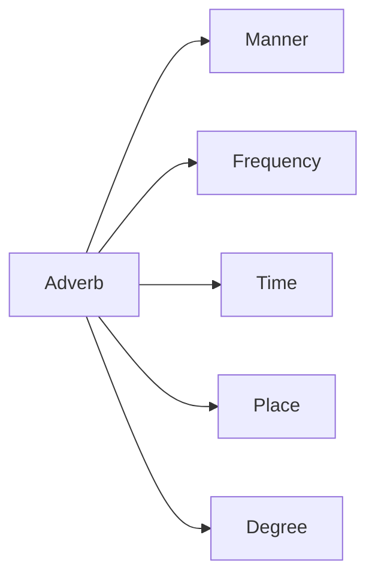
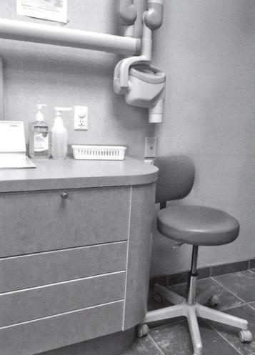
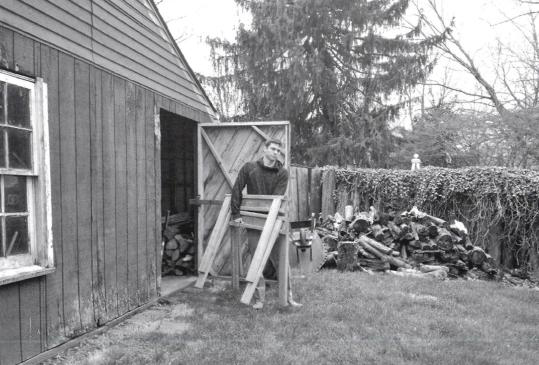

# Unit 3 - Sentence Structure: Adjectives & Adverbs

## Mục tiêu

- Phân biệt chức năng của adjective và adverb.
- Dùng chúng để mô tả tranh tự nhiên hơn.
- Ôn cấu trúc so sánh.

## 1. Adjectives

- Thường đứng trước noun để tạo noun phrase.
- Có thể đứng sau linking verb để bổ nghĩa cho subject.

## 2. Adverbs

Tài liệu phân loại theo **manner, frequency, time, place, degree**. Adverb có thể bổ nghĩa cho verb, adjective hoặc một adverb khác.

## 3. Comparison

| Dạng | Khung cơ bản |
|---|---|
| Bằng | `as + adj/adv + as` |
| Hơn - từ ngắn | `adj-er + than` |
| Hơn - từ dài | `more + adj/adv + than` |
| Nhất - từ ngắn | `the + adj-est` |
| Nhất - từ dài | `the most + adj/adv` |

Bất quy tắc trong tài liệu: `good-better-best`, `bad-worse-worst`, `far-farther/further-farthest/furthest`, `little-less-least`, `much/many-more-most`.

## 4. Ứng dụng mô tả tranh

Khi dùng adjective/adverb, ưu tiên từ bổ sung thông tin quan sát được: trạng thái, cách sắp xếp, mức độ, cách hành động diễn ra. Tránh thêm chi tiết không có căn cứ từ tranh.

## Hình minh họa / đề mẫu tách từ PDF

---

## Nội dung nguồn theo trang
> Phần dưới giữ sát nội dung của PDF để tiện đối chiếu. Bố cục bảng có thể được tuyến tính hóa do trích xuất từ PDF.

<strong>Trang PDF 46</strong>

UNIT 03:
SENTENCE STRUCTURE
ADJECTIVES & ADVERBS
UNIT 3: SENTENCE STRUCTURE – ADJECTIVES & ADVERBS
Expected learning outcomes:
1. Ôn tập kiến thức về tính từ và trạng từ.
2. Kết hợp với kiến thức Unit 1 & Unit 2 để hình thành câu.
3. Ôn tập từ vựng cơ bản, tiếp thu thêm từ vựng nâng cao.
------------------------------------------------------------------
I. TÍNH TỪ (ADJECTIVES – ADJ)
Định nghĩa:
Tính từ là những từ dùng để mô tả tính chất của danh từ hoặc đại từ trong câu: chủ yếu được sử
dụng để cung cấp thông tin chi tiết hơn về danh từ hoặc đại từ, giúp mô tả ngoại hình, tình trạng,
phẩm chất, hoặc các đặc điểm khác của người và sự vật.
Vị trí và chức năng của tính từ trong câu:
- Tính từ thường đứng trước danh từ để bổ nghĩa cho danh từ đó, tạo thành cụm danh từ đứng ở
các vị trí Chủ ngữ, Tân ngữ và sau Giới từ (Unit 1)
Ví dụ:
English
Vietnamese
a beautiful house
Một ngôi nhà đẹp
a talented musician
Một nghệ sĩ tài năng
a red dress
Một chiếc váy màu đỏ
a cup of hot tea
Một cốc trà nóng
Vị trí và chức năng của tính từ trong câu:
- Tính từ đứng sau Linking verbs (động từ liên kết) để bổ nghĩa cho chủ ngữ.
Ví dụ:
English
Vietnamese
The movie was exciting.
(Bộ phim rất thú vị)
He is friendly.
(Anh ấy thân thiện)

<strong>Trang PDF 47</strong>

The weather here is mild.
(Thời tiết ở đây ôn hòa)
II. TRẠNG TỪ (ADVERBS – ADV)
Định nghĩa:
Trạng từ là những từ dùng để mô tả, bổ sung thông tin về cách thức, mức độ, thời gian, hay tần suất
của một động từ, tính từ, hay trạng từ khác.
Ví dụ:
Adverbs of manner
(Mô tả cách thức hành động diễn ra)
She sings beautifully.
Cô ấy hát hay.
Adverbs of frequency
(Mô tả tần suất của hành động)
I always go to the gym.
Tôi luôn đi đến phòng tập gym.
Adverbs of time
(Mô tả thời gian)
I will meet you tomorrow.
Tôi sẽ gặp bạn vào ngày mai
Adverbs of place
(Mô tả nơi chốn)
They will meet us here.
Họ sẽ gặp chúng ta ở đây.

Adverbs of degree
(Mô tả mức độ)
He worked very hard.
Anh ấy đã làm việc rất chăm
chỉ.

III. TÍNH TỪ VÀ TRẠNG TỪ TRONG CÁC CẤU TRÚC SO SÁNH
- Tính từ và Trạng từ thường được sử dụng trong điểm ngữ pháp so sánh.
- Có ba dạng so sánh chính bao gồm so sánh bằng, so sánh hơn, và so sánh nhất.
So sánh bằng
Sử dụng "as...as" khi so sánh
tính chất hay đặc điểm giống
nhau ở hai đối tượng.
- She is as tall as her
sister.
- He studies as diligently
as his sister.
- Cô ấy cao bằng chị gái
của mình.
- Cậu ấy học chăm chỉ
như chị gái của mình.
So sánh hơn
Sử dụng khi so sánh hai đối
tượng có sự khác biệt về mức
độ.
So sánh hơn với tính từ ngắn
(S + V + Adj + “-er” + than)
Lưu ý:
- The data in this report
is clearer than the old
one.

- Số liệu trong bản báo
cáo này rõ ràng hơn
bản cũ.

<strong>Trang PDF 48</strong>

- Nếu tính từ có 1 âm tiết =>
thêm “er” sau tính từ (fast =>
faster)
- Nếu tình từ có 2 âm tiết kết
thúc bằng “y” => thay “y” bằng
“i” rồi thêm “er”. (happy =>
happier)
So sánh hơn với tính từ dài
(S + V + more + Adj + than)
Lưu ý: Nếu tính từ có 2 âm tiết
trở lên => sử dụng "more" trước
tính từ (comfortable => more
comfortable)
- Mr. Swan read the
report more carefully
than Ms. Julie.
- Ông Swan đã đọc báo
cáo một cách kỹ lưỡng
hơn so với cô Julie.
So sánh nhất
Dùng để so sánh một đối tượng
so với nhóm ba hoặc nhiều
hơn.
So sánh nhất với tính từ ngắn
(S + V + the + Adj + -est)
Lưu ý:
- Nếu tính từ có 1 âm tiết =>
thêm “est” sau tính từ (fast =>
fastest)
- Nếu tình từ có 2 âm tiết kết
thúc bằng “y” => thay “y” bằng
“i” rồi thêm “est”. (happy => the
happiest)
- Mount Everest is the
highest mountain in the
world.

- Đỉnh Everest là đỉnh
núi cao nhất thế giới.

So sánh nhất với tính từ dài
(S + V + the most + Adj)
Lưu ý: Nếu tính từ có 2 âm tiết
trở lên => sử dụng " the most"
trước tính từ (comfortable =>
the most comfortable)
- In my project group,
Yumiko presents the
most confidently.
- Trong nhóm dự án
của tôi, Yumiko thuyết
trình tự tin nhất.

<strong>Trang PDF 49</strong>

Một số tính từ có trường hợp ngoại lệ:
Từ
So sánh hơn
So sánh nhất
good
better
the best
bad
worse
the worst
far
farther/further the farthest/furthest
little
less
the least
much/many more
the most

IV. BÀI TẬP ỨNG DỤNG
Exercise 1. Liệt kê vào bảng tất cả các Tính từ và Trạng từ (kèm theo với từ mà nó bổ nghĩa) có trong
đoạn văn sau:
(1) Shopping for clothes can be an exciting experience, especially when searching for the perfect
outfit to express one's unique style. (2) In busy stores, you'll discover a variety of stylish clothing,
ranging from fashionable and lively dresses to comfortably cool and laid-back wear. (3) Shoppers
can carefully browse through neatly organized racks, selecting garments that not only fit perfectly
but also match their individual preferences. (4) Friendly sales associates are often available to
offer helpful suggestions. (5) Mostly, everyone always wants to succeed in their shopping spree
and discover trendy and reasonably priced clothes.

Tính từ
Trạng từ
Câu (1)

Câu (2)

Câu (3)

Câu (4)

Câu (5)

<strong>Trang PDF 50</strong>

Exercise 2. Điền vào chỗ trống để chuyển ngữ những câu sau từ Việt sang Anh.
Câu (1)
Làm vườn là một sở thích thực sự thú vị, giúp bạn có thể trồng những loại cây cung cấp
bóng mát và làm cho môi trường xung quanh bạn trông xanh mướt.

=> Gardening is a ________  ________ hobby in which you can grow plants that provide
shade and make your surroundings ________  ________.
Câu (2)
Chăm sóc cây cỏ tốt làm cho nơi ở của bạn trông yên bình và xinh đẹp.

=> Taking ________  ________ of plants makes your place ________ and  ________.
Câu (3)
Việc lựa chọn kỹ lưỡng những bông hoa đầy màu sắc, những loại cây có mùi thơm và
những bụi cây xanh tươi có thể khiến khu vườn của bạn thực sự hấp dẫn.

=> Your garden will be ________  ________ if you choose ________ flowers, ________
plants and lush green bushes ________.
Câu (4)
Điều quan trọng là phải chăm sóc đủ tốt cho đất và tưới nước cho cây đúng cách để giúp
cây phát triển tốt.

=> It is ________ to provide ________ soil care and water plants ________ to help them
grow ________.

Exercise 3. Viết MỘT câu mô tả cho mỗi bức tranh sau sử dụng các từ cho sẵn (Sử dụng bộ chiến
lược ISS như ở Unit 1 & 2).

1. face/happy
=> ………………………………………………………….....
………………………………………………………….….

<strong>Trang PDF 51</strong>

2. table/arrange
=> ………………………………………………………….....
………………………………………………………….….
3. backyard/heavy
=> ………………………………………………………….....
………………………………………………………….….
=> ………………………………………………………….....
………………………………………………………….….

<strong>Trang PDF 52</strong>

4. unfinished/forest
5. various/stack
=> ………………………………………………………….....
………………………………………………………….….
V. TỪ VỰNG
English
Part of
speech
Phonetics
Vietnamese
Mild
ADJ
/maɪld/
Ôn hòa, dịu nhẹ
Diligent
ADJ
/ˈdɪlɪdʒənt/
Siêng năng
Present
V/N
/ˈprɛzənt/
Thuyết trình/ hiện tại / món quà
Confident
ADJ
/ˈkɒnfɪdənt/
Tự tin
Search for
V
/sɜrtʃ fɔr/
Tìm kiếm
Outfit
N
/ˈaʊtfɪt/
Trang phục
Express one’s style
PHR
/ɪkˈsprɛs wʌnz staɪl/
Thể hiện phong cách của một
người
Unique
ADJ
/juˈniːk/
Độc nhất, đặc trưng
Range from
V
/reɪndʒ frɒm/
Có phạm vi từ…/ trải dài từ…
Lively
ADJ
/ˈlaɪvli/
Sống động
Laid-back
ADJ
/ˈleɪd bæk/
(Quần áo) thoải mái
Browse
V
/braʊz/
Ngắm nhìn xung quanh
Neatly organized
ADJ
/ˈniːtli ˈɔːrɡənaɪzd/
Được sắp xếp gọn gàng
Garment
N
/ˈɡɑːrmənt/
Quần áo
Match one’s preferences
PHR
/mætʃ wʌnz
ˈprɛfərənsɪz/
Phù hợp với sở thích
Sales associate
N
/seɪlz əˈsoʊsiˌeɪt/
Nhân viên bán hàng

<strong>Trang PDF 53</strong>

Available
ADJ
/əˈveɪləbl/
Có sẵn
Offer suggestions
PHR
/ˈɒfər səˈdʒɛstʃənz/
Đưa ra gợi ý
Succeed in
PHR
/səkˈsiːd ɪn/
Thành công trong việc gì
Shopping spree
N
/ˈʃɒpɪŋ spriː/
Mua sắm thả ga
Trendy
ADJ
/ˈtrɛndi/
Hợp xu hướng, hợp thời trang
Reasonably priced
PHR
/ˈriːzənəbli praɪst/
Giá cả hợp lý
Gardening
N
/ˈɡɑːrdnɪŋ/
Làm vườn
Shade
N
/ʃeɪd/
Bóng râm, bóng mát
Surroundings
N
/səˈraʊndɪŋz/
Vùng lân cận
Attractive
ADJ
/əˈtræktɪv/
Hấp dẫn
Fragrant
ADJ
/ˈfreɪɡrənt/
Thơm
Lush
ADJ
/lʌʃ/
Tươi tốt
Bush
N
/bʊʃ/
Bụi cây
Adequate
ADJ
/ˈædɪkwət/
Đủ
Properly
ADV
/ˈprɒpərli/
Đúng cách
Occupied
ADJ
/ˈɒkjʊpaɪd/
Có người sử dụng
Unoccupied
ADJ
/ʌnˈɒkjʊpaɪd/
Không có người sử dụng
Backyard
N
/ˈbækjɑːrd/
Sân sau
Wooden
ADJ
/ˈwʊdən/
Gỗ, làm bằng gỗ
Object
N
/ˈɒbdʒɪkt/
Đồ vật
Quite
ADV
/kwaɪt/
Khá
Frame
N
/freɪm/
Khung sườn
Leave unfinished
V
/liːv ʌnˈfɪnɪʃt/
Để lại ở tình trạng dang dở
Various
ADJ
/ˈvɛəriəs/
Nhiều loại
Luggage
N
/ˈlʌɡɪdʒ/
Hành lý
Stack
V/N
/stæk/
Xếp chồng lên nhau
Iron
ADJ/N
/ˈaɪərn/
Sắt

