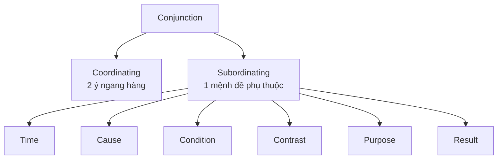

# Unit 4 - Sentence Structure: Conjunctions

## Mục tiêu

- Nối từ, cụm từ và mệnh đề để tạo câu dài nhưng vẫn rõ nghĩa.
- Phân biệt coordinating và subordinating conjunctions.

## 1. Coordinating conjunctions theo nhóm nghĩa

| Nhóm | Ví dụ trong tài liệu | Công dụng |
|---|---|---|
| AND | `and`, `both...and`, `not only...but also`, `as well as`, `moreover`, `furthermore`, `in addition` | thêm ý |
| BUT | `but`, `yet`, `still`, `however`, `nevertheless`, `on the other hand` | tương phản |
| OR | `or`, `or else`, `otherwise`, `either...or`, `neither...nor` | lựa chọn/hệ quả nếu không |
| SO | `so`, `therefore`, `for`, `consequently`, `as a result` | nguyên nhân-kết quả |

## 2. Subordinating conjunctions

- Thời gian: `when, whenever, while, as soon as, after, before, until, since, by the time`.
- Nguyên nhân: `because, as, since, now that`.
- Điều kiện: `if, unless, in case, provided that, as long as, once`.
- Tương phản: `though, although, even though, even if, whether...or not, no matter...`.
- Mục đích: `in order that, so that`.
- Kết quả: `so + adj/adv + that`, `such + (a/an) + adj + noun + that`.
- Mệnh đề nội dung: `that`.

## 3. Ứng dụng Part 1

Conjunction giúp ghép hai quan sát liên quan trong cùng một câu, nhưng vẫn phải đảm bảo câu không trở thành chuỗi ý rời rạc. Dùng khi hai từ khóa bắt buộc cần được nối qua quan hệ thời gian, nguyên nhân, mục đích hoặc tương phản.

## Hình minh họa / đề mẫu tách từ PDF

---

## Nội dung nguồn theo trang
> Phần dưới giữ sát nội dung của PDF để tiện đối chiếu. Bố cục bảng có thể được tuyến tính hóa do trích xuất từ PDF.

<strong>Trang PDF 54</strong>

UNIT 04:
SENTENCE STRUCTURE
CONJUNCTIONS
UNIT 4: SENTENCE STRUCTURE – CONJUNCTIONS
Expected learning outcomes:
1. Ôn tập kiến thức về liên từ
2. Kết hợp với kiến thức Unit 1, Unit 2 & Unit 3 để hình thành câu.
3. Ôn tập từ vựng cơ bản, tiếp thu thêm từ vựng nâng cao.
------------------------------------------------------------------
I. CÁC LOẠI LIÊN TỪ TRONG CÂU.
Định nghĩa:
Liên từ là những từ dùng để liên kết các từ, cụm từ, mệnh đề trong câu.
Liên từ được chia làm 2 loại: Liên từ kết hợp (Co-ordinating conjunctions) và Liên từ phụ thuộc
(Subordinating conjunctions)

1. Liên từ kết hợp (Co-ordinating conjunctions)
Gồm 4 nhóm chính:
Nhóm
Ví dụ
(1) Nhóm AND (chỉ sự thêm vào)
gồm:
and, both…and, not only…but
also, as well as; các trạng từ liên
kết (conjunctive adverbs) besides,
furthermore,
moreover,
in
addition.
- The new software is both user-friendly and efficient. (Phần
mềm mới vừa thân thiện với người dùng, vừa hiệu quả).
- Our team includes experts in programming as well as
graphic design. (Nhóm của chúng tôi bao gồm các chuyên gia
về lập trình cũng như thiết kế đồ họa.)
- The company has a strong market presence. Moreover, it
has a reputation for quality. (Công ty có sự hiện diện mạnh mẽ
trên thị trường. Hơn thế nữa, công ty còn có danh tiếng về
chất lượng.)
- The new product is cost-effective. Furthermore, it also offers
advanced features. (Sản phẩm mới tiết kiệm chi phí. Không
những thế, nó còn có những tính năng tiên tiến.)

<strong>Trang PDF 55</strong>

(2) Nhóm BUT (chỉ sự mâu thuẫn,
trái ngược) gồm:
but, yet, still; các trạng từ liên kết
however, nevertheless, on the
other hand.
- The project faced several challenges, yet the team
successfully completed it on time. (Dự án đối mặt với một số
thách thức, nhưng nhóm đã hoàn thành một cách thành công
và đúng thời hạn.)
- The weather forecast predicted rain, but the picnic still went
ahead as planned. (Dự báo thời tiết báo sẽ có mưa, nhưng
chuyến dã ngoại vẫn diễn ra theo kế hoạch.)
- The meeting was long and tiring. Nevertheless, important
decisions were made. (Cuộc họp kéo dài và mệt mỏi. Tuy
nhiên, những quyết định quan trọng đã được đưa ra.)
- The company is expanding its product line. On the other
hand, it needs to address customer feedback for existing
products. (Công ty đang mở rộng dòng sản phẩm của mình.
Mặt khác, nó cần giải quyết phản hồi của khách hàng đối với
các sản phẩm hiện có.)
(3) Nhóm OR (chỉ sự lựa chọn
/đoán chừng) gồm:
or, or else, otherwise, either…or,
neither…nor.
- You can choose either tea or coffee for your break. (Bạn có
thể chọn trà hoặc cà phê để uống lúc nghỉ giải lao).
- Finish your report by 5 PM, or else you might face
consequences. (Hãy hoàn thành báo cáo của bạn trước 5 giờ
chiều, nếu không bạn có thể phải đối mặt với nhiều hậu quả).
- Please turn off your cell phones during the meeting;
otherwise, it may disturb the proceedings. (Xin vui lòng tắt
điện thoại di động trong cuộc họp; nếu không, nó có thể làm
ảnh hưởng đến quá trình diễn ra cuộc họp).
- Neither the printer nor the copier is working properly today.
(Hôm nay cả máy in và máy photocopy đều không hoạt động
bình thường).

<strong>Trang PDF 56</strong>

(4) Nhóm SO (chỉ hậu quả, kết
quả) gồm:
so, therefore, for; các trạng từ
liên kết consequently, as a result.
- The company has expanded its operations, so it needs to hire
more employees. (Công ty mở rộng hoạt động, vì vậy cần
tuyển thêm nhân viên.)
- The team worked really hard to meet the deadline.
Therefore, the project was completed on time. (Nhóm đã làm
việc chăm chỉ để đáp ứng thời hạn. Do đó, dự án đã hoàn
thành kịp lúc).
- The budget was increased, for the company wanted to invest
in new technology. (Ngân sách đã tăng lên, vì công ty muốn
đầu tư vào công nghệ mới.)
- The sales figures were disappointing, consequently the
marketing strategy will be reassessed. (Số liệu bán hàng đáng
thất vọng, do đó chiến lược tiếp thị sẽ được đánh giá lại.)
- The training program was effective. As a result, employee
productivity increased. (Chương trình đào tạo đã có hiệu quả.
Nhờ đó, năng suất của nhân viên đã tăng lên.)

2. Liên từ phụ thuộc (Subordinating conjunctions)
Nhóm
Ví dụ
(1) Nhóm WHEN (chỉ mối quan hệ
về thời gian) gồm:
when, whenever, while, as, as
soon as, after, before, until/till,
since, by the time…
- I always check my emails when I arrive at the office. (Tôi luôn
kiểm tra email khi đến văn phòng)
- I always have a cup of coffee whenever I feel tired. (Tôi luôn
uống một tách cà phê mỗi khi cảm thấy mệt mỏi)
- I can listen to music while I work on my assignments. (Tôi có
thể nghe nhạc trong khi làm bài tập của mình)
- Please submit your report as soon as I finish the meeting at
4pm. (Vui lòng nộp báo cáo của bạn ngay sau khi tôi kết thúc
cuộc họp lúc 4 giờ chiều)
- Please complete the survey before leaving the room. (Vui
lòng hoàn thành bản khảo sát trước khi rời khỏi phòng)
- We need to work on this project until it is completed. (Chúng
ta cần phải làm dự án này cho đến khi nó được hoàn thành)

<strong>Trang PDF 57</strong>

- She has been working here since last year. (Cô ấy đã làm việc
ở đây kể từ năm ngoái)
- By the time you arrive, the meeting will have already started.
(Trước khi bạn đến nơi, cuộc họp đã bắt đầu rồi)
(2) Nhóm BECAUSE (chỉ nguyên
nhân, lý do) gồm:
because, as, since, now that
- The project was delayed because some team members were
on vacation. (Dự án bị trì hoãn vì một số thành viên trong
nhóm đang đi nghỉ)
- We had to reschedule the meeting as many participants
were unavailable. (Chúng tôi phải lên lịch lại cuộc họp vì nhiều
người tham gia không có mặt)
- Since the weather was bad, the outdoor event was canceled.
(Vì thời tiết xấu nên sự kiện ngoài trời đã bị hủy bỏ)
- Now that the budget has been approved, we can proceed
with the project. (Bởi vì ngân sách đã được phê duyệt, chúng
ta có thể tiến hành dự án)
(3) Nhóm IF (chỉ điều kiện) gồm:
if, unless, in case, provided that,
as long as, once
- If you finish the report by Friday, we can review it over the
weekend. (Nếu bạn hoàn thành báo cáo trước thứ Sáu, chúng
ta có thể xem xét nó vào cuối tuần)
- You won't be allowed to enter the meeting unless you have
a valid ID card. (Bạn sẽ không được phép vào cuộc họp trừ khi
bạn có căn cước hợp lệ)
- In case any issues occur, please contact our customer service
department. (Trong trường hợp có bất kỳ vấn đề gì xảy ra,
vui lòng liên hệ với bộ phận dịch vụ khách hàng của chúng tôi)
- You can take a longer break, provided that you make up for
the time later in the day. (Bạn có thể nghỉ dài hơn, nếu bạn bù
lại thời gian đó vào cuối ngày)
- You can use the conference room as long as you book it in
advance. (Bạn có thể sử dụng phòng hội nghị miễn là bạn đặt
trước)

<strong>Trang PDF 58</strong>

- Once the project is completed, we will celebrate with a team
dinner. (Một khi dự án hoàn thành, cả nhóm chúng ta sẽ ăn
mừng bằng một bữa tối)
(4) Nhóm THOUGH (chỉ sự tương
phản) gồm:
though, although, even though,
even if, whether…or not, no
matter
what,
whatever,
whenever, wherever, whoever,
however + adj/adv

- Although it was raining, the outdoor event was not canceled.
(Mặc dù trời mưa nhưng sự kiện ngoài trời vẫn không bị hủy)
- I will attend the meeting, even if I have to reschedule my
other appointments. (Tôi sẽ tham dự cuộc họp ngay cả khi tôi
phải dời lại các cuộc hẹn khác)
- The manager needs to know whether you will be able to
attend the training session or not. (Người quản lý cần biết liệu
bạn có thể tham gia buổi đào tạo hay không)
- I'll support you no matter what decision you make regarding
the project. (Tôi sẽ hỗ trợ bạn cho dù bạn có quyết định gì về
dự án)
- Wherever you go for the business trip, make sure to
represent our company professionally. (Dù bạn đi công tác ở
bất cứ đâu, hãy đảm bảo rằng bạn đại diện cho công ty của
chúng ta một cách chuyên nghiệp)
(5) Nhóm IN ORDER THAT (chỉ
mục đích “để mà”) gồm:
in order that, so that

- The manager provided clear instructions in order that the
team could complete the project accurately. (Người quản lý
đã cung cấp những hướng dẫn rõ ràng để nhóm có thể hoàn
thành dự án một cách chính xác)
- Please submit the report by Friday so that we can review it
before the client meeting on Monday. (Vui lòng gửi báo cáo
trước thứ Sáu để chúng tôi có thể xem xét trước cuộc họp
khách hàng vào thứ Hai)

<strong>Trang PDF 59</strong>

(6) Nhóm SO … THAT (chỉ kết quả
“quá/rất…đến mức mà”) gồm:
so + adj/adv + that và such +
(a/an) + adj + noun + that
- The weather was so hot that we decided to spend the entire
day at the beach. (Thời tiết quá nóng đến mức chúng tôi
quyết định dành cả ngày ở bãi biển)
- She has such a strong work ethic that her colleagues often
look up to her as a role model. (Cô ấy có đạo đức làm việc rất
cao đến nỗi các đồng nghiệp kính trọng cô ấy như một hình
mẫu)
(7) Nhóm THAT (đưa ra một ý
kiến, một sự việc, “rằng”)
- I believe that the new marketing strategy will significantly
improve our sales performance. (Tôi tin rằng chiến lược tiếp
thị mới sẽ cải thiện đáng kể hiệu quả bán hàng của chúng ta)
- I would like to inform you that the meeting has been
rescheduled to next Monday at 2:00 PM. (Tôi muốn thông báo
với bạn rằng cuộc họp đã được dời lại vào thứ Hai tuần sau
lúc 2 giờ chiều)
- The detailed presentation and data analysis will convince the
clients that our product is the best choice in the market. (Việc
trình bày chi tiết và phân tích dữ liệu sẽ thuyết phục khách
hàng rằng sản phẩm của chúng tôi là sự lựa chọn tốt nhất
trên thị trường.)

II. BÀI TẬP ỨNG DỤNG
Exercise 1. Gạch chân tất cả các LIÊN TỪ có trong các câu sau:
(1) I am excited about the upcoming business trip to Tokyo, and I hope to learn more about
our international partners during the meetings.

(2) Our team will be visiting several clients next week, so we need to prepare comprehensive
presentations and gather relevant documents beforehand.

(3) Although the flight is long, it will be worth it once we arrive and start working on the new
project with our overseas colleagues.

<strong>Trang PDF 60</strong>

(4) We plan to meet with the client on Tuesday, but if there are any scheduling conflicts, we
can reschedule the meeting to ensure everyone's availability.

(5) Since the conference lasts for three days, we should coordinate our schedules and make
sure that we attend all the relevant sessions to maximize our networking opportunities.

Exercise 2. Điền LIÊN TỪ thích hợp vào chỗ trống để hoàn thành những câu sau:
so that
so
not only – but also
because
once
as a result
moreover

(1) Many people prefer shopping at outlet stores __________ they offer discounted prices.
__________, shoppers can find high-quality products at lower costs.
(2) Retailers often organize special sales events during holidays __________ customers can enjoy
substantial discounts.
(3) Outlet stores carry overstock items from popular brands, __________ customers __________
save money __________ have access to a wide variety of products.
(4) Loyalty programs can offer exclusive discounts and promotions. __________, they encourage
customers to return to the store for future purchases.
(5) Some stores provide additional discounts __________ customers use specific credit cards.
Exercise 3. Viết lại câu sang nghĩa tiếng việt:
(1) Người quản lý cũng như hai trưởng nhóm sẽ tham dự cuộc họp.
=> __________________________________________________________________
__________________________________________________________________
(2) Đội ngũ bán hàng đã hoạt động tốt trong quý trước. Mặt khác, bộ phận tiếp thị phải đối mặt với
một số thách thức.
=> __________________________________________________________________
__________________________________________________________________
(3) Nhóm dự án không bị chậm tiến độ cũng như không vượt quá ngân sách.
=> __________________________________________________________________
__________________________________________________________________
(4) Chúng ta không thể rời đi cho đến khi quản lý cho phép.

<strong>Trang PDF 61</strong>

=> __________________________________________________________________
__________________________________________________________________
(5) Ngay sau khi cuộc họp kết thúc, chúng ta có thể thảo luận về các bước tiếp theo.
=> __________________________________________________________________
__________________________________________________________________
(6) Thời hạn dự án đã được kéo dài thêm vì những sự cố không lường trước được.
=> __________________________________________________________________
__________________________________________________________________
(7) Vui lòng mang theo tài liệu dự phòng trong trường hợp tài liệu chính bị hỏng.
=> __________________________________________________________________
__________________________________________________________________
(8) Sự thành công của dự án phụ thuộc vào việc chúng ta có đáp ứng đúng thời hạn hay không.
=> __________________________________________________________________
__________________________________________________________________
(9) Chúng tôi đã triển khai các biện pháp bảo mật mới để dữ liệu được giữ bí mật.
=> __________________________________________________________________
__________________________________________________________________
(10)
Chúng tôi sẽ hoàn thành báo cáo trước khi thời hạn đến.
=> __________________________________________________________________
__________________________________________________________________
Exercise 4. Viết MỘT câu mô tả cho mỗi bức tranh sau sử dụng các từ cho sẵn. (Sử dụng bộ chiến
lược ISS như ở Unit 1 & 2).

1. wipe/after
=> …………………………………………………………….
…………………………………………………………….

<strong>Trang PDF 62</strong>

2. place/whether
=> …………………………………………………………….
…………………………………………………………….

3. repair/so that
=> …………………………………………………………….
…………………………………………………………….

4. pour/before
=> …………………………………………………………….
…………………………………………………………….

<strong>Trang PDF 63</strong>

5. break/because
=> …………………………………………………………….
…………………………………………………………….
III. TỪ VỰNG
English
Part of
speech
Phonetics
Vietnamese
Software
N
/ˈsɒftwɛər/
Phần mềm
User-friendly
ADJ
/ˈjuːzərˌfrɛndli/
Thân thiện với người dùng
Efficient
ADJ
/ɪˈfɪʃənt/
Có hiệu quả
Expert
N
/ˈɛkspɜrt/
Chuyên gia
Graphic design
N
/ˈɡræfɪk dɪˈzaɪn/
Thiết kế đồ họa
Market presence
PHR
/ˈmɑːkɪt ˈprɛzəns/
Sự hiện diện trên thị trường
Reputation
N
/ˌrɛpjʊˈteɪʃən/
Danh tiếng
Cost-effective
ADJ
/ˈkɒstɪˌfɛktɪv/
Tiết kiệm chi phí
Advanced
ADJ
/ədˈvɑːnst/
Nâng cấp, nâng cao
Face
V
/feɪs/
Đối mặt với
Weather forecast
N
/ˈwɛ=>ə ˈfɔːrkæst/
Dự báo thời tiết
Predict
V
/prɪˈdɪkt/
Dự đoán
Go ahead
PHR
/ɡoʊ əˈhɛd/
Tiếp tục
As planned
PHR
/æz plænd/
Như kế hoạch
Product line
N
/ˈprɒdʌkt laɪn/
Dòng sản phẩm
Expand
V
/ɪkˈspænd/
Mở rộng
Address
V
/əˈdrɛs/
Giải quyết
Customer feedback
N
/ˈkʌstəmər ˈfiːdbæk/
Phản hồi của khách hàng
Existing product
PHR
/ɪɡˈzɪstɪŋ ˈprɒdʌkt/
Sản phẩm hiện có
Disturb
V
/dɪˈstɜːrb/
Quấy rầy, làm phiền
Work properly
PHR
/wɜrk ˈprɒpərli/
Làm việc, hoạt động tốt

<strong>Trang PDF 64</strong>

Operation
N
/ˌɒpəˈreɪʃən/
Vận hành, hoạt động
Budget
N
/ˈbʌdʒɪt/
Ngân sách
Invest
V
/ɪnˈvɛst/
Đầu tư
Sales figures
N
/seɪlz ˈfɪɡərz/
Doanh số
Assess
V
/əˈsɛs/
Đánh giá
Employee productivity
PHR
/ɪmˈplɔɪiː ˌprɒdʌkˈtɪvɪti/
Năng suất của nhân viên
Work on
PHR
/wɜrk ɒn/
Làm việc
Assignment
N
/əˈsaɪnmənt/
Nhiệm vụ, phần việc được giao
Submit
V
/səbˈmɪt/
Nộp
Survey
N
/ˈsɜːrveɪ/
Sự khảo sát
Be on vacation
PHR
/biː ɒn vəˈkeɪʃən/
Đang trong kỳ nghỉ
Reschedule
V
/riːˈʃɛdjuːl/
Sắp xếp lại
Review
V
/rɪˈvjuː/
Xem qua
Occur
V
/əˈkɜːr/
Xảy ra
Customer service
department
N
/ˈkʌstəmər ˈsɜːrvɪs
dɪˈpɑːrtmənt/
Bộ phận dịch vụ khách hàng
Take a break
PHR
/teɪk ə breɪk/
Nghỉ ngơi, nghỉ giải lao
Make up for
PHR
/meɪk ʌp fɔːr/
Bù đắp cho
In advance
ADV
/ɪn ədˈvɑːns/
Trước
Beforehand
ADV
/bɪˈfɔːrhænd/
Appointment
N
/əˈpɔɪntmənt/
Cuộc hẹn
Training session
PHR
/ˈtreɪnɪŋ ˈsɛʃən/
Buổi/phiên đào tạo
Regarding
PREP
/rɪˈɡɑːrdɪŋ/
Về…/liên quan đến…
Represent
V
/ˌrɛprɪˈzɛnt/
Đại diện
Go for the business trip
PHR
/ɡoʊ fɔr =>ə ˈbɪznɪs trɪp/
Đi công tác
Accurately
ADV
/ˈækjʊrətli/
Một cách chính xác
Work ethic
PHR
/wɜrk ˈɛθɪk/
Đạo đức làm việc
Look up to s.o
PHR
/lʊk ʌp tʊ ˈsʌmwʌn/
Kính trọng ai đó
A role model
PHR
/ə roʊl ˈmɒdəl/
Một hình mẫu

<strong>Trang PDF 65</strong>

Sales performance
PHR
/seɪlz pərˈfɔːrməns/
Hiệu suất bán hàng
Data analysis
N
/ˈdeɪtə əˈnæləsɪs/
Phân tích dữ liệu
Convince
V
/kənˈvɪns/
Thuyết phục
Comprehensive
ADJ
/ˌkɒmprɪˈhɛnsɪv/
Toàn diện
Relevant
ADJ
/ˈrɛləvənt/
Liên quan
Gather
V
//ˈɡæ=>ər/
Tập trung, gom lại
Scheduling conflict
N
/ˈskɛdjʊlɪŋ ˈkɒnflɪkt/
Trùng lịch
Overseas
ADJ
/ˈoʊvərsiz/
Nước ngoài
Maximize
V
/ˈmæksɪmaɪz/
Tối đa hóa
Networking opportunity
PHR
/ˈnɛtwɜrkɪŋ
ˌɒpjʊnɪˈtjuːnɪti/
Cơ hội kết nối
Outlet store
N
/ˈaʊtlɛt stɔːr/
Cửa hàng đại lý
Overstock item
PHR
/ˈoʊvərstɒk ˈaɪtəm/
Hàng sản xuất dư
Substantial
ADJ
/səbˈstænʃəl/
Đáng kể
Quarter
N
/ˈkwɔːrtər/
Một phần tư
Unforeseen
ADJ
/ʌnˈfɔːrsiːn/
Không lường trước được
Incident
N
/ˈɪnsɪdənt/
Sự cố
Backup
N
/ˈbækʌp/
Dự phòng
Get corrupted
PHR
/ɡɛt kəˈrʌptɪd/
Bị hư hỏng
Implement
V
/ˈɪmplɪmɛnt/
Thực hiện
Security measure
PHR
/sɪˈkjʊərɪti ˈmɛʒər/
Biện pháp an ninh
Confidential
ADJ
/ˌkɒnfɪˈdɛnʃəl/
Bảo mật
Fold
V
/foʊld/
Gấp, xếp
Towel
N
/ˈtaʊəl/
Khăn lau
Wipe off
PHR
/waɪp ɒf/
Lau chùi
Hand tool
N
/hænd tuːl/
Dụng cụ cầm tay
Pour
V
/pɔːr/
Rót, đổ
Laundry detergent liquid
PHR
/ˈlɔːndri dɪˈtɜrdʒənt
ˈlɪkwɪd/
Nước giặt
Lid
N
/lɪd/
Nắp

