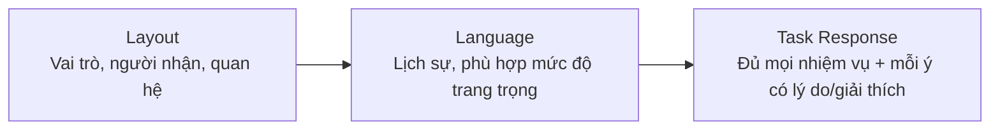
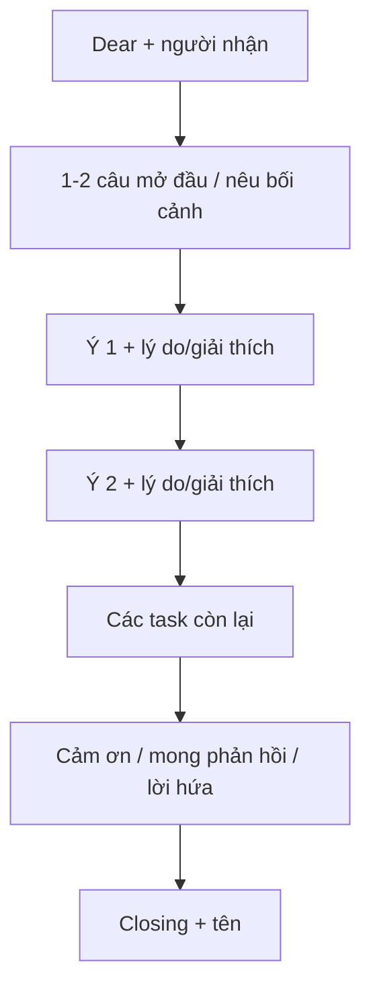
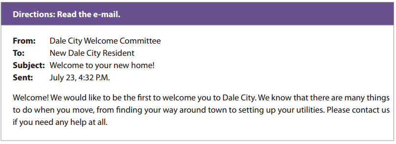

# Part 2 - Respond to a Written Request

## Yêu cầu

- Câu 6-7: phản hồi email.
- 10 phút cho mỗi email.
- Chấm theo chất lượng/đa dạng câu, từ vựng và organization.

## Chiến lược LLT

### L - Layout

Nhận diện mình đang đóng vai ai, viết cho ai, quan hệ gì; sau đó dùng bố cục email chuẩn.

### L - Language

Tài liệu khuyến nghị ưu tiên ngôn ngữ lịch sự, kể cả khi phàn nàn.

### T - Task Response

Đếm chính xác số yêu cầu trong đề. Ví dụ đề yêu cầu 2 câu hỏi + 1 đề xuất thì phải có đủ cả ba; mỗi ý nên kèm một lý do hoặc giải thích ngắn.

## Cấu trúc email chung

## Hình minh họa / đề mẫu tách từ PDF

---

## Nội dung nguồn theo trang
> Phần dưới giữ sát nội dung của PDF để tiện đối chiếu. Bố cục bảng có thể được tuyến tính hóa do trích xuất từ PDF.

<strong>Trang PDF 66</strong>

PART 2. QUESTIONS 6-7
RESPOND TO A WRITTEN REQUEST
PART 2 (QUESTIONS 6-7): RESPOND TO A WRITTEN REQUEST

<strong>Trang PDF 67</strong>

DIRECTIONS
Directions:
In this part of the test, you will show how well you can write a response to an e-mail.
Your response will be scored on
- the quality and variety of your sentences,
- vocabulary, and
- organization.
You will have 10 minutes to read and answer each e-mail.
Hướng dẫn:
Trong phần thi này, bạn sẽ thể hiện khả năng viết phản hồi cho e-mail của mình tốt đến mức nào.
Câu trả lời của bạn sẽ được chấm điểm dựa trên:
- chất lượng và sự đa dạng của câu viết,
- từ vựng, và
- cách tổ chức/sắp xếp ý.
Bạn sẽ có 10 phút để đọc và trả lời mỗi email.

Band score (Thang điểm)
0-1-2-3-4
(for each email)

<strong>Trang PDF 68</strong>

NẮM BẮT CÁCH THỨC RA ĐỀ THI PART 2
Ở phần 2 của TOEIC Writing, bạn sẽ phản hồi lại một email cho sẵn, ví dụ có nội dung như sau (được
trích từ sample test (đề thi mẫu) do trang web của IIG cung cấp):

Translation:
Từ:

Ủy ban Chào mừng cư dân Thành phố Dale
Đến:
Cư dân mới đến thành phố Dale
Chủ đề:
Chào mừng đến với ngôi nhà mới của bạn!
Đã gửi:
Ngày 23 tháng 7, 4h32 chiều.
Chào mừng bạn! Chúng tôi muốn là người đầu tiên chào đón bạn đến với Thành phố Dale. Chúng tôi
biết rằng có rất nhiều việc phải làm khi bạn chuyển nhà, từ việc tìm đường quanh thành phố cho đến
thiết lập các tiện ích của mình. Hãy liên hệ với chúng tôi nếu bạn cần bất kỳ sự trợ giúp nào nhé.

Translation:
Yêu cầu: Hãy phản hồi lại e-mail trên. Đóng vai bạn là người vừa chuyển đến sống ở một thành phố
mới. Trong e-mail gửi đến cho Ủy ban, bạn hãy đưa ra ít nhất 2 yêu cầu về thông tin.

Trong phần Diễn giải thang điểm được đề cập ở phần Tổng quan Bài thi TOEIC Writing, một câu trả
lời tốt nhất và đạt điểm tối đa (4 điểm) yêu cầu thí sinh phải giải quyết một cách hiệu quả tất cả các
nhiệm vụ trong đề, truyền tải rõ ràng thông tin, lập luận có tổ chức, có sự mạch lạc giữa các câu;
đồng thời, giọng điệu và phạm vi từ vựng của câu trả lời phù hợp với đối tượng người đọc đang
hướng đến.

<strong>Trang PDF 69</strong>

Hãy đọc câu trả lời mẫu sau:
Dear Dale City Welcome Committee,

I truly appreciate your warm welcome to Dale City! As a new resident, I am excited to explore
and become acquainted with my new surroundings.
(Tôi thực sự đánh giá cao sự chào đón nồng nhiệt của bạn khi tôi đến Thành phố Dale! Là một cư
dân mới, tôi rất hào hứng khám phá và làm quen với môi trường mới xung quanh).

By the way, I have a couple of inquiries. Can you provide information on local community events
or gatherings? I am eager to connect with fellow residents and engage in activities that showcase
the spirit of Dale City. In addition, could you please share any relevant contacts or resources to
help me set up my utilities? I have a variety of stuff and I am quite confused with how to arrange
it.
(Nhân tiện, tôi có vài câu hỏi. Bạn có thể cung cấp thông tin về các sự kiện hoặc các cuộc gặp mặt
cộng đồng trong khu vực không? Tôi mong muốn được kết nối với những người dân ở đây và
tham gia vào các hoạt động thể hiện tinh thần của Thành phố Dale. Ngoài ra, bạn có thể vui lòng
chia sẻ bất kỳ địa chỉ liên hệ hoặc nguồn giúp đỡ nào có liên quan để giúp tôi sắp xếp các tiện ích
của mình không? Tôi có rất nhiều loại đồ đạc và thấy khá bối rối trong việc sắp xếp chúng như thế
nào.

Thank you so much for your assistance, and I look forward to becoming an active member of the
Dale City community.
(Cảm ơn rất nhiều vì sự hỗ trợ của bạn, và tôi mong muốn trở thành một thành viên tích cực của
cộng đồng Thành phố Dale).

Best regards,
Michelle

So sánh bài mẫu với các tiêu chí đạt điểm tối đa:
Tiêu chí
Bài mẫu
Giải quyết tất cả các nhiệm
vụ của đề:
Câu hỏi 1: Can you provide information on local community
events or gatherings?

<strong>Trang PDF 70</strong>

Yêu cầu đưa ra ít nhất 2 câu
hỏi về thông tin.
Câu hỏi 2: Could you please share any relevant contacts or
resources to help me set up my utilities?
Truyền tải rõ ràng thông tin
Người viết nêu được vị trí của mình “As a new resident”, dựa
vào hoàn cảnh đó để đặt câu hỏi “By the way, I have a couple of
inquiries”.
Lập luận có tổ chức
Cứ sau mỗi câu hỏi, người viết đều cung cấp một lý do vì sao cần
thông tin đó:
Lý do 1: I am eager to connect with fellow residents and engage
in activities that showcase the spirit of Dale City.
Lý do 2: I have a variety of stuff and I am quite confused with
how to arrange it.
Có sự mạch lạc giữa các câu
Nêu một câu tổng quan “I have a couple of inquiries”, sau đó
dùng “In addition” để liên kết giữa ý 1 và ý 2.
Sau đó nói lời cảm ơn “Thank you so much for your assistance”,
vì đúng theo e-mail ban đầu, ủy ban đã ngỏ lời muốn giúp đỡ
nếu cần “if you need any help at all”.
Giọng điệu và phạm vi từ
vựng phù hợp với đối tượng
người đọc đang hướng đến
Người viết nhận thức được mối quan hệ giữa mình và người
nhận e-mail (cư dân mới - ủy ban thành phố) “I truly appreciate
your warm welcome to Dale City”. Sau đó, bày tỏ sự hào hứng
muốn được gắn kết với cộng đồng “I look forward to becoming
an active member of the Dale City community”.

Từ bảng so sánh trên, chúng ta rút ra kinh nghiệm làm bài cho phần thi này, được tóm tắt trong bộ
chiến lược LLT (Layout – Language – Task Response) như sau:
L – Layout (bố cục): Luôn tuân thủ cách trình bày nội dung theo cấu trúc chung của một email
(trang kế tiếp); Khi đọc hiểu đề, cần lưu ý mình đang đóng vai là nhân vật nào, mình đang viết
email phản hồi cho ai, mối quan hệ giữa mình và người nhận email lúc này là gì.
L – Language (ngôn ngữ): Lựa chọn ngôn ngữ lịch sự là cách tối ưu nhất đối với tất cả mọi loại
quan hệ người gửi-người nhận (dù cho đề có yêu cầu viết e-mail phàn nàn về một sự việc).
T – Task response (phản hồi yêu cầu): Bám sát và lên ý tưởng ĐỦ theo yêu cầu của đề (ví dụ: 2
yêu cầu, 1 câu hỏi, 3 lời khuyên…); Cứ một ý kiến đưa ra đều phải được đi kèm với một lý do
hoặc một lời giải thích ngắn gọn.

<strong>Trang PDF 71</strong>

CẤU TRÚC CHUNG CỦA MỘT E-MAIL
Dear [người nhận],

[1-2 câu chào hỏi, nêu vấn đề, nêu cảm xúc khi nhận mail,…]

[Nội dung chính: (ý kiến 1 + giải thích 1); (ý kiến 2 + giải thích 2); …]

[Lời cảm ơn / nêu hi vọng được nhận lại phản hồi / lời hứa hẹn /…]

[Chào hỏi],
[Tên]

• Lưu ý: Bạn hãy so sánh cấu trúc này với các câu trả lời mẫu ở phần II dưới đây, từ đó “thấm nhuần”
cách triển khai câu trả lời theo chiến lược LLT, giúp rút gọn thời gian suy nghĩ. (Chỉ có 10 phút cho
cả việc đọc đề và viết câu trả lời).

