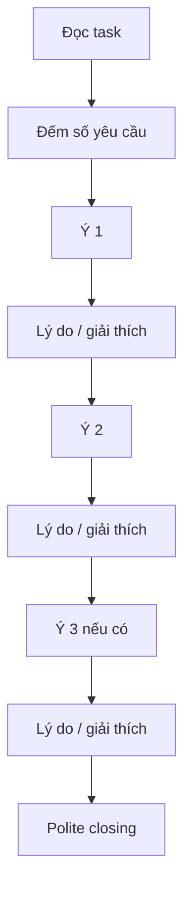
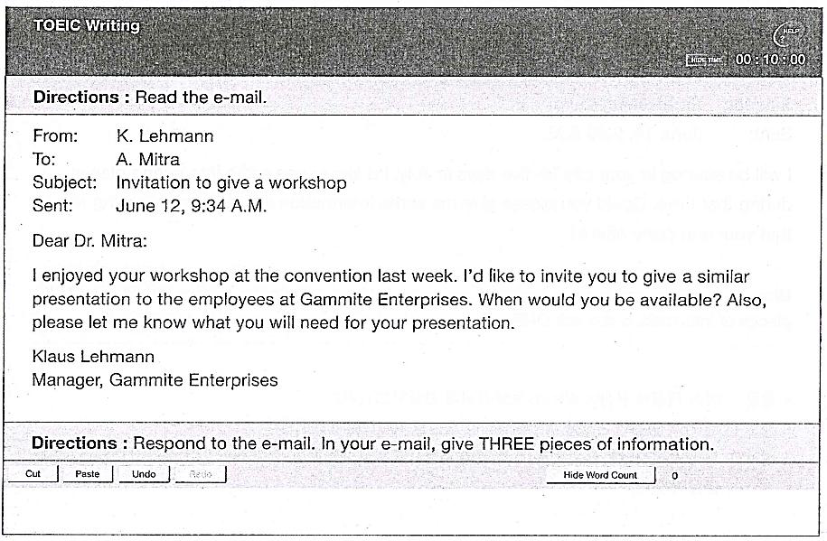
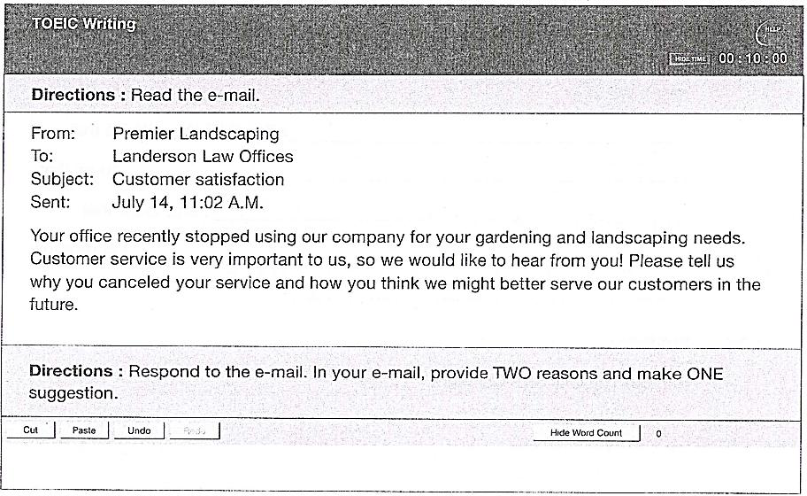
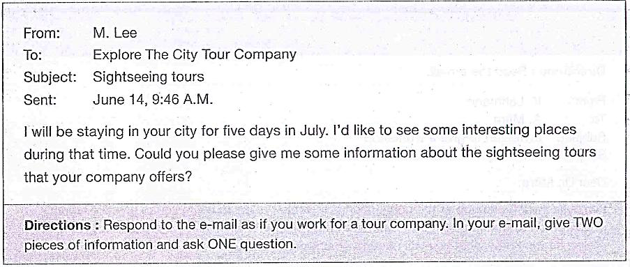

# Unit 5 - Email: Một số dạng câu hỏi phổ biến (1)

## Dạng bài trọng tâm

Tài liệu tập trung vào email **cung cấp thông tin, yêu cầu, đề nghị, nêu sự cố/phàn nàn và hỏi thông tin**.

## Sample 1 - Nhận lời mời workshop

Task trong tài liệu: trả lời lời mời, nêu **3 thông tin** về thời gian rảnh và thiết bị cần dùng. Bài mẫu dùng giọng lịch sự, cho ngày/khung thời gian, projector, speaker và giải thích lý do cho từng chi tiết.

## Sample 2 - Phản hồi dịch vụ gardening/landscaping

Task: nêu **2 lý do** dừng dịch vụ + **1 đề xuất** cải thiện. Bài mẫu phát triển:

- financial limitations -> nhu cầu tối ưu chi phí;
- inconsistent maintenance -> ảnh hưởng hình ảnh chuyên nghiệp;
- flexible pricing plan -> có thể thu hút nhiều nhóm khách hàng hơn.

## Bộ câu mở/kết email cần luyện

Tài liệu cho các mẫu như:

- `I hope this email finds you well.`
- `I am writing to inquire about...`
- `Thank you for your understanding.`
- `I look forward to your response.`
- `If you have any further questions, feel free to contact me.`
- `Looking forward to hearing from you soon.`
- `Please reply to me at your earliest convenience.`

## Cách triển khai theo LLT

## Hình minh họa / đề mẫu tách từ PDF

---

## Nội dung nguồn theo trang
> Phần dưới giữ sát nội dung của PDF để tiện đối chiếu. Bố cục bảng có thể được tuyến tính hóa do trích xuất từ PDF.

<strong>Trang PDF 72</strong>

UNIT 05: EMAIL
MỘT SỐ DẠNG CÂU HỎI PHỔ BIẾN (1)

UNIT 5: EMAIL - MỘT SỐ DẠNG CÂU HỎI PHỔ BIẾN (1)
Expected learning outcomes:
1. Tiếp cận các mẫu câu đa dạng, phù hợp viết email theo dạng bài cung cấp thông tin, yêu cầu, đề
nghị, trình bày sự cố, hỏi thông tin (providing information, requesting, suggesting, mentioning
problem, asking questions)
2. Ôn tập từ vựng cơ bản, tiếp thu thêm từ vựng nâng cao.
------------------------------------------------------------------
I. ĐỀ THI VÀ CÂU TRẢ LỜI MẪU
ĐỀ 01. (Nguồn: ETS TOEIC Writing 2021)

1. Đọc đề:
- Nhập vai: Dr. Mitra
- Gửi phản hồi cho: Mr. Lehmann, Manager of Gammite Enterprises
- Nhiệm vụ: Đưa ra 3 thông tin về thời gian rảnh để diễn thuyết tại công ty Gammite Enterprises &
cần những gì cho bài thuyết trình này.

<strong>Trang PDF 73</strong>

2. Câu trả lời mẫu
Dear Mr. Lehmann,

I appreciate your positive feedback on my workshop at the recent convention and your kind
invitation for a presentation at Gammite Enterprises.
(Tôi rất cảm kích vì phản hồi tích cực của bạn về hội thảo của tôi tại hội nghị gần đây và lời mời
tử tế của bạn cho buổi thuyết trình tại Gammite Enterprises).

Could we schedule the workshop for the second week of July? I have two more speeches to
deliver and will be free in the first half of July. About equipment, I will need a projector to show
my slides and a speaker for some video clips in the presentation.
(Chúng ta có thể sắp xếp buổi hội thảo vào tuần thứ hai của tháng 7 được không? Tôi còn hai bài
phát biểu nữa và sẽ rảnh vào nửa đầu tháng Bảy. Về thiết bị, tôi sẽ cần một máy chiếu để trình
chiếu slide và một chiếc loa để phát một số video clip trong bài thuyết trình).

I look forward to your response with the exact date you want for this workshop.
(Tôi rất mong nhận được phản hồi của bạn về ngày chính xác mà bạn muốn tổ chức hội thảo
này).

Best regards,
Mitra

3. Nhận xét câu trả lời theo bộ chiến lược LLT:
L (Layout): Nhận thức mối quan hệ người
gửi-người nhận trong bố cục:
=> Giọng điệu và từ vựng sử dụng phù hợp (người
nhận lời mời – người gửi lời mời)
L (Language): Ngôn ngữ lịch sự:
=> Cảm ơn vì “positive feedback” và “kind
invitation”.
T (Task response):
- Bám sát và lên ý tưởng ĐỦ theo yêu cầu của
đề:

=> Câu trả lời đủ 3 thông tin: Thời gian rảnh (the
second week of July), cần những gì (a projector
and a speaker).

<strong>Trang PDF 74</strong>

- Một ý đưa ra đều phải được đi kèm với một
lý do hoặc một lời giải thích ngắn gọn:

=> Lý do của “the second week of July”: “I have
two more speeches to deliver and will be free in
the first half of July”
=> Lý do của “a projector”: “to show my slides”
=> Lý do của “a speaker”: “for some video clips in
the presentation”

ĐỀ 02. (Nguồn: ETS TOEIC Writing 2021)

1. Đọc đề
- Nhập vai: Đại diện Landerson Law Offices
- Gửi phản hồi cho: Premier Landscaping
- Nhiệm vụ: Đưa ra 2 lý do vì sao hủy dịch vụ gardening và landscaping với công ty Premier & đưa ra
1 lời đề xuất để cải thiện dịch vụ.
2. Câu trả lời mẫu
Dear Premier Landscaping,

<strong>Trang PDF 75</strong>

I hope this email finds you well. Thank you for your willingness to listen to customer feedback, and
here are the reasons why Landerson Law Offices discontinued your gardening and landscaping
services.
(Tôi hy vọng email này đến được với bạn. Cảm ơn bạn đã sẵn lòng lắng nghe phản hồi của khách
hàng và đây là những lý do khiến Văn phòng Luật Landerson ngừng dịch vụ làm vườn và cảnh quan
của bạn).

First, financial limitations became a concern for our company. As our law office has been actively
working towards cost optimization, we found it necessary to explore reasonably priced landscaping
services.
(Đầu tiên, những hạn chế về tài chính đã trở thành mối lo ngại đối với công ty chúng tôi. Bởi vì
chúng tôi đang tích cực tìm cách tối ưu hóa chi phí, nên chúng tôi thấy cần phải tìm hiểu các dịch
vụ cảnh quan có giá cả hợp lý).
Second, there were times when the maintenance plan was inconsistent. Timely and regular
maintenance is crucial for our office's professional image, and unfortunately, we have seen
shortcomings in this area of your service.
(Thứ hai, có những lúc kế hoạch duy tu không liên tục/nhất quán. Việc duy tu kịp thời và thường
xuyên là rất quan trọng đối với hình ảnh chuyên nghiệp của văn phòng chúng tôi. Thật không may,
chúng tôi đã nhận thấy những thiếu sót trong khía cạnh dịch vụ này của bạn).
In order to improve customer satisfaction, you may want to implement a more flexible pricing plan
that accommodates different budgetary constraints. Providing such customizable plans may attract
a broader range of clients with various needs, in my opinion.
(Để cải thiện sự hài lòng khách hàng, bạn nên triển khai các gói dịch vụ linh hoạt hơn để đáp ứng
các khoản ngân sách khác nhau. Theo tôi, việc cung cấp các gói dịch vụ có thể điều chỉnh như vậy
sẽ giúp thu hút nhiều khách hàng hơn với nhiều nhu cầu khác nhau).
I believe that addressing these concerns will contribute to an improved customer experience.
(Tôi tin rằng việc giải quyết những mối quan ngại này sẽ góp phần cải thiện trải nghiệm của khách
hàng)
Thank you for your understanding.
Best regards,
Michelle
Landerson Law Offices

<strong>Trang PDF 76</strong>

3. Nhận xét câu trả lời theo bộ chiến lược LLT:
L (Layout) - Nhận thức mối quan hệ người
gửi-người nhận:
=> Giọng điệu và từ vựng sử dụng phù hợp (người
phàn nàn về dịch vụ – người cung cấp dịch vụ
chưa đạt độ hài lòng khách hàng)
L (Language) - Ngôn ngữ lịch sự:
=> “Thank you for your willingness to listen to
customer feedback”; “Thank you for your
understanding.”
T (Task response) - Bám sát và lên ý tưởng
ĐỦ theo yêu cầu của đề:

- Một ý đưa ra đều phải được đi kèm với một
lý do hoặc một lời giải thích ngắn gọn:

=> Câu trả lời đủ 2 lý do: “financial limitations” và
“inconsistent maintenance”; đưa ra 1 lời đề nghị
“implement a more flexible pricing plan”
=> Giải thích của “financial limitations”: “actively
working towards cost optimization”
=> Giải thích của “inconsistent maintenance”:
“Timely and regular maintenance is crucial for
our office's professional image”
=> Giải thích của “a more flexible pricing plan”:
“attract a broader range of clients with various
needs”

II. BÀI TẬP ỨNG DỤNG
Exercise 1. Nối câu ở cột A với nghĩa tương ứng ở cột B.
A
Answer
B
1. I hope this email finds you well.
1. ____
a. Rất mong sớm nhận được phản hồi từ
bạn.
2. Thank you for your understanding.
2. ____
b. Vui lòng trả lời tôi trong thời gian sớm
nhất có thể.
3. Thank you for your willingness to listen
to customer feedback.
3. ____
c. Vui lòng cho tôi biết nếu tôi có thể hỗ
trợ bạn điều gì khác.
4. I look forward to your response.
4. ____
d. Cảm ơn bạn đã sẵn lòng lắng nghe
phản hồi của khách hàng.
5. I am writing to inquire about…
5. ____
e. Tôi hy vọng email này sẽ đến được với
bạn.

<strong>Trang PDF 77</strong>

6. Thank you for your attention to this
matter.
6. ____
f. Tôi viết thư này để hỏi về…
7. If you have any further questions, feel
free to contact me.
7. ____
g. Tôi rất mong nhận được phản hồi của
bạn.
8. Looking forward to hearing from you
soon.
8. ____
h. Cảm ơn sự thông cảm của bạn.
9. Please let me know if there is anything
else I can assist you with.
9. ____
i. Nếu bạn có thêm bất kỳ câu hỏi nào, vui
lòng liên hệ với tôi.
10. I appreciate your prompt response.
10. ____
j. Tôi đánh giá cao phản hồi nhanh chóng
của bạn.
11. Don’t hesitate to contact me.
11. ____
k. Cảm ơn bạn đã quan tâm đến vấn đề
này.
12. Please reply to me at your earliest
convenience.
12. ____
l. Đừng ngần ngại liên hệ với tôi.

• Lưu ý:  Hãy dùng 12 câu gợi ý trên để mở đầu/ kết thúc email.
Exercise 2. Trong những cặp câu sau đây, trường hợp nào phù hợp hơn khi viết e-mail? Đánh dấu
(✓) nếu phù hợp, đánh dấu () nếu không phù hợp.

a) Please find the attached document
for your review.

b) I've attached the document. Look at
it and let me know what you think.

a) I would appreciate it if you could
provide the requested information at
your earliest convenience.

b) Hurry up and send me the
information I asked for.

a) Finally, you replied. It took you long
enough.

b) Thank you for your prompt response
to my inquiry.

a) We need to talk about the project.
What's your take on it?

b) I'm writing to discuss the upcoming
project and gather your insights.

a) Are you even reading my emails?
Respond ASAP.

b) I hope this email finds you well.

• Lưu ý: Hãy dùng các câu (✓) để văn phong e-mail của bạn trang trọng hơn.

<strong>Trang PDF 78</strong>

Exercise 3. Đọc email và phản hồi lại email theo yêu cầu bên dưới.

Câu trả lời:
………………………………………………………………………………………………………………………………………………….
………………………………………………………………………………………………………………………………………………….
………………………………………………………………………………………………………………………………………………….
………………………………………………………………………………………………………………………………………………….
………………………………………………………………………………………………………………………………………………….
………………………………………………………………………………………………………………………………………………….
………………………………………………………………………………………………………………………………………………….
………………………………………………………………………………………………………………………………………………….
………………………………………………………………………………………………………………………………………………….
………………………………………………………………………………………………………………………………………………….
………………………………………………………………………………………………………………………………………………….
………………………………………………………………………………………………………………………………………………….
………………………………………………………………………………………………………………………………………………….
………………………………………………………………………………………………………………………………………………….
………………………………………………………………………………………………………………………………………………….
III. TỪ VỰNG
English
Part of
speech
Phonetics
Vietnamese
Appreciate
V
/əˈpriːʃieɪt/
Cảm kích, đánh giá cao
Warm welcome
PHR
/wɔːrm ˈwelkəm/
Sự chào đón nồng nhiệt
Acquainted with
PHR
/əˈkweɪntɪd wɪ=>/
Quen với ai/việc gì

<strong>Trang PDF 79</strong>

Surroundings
N
səˈraʊndɪŋz/
Vùng lân cận
By the way
PHR
/baɪ =>ə weɪ/
Nhân tiện đây
Inquiry
N
/ˈɪnkwəri/
Câu hỏi, lời yêu cầu
Be eager to
PHR
/bi ˈiːɡər tuː/
Háo hức
Fellow
N
/ˈfeloʊ/
Đồng nghiệp, đồng chí, hội
viên, thành viên
Engage in
PHR
/ɪnˈɡeɪdʒ ɪn/
Tham gia vào
Showcase
V
/ˈʃoʊˌkeɪs/
Trưng bày, chỉ ra được, trình ra
Stuff
N
/stʌf/
Đồ vật nói chung
Confused
ADJ
/kənˈfjuzd/
Bối rối
Positive feedback
PHR
/ˈpɑzətɪv ˈfiːdbæk/
Phản hồi tích cực
Deliver a speech
PHR
/dɪˈlɪvər ə spiːtʃ/
Gửi một thông điệp
Projector
N
/prəˈdʒektər/
Máy chiếu
Speaker
N
/ˈspiːkər/
Loa
Willingness to
PHR
/ˈwɪlɪŋnəs tuː/
Sẵn lòng
Customer feedback
N
/ˈkʌstəmər ˈfiːdbæk/
Phản hồi của khách hàng
Financial limitation
PHR
/faɪˈnænʃəl ˌlɪmɪˈteɪʃən/
Hạn chế về ngân sách
Budgetary constraint
PHR
/ˈbʌdʒɪtəri kənˈstreɪnt/
Concern
N
/kənˈsɜrn/
Mối bận tâm
Cost optimization
PHR
/kɒst ˌɒptɪmɪˈzeɪʃən/
Tối ưu hóa chi phí
Reasonably priced
PHR
/ˈriːzənəbli praɪst/
Giá cả hợp lý
Gardening
N
/ˈɡɑrdənɪŋ/
Làm vườn
Landscaping
N
/ˈlændskeɪpɪŋ/
Cảnh quan
Inconsistent
ADJ
/ˌɪnkənˈsɪstənt/
Không nhất quán, không liên
tục
Timely
ADJ
/ˈtaɪmli/
Hợp lúc, đúng lúc
Crucial
ADJ
/ˈkruːʃəl/
Chủ yếu
Shortcoming
N
/ˈʃɔrtˌkʌmɪŋ/
Sự thiếu sót
Implement
V
/ˈɪmplɪˌment/
Thực hiện
Accommodate
V
/əˈkɒməˌdeɪt/
Chứa / thích hợp
Customizable
ADJ
/ˈkʌstəmaɪzəbəl/
Tùy chỉnh, điều chỉnh được

<strong>Trang PDF 80</strong>

Attract
V
/əˈtrækt/
Thu hút
A broader range of clients
PHR
/ə ˈbrɔdər reɪndʒ ʌv
ˈklaɪənts/
Phạm vi khách hàng rộng hơn
Address a concern
PHR
/əˈdres ə kənˈsɜrn/
Giải quyết một mối quan tâm
Prompt response
PHR
/prɒmpt rɪˈspɒns/
Lời hồi đáp nhanh chóng
Hesitate to
PHR
/ˈhezɪˌteɪt tuː/
Ngần ngại
Reply to s.o
PHR
/rɪˈplaɪ tuː ˈsʌmwʌn/
Trả lời ai
At one’s earliest
convenience
PHR
/æt wʌnz ˈɜrliɪst
kənˈviːniəns/
Vào lúc thuận tiện nhất của ai
đó
Have any further
questions
PHR
/hæv ˈeni ˈfɜr=>ər
ˈkwestʃənz/
Có thêm câu hỏi nào
Matter
N
/ˈmætər/
Vấn đề
Attention to
PHR
/əˈtenʃən tuː/
Chú ý đến
Find the attached
document
PHR
/faɪnd =>ə əˈtætʃt
ˈdɒkjʊmənt/
Tìm đọc tài liệu đính kèm
Reach out to
PHR
/riːʧ aʊt tuː/
Liên lạc với
Thrilled
ADJ
/θrɪld/
Phấn khích
Iconic
ADJ
/aɪˈkɒnɪk/
Mang tính biểu tượng
Immersive
ADJ
/ɪˈmɜrsɪv/
Sâu sắc, nhiều, phong phú
Breathtaking view
N
/ˈbreɪθˌteɪkɪŋ vjuː/
Quang cảnh đẹp ngoạn mục
Cityscape
N
/ˈsɪtɪˌskeɪp/
Cảnh quan thành phố
Illuminate
V
/ɪˈluːmɪˌneɪt/
Chiếu sáng
Modify
V
/ˈmɒdɪˌfaɪ/
Thay đổi, điều chỉnh
Match one’s preferences
PHR
/mætʃ wʌnzˈprefərənsɪz/ Phù hợp với sở thích của ai đó
Yours sincerely,
Yours faithfully,
Best regards,
Cordially,
PHR
/jʊərz sɪnˈsɪrli/
/jʊərz ˈfeɪθfʊli/
/best rɪˈɡɑrdz/
/ˈkɔrdiəli/
Trân trọng,
06
UNIT 06: EMAIL
MỘT SỐ DẠNG CÂU HỎI PHỔ BIẾN (2)

