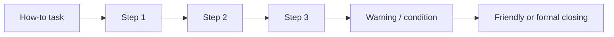
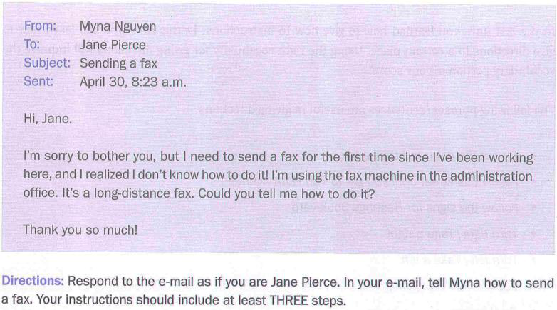
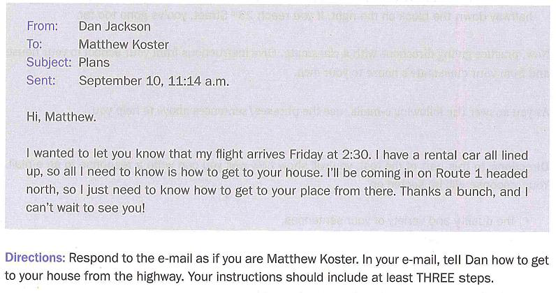
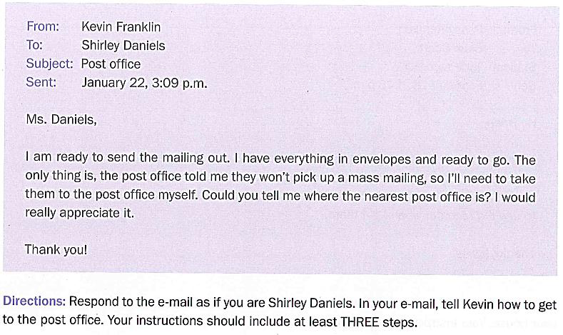

# Unit 6 - Email: Một số dạng câu hỏi phổ biến (2)

## Dạng bài “How to”

Tài liệu luyện email đưa ra **hướng dẫn/quy trình** và **chỉ đường**.

### Sample 3 - Hướng dẫn gửi fax

Bài mẫu triển khai ít nhất 3 bước theo chuỗi:

1. chuẩn bị tài liệu;
2. nhập số fax và mã vùng/quốc tế cần thiết;
3. nhấn Send/Start và kiểm tra quá trình gửi.

### Sample 4 - Chỉ đường từ highway về nhà

Bài mẫu dùng ngôn ngữ chỉ hướng cụ thể: `head north`, `take Exit`, `merge onto`, `continue`, `reach the roundabout`, `take the second exit`, `on the left`.

## Ngôn ngữ tổ chức trình tự

`First` -> `Next` -> `Then` -> `Finally`.

## Ngôn ngữ giúp người nhận tránh lỗi

- `Be careful not to...`
- `Be sure to...`
- `Don't forget to...`
- `If..., then...`

## Mức độ trang trọng

Tài liệu nhấn mạnh phải xác định quan hệ người gửi-người nhận. Đồng nghiệp/bạn bè có thể dùng `Hi`, `Best`, `Yours`; email công việc với người lạ/đối tác nên trang trọng hơn.

## Hình minh họa / đề mẫu tách từ PDF

---

## Nội dung nguồn theo trang
> Phần dưới giữ sát nội dung của PDF để tiện đối chiếu. Bố cục bảng có thể được tuyến tính hóa do trích xuất từ PDF.

<strong>Trang PDF 81</strong>

UNIT 6: EMAIL – MỘT SỐ DẠNG CÂU HỎI PHỔ BIẾN (2)
Expected learning outcomes:
1. Tiếp cận các mẫu câu đa dạng, phù hợp viết email theo dạng bài cung cấp hướng dẫn (providing
instructions/ giving directions).
2. Kết hợp từ vựng và cấu trúc câu để luyện tập viết email từ Actual tests.
3. Ôn tập từ vựng cơ bản, tiếp thu thêm từ vựng nâng cao.
------------------------------------------------------------------
I. ĐỀ THI VÀ CÂU TRẢ LỜI MẪU (TIẾP THEO UNIT 5)
ĐỀ 03. (Nguồn: New TOEIC Writing Coach)

1. Đọc đề
- Nhập vai: Jane Pierce
- Gửi phản hồi cho: Myna Nguyen
- Nhiệm vụ: Đưa ra lời hướng dẫn cách gửi fax có ít nhất 3 bước.

<strong>Trang PDF 82</strong>

2. Câu trả lời mẫu
Hi Myna,

No problem at all. I’m happy to help you with sending the fax. Here are three simple steps to guide
you through the process:
(Không có vấn đề gì cả. Tôi rất vui được giúp bạn gửi fax. Đây là ba bước đơn giản để hướng dẫn
bạn thực hiện quy trình này)
First, make sure the document you want to fax is ready. If it's a physical document, have it printed
out. If it's a digital file, it should be saved and accessible.
(Trước tiên, hãy đảm bảo tài liệu bạn muốn fax đã sẵn sàng. Nếu đó là file cứng, hãy in nó ra. Nếu
đó là file mềm, nó phải được lưu và cấp quyền truy cập)
Next, on the machine's keypad, dial the long-distance fax number you intend to send the document
to. Be sure to include any necessary international or area codes.
(Tiếp theo, trên bàn phím của máy, quay số fax mà bạn định gửi tài liệu tới. Hãy chắc chắn nó bao
gồm cả mã quốc tế hoặc mã vùng cần thiết).

Finally, once the number is dialed, look for and press a button or option on the fax machine that
says "Send" or "Start". The machine will then start the process, and you should hear the familiar
fax tones as the document is sent.
(Cuối cùng, sau khi quay số xong, hãy tìm và nhấn nút trên máy fax có nội dung "Gửi" hoặc "Bắt
đầu". Sau đó, máy sẽ bắt đầu quá trình và bạn sẽ nghe thấy âm báo fax quen thuộc khi tài liệu
được gửi đi).

If you need further assistance, don’t hesitate to contact me.
(Nếu bạn cần hỗ trợ thêm, đừng ngần ngại liên hệ với tôi nhé).

Best,
Jane Pierce

<strong>Trang PDF 83</strong>

3. Nhận xét câu trả lời theo bộ chiến lược LLT:
L (Layout) - Nhận thức mối quan hệ người
gửi-người nhận:
=> Giọng điệu và từ vựng sử dụng phù hợp (người
đang đưa ra sự trợ giúp – người cần sự trợ giúp)
L (Language) - Ngôn ngữ lịch sự:
=> “Hi Myna, No problem at all” (phù hợp với mối
quan hệ đồng nghiệp trong một văn phòng)
T (Task response) - Bám sát và lên ý tưởng
ĐỦ theo yêu cầu của đề:
- Một ý đưa ra đều phải được đi kèm với một
lý do hoặc một lời giải thích ngắn gọn:
=> Lời hướng dẫn cách gửi fax có đủ ít nhất 3
bước.
=> Giải thích cho “fax is ready”: “physical
document – print; a digital file – saved and
accessible”
=> Giải thích rõ cho “dial the long-distance fax
number”: “on the machine's keypad; include
any necessary international or area codes”
=> Giải thích rõ cho “press a button”: “says
"Send" or "Start"; hear the familiar fax tones”

ĐỀ 04. (Nguồn: New TOEIC Writing Coach)

1. Đọc đề
- Nhập vai: Matthew Koster
- Gửi phản hồi cho: Dan Jackson

<strong>Trang PDF 84</strong>

- Nhiệm vụ: Đưa ra lời hướng dẫn có ít nhất 3 bước để về nhà từ đường cao tốc.
2. Câu trả lời mẫu
Hi Dan,

Great to hear about your upcoming visit! I'm looking forward to seeing you too.
To get to my house from the highway, follow these three steps:
(Thật vui khi được nghe về chuyến thăm sắp tới của bạn! Tôi cũng mong được gặp bạn lắm.
Để đến nhà tôi từ đường cao tốc, hãy đi theo ba bước sau):

After heading north on Route 1, take Exit 3 towards Pine Street.
(Sau khi đi về hướng bắc trên Route 1, rẽ vào Exit 3 về phía Pine Street).

Then, merge onto Pine Street and continue for about 2 miles until you reach the roundabout.
(Sau đó, nhập vào đường Pine Street và đi tiếp khoảng 2 dặm cho đến khi đến vòng xuyến).

Finally, take the second exit from the roundabout onto Oak Avenue. My house is the third one on
the left, number 123 Oak Avenue.
(Cuối cùng, đi theo lối ra thứ hai từ vòng xuyến vào Đại lộ Oak. Nhà tôi ở căn thứ ba bên trái, số
123 Đại lộ Oak).

Safe travels, and see you soon!
(Đi đường an toàn và hẹn gặp bạn sớm nhé!)

Yours,
Matthew Koster

3. Nhận xét câu trả lời theo bộ chiến lược LLT:
L (Layout) - Nhận thức mối quan hệ người
gửi-người nhận:
=> Giọng điệu và từ vựng sử dụng phù hợp (người
hướng dẫn đường đi – người hỏi đường)
L (Language) - Ngôn ngữ phù hợp (bạn thân
thiết đến thăm nhau):
=> “Great to hear about your upcoming visit! I'm
looking forward to seeing you too; Safe travels,
and see you soon!; Yours,”

<strong>Trang PDF 85</strong>

T (Task response) - Bám sát và lên ý tưởng
ĐỦ theo yêu cầu của đề:
- Một ý đưa ra đều phải được đi kèm với một
lý do hoặc một lời giải thích ngắn gọn (Sử
dụng cụ thể tên đường):

=> Đưa ra đủ ít nhất 3 bước để hướng dẫn về nhà
từ đường cao tốc.
=> Giải thích chi tiết cho các bước: “heading
north, take towards, merge onto, continue for
about 2 miles; reach the roundabout; take the
second exit; my house is the third one on the
left; number…” (sử dụng từ ngữ đúng ngữ cảnh
chỉ đường)

• Lưu ý:
- Đây là 2 dạng bài “How to” - yêu cầu bạn nêu ra lời hướng dẫn với các bước cụ thể. Tuy là dạng đề
hiếm gặp, nhưng bạn cũng nên “đút túi” vài bài để đề phòng.
- Thông thường, ngôn ngữ được sử dụng sẽ là “First, [step 1]. Next, [step 2]. Then, [step 3]. Finally,
[the last step]”. Kèm theo đó, khi bạn đưa ra lời hướng dẫn, bạn thường mong muốn người kia
không mắc lỗi trong lúc thực hiện. Hãy dùng những câu như “Be careful not to…”, “Be sure to…”,
“Don’t forget to…”, “If…, then…”.
- Thêm một lưu ý nhỏ, bạn cần xác định thật rõ mối quan hệ giữa người gửi-người nhận, để lựa chọn
giọng điệu và từ ngữ phù hợp. Ở Unit 5, đa số văn phong dùng ở dạng trang trọng, vì tình huống đưa
ra là người lạ mặt, hoặc đại diện công ty trao đổi với nhau. Ở Unit 6 này, 2 đề mẫu đều cho thấy họ là
mối quan hệ thân thiết (đồng nghiệp, bạn bè), do đó từ ngữ cũng được “mềm hóa” hơn, thân mật và
ít trang trọng: Hi Dan (thay vì Dear); Best,/Yours, (thay vì Yours faithfully,…).
II. BÀI TẬP ỨNG DỤNG
Exercise 1. Sử dụng những cấu trúc gợi ý trên, hãy viết một câu để người nhận mail tránh mắc sai
lầm.
a. using a photocopy machine
Hãy cẩn thận đừng để các tài liệu có ghim hoặc kẹp giấy để tránh tình trạng kẹt giấy.
=> ________________________________________________________________________
b. watering plants
Đừng quên tuân theo lịch tưới nước nhất quán mà tôi đã dán trên tường để tránh tưới quá nhiều
nước cho cây.
=> ________________________________________________________________________

<strong>Trang PDF 86</strong>

c. using discount coupons to buy items
Hãy đảm bảo đọc kỹ các điều khoản để tránh bỏ qua những hạn chế khi áp dụng hoặc ngày hết hạn.
=> ________________________________________________________________________

d. restocking items on shelves
Nếu có mặt hàng nào đã hết hạn sử dụng, hãy cho chúng vào xe đẩy hàng và mang vào kho riêng.
=> ________________________________________________________________________
Exercise 2. Đọc email và phản hồi lại email theo yêu cầu bên dưới.

Câu trả lời:
………………………………………………………………………………………………………………………………………………….
………………………………………………………………………………………………………………………………………………….
………………………………………………………………………………………………………………………………………………….
………………………………………………………………………………………………………………………………………………….
………………………………………………………………………………………………………………………………………………….
………………………………………………………………………………………………………………………………………………….
………………………………………………………………………………………………………………………………………………….
………………………………………………………………………………………………………………………………………………….
………………………………………………………………………………………………………………………………………………….
………………………………………………………………………………………………………………………………………………….
………………………………………………………………………………………………………………………………………………….

<strong>Trang PDF 87</strong>

………………………………………………………………………………………………………………………………………………….
………………………………………………………………………………………………………………………………………………….
………………………………………………………………………………………………………………………………………………….
………………………………………………………………………………………………………………………………………………….
………………………………………………………………………………………………………………………………………………….
………………………………………………………………………………………………………………………………………………….
………………………………………………………………………………………………………………………………………………….
………………………………………………………………………………………………………………………………………………….
………………………………………………………………………………………………………………………………………………….
III. TỪ VỰNG
English
Part of
speech
Phonetics
Vietnamese
Bother
V
/ˈbɒ=>ər/
Làm phiền
Realize
V
/ˈriːəˌlaɪz/
Nhận ra
Administration office
N
/ədˌmɪnɪˈstreɪʃən ˈɒfɪs/
Văn phòng hành chính
Long-distance
ADJ
/lɒŋ ˈdɪstəns/
Khoảng cách xa
Physical
ADJ
/ˈfɪzɪkəl/
Thuộc về vật chất / có thật /
có thể chạm vào được
Digital
ADJ
/ˈdɪdʒɪtl̩/
Điện tử
Accessible
ADJ
/əkˈsesəbl̩/
Có thể truy cập
Keypad
N
/ˈkiːˌpæd/
Bàn phím
Dial
V
/daɪəl/
Quay số
Intend to
V
/ɪnˈtend tuː/
Có ý định
Area codes
N
/ˈeəriə koʊdz/
Mã vùng
Press a button
V
/pres ə ˈbʌtn̩/
Nhấn nút
Familiar
ADJ
/fəˈmɪljər/
Thân thuộc
Tone
N
/toʊn/
Âm thanh
Rental car
N
/ˈrentəl kɑr/
Ôtô cho thuê
All lined up
ADJ
/ɔːl laɪnd ʌp/
Tất cả đã được chuẩn bị sẵn
Route
N
/rut/
Tuyến đường
Head north
PHR
/hed nɔrθ/
Đi về phía bắc
Head south
PHR
/hed saʊθ/
Đi về phía nam

<strong>Trang PDF 88</strong>

Head west
PHR
/hed west/
Đi về phía tây
Head east
PHR
/hed ist/
Đi về phía đông
Thanks a bunch.
SENTENCE
/θæŋks ə bʌntʃ/
Cảm ơn nhiều.
I can’t wait to see you.
SENTENCE
/aɪ kænt weɪt tuː siː juː/
Tôi nóng lòng muốn gặp bạn.
Highway
N
/ˈhaɪˌweɪ/
Xa lộ
Take the exit…
PHR
/teɪk =>ə ˈeksɪt/
Đi theo lối ra…
Merge onto
PHR
/mɜrdʒ ˈɒntuː/
Hợp nhất vào
Roundabout
N
/ˈraʊndəˌbaʊt/
Bùng binh
Avenue
N
/ˈævəˌnjuː/
Đại lộ
Safe travels!
SENTENCE
/seɪf ˈtrævəlz/
Đi đường an toàn nhé (câu
chúc)
Discount coupon
PHR
/ˈdɪskaʊnt ˈkuːpɒn/
Phiếu giảm giá
Restock items on
shelves
PHR
/ˌriːˈstɒk ˈaɪtəmz ɒn
ʃelvz/
Bổ sung lại các mặt hàng trên
kệ
Staple
N
/ˈsteɪpəl/
Ghim giấy
Paper clip
N
/ˈpeɪpər klɪp/
Kẹp giấy
Paper jams
N
/ˈpeɪpər dʒæmz/
Tình trạng kẹt giấy
Consistent
V
/kənˈsɪstənt/
Nhất quán
Overlook
V
/ˌoʊvərˈlʊk/
Bỏ qua
Restriction
N
/rɪˈstrɪkʃən/
Sự hạn chế
Expiration date
N
/ˌekspəˈreɪʃən deɪt/
Ngày hết hạn
Expire
V
/ɪkˈspaɪər/
Hết hạn
Cart
N
/kɑrt/
Xe đẩy
Separate
ADJ/V
/ˈsepəˌreɪt/
Tách biệt, riêng biệt
Storage
N
/ˈstɔrɪdʒ/
Kho
Intersection
N
/ˌɪntərˈsekʃən/
Ngã tư, đường giao nhau
Block
N
/blɒk/
Dãy nhà, lô đất
Corner
N
/ˈkɔrnər/
Góc đường

