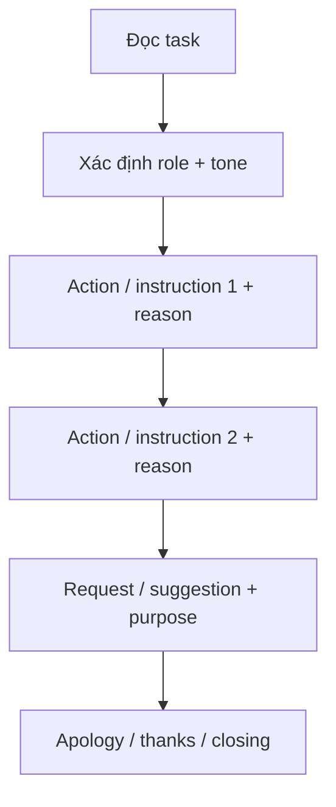
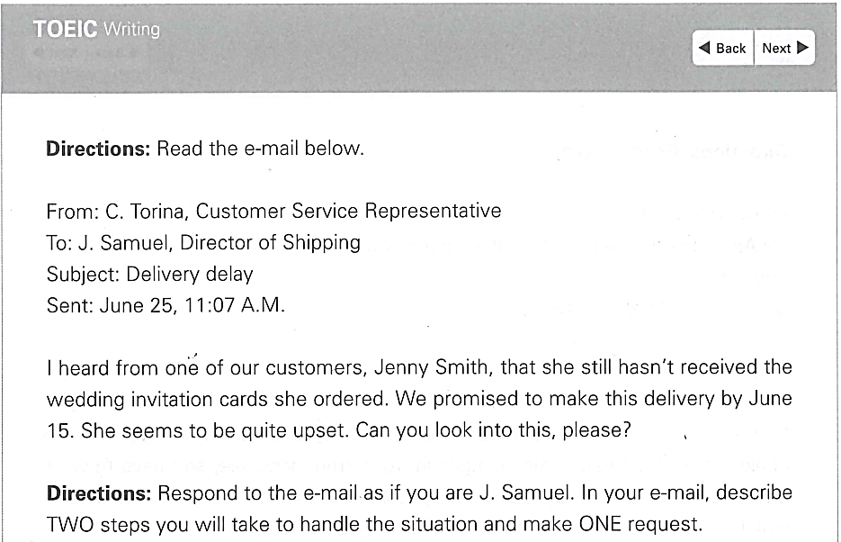
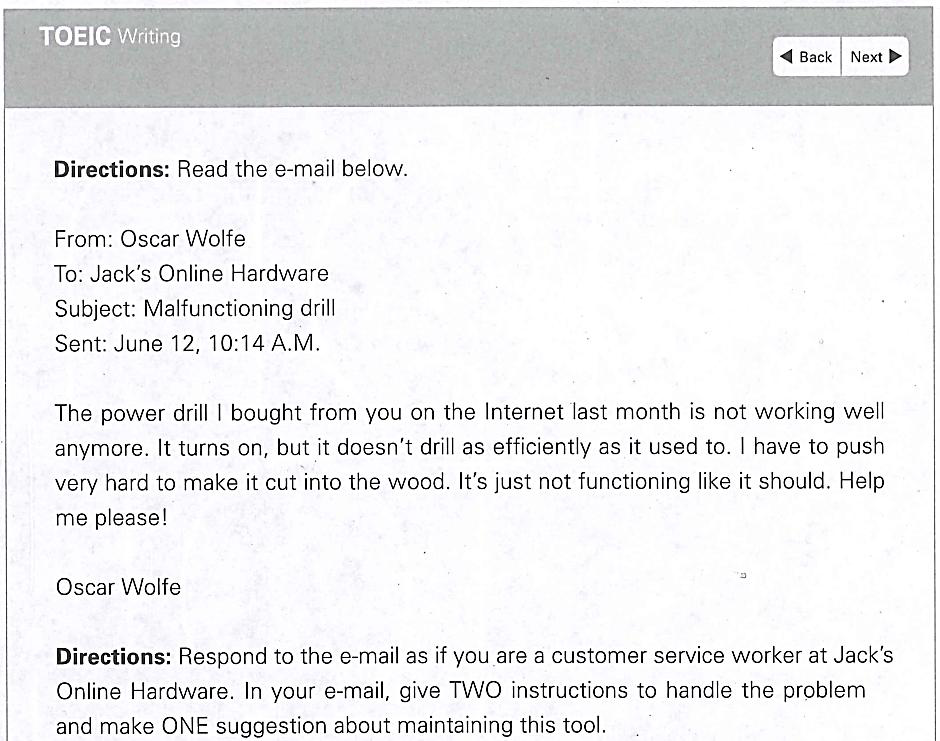
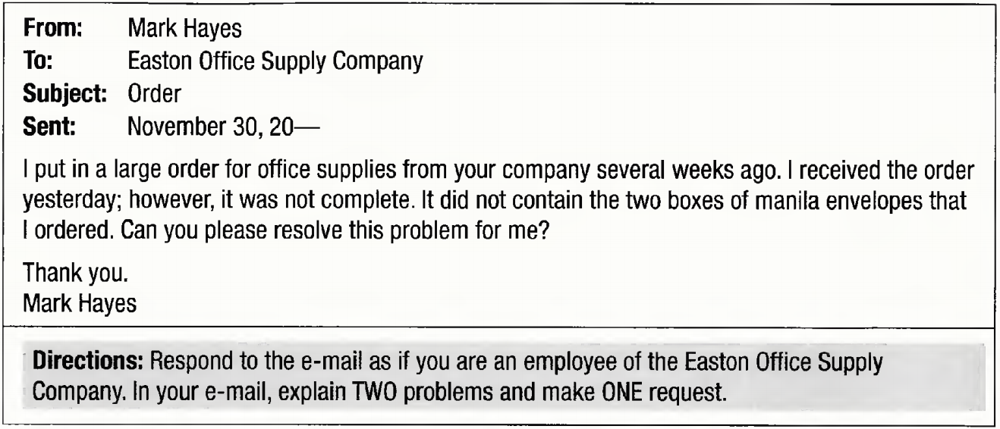

# Unit 7 - Email: Luyện tập với đề thi thật

## Mục tiêu

Kết hợp dạng task của Unit 5 và Unit 6 trong email thực tế, vẫn dùng LLT để kiểm soát bố cục, ngôn ngữ và độ đầy đủ.

## Đề 05 - Shipping issue

Task: nêu **2 bước giải quyết** + **1 yêu cầu**. Bài mẫu:

- điều tra trạng thái đơn hàng bằng shipping records/tracking;
- phối hợp shipping team để expedite, dùng express/overnight delivery;
- yêu cầu order number và relevant details để cập nhật chính xác.

## Đề 06 - Power drill problem

Task: **2 hướng dẫn xử lý** + **1 đề xuất bảo trì**. Bài mẫu:

- siết drill bit cho chắc;
- sạc đầy pin;
- bảo dưỡng định kỳ: lau bụi và tra dầu cho moving parts.

## Ngôn ngữ customer service nên dùng

- `Thank you for bringing this to my attention.`
- `I will take immediate action to address this issue.`
- `Thank you for your understanding.`
- `I apologize for any inconvenience this may have caused.`
- `We sincerely apologize for any inconvenience you have experienced.`
- `Thank you for choosing our service.`

## Điểm ngữ pháp: Causative passive

Tài liệu giới thiệu:

`HAVE / GET + something + V3/ed`

Ví dụ về ý nghĩa: nhấn mạnh vật/đối tượng được xử lý, không tập trung ai là người thực hiện.

## Hình minh họa / đề mẫu tách từ PDF

---

## Nội dung nguồn theo trang
> Phần dưới giữ sát nội dung của PDF để tiện đối chiếu. Bố cục bảng có thể được tuyến tính hóa do trích xuất từ PDF.

<strong>Trang PDF 89</strong>

UNIT 07: EMAIL
LUYỆN TẬP VỚI CÁC ĐỀ THI THẬT
UNIT 7: EMAIL – LUYỆN TẬP VỚI CÁC ĐỀ THI THẬT
Expected learning outcomes:
1. Tiếp cận các mẫu câu đa dạng, phù hợp viết email.
2. Kết hợp từ vựng và cấu trúc câu ở Unit 5 và Unit 6, luyện tập viết email từ Actual tests.
3. Ôn tập từ vựng cơ bản, tiếp thu thêm từ vựng nâng cao.
------------------------------------------------------------------
I. ĐỀ THI VÀ CÂU TRẢ LỜI MẪU (KẾT HỢP GIỮA DẠNG BÀI CỦA UNIT 5 VÀ UNIT 6)
ĐỀ 05. (Nguồn: Tomato TOEIC Writing Flow)

1. Đọc đề
- Nhập vai: J. Samuel
- Gửi phản hồi cho: C. Torina, Customer Service Representative
- Nhiệm vụ: Đưa ra 2 bước giải quyết vấn đề và 1 yêu cầu.
2. Câu trả lời mẫu
Dear Ms. Torina,

<strong>Trang PDF 90</strong>

Thank you for bringing this to my attention. I understand the urgency of the situation and will take
immediate action to address this issue.
(Cảm ơn bạn đã cho tôi biết vấn đề này. Tôi hiểu tính cấp bách của tình huống này và sẽ hành động
ngay lập tức để giải quyết vấn đề).

I will take the following steps: First of all, I will initiate an investigation into the status of Ms. Smith's
order. This will involve checking the shipping records and tracking information to identify any
potential issues or delays in the delivery process. Then, I will coordinate with the shipping team to
expedite the processing of Ms. Smith's order, using express or overnight delivery.
(Tôi sẽ thực hiện các bước sau: Trước hết, tôi sẽ bắt đầu một cuộc điều tra về tình trạng đơn hàng
của cô Smith. Điều này bao gồm việc kiểm tra hồ sơ vận chuyển và thông tin theo dõi để xác định
vấn đề tiềm ẩn hoặc sự chậm trễ nào đó trong quá trình giao hàng. Sau đó, tôi sẽ phối hợp với đội
vận chuyển đẩy nhanh việc xử lý đơn hàng của cô Smith bằng hình thức chuyển phát nhanh hoặc
giao hàng qua đêm)

By the way, could you please send me Ms. Smith's order number and any relevant details regarding
the order? This information will help us to provide her with accurate updates on the status of her
delivery.
(Nhân tiện, bạn có thể vui lòng gửi cho tôi số đơn đặt hàng của cô Smith và bất kỳ chi tiết nào liên
quan đến đơn hàng không? Thông tin này sẽ giúp chúng tôi cung cấp cho cô ấy thông tin cập nhật
chính xác về tình trạng giao hàng của cô ấy)

Thank you for your understanding, and I apologize for any inconvenience this may have caused.
(Cảm ơn sự thông cảm của bạn và tôi xin lỗi nếu có bất kỳ sự bất tiện nào mà điều này có thể gây
ra)

Best regards,
J. Samuel
Director of Shipping

<strong>Trang PDF 91</strong>

3. Nhận xét câu trả lời theo bộ chiến lược LLT:
L (Layout) - Nhận thức mối quan hệ người
gửi-người nhận:
=> Giọng điệu và từ vựng sử dụng phù hợp
(trưởng bộ phận giao hàng đang tìm hướng giải
quyết – nhân viên chăm sóc khách hàng cùng
công ty)
L (Language) - Ngôn ngữ lịch sự, phù hợp:
=> “Thank you for bringing this to my attention;
could you please send me; Thank you for your
understanding, and I apologize for any
inconvenience this may have caused.”
T (Task response) - Bám sát và lên ý tưởng
ĐỦ theo yêu cầu của đề:
=> Đủ 2 bước giải quyết và 1 yêu cầu cung cấp
thông tin.
- Một ý đưa ra đều phải được đi kèm với một
lý do hoặc một lời giải thích ngắn gọn:
=> Giải thích cho “fax is ready”: “physical
document – print; a digital file – saved and
accessible”
=> Giải thích cho “initiate an investigation”:
“checking the shipping records and tracking
information”
=> Giải thích rõ cho “coordinate with the shipping
team”: “expedite the processing; using express
or overnight delivery”
=> Giải thích rõ cho “send me Ms. Smith's order
number and relevant details”: “accurate
updates on the status of her delivery”

<strong>Trang PDF 92</strong>

ĐỀ 06. (Nguồn: Tomato TOEIC Writing Flow)

1. Đọc đề
- Nhập vai: a customer service worker at Jack's Online Hardware
- Gửi phản hồi cho: Oscar Wolfe
- Nhiệm vụ: Đưa ra 2 lời hướng dẫn để giải quyết vấn đề và 1 đề xuất bảo trì công cụ.
2. Câu trả lời mẫu
Dear Mr. Wolfe,

Thank you for reaching out to Jack's Online Hardware regarding the issue with your power drill.
We sincerely apologize for any inconvenience you have experienced.
(Cảm ơn bạn đã liên hệ với Jack's Online Hardware về sự cố với máy khoan điện của bạn. Chúng
tôi chân thành xin lỗi vì bất kỳ sự bất tiện nào bạn đã gặp phải)
Here are two instructions to address the problem: First, make sure to tighten the drill bit so that
it is securely attached to the drill. Loose or improperly attached bits can affect the efficiency of
the drilling process. In addition, you are using a battery-powered drill, so don’t forget to have it
fully charged. Inadequate power supply can lead to a decrease in drill performance.

<strong>Trang PDF 93</strong>

(Dưới đây là hai hướng dẫn để giải quyết vấn đề: Đầu tiên, hãy đảm bảo siết chặt mũi khoan sao
cho nó được gắn chắc chắn vào máy khoan. Các mũi khoan bị lỏng hoặc gắn không đúng cách có
thể ảnh hưởng đến hiệu quả của quá trình khoan. Ngoài ra, bạn đang sử dụng máy khoan chạy
bằng pin nên đừng quên sạc đầy pin nhé. Nguồn điện không đủ có thể dẫn đến giảm hiệu suất
máy khoan).

For your information, dust can accumulate over time we use. Therefore, periodic maintenance,
such as wiping off and applying a small amount of oil to the moving parts, is crucial.
(Xin lưu ý với bạn rằng, bụi có thể tích tụ theo thời gian chúng ta sử dụng. Do đó, việc bảo trì định
kỳ, chẳng hạn như lau sạch và tra một lượng nhỏ dầu vào các bộ phận chuyển động, là rất quan
trọng)

Thank you for choosing Jack's Online Hardware. I hope to see you return for your next purchases.
(Cảm ơn bạn đã lựa chọn Jack's Online Hardware. Tôi hy vọng sẽ thấy bạn quay trở lại cho những
lần mua hàng tiếp theo)

Best regards,
Customer Service Representative
Jack's Online Hardware

3. Nhận xét câu trả lời theo bộ chiến lược LLT:
L (Layout) - Nhận thức mối quan hệ người
gửi-người nhận:
=> Giọng điệu và từ vựng sử dụng phù hợp (nhân
viên chăm sóc khách hàng đang đưa ra cách giải
quyết vấn đề - khách hàng gặp sự cố về sản
phẩm)
L (Language) - Ngôn ngữ phù hợp (của một
nhân viên chăm sóc khách hàng):
=> “We sincerely apologize for any
inconvenience you have experienced; I hope to
see you return for your next purchases”
T (Task response) - Bám sát và lên ý tưởng
ĐỦ theo yêu cầu của đề:
=> Đủ 2 lời hướng dẫn khắc phục sự cố và 1 lời đề
nghị bảo trì dụng cụ đúng cách.

<strong>Trang PDF 94</strong>

- Một ý đưa ra đều phải được đi kèm với một
lý do hoặc một lời giải thích ngắn gọn:
=> Giải thích cho “fax is ready”: “physical
document – print; a digital file – saved and
accessible”
=> Giải thích cho “tighten the drill bit”: “Loose or
improperly attached bits can affect the
efficiency”
=> Giải thích cho “don’t forget to have it fully
charged”: “you are using a battery-powered
drill; Inadequate power supply can lead to a
decrease in drill performance”
=> Giải thích cho “dust can accumulate over
time”: “wiping off and applying a small amount
of oil to the moving parts”

• Lưu ý về dạng đề:
- Đây là 2 đề thi kết hợp giữa dạng bài cung cấp lời đề xuất, yêu cầu (UNIT 5) và dạng bài “How to”
(UNIT 6).
- Ngôn ngữ được sử dụng vẫn sẽ là “First, [step 1]. Next, [step 2]. Then, [step 3]. Finally, [the last
step]” để mô tả các bước theo chuỗi logic. Cùng với đó, khi bạn đưa ra yêu cầu, ngôn ngữ lịch sự
được sử dụng là “Could you please…?”
- Đặc biệt, khi ở vị thế là nhân viên chăm sóc khách hàng, hoặc đại diện một bộ phận đang cố tìm
cách khắc phục sự cố, ngôn ngữ sử dụng phải thật khiêm nhường và lịch sự, ví dụ:
-
Thank you for bringing this to my attention.
-
I will take immediate action to address this issue.
-
Thank you for your understanding.
-
I apologize for any inconvenience this may have caused.
-
We sincerely apologize for any inconvenience you have experienced.
-
Thank you for choosing our service.
-
I hope to see you return for your next purchases.
• Lưu ý về điểm ngữ pháp thường dùng trong văn viết:
PASSIVE IN CAUSATIVE FORM (Bị động trong câu cầu khiến)

<strong>Trang PDF 95</strong>

Cách dùng: Đây là một cách diễn đạt khác của thể bị động thông thường (Be + V3/ed), với cách
dùng tương tự: người nói/viết muốn nhấn mạnh đối tượng chịu tác động (nhận hành động),
không tập trung vào tác nhân gây ra hành động đó.

Cấu trúc sử dụng: HAVE / GET something V3/ed

Ví dụ từ bài mẫu:
“You are using a battery-powered drill, so don’t forget to have it fully charged”
=> Người viết muốn nhấn mạnh: pin của máy khoan phải được sạc đầy (không bắt buộc người
thực hiện việc này phải là người nhận mail hay ai đó khác)
II. BÀI TẬP ỨNG DỤNG
Exercise 1. Sử dụng cấu trúc “have/get something V3/ed” để diễn đạt các câu sau bằng tiếng Anh:
a. Công ty đã để cho văn phòng được sửa sang lại trong kỳ nghỉ hè.
=> The company had/got the office renovated during the summer holiday.
b. Nhân viên được yêu cầu sự có mặt của họ trong buổi tập huấn phải được ghi lại.
=> _________________________________________________________________________________
c. Chúng tôi đang để toàn bộ hệ thống máy tính được kiểm tra bởi chuyên viên IT.
=> _________________________________________________________________________________
d. Bạn vui lòng đi in màu các tài liệu này để chúng thu hút khách hàng hơn.
=> _________________________________________________________________________________
e. Hãy chuẩn bị bài thuyết trình trước cuối tuần này nhé.
=> _________________________________________________________________________________
Exercise 2. Sắp xếp các ý tưởng sau theo từng chủ đề: (adapted from Tomato TOEIC Writing Flow)
a. You should stay at a hotel close to the conference center.
b. We'd like you to make use of new advertising channels. In particular, please try and use a lot of
Internet advertisements.
c. You can plan a tour of the city because you have free time in the afternoon.
d. You can send it to our main service center.
e. Consult the product manual.
f. Try checking our website for a list of recommended technicians.
g. We'd like the advertisements to target young people, especially males.
h. Try to disassemble every unit and clean it.

<strong>Trang PDF 96</strong>

i. It is recommended that you bring your laptop to take notes.
j. You should try to fly in the day before the conference is due to start.

To ask for suggestions for
travel arrangements.
To get useful advice about
fixing the air conditioner.
To instruct before beginning to
plan the campaign.

<strong>Trang PDF 97</strong>

Exercise 3. Đọc email và phản hồi lại email theo yêu cầu bên dưới.

Câu trả lời:
………………………………………………………………………………………………………………………………………………….
………………………………………………………………………………………………………………………………………………….
………………………………………………………………………………………………………………………………………………….
………………………………………………………………………………………………………………………………………………….
………………………………………………………………………………………………………………………………………………….
………………………………………………………………………………………………………………………………………………….
………………………………………………………………………………………………………………………………………………….
………………………………………………………………………………………………………………………………………………….
………………………………………………………………………………………………………………………………………………….
………………………………………………………………………………………………………………………………………………….
………………………………………………………………………………………………………………………………………………….
………………………………………………………………………………………………………………………………………………….
………………………………………………………………………………………………………………………………………………….
………………………………………………………………………………………………………………………………………………….
………………………………………………………………………………………………………………………………………………….
………………………………………………………………………………………………………………………………………………….
………………………………………………………………………………………………………………………………………………….
………………………………………………………………………………………………………………………………………………….
………………………………………………………………………………………………………………………………………………….

<strong>Trang PDF 98</strong>

III. TỪ VỰNG
English
Part of
speech
Phonetics
Vietnamese
Look into
PHR
/lʊk ˈɪntuː/
Xem xét
Handle
V
/ˈhændəl/
Xử lý
Urgency
N
/ˈɜːrdʒənsi/
Sự khẩn cấp
Situation
N
/sɪtʃuˈeɪʃən/
Tình huống
Take immediate action
PHR
/teɪk ɪˈmiːdiət ˈækʃən/
Hành động ngay lập tức
Address the issue
PHR
/əˈdres =>ə ˈɪʃuː/
Giải quyết vấn đề
Initiate
V
/ɪˈnɪʃiˌeɪt/
Khởi xướng, bắt đầu
Investigation
N
/ɪnˌvestɪˈgeɪʃən/
Cuộc điều tra
Status
N
/ˈsteɪtəs/
Trạng thái
Involve
V
/ɪnˈvɒlv/
Liên quan, bao gồm
Record
V
/rɪˈkɔːrd/
Ghi lại thông tin
Track
V
/træk/
Theo dõi, dò theo
Identify
V
/aɪˈdentɪˌfaɪ/
Nhận dạng
Potential
ADJ
/pəˈtenʃəl/
Tiềm năng, tiềm ẩn
Coordinate with
PHR
/kəʊˈɔːrdɪˌneɪt wɪ=>/
Hợp tác với
Expedite
V
/ˈekspɪˌdaɪt/
Thúc giục, đẩy nhanh tiến độ
Express delivery
PHR
/ɪkˈspres dɪˈlɪvəri/
Chuyển phát nhanh
Overnight delivery
PHR
/ˈoʊvərnaɪt dɪˈlɪvəri/
Giao hàng qua đêm
Relevant
ADJ
/ˈreləvənt/
Liên quan
Regarding
PREP
rɪˈɡɑːrdɪŋ/
Về việc gì
Accurate
ADJ
/ˈækjʊrət/
Chính xác
Sincerely apologize for
V
/sɪnˈsɪrli əˈpɒləˌdʒaɪz fɔːr/
Thành thật xin lỗi vì
Cause
V
/kɔːz/
Gây ra
Drill
N
/drɪl/
Máy khoan
Drill bit
N
/drɪl bɪt/
Mũi khoan
Function
V/N
/ˈfʌŋkʃən/
Hoạt động, vận hành
Tighten
V
/ˈtaɪtən/
Thắt chặt
Loose
ADJ
/luːs/
Lỏng lẻo

<strong>Trang PDF 99</strong>

Improperly
ADV
/ɪmˈprɒpəli/
Không đúng cách
Battery
N
/ˈbætəri/
Ắc quy, pin
Fully charge
PHR
/ˈfʊli tʃɑːrdʒ/
Sạc đầy
Inadequate
ADJ
/ɪnˈædɪkwɪt/
Không đủ
Performance
N
/pərˈfɔːrməns/
Hiệu suất, sự biểu diễn
Dust
N
/dʌst/
Bụi
Accumulate
V
/əˈkjuːmjʊleɪt/
Tích trữ, tích lũy
Periodic maintenance
PHR
/ˌpɪərɪˈɒdɪk ˈmeɪntɪnəns/
Bảo dưỡng định kỳ
Moving part
PHR
/ˈmuːvɪŋ pɑːrt/
Bộ phận chuyển động
Travel arrangement
N
/ˈtrævəl əˈreɪndʒmənt/
Việc sắp xếp chuyến đi
Renovate
V
/ˈrenəveɪt/
Đổi mới, cải tạo, sửa sang
Attendance
N
/əˈtendəns/
Sự tham dự
Inspect
V
/ɪnˈspekt/
Quan sát, kiểm tra
Specialist
N
/ˈspɛʃəlɪst/
Chuyên gia
Attractive
ADJ
/əˈtræktɪv/
Hấp dẫn
Due
ADJ
/djuː/
Đến hạn
Recommend
V
/ˌrekəˈmend/
Gợi ý
Consult
V
/kənˈsʌlt/
Tham khảo ý kiến
Product manual
PHR
/ˈprɒdʌkt ˈmænjʊəl/
Hướng dẫn sử dụng sản phẩm
Disassemble
V
/ˌdɪsəˈsembəl/
Tháo rời
Technician
N
/tɛkˈnɪʃən/
Kỹ thuật viên
Target
V/N
/ˈtɑːrɡɪt/
Nhắm đến
Advertising channel
N
/ˈædvərˌtaɪzɪŋ ˈtʃænəl/
Kênh quảng cáo
Complete
ADJ/V
/kəmˈpliːt/
Hoàn thành
Office supplies
N
/ˈɒfɪs səˈplaɪz/
Văn phòng phẩm
Envelope
N
/ˈenvəˌloʊp/
Phong bì
Resolve the problem
PHR
/rɪˈzɒlv =>ə ˈprɒbləm/
Giải quyết vấn đề
Explain

/ɪkˈspleɪn/
Giải thích
Primary
ADJ
/ˈpraɪməri/
Chủ yếu
Initial
ADJ
/ɪˈnɪʃl/
Ban đầu
Promotional campaign
PHR
/prəˈmoʊʃənəl kæmˈpeɪn/ Chiến dịch quảng cáo

<strong>Trang PDF 100</strong>

Affix
V
/əˈfɪks/
Gắn vào
Dispatch
V
/dɪˈspætʃ/
Gửi đi
Approximately
ADV
əˈprɒksɪmətli/
Khoảng, xấp xỉ
Collaborate with
PHR
/kəˈlæbəreɪt wɪ=>/
Hợp tác với
Be keen on
PHR
/biː kiːn ɒn/
Quan tâm về…
Attentiveness
N
/əˈtentɪvnəs/
Sự chú ý, sự chu đáo

