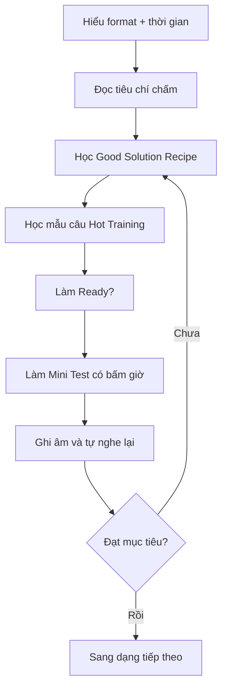

# Lộ trình học Tomato TOEIC Speaking Flow

Sách có sẵn tinh thần học theo **4 tuần**, còn pack này chuyển thành một lộ trình dễ theo dõi hơn.

## Lộ trình 28 ngày

| Giai đoạn | Ngày | Nội dung |
|---|---:|---|
| Nền tảng | 1-7 | Grammar, Vocabulary, Listening, Pronunciation, Thinking in English, Fluency, Goal |
| Q1-2 | 8-10 | Đọc đoạn văn + Mini Tests |
| Q3 | 11-13 | Miêu tả ảnh + Mini Tests |
| Q4-6 | 14-16 | Trả lời câu hỏi + Mini Tests |
| Q7-9 | 17-19 | Đọc bảng thông tin và trả lời + Mini Tests |
| Q10 | 20-22 | Trình bày giải pháp + Mini Tests |
| Q11 | 23-25 | Trình bày ý kiến + Mini Tests |
| Đề hoàn chỉnh | 26-28 | Actual Test 1-5, nghe lại bản ghi, đối chiếu đáp án |

## Vòng lặp học cho mỗi dạng

## Checklist mỗi buổi

- [ ] Đọc nhanh trang Preview và Scoring.
- [ ] Viết lại 3-5 chiến lược bằng lời của mình.
- [ ] Học 5-10 mẫu câu/collocation từ Hot Training.
- [ ] Làm một lượt không bấm giờ để đúng kỹ thuật.
- [ ] Làm một lượt có bấm giờ.
- [ ] Nghe lại file ghi âm và ghi 3 lỗi lớn nhất.
