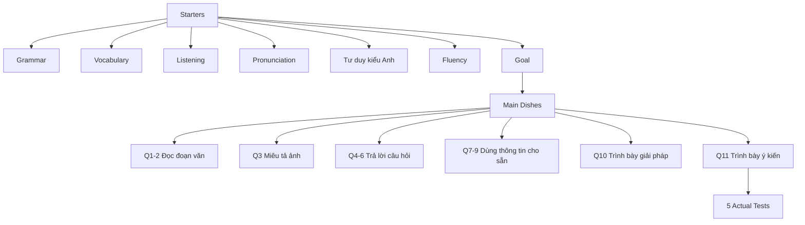
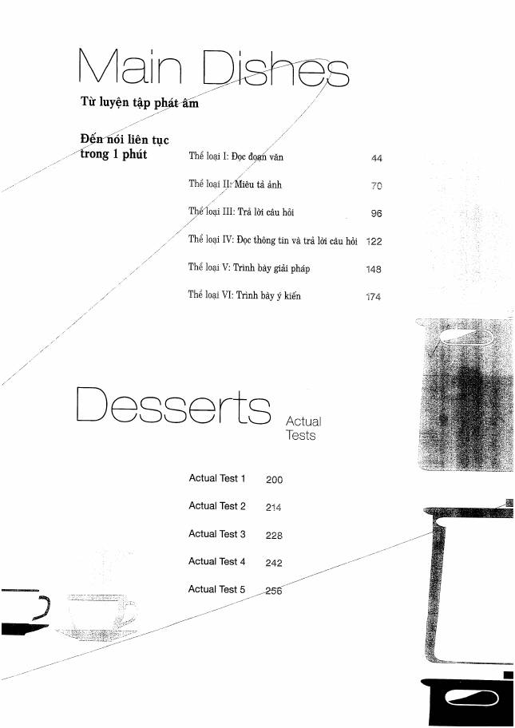

# Tổng quan TOEIC Speaking và cấu trúc sách

## Cấu trúc bài thi trong sách

Sách chia TOEIC Speaking thành 6 dạng:

| Dạng | Câu | Nhiệm vụ | Điểm tối đa mỗi câu |
|---|---:|---|---:|
| I | 1-2 | Read a Text Aloud | 3 |
| II | 3 | Describe a Picture | 3 |
| III | 4-6 | Respond to Questions | 3 |
| IV | 7-9 | Respond Using Information Provided | 3 |
| V | 10 | Propose a Solution | 5 |
| VI | 11 | Express an Opinion | 5 |

## Bản đồ cuốn sách

## Trang nguồn quan trọng

- Cấu trúc/mục lục: `assets/pages/page-004.jpg` - `page-011.jpg`
- Starters: `page-012.jpg` - `page-039.jpg`
- Main Dishes: `page-041.jpg` - `page-195.jpg`
- Actual Tests: `page-196.jpg` - `page-268.jpg`
- Answers: `page-269.jpg` - `page-315.jpg`

