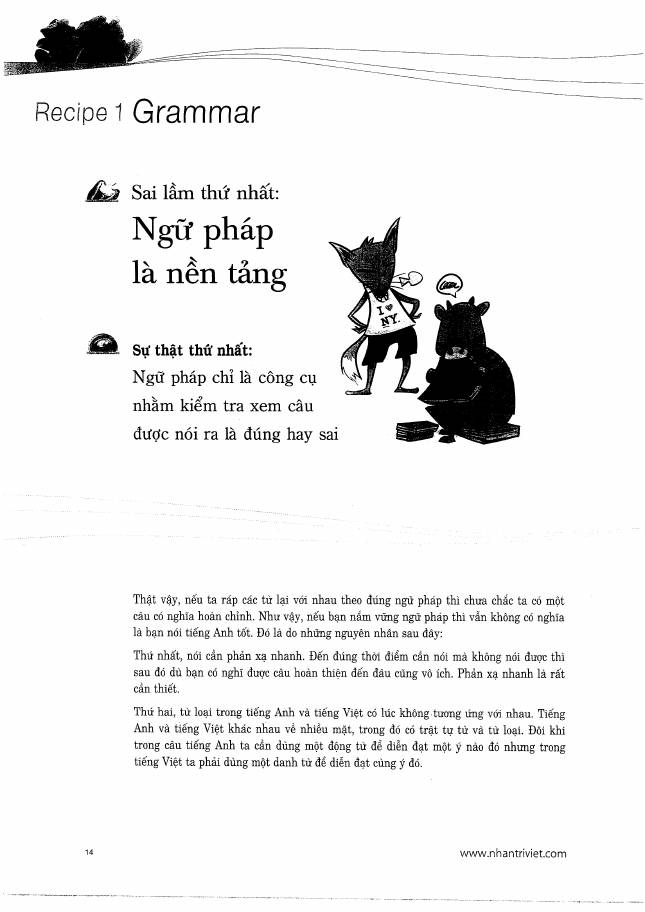
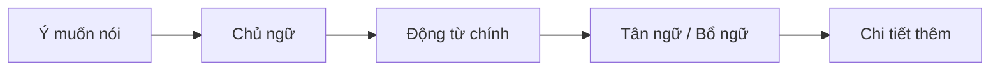

# Recipe 1 - Grammar

**Trang nguồn:** 14-19

## Trọng tâm

Sách phản biện quan niệm **"ngữ pháp là nền tảng nên phải kiểm tra từng câu trước khi nói"**. Mục tiêu của phần này là dùng ngữ pháp như công cụ tạo câu, không để việc tự kiểm tra liên tục làm đứt mạch nói.

### Các điểm cần nắm

- Nhận diện **chủ ngữ** rõ ràng trong câu tiếng Anh.
- Không bỏ chủ ngữ như cách nói tiếng Việt đôi khi cho phép.
- Dùng đúng dạng động từ theo chủ ngữ và thời.
- Tránh dịch từng chữ A -> B; ưu tiên cấu trúc tự nhiên của tiếng Anh.
- Ôn các mẫu câu phổ biến có tân ngữ, động từ nguyên mẫu, V-ing và đại từ.

## Cách luyện

1. Nói câu ngắn đúng cấu trúc trước.
2. Sau đó mới mở rộng bằng trạng từ, cụm giới từ và mệnh đề.
3. Khi luyện nói, không dừng giữa câu chỉ để "soi" ngữ pháp.

## Xem toàn bộ trang nguồn

- `../assets/pages/page-014.jpg` đến `page-019.jpg`
