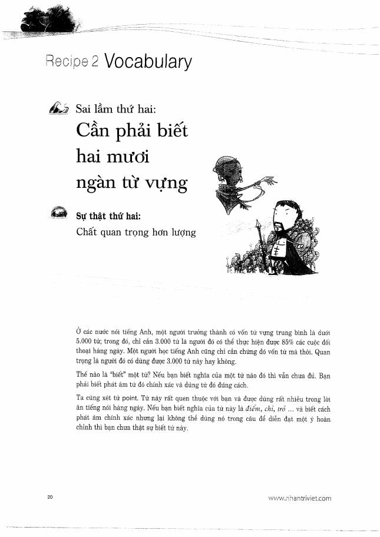
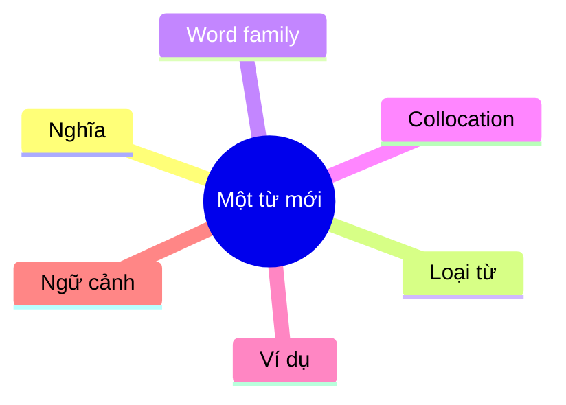

# Recipe 2 - Vocabulary

**Trang nguồn:** 20-23

## Trọng tâm

Phần này nhấn mạnh **chất lượng vốn từ quan trọng hơn số lượng từ rời rạc**.

### Ba lớp từ vựng nên học

1. **Word family**: học các dạng liên quan của cùng một gốc từ.
2. **Collocation**: học từ theo cụm tự nhiên thay vì ghép từng từ theo tiếng Việt.
3. **Ngữ cảnh sử dụng**: biết từ nào dùng được trong tình huống giao tiếp nào.

## Cách luyện

- Nếu vốn từ còn mỏng: xây nền từ thông dụng trước.
- Nếu đã có nền: tăng collocation và cách diễn đạt.
- Khi gặp từ đặc biệt: ghi lại và tái sử dụng nhiều lần trong câu nói.

## Xem toàn bộ trang nguồn

- `../assets/pages/page-020.jpg` đến `page-023.jpg`
