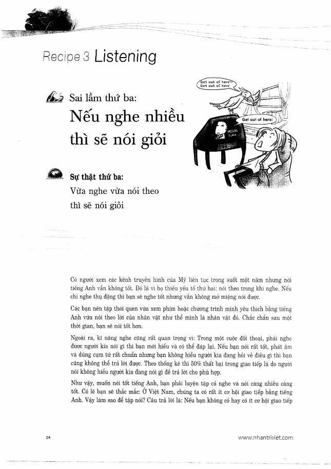
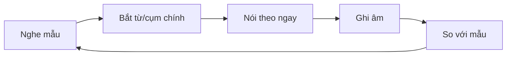

# Recipe 3 - Listening

**Trang nguồn:** 24-25

## Trọng tâm

Thông điệp chính: **nghe nhiều chưa chắc nói giỏi; cần vừa nghe vừa nói theo**.

### Chu trình luyện nghe phục vụ Speaking

### Nguồn luyện được sách gợi ý theo tinh thần chung

- phim/TV tiếng Anh,
- bản tin,
- nội dung tiếng Anh khi làm việc khác,
- audio bài luyện TOEIC.

Điểm quan trọng là **shadowing / nói theo**, không chỉ nghe thụ động.

## Xem toàn bộ trang nguồn

- `../assets/pages/page-024.jpg` đến `page-025.jpg`
