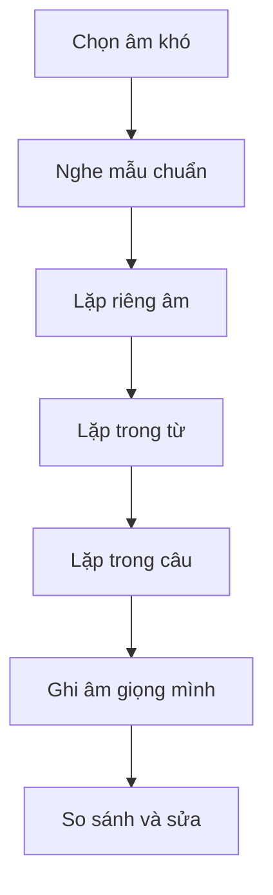

# Recipe 4 - Pronunciation

**Trang nguồn:** 26-28

## Trọng tâm

Sách nhấn mạnh rằng người nghe hiểu được bạn không chỉ nhờ từng âm riêng lẻ, mà còn nhờ **mạch diễn đạt, trọng âm và ngữ điệu**.

### Khác biệt cần chú ý

- Hệ thống âm tiếng Anh khác tiếng Việt.
- Cụm phụ âm và âm cuối dễ bị bỏ.
- Trọng âm từ và trọng âm câu ảnh hưởng khả năng hiểu.
- Ngữ điệu giúp người nghe nhận ra cấu trúc và thái độ.

## Quy trình luyện

## Xem toàn bộ trang nguồn

- `../assets/pages/page-026.jpg` đến `page-028.jpg`
