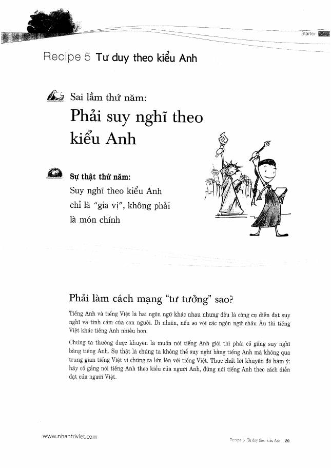
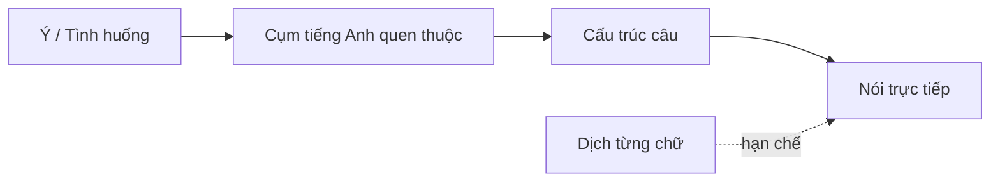

# Recipe 5 - Tư duy theo kiểu Anh

**Trang nguồn:** 29-33

## Trọng tâm

Sách khuyên giảm thói quen **dịch từng câu từ tiếng Việt sang tiếng Anh**. "Tư duy kiểu Anh" ở đây được trình bày như việc quen với cách kết hợp từ, cấu trúc và góc diễn đạt tự nhiên của tiếng Anh.

### Điểm đáng học

- Một giới từ có thể có nhiều nghĩa tùy cụm và ngữ cảnh.
- Có nhiều cụm diễn đạt tự nhiên không thể dịch từng chữ.
- Một số cấu trúc sở hữu, động từ và giới từ được tổ chức khác tiếng Việt.
- Học theo **cụm hoàn chỉnh** giúp phản xạ nhanh hơn học từng từ.

## Xem toàn bộ trang nguồn

- `../assets/pages/page-029.jpg` đến `page-033.jpg`
