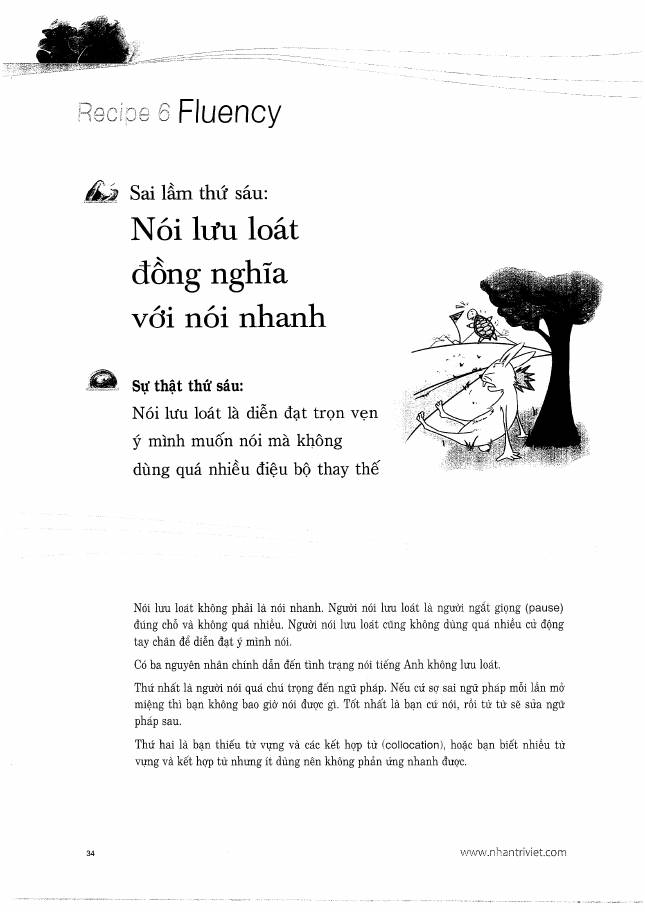
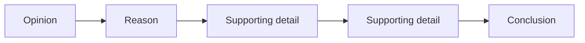

# Recipe 6 - Fluency

**Trang nguồn:** 34-36

## Trọng tâm

**Nói lưu loát không đồng nghĩa nói thật nhanh.** Fluency là truyền đạt trọn ý, giữ mạch nói và hạn chế những khoảng dừng làm người nghe mất dòng suy nghĩ.

### Mô hình phát triển câu

Sách minh họa cách đi từ một ý ngắn thành chuỗi:

### Cách luyện

- Tập trung vào **ý nghĩa**, không quá ám ảnh từng lỗi nhỏ khi đang nói.
- Dùng câu nối để giữ mạch.
- Luyện hội thoại theo chuỗi hỏi - đáp - hỏi tiếp.
- Sau khi nói xong mới nghe lại và sửa lỗi có hệ thống.

## Xem toàn bộ trang nguồn

- `../assets/pages/page-034.jpg` đến `page-036.jpg`
