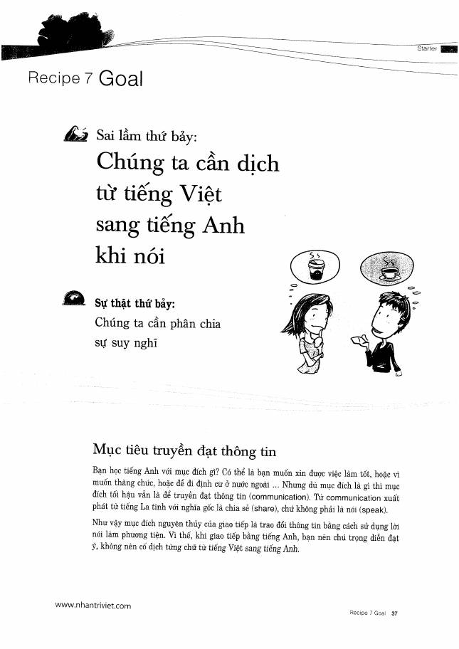
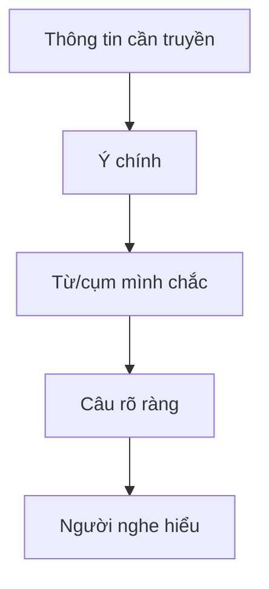

# Recipe 7 - Goal

**Trang nguồn:** 37-39

## Trọng tâm

Mục tiêu của TOEIC Speaking là **truyền đạt thông tin**, không phải dịch hoàn hảo từng câu tiếng Việt.

### Mục tiêu luyện nói

- Người nghe hiểu thông tin chính ngay lần đầu.
- Biết diễn đạt vòng khi thiếu đúng một từ.
- Ưu tiên câu rõ, có cấu trúc và đúng mục đích giao tiếp.
- Phản xạ theo ý nghĩa thay vì theo bản dịch trong đầu.

## Xem toàn bộ trang nguồn

- `../assets/pages/page-037.jpg` đến `page-039.jpg`
