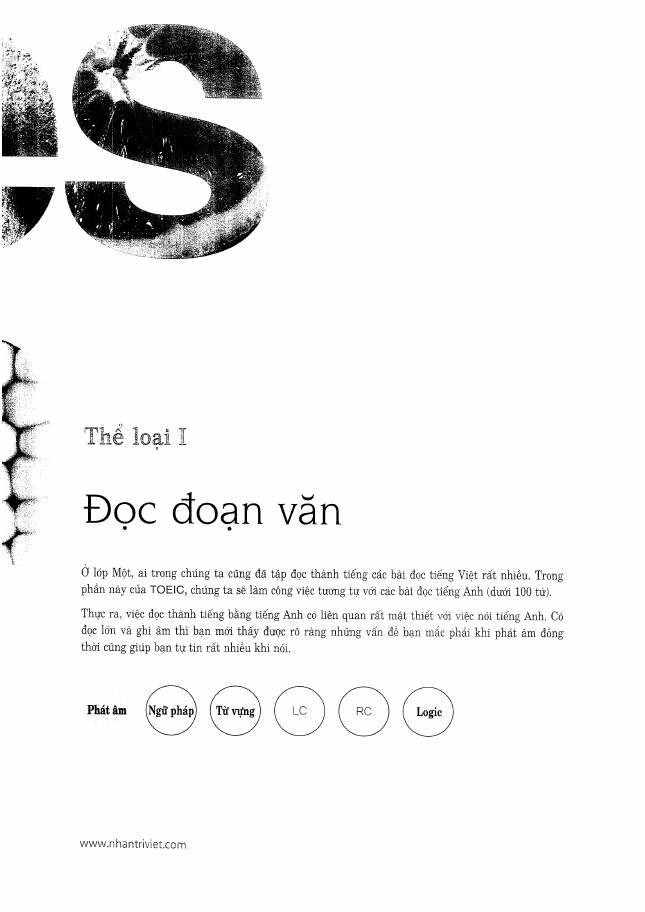
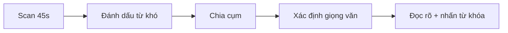

# Thể loại I - Questions 1-2: Read a Text Aloud

**Trang nguồn:** 43-68

## Format

- 2 đoạn đọc thành tiếng.
- Có thời gian chuẩn bị trước khi đọc.
- Trọng tâm chấm: **phát âm, trọng âm, ngữ điệu**.

## Good Solution Recipe

Các chiến lược nổi bật trong sách:

1. Tận dụng thời gian chuẩn bị để đánh dấu từ khó và cụm cần ngắt.
2. **Nhập vai người đọc**: thông báo, quảng cáo, phát thanh hay tin nhắn sẽ có giọng khác nhau.
3. Đọc sai thì sửa ngay và tiếp tục; không để một lỗi làm hỏng cả đoạn.
4. Xuống giọng ở cuối câu trần thuật và ngắt tự nhiên ở dấu câu.
5. Không chạy tốc độ; ưu tiên rõ, đều và có nhịp.

## Hot Training Recipe

Sách gom nhiều mẫu mở đầu thường gặp trong thông báo/quảng cáo/tin nhắn như:

- lời cảm ơn và chào mừng,
- giới thiệu diễn giả/sản phẩm,
- thông báo thời gian hoạt động,
- giảm giá,
- yêu cầu gọi điện hoặc để lại lời nhắn,
- cập nhật giao thông/tin tức.

Mục đích không phải học thuộc cả đoạn mà là quen **nhịp và cụm phát âm lặp lại**.

## Cách học phần này

1. Xem Preview.
2. Đọc Scoring trước khi học mẫu.
3. Học Good Solution Recipe.
4. Lặp lại Hot Training Recipe thành tiếng.
5. Làm Ready? rồi Mini Test.
6. Ghi âm, nghe lại, sau đó mới kiểm đáp án.

## Trang nguồn

`../assets/pages/page-043.jpg` đến `page-068.jpg`.
