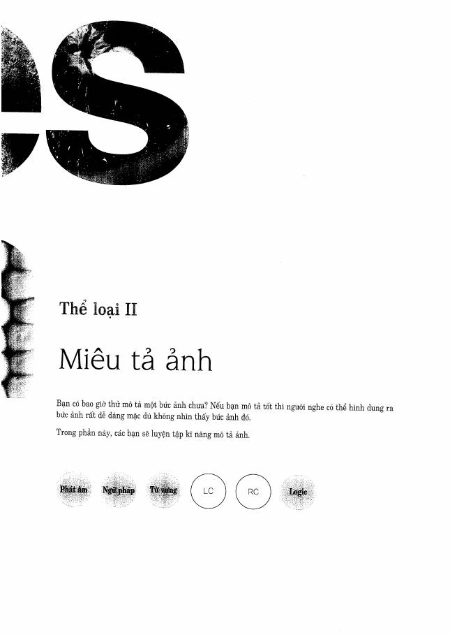
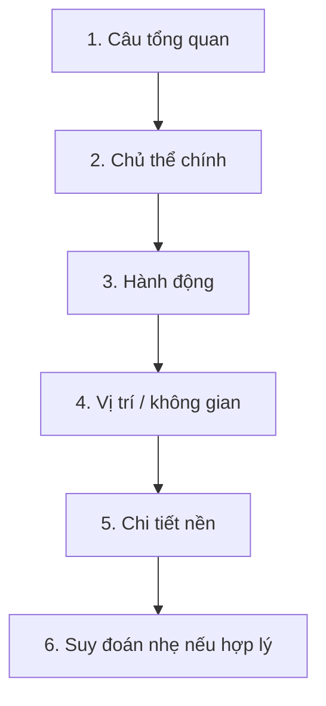

# Thể loại II - Question 3: Describe a Picture

**Trang nguồn:** 69-93

## Format

- Quan sát ảnh trong thời gian chuẩn bị.
- Nói liên tục để mô tả người, vật, hành động và bối cảnh.
- Chấm thêm grammar, vocabulary và tính liên kết ngoài phát âm/ngữ điệu.

## Framework mô tả ảnh

## Hot Training Recipe

Các pattern quan trọng của phần này xoay quanh:

- `This is a picture of ...`
- `In the foreground / background ...`
- `On the left / right ...`
- `In front of / behind / next to ...`
- `There is / There are ...`
- mô tả quần áo, hành động, đồ vật và vị trí.

## Nguyên tắc

- Đi từ **toàn cảnh -> cụ thể**.
- Đừng dành quá nhiều thời gian đoán danh tính/nghề nghiệp nếu ảnh không đủ bằng chứng.
- Nếu bí từ, mô tả chức năng hoặc vị trí của vật thay vì im lặng.

## Cách học phần này

1. Xem Preview.
2. Đọc Scoring trước khi học mẫu.
3. Học Good Solution Recipe.
4. Lặp lại Hot Training Recipe thành tiếng.
5. Làm Ready? rồi Mini Test.
6. Ghi âm, nghe lại, sau đó mới kiểm đáp án.

## Trang nguồn

`../assets/pages/page-069.jpg` đến `page-093.jpg`.
