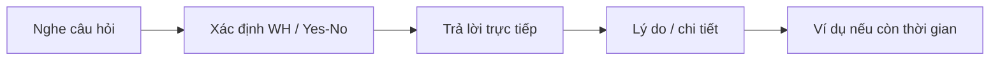

# Thể loại III - Questions 4-6: Respond to Questions

**Trang nguồn:** 94-119

## Format

Ba câu hỏi cùng một chủ đề quen thuộc. Hai câu đầu thường ngắn hơn; câu cuối cần phát triển dài hơn.

## Flow trả lời

## Good Solution Recipe

- Xác định **chủ đề chung** của nhóm câu hỏi ngay từ phần dẫn.
- Luyện phản xạ với từ để hỏi: when, where, who, why, how often, how long...
- Câu 4-5: ưu tiên câu trả lời trực tiếp + một chi tiết.
- Câu 6: thêm lý do, ví dụ hoặc mô tả để lấp đầy thời lượng mà vẫn đúng trọng tâm.

## Hot Training Recipe

Phần luyện mẫu tập trung vào các cách hỏi/trả lời về:

- tần suất,
- thời gian,
- địa điểm,
- sở thích,
- lý do,
- lựa chọn cá nhân,
- mô tả thói quen.

## Cách học phần này

1. Xem Preview.
2. Đọc Scoring trước khi học mẫu.
3. Học Good Solution Recipe.
4. Lặp lại Hot Training Recipe thành tiếng.
5. Làm Ready? rồi Mini Test.
6. Ghi âm, nghe lại, sau đó mới kiểm đáp án.

## Trang nguồn

`../assets/pages/page-094.jpg` đến `page-119.jpg`.
