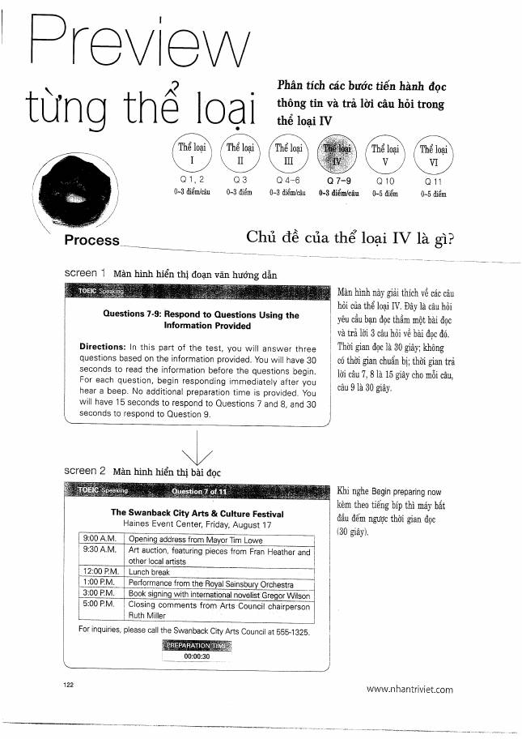
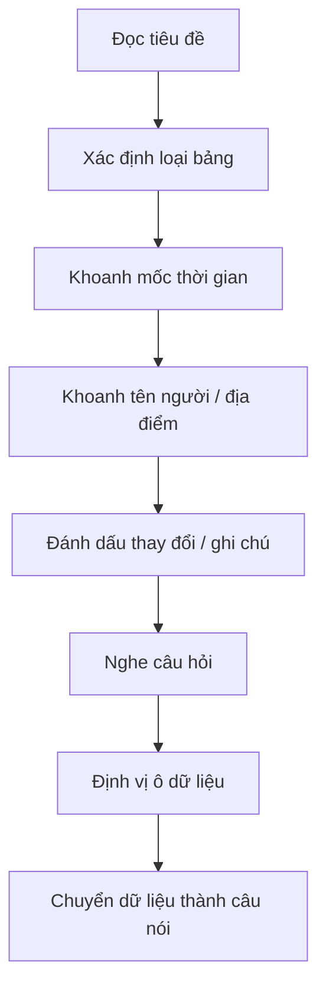

# Thể loại IV - Questions 7-9: Respond Using Information Provided

**Trang nguồn:** 120-143

## Format

- Đọc trước lịch trình/bảng thông tin.
- Sau đó nghe câu hỏi và trả lời dựa trên dữ kiện đã cho.
- Câu cuối thường yêu cầu nối nhiều mẩu thông tin hơn.

## Chiến lược quét bảng

## Điểm quan trọng

- Không đọc bảng theo kiểu từ đầu đến cuối; hãy **scan theo trường thông tin**.
- Với câu xác nhận kiểu `I heard ... Is that correct?`, phải chú ý dữ kiện đã thay đổi/hủy.
- Trả lời lịch sự, tự nhiên, có thể dùng một filler ngắn trước khi nêu thông tin.
- Câu 9 nên sắp xếp dữ kiện theo trình tự thời gian để dễ nghe.

## Hot Training Recipe

Mẫu câu được tổ chức quanh cách nói về lịch, thời gian, địa điểm, người trình bày và chương trình.

## Cách học phần này

1. Xem Preview.
2. Đọc Scoring trước khi học mẫu.
3. Học Good Solution Recipe.
4. Lặp lại Hot Training Recipe thành tiếng.
5. Làm Ready? rồi Mini Test.
6. Ghi âm, nghe lại, sau đó mới kiểm đáp án.

## Trang nguồn

`../assets/pages/page-120.jpg` đến `page-143.jpg`.
