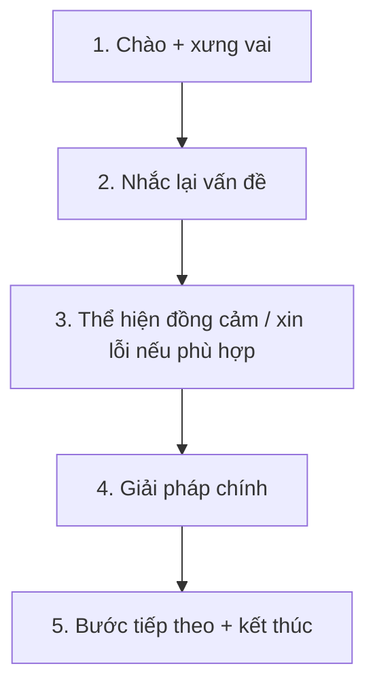

# Thể loại V - Question 10: Propose a Solution

**Trang nguồn:** 144-169

## Format

- Nghe voicemail mô tả vấn đề.
- Có thời gian chuẩn bị ngắn.
- Trả lời khoảng 1 phút với vai trò được chỉ định.
- Cần thể hiện đã hiểu vấn đề và đưa ra giải pháp.

## Khung 5 bước

## Good Solution Recipe

- Nghe để bắt **vấn đề cốt lõi**, không sa vào chi tiết phụ.
- Trong 30 giây, ghi nhanh: Problem -> Solution 1 -> Solution 2 / next step.
- Dùng giải pháp cụ thể, khả thi trong vai trò đề cho.
- Nói rõ người nghe cần làm gì tiếp theo nếu có.

## Hot Training Recipe

Sách luyện các cụm thường gặp trong voicemail dịch vụ:

- giới thiệu người gọi,
- nhắc lại vấn đề,
- xin lỗi/đồng cảm,
- xác nhận đã nhận được lời nhắn,
- thông báo phương án xử lý,
- hẹn gọi lại hoặc cung cấp kênh liên hệ.

## Cách học phần này

1. Xem Preview.
2. Đọc Scoring trước khi học mẫu.
3. Học Good Solution Recipe.
4. Lặp lại Hot Training Recipe thành tiếng.
5. Làm Ready? rồi Mini Test.
6. Ghi âm, nghe lại, sau đó mới kiểm đáp án.

## Trang nguồn

`../assets/pages/page-144.jpg` đến `page-169.jpg`.
