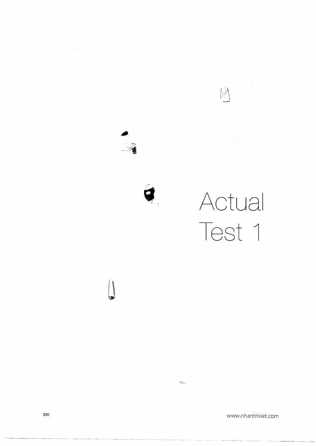

# Actual Test 1

**Trang nguồn:** 198-211

## Cách làm

- Chuẩn bị tai nghe/micro và phần mềm ghi âm.
- Làm từ đầu đến cuối, **không dừng để sửa**.
- Tuân thủ đúng thời gian từng dạng đã học.
- Sau khi hoàn tất mới mở phần Answers.

## Phiếu tự chấm

| Dạng | Câu | Điều cần nghe lại |
|---|---:|---|
| Read aloud | 1-2 | âm cuối, stress, ngắt cụm, tốc độ |
| Describe picture | 3 | câu tổng quan, vị trí, động từ, từ vựng |
| Respond | 4-6 | đúng câu hỏi, đủ chi tiết, ít khoảng dừng |
| Information | 7-9 | dữ kiện chính xác, trình tự rõ |
| Solution | 10 | hiểu vấn đề, giải pháp khả thi, cấu trúc |
| Opinion | 11 | lập trường, lý do, ví dụ, kết luận |

## Trang đề

`../assets/pages/page-198.jpg` đến `page-211.jpg`.
