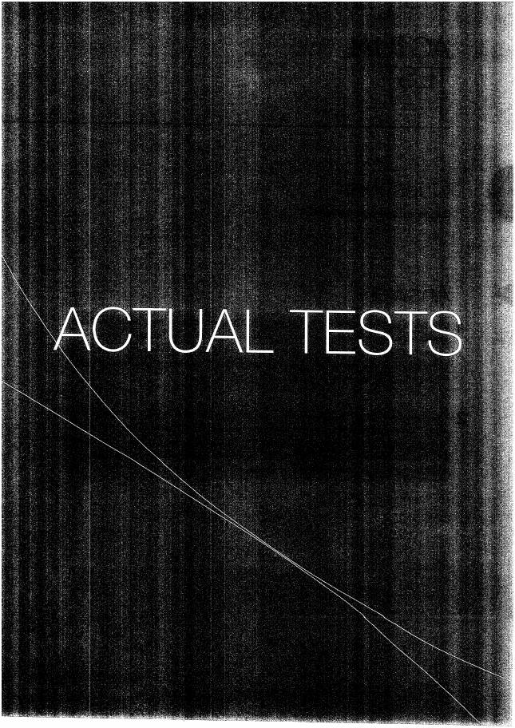
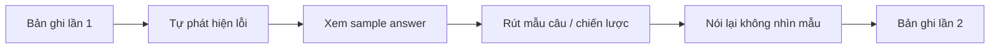

# Answers - Actual Tests

- Phần đáp án Actual Tests: `page-285.jpg` - `page-315.jpg`.
- Mỗi đề có câu hỏi/mẫu trả lời để so sánh sau khi làm test.

## Quy trình review

Ưu tiên học cách **tổ chức câu trả lời** hơn là ghi nhớ đúng từng câu của đáp án mẫu.
